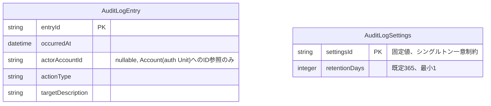

# Functional Specification: audit-log

## ワークフロー

### 1. 記録受付(イベント駆動)

1. config-management・dynamic-data-access・auth・account-managementのいずれかが操作を完了し、AuditableActionOccurredEventを発行する(contract-summary.md #5〜#8)。
2. audit-logのイベントリスナーがイベントを受信する。
3. occurredAt・actorAccountId・actionType・targetDescriptionを取り出す。
4. AuditLogEntryとして永続化する(BR1.1)。
5. 手順3〜4のいずれかで例外が発生した場合、例外を捕捉し、発行元へは伝播させない。同時に、actionType・occurredAt・例外内容を含む構造化ログをERRORレベルで出力する(BR1.2)。発行元の主処理(設定変更・業務データ操作・アカウント操作そのもの)は記録の成否に関わらず完了する。

### 2. 参照・絞り込み

1. 管理者(isAdminクレーム保持者、BR5.1)が監査ログ画面(または`GET /api/admin/audit-log`)を開く。
2. 操作種別(actionType)・利用者(actorAccountId)・期間(occurredAtの範囲)のFilter条件のいずれかまたは組み合わせを指定する(BR2.1)。加えて、Search欄に自由文字列を入力するとtargetDescriptionの部分一致検索がAND条件で適用される(BR2.2)。
3. 条件に一致するAuditLogEntryを、ページング・ソート付きで返す(共通規約: page/size/sort、contract-summary.md参照)。

### 3. エクスポート

1. 管理者が監査ログ画面(または`GET /api/admin/audit-log/export`)でエクスポートを要求し、`format`パラメータでCSVまたはJSON形式を選択する(必須パラメータ、BR3.1)。
2. 現在の絞り込み条件(BR2.1・BR2.2と同じ)に一致するAuditLogEntry全件を、指定された形式のファイルとして生成する。
3. `format`がcsv・json以外の場合は400エラー(RFC 7807)を返す。

### 4. 保持期間超過分の削除

1. 管理者が監査ログ画面を開くと、画面は`GET /api/admin/audit-log/settings`で現在のretentionDays(既定365)を取得し、削除確認ダイアログの日数入力欄の初期値として表示する(refined-mockups/mockups.md 12.の確認ダイアログを経由)。
2. 管理者は表示された日数をそのまま使うか、その場で別の日数に上書きしてから削除を実行できる(BR4.1)。
3. `DELETE /api/admin/audit-log?olderThanDays=<確定した日数>`を呼び出す。`olderThanDays`が1以上の整数であることを検証する(BR4.3)。検証に失敗した場合は400エラー(RFC 7807)を返し、削除は実行しない。
4. `現在日時 - olderThanDays日`を削除基準日時として算出する。
5. `occurredAt`が削除基準日時より前のAuditLogEntryをすべて削除する。この操作はAuditLogSettings.retentionDays自体を変更しない(一時的な上書きは削除操作限りであり、次回以降の初期値には影響しない)。
6. 削除件数を管理者に返す。

### 5. 保持日数の設定変更

1. 管理者が監査ログ画面(または`PUT /api/admin/audit-log/settings`)からretentionDaysの変更を要求する。
2. 指定値が1以上の整数であることを検証する(BR4.2)。検証に失敗した場合は400エラー(RFC 7807)を返す。
3. 検証に成功した場合、AuditLogSettingsの唯一の行(settingsId固定値)を更新する。以降、ワークフロー4の削除確認ダイアログはこの新しい値を初期値として表示する。

## 状態遷移

AuditLogEntryはBR6.1により作成後不変であり、意味のある状態遷移(ライフサイクル)を持たない。存在(作成)から削除(保持期間超過による一括削除)への単純な遷移のみである。

```
[存在しない] --記録受付(ワークフロー1)--> [記録済み(不変)] --保持期間超過分の削除(ワークフロー4)--> [存在しない]
```

## エンティティ関連図(ER図、entities.mdから導出)



<!-- Text fallback: AuditLogEntryは5つの属性(entryId主キー、occurredAt、actorAccountId(nullable、外部キー制約なしのID参照)、actionType、targetDescription)を持つ。AuditLogSettingsはsettingsId(固定値の主キー、シングルトンを一意制約で保証)とretentionDays(既定365、最小1)を持ち、AuditLogEntryとの直接の関連はない。 -->

## ルールサマリー(rules.mdから導出)

| ワークフロー | 適用ルール |
|---|---|
| 1. 記録受付 | BR1.1, BR1.2 |
| 2. 参照・絞り込み | BR2.1, BR2.2, BR5.1 |
| 3. エクスポート | BR3.1, BR5.1 |
| 4. 保持期間超過分の削除 | BR4.1, BR4.3, BR5.1 |
| 5. 保持日数の設定変更 | BR4.2, BR5.1 |

## Review

**Verdict:** READY
**Reviewer:** aidlc-architecture-reviewer-agent
**Date:** 2026-09-06T09:24:02Z
**Iteration:** 1
**Request Challenge:** review:17304181fd41d3e861158976537271a0

本レビューは、functional-designステージ全体のredo jump(review-freeze回復のため)によりレビュー受信がツール上リセットされたことに伴う再認定である。entities.md/rules.md/functional-spec.md/traceability.jsonの4ファイルは内容の変更がないことを前提として提示されたが、独立して全内容を再読し、上流成果物(requirements.md FR7.1〜FR7.5・FR5.5/FR5.6、unit-of-work.md U8、contract-summary.md #5〜#8・#18・#19、components.md AuditLogComponent、functional-design-questions.md Q1・Q2)と突き合わせて検証した。過去の`## Review`セクション(R-07/R-08を含む)は本セクションで置き換える。

### Findings

| ID | Severity | Location | Finding | Required action | Status |
|---|---|---|---|---|---|
| R-07 | Major | rules.md BR4.3, functional-spec.md ワークフロー4 手順3, contract-summary.md #18 DELETE /api/admin/audit-log | 再検証済み。BR4.3はolderThanDaysに1以上の整数を要求し(BR4.2と同じ下限)、違反時は400(RFC 7807)・削除未実行とする。functional-spec.mdワークフロー4は手順3(BR4.3検証)を手順4(削除基準日時の算出)より前に置いており、0以下の値が日時計算・削除実行に到達する前に拒否される。contract-summary.md #18のDELETE操作はolderThanDaysにschema.minimum: 1と400レスポンスケースを持ち、既存の204レスポンスは変更されていない。BR4.1(管理者による上書き・設定値のプリフィル)とも矛盾しない。ファイル内容は前回レビュー時から変化がないことを確認した。 | なし。 | Resolved |
| R-08 | Minor | construction/audit-log/functional-design/traceability.json > FR7.5のcoverageエントリ | FR7.5のcoverage行は依然として`target: "BR4.1, BR4.2"`のみで、BR4.3(rules.mdのsource欄によればFR7.5の削除操作に付随する安全性ギャップとして追加されたルール)が含まれていない。再検証の結果、ファイル内容は前回指摘時から変化しておらず、未解消のまま残っている。 | traceability.jsonが次に編集される際に、FR7.5のcoverage行のtargetへBR4.3を追加する(例: "BR4.1, BR4.2, BR4.3")。 | Unresolved |
| R-09 | Major | functional-spec.md ワークフロー2手順2・ワークフロー3手順2、contract-summary.md #18 GET /api/admin/audit-log および GET /api/admin/audit-log/export | rules.md BR2.1(actionType・actorAccountId・occurredAt範囲での絞り込み)とBR2.2(targetDescriptionの自由文字列検索)はfunctional-spec.mdのワークフロー2・3で必須の振る舞いとして記述されているが、contract-summary.md #18のGET /api/admin/audit-logのparametersにはpage/size/sortのみが定義されており、actionType・actorAccountId・期間(from/to等)・検索文字列に対応するクエリパラメータが1つも定義されていない。GET /api/admin/audit-log/exportも同様にformatパラメータしか定義されておらず、「現在の絞り込み条件に一致する全件をエクスポートする」(ワークフロー3手順2)を実現するためのフィルタ用パラメータが契約上存在しない。共通規約の「テーブルごとに設定された検索条件パラメータ」はdynamic-data-access向けの設定駆動パラメータを指すものであり、固定スキーマを持つaudit-log自身のフィルタ条件を代替しない。この状態では、開発者はBR2.1/BR2.2を実装する際にクエリパラメータ名(例: actionType, actorAccountId, from, to, q)を独自に決めるほかなく、フロントエンド(frontend-admin)側の実装と食い違うリスクがある。 | contract-summary.md #18のGET /api/admin/audit-logとGET /api/admin/audit-log/exportの両方に、BR2.1・BR2.2に対応する具体的なクエリパラメータ名・型を追加する(共有契約側の改訂が必要なため、audit-log Unit側では対応不可な場合はcontract-designへのフォローアップとして起票する)。 | New |
| R-10 | Minor | entities.md > AuditLogEntry.actionType.allowed_values(config-management分), contract-summary.md #5〜#8 | entities.mdのactionType allowed_valuesは、config-management向けに`CONFIG_TABLE_CREATED \| CONFIG_TABLE_UPDATED \| CONFIG_TABLE_DELETED \| CONFIG_IMPORTED`のみを列挙しているが、contract-summary.md #5〜#8は「追記: Construction / config-management Unit Functional Designレビューより」として`CONFIG_CONNECTION_CREATED/UPDATED/DELETED`・`CONFIG_MENU_CREATED/UPDATED/DELETED`を加法的に追加済みである。entities.mdの列挙はcontract-summary.mdへの参照を明記しているため実害は小さいが(BR1.1により受信したactionTypeの値を問わず記録するため、この列挙自体はバリデーションに使われない)、列挙内容自体は契約より古い。 | entities.mdのconfig-management向けallowed_values列挙を、contract-summary.md #5〜#8の現行のactionType語彙(CONFIG_CONNECTION_*・CONFIG_MENU_*を含む)に合わせて更新する。 | New |

### Validation Tool Results

本ステージにこのdispatch向けの検証ツール指定はなし。entities.md・rules.md・functional-spec.md・traceability.jsonを、上流のrequirements.md・unit-of-work.md・contract-summary.md・components.md・functional-design-questions.mdと突き合わせる手動クロスリファレンスで検証した。

なお、team.mdに記載の既知の制約により、aidlc-sensor-traceability・aidlc-sensor-upstream-coverageは、stories.mdがプロジェクト全体でSKIPされているためのFRフォールバックにより、本Unit固有のFR(FR7.1〜FR7.5)以外の大半を`missing_from_upstream_ids`として検出する構成になっている。これは新規欠陥ではなく既知の制約として記録する。

### Summary

4ファイルの内容はredo jump前と変化がないことを確認した。R-07(olderThanDaysの下限検証)は前回どおり解消済みで再検証でも問題ない。R-08(traceability.jsonのFR7.5行がBR4.3を含んでいない)は未解消のまま残っている(Minor)。新たに、契約上のクエリパラメータ不足(R-09、Major: GET /api/admin/audit-logとexportエンドポイントにBR2.1/BR2.2のフィルタ条件に対応するパラメータが定義されていない)と、config-management向けactionType列挙の陳腐化(R-10、Minor)を検出した。Critical 0件・Major 1件(R-09。R-07はResolved)・Minor 2件であり、判定基準(Critical 0件かつMajor 2件以下)によりREADYとする。ただし、R-09はfrontend-admin実装時にクエリパラメータ名の食い違いを招きうるため、次にcontract-summary.mdが編集される機会に解消することを強く推奨する。
