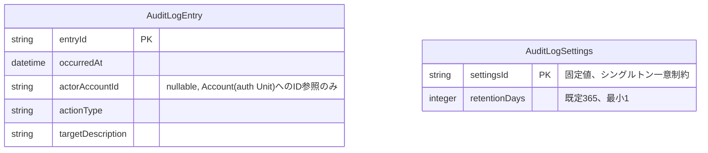

# Functional Specification: audit-log

## ワークフロー

### 1. 記録受付(イベント駆動)

1. config-management・dynamic-data-access・auth・account-managementのいずれかが操作を完了し、AuditableActionOccurredEventを発行する(contract-summary.md #5〜#8)。
2. audit-logのイベントリスナーがイベントを受信する。
3. occurredAt・actorAccountId・actionType・targetDescriptionを取り出す。
4. AuditLogEntryとして永続化する(BR1.1)。
5. 手順3〜4のいずれかで例外が発生した場合、例外を捕捉し、発行元へは伝播させない。同時に、actionType・occurredAt・例外内容を含む構造化ログをERRORレベルで出力する(BR1.2)。発行元の主処理(設定変更・業務データ操作・アカウント操作そのもの)は記録の成否に関わらず完了する。

### 2. 参照・絞り込み

1. 管理者(isAdminクレーム保持者、BR5.1)が監査ログ画面(または`GET /api/admin/audit-log`)を開く。
2. 操作種別(actionType)・利用者(actorAccountId)・期間(occurredAtの範囲)のFilter条件のいずれかまたは組み合わせを指定する(BR2.1)。加えて、Search欄に自由文字列を入力するとtargetDescriptionの部分一致検索がAND条件で適用される(BR2.2)。
3. 条件に一致するAuditLogEntryを、ページング・ソート付きで返す(共通規約: page/size/sort、contract-summary.md参照)。

### 3. エクスポート

1. 管理者が監査ログ画面(または`GET /api/admin/audit-log/export`)でエクスポートを要求し、`format`パラメータでCSVまたはJSON形式を選択する(必須パラメータ、BR3.1)。
2. 現在の絞り込み条件(BR2.1・BR2.2と同じ)に一致するAuditLogEntry全件を、指定された形式のファイルとして生成する。
3. `format`がcsv・json以外の場合は400エラー(RFC 7807)を返す。

### 4. 保持期間超過分の削除

1. 管理者が監査ログ画面を開くと、画面は`GET /api/admin/audit-log/settings`で現在のretentionDays(既定365)を取得し、削除確認ダイアログの日数入力欄の初期値として表示する(refined-mockups/mockups.md 12.の確認ダイアログを経由)。
2. 管理者は表示された日数をそのまま使うか、その場で別の日数に上書きしてから削除を実行できる(BR4.1)。
3. `DELETE /api/admin/audit-log?olderThanDays=<確定した日数>`を呼び出す。`olderThanDays`が1以上の整数であることを検証する(BR4.3)。検証に失敗した場合は400エラー(RFC 7807)を返し、削除は実行しない。
4. `現在日時 - olderThanDays日`を削除基準日時として算出する。
5. `occurredAt`が削除基準日時より前のAuditLogEntryをすべて削除する。この操作はAuditLogSettings.retentionDays自体を変更しない(一時的な上書きは削除操作限りであり、次回以降の初期値には影響しない)。
6. 削除件数を管理者に返す。

### 5. 保持日数の設定変更

1. 管理者が監査ログ画面(または`PUT /api/admin/audit-log/settings`)からretentionDaysの変更を要求する。
2. 指定値が1以上の整数であることを検証する(BR4.2)。検証に失敗した場合は400エラー(RFC 7807)を返す。
3. 検証に成功した場合、AuditLogSettingsの唯一の行(settingsId固定値)を更新する。以降、ワークフロー4の削除確認ダイアログはこの新しい値を初期値として表示する。

## 状態遷移

AuditLogEntryはBR6.1により作成後不変であり、意味のある状態遷移(ライフサイクル)を持たない。存在(作成)から削除(保持期間超過による一括削除)への単純な遷移のみである。

```
[存在しない] --記録受付(ワークフロー1)--> [記録済み(不変)] --保持期間超過分の削除(ワークフロー4)--> [存在しない]
```

## エンティティ関連図(ER図、entities.mdから導出)



<!-- Text fallback: AuditLogEntryは5つの属性(entryId主キー、occurredAt、actorAccountId(nullable、外部キー制約なしのID参照)、actionType、targetDescription)を持つ。AuditLogSettingsはsettingsId(固定値の主キー、シングルトンを一意制約で保証)とretentionDays(既定365、最小1)を持ち、AuditLogEntryとの直接の関連はない。 -->

## ルールサマリー(rules.mdから導出)

| ワークフロー | 適用ルール |
|---|---|
| 1. 記録受付 | BR1.1, BR1.2 |
| 2. 参照・絞り込み | BR2.1, BR2.2, BR5.1 |
| 3. エクスポート | BR3.1, BR5.1 |
| 4. 保持期間超過分の削除 | BR4.1, BR4.3, BR5.1 |
| 5. 保持日数の設定変更 | BR4.2, BR5.1 |

## Review

**Verdict:** READY
**Reviewer:** aidlc-architecture-reviewer-agent
**Date:** 2026-09-06T02:06:40Z
**Iteration:** 1

### Findings

| ID | Severity | Location | Finding | Required action | Status |
|---|---|---|---|---|---|
| R-07 | Major | rules.md BR4.3, functional-spec.md ワークフロー4 手順3, contract-summary.md #18 DELETE /api/admin/audit-log | Verified the fix closes the gap at both layers. rules.md BR4.3 requires olderThanDays to be a positive integer (same lower bound as BR4.2) and states the violation returns 400 (RFC 7807) with no deletion executed. functional-spec.md ワークフロー4 places the BR4.3 validation at step 3, strictly before the deletion-basis-date computation at step 4, so an admin submitting 0 or a negative value is rejected before any date arithmetic or deletion occurs. contract-summary.md #18's DELETE operation now carries schema.minimum: 1 on olderThanDays and a new 400 response case, while the existing 204 response is untouched, matching the same 400-on-invalid-numeric-bound pattern already used for `format` (R-03 pattern) and for AuditLogSettings.retentionDays (BR4.2). No contradiction with BR4.1: BR4.1 still frames olderThanDays as admin-overridable and settings-prefilled: BR4.3 only adds a lower bound, it does not touch the override/prefill semantics. Both rules.md and functional-spec.md's rule-summary tables were updated to list BR4.3 alongside BR4.1 for this workflow. | None. | Resolved |
| R-08 | Minor | construction/audit-log/functional-design/traceability.json > coverage entry for FR7.5 | The FR7.5 coverage row still targets only "BR4.1, BR4.2"; the new BR4.3 (also sourced from FR7.5's delete operation, per its `source` field in rules.md) is not listed in the traceability mapping. This does not affect correctness of the fix itself, but leaves the coverage artifact slightly stale relative to the new rule. | Add BR4.3 to the FR7.5 coverage row's target list (e.g. "BR4.1, BR4.2, BR4.3") the next time traceability.json is touched. | New |

### Validation Tool Results

No stage validation tools were listed for this dispatch; verification was performed by cross-reading rules.md, functional-spec.md, contract-summary.md #18, entities.md, and traceability.json.

### Summary

The narrow fix for R-07 is complete and correct: BR4.3 rejects olderThanDays <= 0 or non-integer at both the business-rule layer and the REST contract layer (minimum: 1, 400 response), the functional-spec.md workflow validates before computing the deletion basis date, and no contradiction with BR4.1's override/prefill framing was introduced. One new Minor, non-blocking gap was found: traceability.json's FR7.5 row was not updated to list BR4.3.
