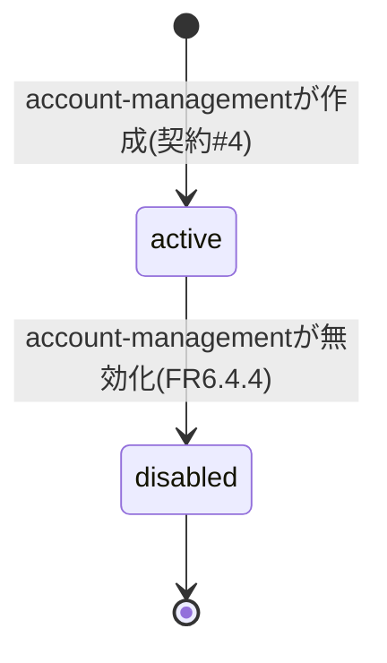
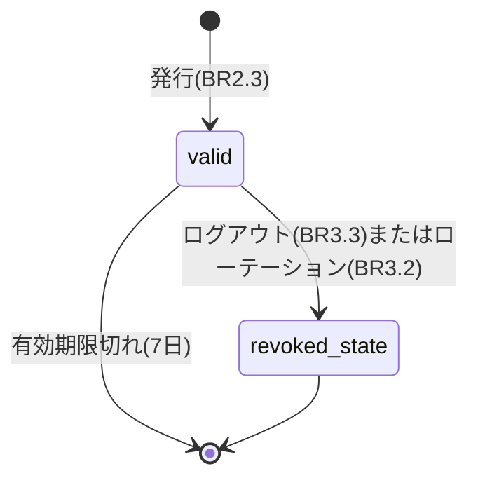
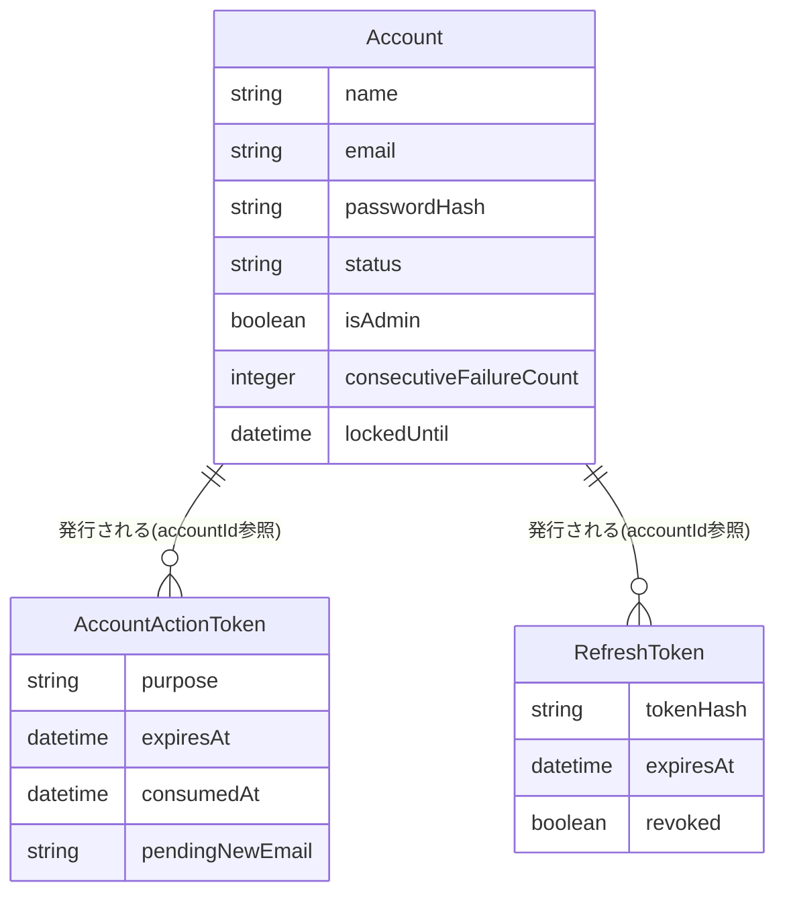

# Functional Specification: auth

## ワークフロー

### 1. ログイン

1. 利用者がemail/passwordで `POST /api/auth/login` を呼び出す。
2. lockedUntilが未来であれば403を返す(BR4.2)。
3. email/passwordを照合する(BR1.1)。失敗すればconsecutiveFailureCountを加算し(BR4.1)、監査ログイベント(actionType=LOGIN_FAILED。ロック閾値に達しlockedUntilを新規設定した場合はLOGIN_LOCKEDも発行、BR8.1)を発行してから401を返す。
4. 成功すればconsecutiveFailureCount/lockedUntilをリセットする(BR4.3)。
5. 契約#20(auth → permission)でaccountIdの有効ロールID一覧を取得する(BR2.1)。
6. アクセストークン(JWT、claims: sub/isAdmin/roles/iat/exp、有効期限15分)を発行する(BR2.2)。
7. リフレッシュトークンを発行し、ハッシュ化して永続化する(BR2.3)。
8. 監査ログイベント(actionType=LOGIN_SUCCESS、BR8.1)を発行する。
9. accessToken/refreshTokenをレスポンスとして返す。

### 2. アクセストークンのリフレッシュ

1. フロントエンドが、アクセストークン期限切れ(401)を検知して `POST /api/auth/refresh` を呼び出す。
2. 受け取ったリフレッシュトークンをハッシュ化し、有効なRefreshTokenと照合する(BR3.1)。一致しなければ401。
3. 一致すれば、ロール一覧を再取得したうえで新しいアクセストークンと新しいリフレッシュトークンを発行し、古いRefreshTokenを失効させる(BR3.2、ローテーション)。

### 3. ログアウト

1. 認証済み利用者が `POST /api/auth/logout` を呼び出す。
2. 当該accountIdに紐づく有効なRefreshTokenをすべて失効させる(BR3.3)。

### 4. アカウント登録完了(account-managementでの作成後)

1. account-managementが契約#4経由でAccountを新規作成する(status=active、passwordHash=null)。authはこの同一呼び出しの中で、purpose=registration_completionのAccountActionTokenを発行し(BR6.1)、実トークン値(registrationToken)を契約#4の戻り値としてaccount-managementへ返す。
2. account-managementは受け取ったregistrationTokenを用いて、AccountCreatedEvent(通知イベント契約#9、accountId・recipientEmail・registrationToken)をnotificationへ発行する(publisherはaccount-management。authはこのイベントを経由しない)。NotificationComponentがこれを購読し、アカウント作成通知メール(記載URLにトークンを含む)を送信する(FR6.4(1))。
3. 利用者が通知メール内のURLへアクセスし、氏名・パスワードを入力して `POST /api/auth/complete-registration` を呼び出す。
4. トークンの有効性を検証し(BR6.2)、Account.name・passwordHashを設定する(BR6.3、BR5.1)。
5. 監査ログイベント(actionType=SELF_SERVICE_PROFILE_CHANGED、BR8.1)を発行する。
6. 完了後、auth自身がAccountRegistrationCompletedEvent(通知イベント契約#9〜#10、publisher=auth)をnotificationへ発行し、アカウント登録完了通知(FR6.4(2))を送信する。

### 5. パスワード忘れ対応

1. 利用者が `POST /api/auth/forgot-password` にemailを渡す。
2. purpose=password_forgotのAccountActionTokenを発行する(BR6.1)。存在しないemailの場合も202を返す(利用者列挙[user enumeration]を防ぐため、常に同一レスポンスとする)。
3. NotificationComponentへパスワード忘れ対応通知(FR6.4(5))のイベントを発行する。
4. 利用者が通知メール内のURLへアクセスし、新しいパスワードを入力して `POST /api/auth/reset-password` を呼び出す。
5. トークンの有効性を検証し(BR6.2)、Account.passwordHashを設定する(BR5.1)。
6. 監査ログイベント(actionType=SELF_SERVICE_PROFILE_CHANGED、BR8.1)を発行する。
7. 完了後、NotificationComponentへパスワード変更通知(FR6.4(4))のイベントを発行する。

### 6. 自己サービスでの氏名・パスワード変更

1. 認証済み利用者が `PUT /api/me/profile` を呼び出す。
2. nameが空文字でないことを検証する(BR6.5)。
3. Account.name、および(指定があれば)passwordHash(BR5.1)を更新する。
4. 監査ログイベント(actionType=SELF_SERVICE_PROFILE_CHANGED、BR8.1)を発行する。
5. パスワードを変更した場合、NotificationComponentへパスワード変更通知(FR6.4(4))のイベントを発行する。氏名のみの変更の場合はアカウント情報変更通知(FR6.4(3))のイベントを発行する。

### 7. 自己サービスでのメールアドレス変更

1. 認証済み利用者が `POST /api/me/email-change-request` に新アドレスを渡す。
2. purpose=email_changeのAccountActionTokenをpendingNewEmail込みで発行する(BR6.1)。
3. NotificationComponentへメールアドレス変更リクエスト通知(FR6.4(6))のイベントを発行する(送信先は新アドレス)。
4. 利用者が新アドレス宛メール内のURLへアクセスし、現在のパスワードを入力して `POST /api/me/email-change-confirm` を呼び出す。
5. トークンの有効性を検証し(BR6.2)、現在のパスワードを検証したうえでAccount.emailを更新する(BR6.4)。
6. 監査ログイベント(actionType=SELF_SERVICE_PROFILE_CHANGED、BR8.1)を発行する。
7. 完了後、NotificationComponentへアカウント情報変更通知(FR6.4(3))のイベントを発行する。

## 状態遷移

### Account.status

<!-- Text fallback: Accountはaccount-management作成時にactiveとなり、無効化操作によりdisabledへ遷移する(論理削除、物理削除なし)。disabledから元に戻す操作はスコープ外。 -->

### RefreshToken.revoked

<!-- Text fallback: RefreshTokenは発行時にvalid(revoked=false)。ログアウトまたはローテーションによりrevoked=trueとなる。有効期限切れも同様に無効として扱う(明示的な状態列は持たない)。 -->

## エンティティ関連図(ER図、entities.mdから導出)

<!-- Text fallback: AccountはAccountActionToken(多)とRefreshToken(多)の参照元となる。いずれもaccountIdによるID参照であり、外部キー制約は設けない。 -->

## ルールサマリー(rules.mdから導出)

| ワークフロー | 適用ルール |
|---|---|
| 1. ログイン | BR1.1, BR2.1, BR2.2, BR2.3, BR4.1, BR4.2, BR4.3, BR7.1, BR8.1 |
| 2. アクセストークンのリフレッシュ | BR3.1, BR3.2 |
| 3. ログアウト | BR3.3 |
| 4. アカウント登録完了 | BR6.1, BR6.2, BR6.3, BR5.1, BR8.1 |
| 5. パスワード忘れ対応 | BR6.1, BR6.2, BR5.1, BR8.1 |
| 6. 自己サービスでの氏名・パスワード変更 | BR6.5, BR5.1, BR8.1 |
| 7. 自己サービスでのメールアドレス変更 | BR6.1, BR6.2, BR6.4, BR8.1 |

## Review

**Verdict:** READY
**Reviewer:** aidlc-architecture-reviewer-agent
**Date:** 2026-09-06T04:31:15Z
**Iteration:** 1

### Findings

| ID | Severity | Location | Finding | Required action | Status |
|---|---|---|---|---|---|
| R-01 | Minor | construction/auth/functional-design/functional-spec.md > ワークフロー6(自己サービスでの氏名・パスワード変更)手順5 | 「パスワードを変更した場合、パスワード変更通知(PasswordChangedEvent)を発行する。氏名のみの変更の場合はアカウント情報変更通知(AccountInfoChangedEvent)を発行する」という分岐は、氏名とパスワードを同時に変更した場合にAccountInfoChangedEvent(氏名変更の通知)が発行されないという抜けを生む。contract-summary.mdの`AccountInfoChangedEvent.changedFields`は`"name" \| "password" \| "email"`の複数値配列を許容する設計になっており、同時変更を表現できるはずだが、本ワークフローはその複数値ケースを扱っていない | 氏名とパスワードを同時に変更した場合の通知方針(両方のイベントを発行する、またはchangedFieldsに両方を含めた単一のAccountInfoChangedEventで代替する等)を明記し、手順5の分岐ロジックを修正する | New |
| R-02 | Minor | construction/auth/functional-design/rules.md > BR5.1(パスワードハッシュ化) と BR6.4(メールアドレス変更確定時のパスワード再検証)の対比 | 自己サービスでのメールアドレス変更確定(BR6.4)は「現在のパスワードをArgon2で再検証したうえで」実行すると明記されているのに対し、自己サービスでのパスワード変更(`PUT /api/me/profile`、BR5.1・ワークフロー6手順3)には現在のパスワードの再検証が一切規定されていない。同一Unit内の類似の自己サービス操作(セッション乗っ取り・短命アクセストークン漏えい時のリスク)に対して、片方だけ多層防御(現在パスワード確認)を課し、もう片方(パスワードそのものの変更)には課さないという非対称な設計になっている | 自己サービスのパスワード変更にも現在のパスワード再検証を要求するかどうかを明示的に決定し、rules.md(BR5.1またはBR6.5近傍への追記)とfunctional-spec.mdワークフロー6手順3に反映する。要求しないと判断する場合はその根拠を記載する | New |

### Validation Tool Results

| Tool | Result | Interpretation |
|---|---|---|
| aidlc-sensor-traceability.ts --output-path traceability.json --stage functional-design | `pass:false`、`gaps:[]`、`orphans:[]`、`missing_from_table:[]`、`invalid_entries:[]`、`invalid_targets:[]`、`missing_from_upstream_ids`にFR1系〜FR7系(stories.md未生成によるFRフォールバック)38件 | 既知の制約(プロジェクト全体でstories.mdがSKIPされているためのFRフォールバック)どおりの結果であり、新規欠陥ではない。gaps/orphans/missing_from_table/invalid_entries/invalid_targetsがいずれも空であることを確認し、実質的な整合性エラーがないことを検証した |
| aidlc-sensor-upstream-coverage.ts --output-path traceability.json --stage functional-design | `pass:true`、`unreferenced:[]`、`findings_count:0` | upstream側の未参照なし |
| aidlc-sensor-required-sections.ts --output-path entities.md/rules.md/functional-spec.md --stage functional-design | 3ファイルとも`pass:true`、`findings_count:0` | 必須セクション要件を満たす |

### Summary

前回(非公式)レビューで指摘された3件(契約#9との矛盾、監査ログイベント発行の欠落、氏名変更の業務ルール欠落)はいずれも独立して検証した結果、正しく解消されており、新たな矛盾も生んでいない。具体的には、(1)契約#4のregistrationToken追記は契約#9のpublisher(account-management)と矛盾せず、authはAccountCreatedEventを発行しない記述に統一されている、(2)BR8.1のactionType語彙は契約#7の4語彙(LOGIN_SUCCESS/LOGIN_FAILED/LOGIN_LOCKED/SELF_SERVICE_PROFILE_CHANGED)の範囲内に収まっている、(3)BR6.5により氏名変更の空文字禁止ルールが追加され、ワークフロー6と整合している。今回新たに、氏名・パスワード同時変更時の通知イベント選択ロジックの抜け(R-01)と、自己サービスパスワード変更における現在パスワード再検証の欠如(R-02)という2件のMinor所見を独立に発見したが、いずれも実装をブロックする性質ではない。Critical 0件・Major 0件のためREADYと判定する。

