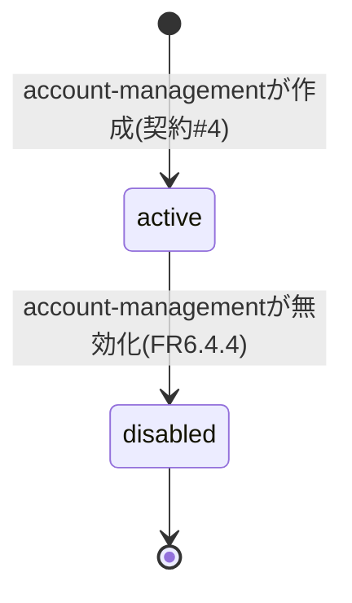
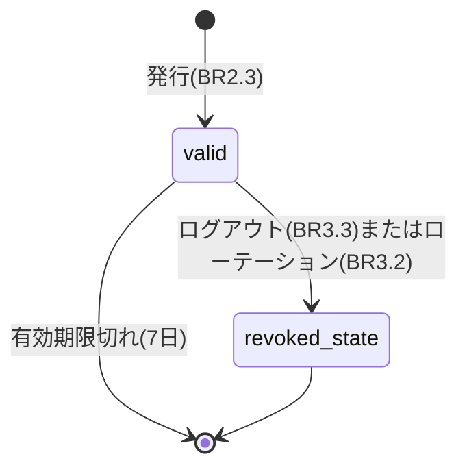
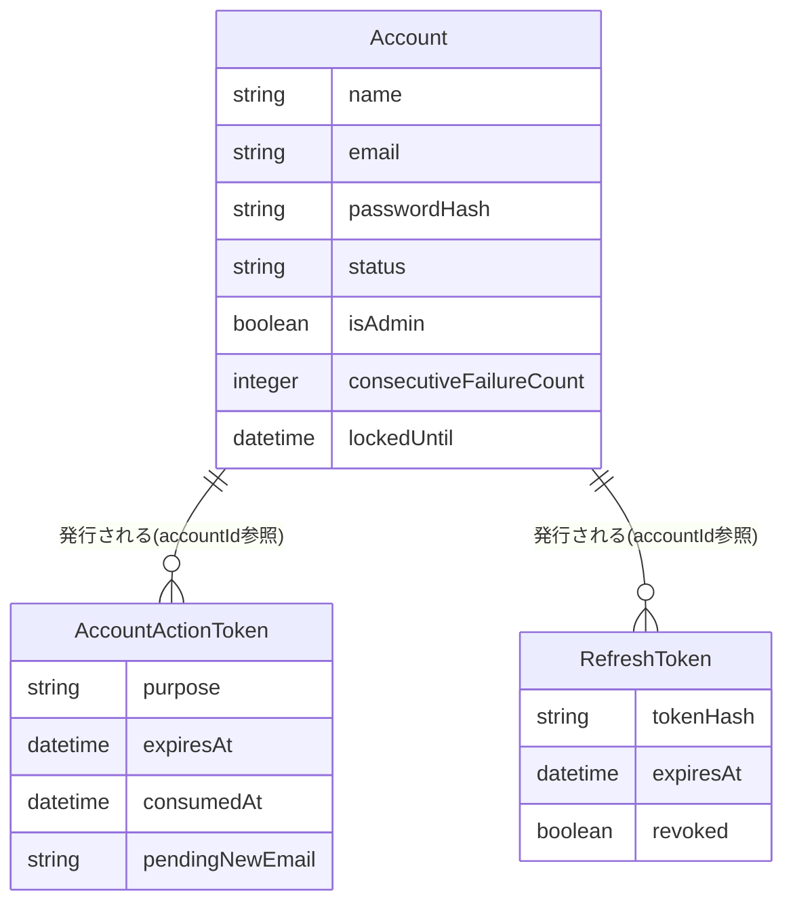

# Functional Specification: auth

## ワークフロー

### 1. ログイン

1. 利用者がemail/passwordで `POST /api/auth/login` を呼び出す。
2. lockedUntilが未来であれば403を返す(BR4.2)。
3. email/passwordを照合する(BR1.1)。失敗すればconsecutiveFailureCountを加算し(BR4.1)、監査ログイベント(actionType=LOGIN_FAILED。ロック閾値に達しlockedUntilを新規設定した場合はLOGIN_LOCKEDも発行、BR8.1)を発行してから401を返す。
4. 成功すればconsecutiveFailureCount/lockedUntilをリセットする(BR4.3)。
5. 契約#20(auth → permission)でaccountIdの有効ロールID一覧を取得する(BR2.1)。
6. アクセストークン(JWT、claims: sub/isAdmin/roles/iat/exp、有効期限15分)を発行する(BR2.2)。
7. リフレッシュトークンを発行し、ハッシュ化して永続化する(BR2.3)。
8. 監査ログイベント(actionType=LOGIN_SUCCESS、BR8.1)を発行する。
9. accessToken/refreshTokenをレスポンスとして返す。

### 2. アクセストークンのリフレッシュ

1. フロントエンドが、アクセストークン期限切れ(401)を検知して `POST /api/auth/refresh` を呼び出す。
2. 受け取ったリフレッシュトークンをハッシュ化し、有効なRefreshTokenと照合する(BR3.1)。一致しなければ401。
3. 一致すれば、ロール一覧を再取得したうえで新しいアクセストークンと新しいリフレッシュトークンを発行し、古いRefreshTokenを失効させる(BR3.2、ローテーション)。

### 3. ログアウト

1. 認証済み利用者が `POST /api/auth/logout` を呼び出す。
2. 当該accountIdに紐づく有効なRefreshTokenをすべて失効させる(BR3.3)。

### 4. アカウント登録完了(account-managementでの作成後)

1. account-managementが契約#4経由でAccountを新規作成する(status=active、passwordHash=null)。authはこの同一呼び出しの中で、purpose=registration_completionのAccountActionTokenを発行し(BR6.1)、実トークン値(registrationToken)を契約#4の戻り値としてaccount-managementへ返す。
2. account-managementは受け取ったregistrationTokenを用いて、AccountCreatedEvent(通知イベント契約#9、accountId・recipientEmail・registrationToken)をnotificationへ発行する(publisherはaccount-management。authはこのイベントを経由しない)。NotificationComponentがこれを購読し、アカウント作成通知メール(記載URLにトークンを含む)を送信する(FR6.4(1))。
3. 利用者が通知メール内のURLへアクセスし、氏名・パスワードを入力して `POST /api/auth/complete-registration` を呼び出す。
4. トークンの有効性を検証し(BR6.2)、Account.name・passwordHashを設定する(BR6.3、BR5.1)。
5. 監査ログイベント(actionType=SELF_SERVICE_PROFILE_CHANGED、BR8.1)を発行する。
6. 完了後、auth自身がAccountRegistrationCompletedEvent(通知イベント契約#9〜#10、publisher=auth)をnotificationへ発行し、アカウント登録完了通知(FR6.4(2))を送信する。

### 5. パスワード忘れ対応

1. 利用者が `POST /api/auth/forgot-password` にemailを渡す。
2. purpose=password_forgotのAccountActionTokenを発行する(BR6.1)。存在しないemailの場合も202を返す(利用者列挙[user enumeration]を防ぐため、常に同一レスポンスとする)。
3. NotificationComponentへパスワード忘れ対応通知(FR6.4(5))のイベントを発行する。
4. 利用者が通知メール内のURLへアクセスし、新しいパスワードを入力して `POST /api/auth/reset-password` を呼び出す。
5. トークンの有効性を検証し(BR6.2)、Account.passwordHashを設定する(BR5.1)。
6. 監査ログイベント(actionType=SELF_SERVICE_PROFILE_CHANGED、BR8.1)を発行する。
7. 完了後、NotificationComponentへパスワード変更通知(FR6.4(4))のイベントを発行する。

### 6. 自己サービスでの氏名・パスワード変更

1. 認証済み利用者が `PUT /api/me/profile` を呼び出す。
2. nameが空文字でないことを検証する(BR6.5)。
3. Account.name、および(指定があれば)passwordHash(BR5.1)を更新する。
4. 監査ログイベント(actionType=SELF_SERVICE_PROFILE_CHANGED、BR8.1)を発行する。
5. パスワードを変更した場合、NotificationComponentへパスワード変更通知(FR6.4(4))のイベントを発行する。氏名のみの変更の場合はアカウント情報変更通知(FR6.4(3))のイベントを発行する。

### 7. 自己サービスでのメールアドレス変更

1. 認証済み利用者が `POST /api/me/email-change-request` に新アドレスを渡す。
2. purpose=email_changeのAccountActionTokenをpendingNewEmail込みで発行する(BR6.1)。
3. NotificationComponentへメールアドレス変更リクエスト通知(FR6.4(6))のイベントを発行する(送信先は新アドレス)。
4. 利用者が新アドレス宛メール内のURLへアクセスし、現在のパスワードを入力して `POST /api/me/email-change-confirm` を呼び出す。
5. トークンの有効性を検証し(BR6.2)、現在のパスワードを検証したうえでAccount.emailを更新する(BR6.4)。
6. 監査ログイベント(actionType=SELF_SERVICE_PROFILE_CHANGED、BR8.1)を発行する。
7. 完了後、NotificationComponentへアカウント情報変更通知(FR6.4(3))のイベントを発行する。

## 状態遷移

### Account.status

<!-- Text fallback: Accountはaccount-management作成時にactiveとなり、無効化操作によりdisabledへ遷移する(論理削除、物理削除なし)。disabledから元に戻す操作はスコープ外。 -->

### RefreshToken.revoked

<!-- Text fallback: RefreshTokenは発行時にvalid(revoked=false)。ログアウトまたはローテーションによりrevoked=trueとなる。有効期限切れも同様に無効として扱う(明示的な状態列は持たない)。 -->

## エンティティ関連図(ER図、entities.mdから導出)

<!-- Text fallback: AccountはAccountActionToken(多)とRefreshToken(多)の参照元となる。いずれもaccountIdによるID参照であり、外部キー制約は設けない。 -->

## ルールサマリー(rules.mdから導出)

| ワークフロー | 適用ルール |
|---|---|
| 1. ログイン | BR1.1, BR2.1, BR2.2, BR2.3, BR4.1, BR4.2, BR4.3, BR7.1, BR8.1 |
| 2. アクセストークンのリフレッシュ | BR3.1, BR3.2 |
| 3. ログアウト | BR3.3 |
| 4. アカウント登録完了 | BR6.1, BR6.2, BR6.3, BR5.1, BR8.1 |
| 5. パスワード忘れ対応 | BR6.1, BR6.2, BR5.1, BR8.1 |
| 6. 自己サービスでの氏名・パスワード変更 | BR6.5, BR5.1, BR8.1 |
| 7. 自己サービスでのメールアドレス変更 | BR6.1, BR6.2, BR6.4, BR8.1 |

## Review

**Verdict:** READY
**Reviewer:** aidlc-architecture-reviewer-agent
**Date:** 2026-09-06T13:45:00Z
**Iteration:** 1
**Request Challenge:** review:911d0b73cd67a41f5914942d4728fca6

### Findings

| ID | Severity | Location | Finding | Required action | Status |
|---|---|---|---|---|---|
| R-01 | Minor | construction/auth/functional-design/functional-spec.md > ワークフロー6「自己サービスでの氏名・パスワード変更」ステップ5 | 氏名とパスワードを同時に変更した場合、現状は either/or の分岐でどちらか一方の通知イベントのみを発行している。氏名変更(AccountInfoChangedEvent, changedFields=["name"])とパスワード変更(PasswordChangedEvent)を独立に判定し、両方が変更された場合は両方のイベントを発行すべき | ワークフロー6ステップ5のロジックを、パスワード変更の有無と氏名変更の有無をそれぞれ独立に判定し、該当するイベントをそれぞれ(必要なら両方)発行するよう修正する | Unresolved |
| R-02 | Minor | construction/auth/functional-design/rules.md > BR6.5 および functional-spec.md ワークフロー6 | 自己サービスでのパスワード変更(`PUT /api/me/profile`)は、新パスワード設定前に呼び出し元の現在パスワードの再検証を要求していない。email-change-confirmフロー(BR6.4)は現在パスワードの再検証を必須としており、整合性がない | `PUT /api/me/profile`でのパスワード変更時にも、BR6.4と同様の現在パスワード再検証をルールとして追加する | Unresolved |

### Validation Tool Results

| Tool | Result | Interpretation |
|---|---|---|
| required-sections (functional-spec.md) | passed | 必須セクションはすべて存在 |
| traceability (traceability.json) | FAIL: missing_from_upstream_ids に FR1系〜FR7系(auth Unit非所有)多数 | 既知の誤検知パターン(このUnitのupstream_idsはFR5.5/FR5.6/FR6.1-6.3/FR6.6/NFR7に正しくスコープされており、他Unit所有のFRを本Unitのtraceability.jsonへ追加する必要はない)。新規欠陥ではない |
| upstream-coverage (traceability.json) | FAIL: unreferenced = unit-of-work, unit-of-work-story-map, requirements | 同上の既知の誤検知パターン(このUnitの成果物はcontract-summary/componentsを主に参照する設計であり、consumes契約のうち直接引用されない3件は本Unitの範囲外情報であるため未参照は妥当)。新規欠陥ではない |

### Summary

本ユニットのentities.md/rules.md/functional-spec.md/traceability.jsonは、前回認証済み内容から変更がなく、内部整合性も保たれていることを確認した(7ワークフローすべてが契約#11のREST APIパス・レスポンスと一致、Account/AccountActionToken/RefreshTokenの所有権が契約#19・#4と整合、契約#20経由のロール取得が正しく組み込まれている)。R-01・R-02は既知の未解決事項として継続し、ステージ末尾ゲートでの一括修正に委ねる。新規のCritical/Major所見はなく、READYと判定する。
