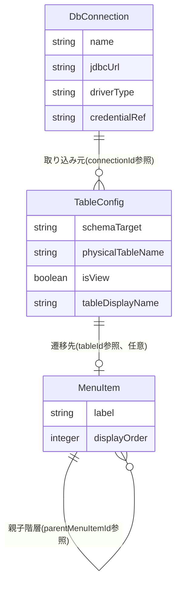

# Functional Specification: config-management

## ワークフロー

### 1. DB接続先設定のCRUD

1. 管理者がDB接続先設定を作成・更新・削除する(BR7.1で管理者権限を検証)。
2. 作成・更新時はBR1.1(必須項目検証)を適用する。
3. 削除時はBR1.2(参照中のTableConfigがあれば拒否)を適用する。
4. 操作成功時、該当キャッシュエントリを無効化し(BR6.2)、監査ログイベント(actionType=CONFIG_CONNECTION_CREATED/UPDATED/DELETED、BR8.1)を発行する。

### 2. スキーマ取り込みからのテーブル設定作成

1. 管理者がschema-ingestion(#14)の `GET /api/admin/schema-ingestion/schemas` と `POST /api/admin/schema-ingestion/preview` を呼び出し、取り込み対象のスキーマ/データベースとテーブルを選択する(schema-ingestion Unit担当の画面操作)。
2. 管理者が選択結果を `POST /api/admin/table-configs/import-from-schema` で送信する。
3. 契約#1経由でschema-ingestionから正規化スキーマ情報を再取得する(BR2.1)。
4. 選択された各テーブルについてTableConfigを新規作成し、formWidget(BR2.2)・required/maxLength(BR2.3)・isSearchable/listOrder/displayName(BR2.4)・foreignKeys(BR2.5、参照先が同一connectionId・schemaTarget内に既存であればreferencedTableIdを解決し、なければnullのままreferencedTablePhysicalNameを保持)の初期値を機械的に導出する。
5. 同一connectionId・schemaTarget内の既存TableConfigが持つ未解決の外部キー(referencedTableId=null)のうち、今回作成したテーブルのphysicalTableNameと一致するものを遡って解決する(BR2.7)。解決済みの参照について、代表表示列を決定する(BR2.8)。
6. 監査ログイベント(actionType=CONFIG_TABLE_CREATED、BR8.1)をテーブルごとに発行する。
7. 作成されたTableConfig一覧(未解決の外部キーがある場合はその旨を含む)を返す。

### 3. テーブル設定の個別編集

1. 管理者が `PUT /api/admin/table-configs/{tableId}` でTableConfigの個別項目(検索条件・一覧表示項目・編集対象外・バリデーション・フォーム部品・論理表示名等)を調整する(BR2.6)。
2. formWidget/searchOperatorの列挙値を検証する(BR3.1)。
3. 操作成功時、該当キャッシュエントリを無効化し(BR6.2)、監査ログイベント(actionType=CONFIG_TABLE_UPDATED、BR8.1)を発行する。

### 4. メニュー構成のCRUD

1. 管理者がメニュー項目を作成・更新・削除する。
2. 循環参照検証(BR4.1)、tableId存在検証(BR4.2)を適用する。
3. 操作成功時、該当キャッシュエントリを無効化し(BR6.2)、監査ログイベント(actionType=CONFIG_MENU_CREATED/UPDATED/DELETED、BR8.1)を発行する。

### 5. 設定のエクスポート

1. 管理者が `POST /api/admin/config/export` を呼び出す。
2. DbConnection・TableConfig・MenuItemの全件を単一のJSONファイルとして出力する(BR5.1、credentialRefは暗号化されたまま)。

### 6. 設定のインポート

1. 管理者が `POST /api/admin/config/import` でエクスポート済み(または手動作成)の設定ファイルを送信する。
2. 不正形式・スキーマ不一致・必須項目欠落の3種を検証する(BR5.2)。1件でも検出すれば設定全体を拒否し、errors配列とともに409を返す。
3. 検証をすべて通過すれば、既存の設定全体を置き換える。
4. キャッシュを全体クリアし(BR5.3)、監査ログイベント(actionType=CONFIG_IMPORTED、BR8.1)を発行する。

### 7. 有効な設定の参照(契約#2、dynamic-data-accessからの呼び出し)

1. dynamic-data-access(U4)が契約#2経由でtableIdを渡し、有効なTableConfigを要求する。
2. キャッシュにヒットすればキャッシュから返す。ミスした場合のみDBへ問い合わせ、結果をキャッシュに格納してから返す(BR6.1)。
3. 未設定のtableIdの場合は例外とし、dynamic-data-accessがREST境界で404として応答する(契約#2 Failure behavior)。
4. 返されたTableConfig.foreignKeysのうち、referencedTableIdがnull(BR2.5で未解決のまま)のエントリについては、dynamic-data-accessはFK値の名称解決(FR4.1)・ポップアップ検索(FR4.2)の対象外として扱う(エラーとはしない。参照先テーブルが後からインポートされればBR2.7により自動的に解決される)。

## 状態遷移

config-management(DbConnection・TableConfig・MenuItem)は、いずれも明示的な状態列を持たない。作成・更新・削除の3操作のみであり、意味のある状態遷移図は存在しない。

## エンティティ関連図(ER図、entities.mdから導出)

<!-- Text fallback: DbConnectionは複数のTableConfigの取り込み元となる(connectionIdによるID参照)。MenuItemはtableIdでTableConfigを任意に参照する(フォルダ/グループノードはnull)。MenuItemは自己参照でparentMenuItemIdによる階層構造を持つ。いずれもID参照であり外部キー制約は設けない。 -->

## ルールサマリー(rules.mdから導出)

| ワークフロー | 適用ルール |
|---|---|
| 1. DB接続先設定のCRUD | BR1.1, BR1.2, BR6.2, BR7.1, BR8.1 |
| 2. スキーマ取り込みからのテーブル設定作成 | BR2.1, BR2.2, BR2.3, BR2.4, BR2.5, BR2.7, BR2.8, BR7.1, BR8.1 |
| 3. テーブル設定の個別編集 | BR2.6, BR3.1, BR6.2, BR7.1, BR8.1 |
| 4. メニュー構成のCRUD | BR4.1, BR4.2, BR6.2, BR7.1, BR8.1 |
| 5. 設定のエクスポート | BR5.1, BR7.1 |
| 6. 設定のインポート | BR5.2, BR5.3, BR7.1, BR8.1 |
| 7. 有効な設定の参照(契約#2) | BR6.1 |

## Review

**Verdict:** READY
**Reviewer:** aidlc-architecture-reviewer-agent
**Date:** 2026-09-06T13:47:11Z
**Iteration:** 1
**Request Challenge:** review:8ae54b054aa36072ed1815d44aad8e09

### Findings

| ID | Severity | Location | Finding | Required action | Status |
|---|---|---|---|---|---|
| R-03 | Minor | entities.md > エンティティサマリー表 DbConnection行 | credentialRefの暗号化鍵の出典として「契約#19注記」を挙げているが、契約#19(auth→account-management、shared-schema、Accountテーブル)はDbConnection/credentialRefと無関係であり、この引用は誤り。実際の出典はschema-ingestion/functional-design-questions.md Q4およびdomain-design/components.mdのDbConnection行である(エンティティ一覧のyaml内では正しい出典が併記済み) | エンティティサマリー表の「契約#19注記」という記述を、schema-ingestion/functional-design-questions.md Q4およびdomain-design/components.mdへの参照に修正する | Unresolved |
| R-04 | Minor | entities.md > TableConfig.foreignKeysのインライン型記法 | `referencedTableId: identifier, nullable, referencedTablePhysicalName: string` という記法では、`nullable`がreferencedTableIdに掛かるのかreferencedTablePhysicalNameに掛かるのか曖昧 | `referencedTableId: identifier|null, referencedTablePhysicalName: string` のように、nullable対象を明示する記法に修正する | Unresolved |

### Validation Tool Results

| Tool | Result | Interpretation |
|---|---|---|
| aidlc-sensor.ts fire required-sections (functional-spec.md) | passed | 必須セクション構成に欠落なし |
| requirements.md FR2.1〜FR2.6・FR2.3.1・FR3.4 spot-check | 一致 | rules.md/entities.md/functional-spec.mdの記述内容(BR1.1〜BR8.1、7ワークフロー)がすべて対応するFRの文言と整合。traceability.jsonのcoverageもFR2.1〜FR3.4を漏れなくOKでカバーし、reverse側のBR1.2/BR7.1/BR8.1はN/A(実装補完・横断ルール)として妥当に説明されている |
| contract-summary.md #1/#2/#15/#19 spot-check | 一致(#19は無関係、R-03の裏付け) | 契約#1(config-management→schema-ingestion)の引数・戻り値・失敗時挙動はrules.md BR2.1・functional-spec.mdワークフロー2と完全一致。契約#2(dynamic-data-access→config-management)のキャッシュ経由参照・404失敗挙動はfunctional-spec.mdワークフロー7・BR6.1と完全一致。契約#15の`/api/admin/db-connections`等のエンドポイント群はfunctional-spec.mdの各ワークフローのAPIパスと一致。契約#19はAccountテーブルの共有スキーマ契約でありDbConnection/credentialRefとは無関係 — R-03がこの誤引用を正しく特定している |

### Summary

同一内容の再認定であることを確認した。entities.md/rules.md/functional-spec.md/traceability.jsonの内容は前回認証時のまま変化がなく、7ワークフロー・全ルール(BR1.1〜BR8.1)・全エンティティが要件(FR2.1〜FR2.6、FR2.3.1、FR3.4)および契約(#1・#2・#15)と整合している。Critical/Majorな新規欠陥は見つからず、R-03・R-04は既知の軽微な指摘としてUnresolvedのまま繰り越す。READYとする。
