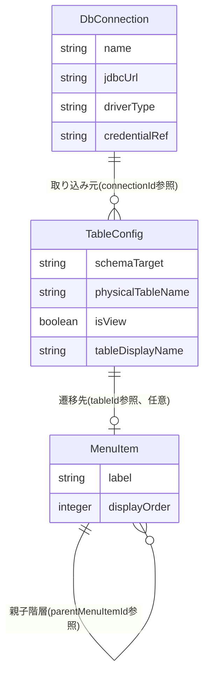

# Functional Specification: config-management

## ワークフロー

### 1. DB接続先設定のCRUD

1. 管理者がDB接続先設定を作成・更新・削除する(BR7.1で管理者権限を検証)。
2. 作成・更新時はBR1.1(必須項目検証)を適用する。
3. 削除時はBR1.2(参照中のTableConfigがあれば拒否)を適用する。
4. 操作成功時、該当キャッシュエントリを無効化し(BR6.2)、監査ログイベント(actionType=CONFIG_CONNECTION_CREATED/UPDATED/DELETED、BR8.1)を発行する。

### 2. スキーマ取り込みからのテーブル設定作成

1. 管理者がschema-ingestion(#14)の `GET /api/admin/schema-ingestion/schemas` と `POST /api/admin/schema-ingestion/preview` を呼び出し、取り込み対象のスキーマ/データベースとテーブルを選択する(schema-ingestion Unit担当の画面操作)。
2. 管理者が選択結果を `POST /api/admin/table-configs/import-from-schema` で送信する。
3. 契約#1経由でschema-ingestionから正規化スキーマ情報を再取得する(BR2.1)。
4. 選択された各テーブルについてTableConfigを新規作成し、formWidget(BR2.2)・required/maxLength(BR2.3)・isSearchable/listOrder/displayName(BR2.4)・foreignKeys(BR2.5、参照先が同一connectionId・schemaTarget内に既存であればreferencedTableIdを解決し、なければnullのままreferencedTablePhysicalNameを保持)の初期値を機械的に導出する。
5. 同一connectionId・schemaTarget内の既存TableConfigが持つ未解決の外部キー(referencedTableId=null)のうち、今回作成したテーブルのphysicalTableNameと一致するものを遡って解決する(BR2.7)。解決済みの参照について、代表表示列を決定する(BR2.8)。
6. 監査ログイベント(actionType=CONFIG_TABLE_CREATED、BR8.1)をテーブルごとに発行する。
7. 作成されたTableConfig一覧(未解決の外部キーがある場合はその旨を含む)を返す。

### 3. テーブル設定の個別編集

1. 管理者が `PUT /api/admin/table-configs/{tableId}` でTableConfigの個別項目(検索条件・一覧表示項目・編集対象外・バリデーション・フォーム部品・論理表示名等)を調整する(BR2.6)。
2. formWidget/searchOperatorの列挙値を検証する(BR3.1)。
3. 操作成功時、該当キャッシュエントリを無効化し(BR6.2)、監査ログイベント(actionType=CONFIG_TABLE_UPDATED、BR8.1)を発行する。

### 4. メニュー構成のCRUD

1. 管理者がメニュー項目を作成・更新・削除する。
2. 循環参照検証(BR4.1)、tableId存在検証(BR4.2)を適用する。
3. 操作成功時、該当キャッシュエントリを無効化し(BR6.2)、監査ログイベント(actionType=CONFIG_MENU_CREATED/UPDATED/DELETED、BR8.1)を発行する。

### 5. 設定のエクスポート

1. 管理者が `POST /api/admin/config/export` を呼び出す。
2. DbConnection・TableConfig・MenuItemの全件を単一のJSONファイルとして出力する(BR5.1、credentialRefは暗号化されたまま)。

### 6. 設定のインポート

1. 管理者が `POST /api/admin/config/import` でエクスポート済み(または手動作成)の設定ファイルを送信する。
2. 不正形式・スキーマ不一致・必須項目欠落の3種を検証する(BR5.2)。1件でも検出すれば設定全体を拒否し、errors配列とともに409を返す。
3. 検証をすべて通過すれば、既存の設定全体を置き換える。
4. キャッシュを全体クリアし(BR5.3)、監査ログイベント(actionType=CONFIG_IMPORTED、BR8.1)を発行する。

### 7. 有効な設定の参照(契約#2、dynamic-data-accessからの呼び出し)

1. dynamic-data-access(U4)が契約#2経由でtableIdを渡し、有効なTableConfigを要求する。
2. キャッシュにヒットすればキャッシュから返す。ミスした場合のみDBへ問い合わせ、結果をキャッシュに格納してから返す(BR6.1)。
3. 未設定のtableIdの場合は例外とし、dynamic-data-accessがREST境界で404として応答する(契約#2 Failure behavior)。
4. 返されたTableConfig.foreignKeysのうち、referencedTableIdがnull(BR2.5で未解決のまま)のエントリについては、dynamic-data-accessはFK値の名称解決(FR4.1)・ポップアップ検索(FR4.2)の対象外として扱う(エラーとはしない。参照先テーブルが後からインポートされればBR2.7により自動的に解決される)。

## 状態遷移

config-management(DbConnection・TableConfig・MenuItem)は、いずれも明示的な状態列を持たない。作成・更新・削除の3操作のみであり、意味のある状態遷移図は存在しない。

## エンティティ関連図(ER図、entities.mdから導出)

<!-- Text fallback: DbConnectionは複数のTableConfigの取り込み元となる(connectionIdによるID参照)。MenuItemはtableIdでTableConfigを任意に参照する(フォルダ/グループノードはnull)。MenuItemは自己参照でparentMenuItemIdによる階層構造を持つ。いずれもID参照であり外部キー制約は設けない。 -->

## ルールサマリー(rules.mdから導出)

| ワークフロー | 適用ルール |
|---|---|
| 1. DB接続先設定のCRUD | BR1.1, BR1.2, BR6.2, BR7.1, BR8.1 |
| 2. スキーマ取り込みからのテーブル設定作成 | BR2.1, BR2.2, BR2.3, BR2.4, BR2.5, BR2.7, BR2.8, BR7.1, BR8.1 |
| 3. テーブル設定の個別編集 | BR2.6, BR3.1, BR6.2, BR7.1, BR8.1 |
| 4. メニュー構成のCRUD | BR4.1, BR4.2, BR6.2, BR7.1, BR8.1 |
| 5. 設定のエクスポート | BR5.1, BR7.1 |
| 6. 設定のインポート | BR5.2, BR5.3, BR7.1, BR8.1 |
| 7. 有効な設定の参照(契約#2) | BR6.1 |

## Review

**Verdict:** READY
**Reviewer:** aidlc-architecture-reviewer-agent
**Date:** 2026-09-06T05:14:50Z
**Iteration:** 1
**Request Challenge:** review:61608dff90564aefad931cfe0202d050

> redo jump後の再認定(iteration 1)。内容は以前のiteration 2(pre-redo-jump)から変更なし。以下の2件のMinorは引き続き未解消(functional-designステージ終了ゲートへの繰延べ事項として記録)。

### Findings

| ID | Severity | Location | Finding | Required action | Status |
|---|---|---|---|---|---|
| R-01 | Critical | rules.md > BR2.5, BR2.7, BR2.8; entities.md > TableConfig.foreignKeys; functional-spec.md > ワークフロー2・7 | schema-ingestionのIngestedForeignKey(columns[]・referencedTable(物理テーブル名文字列)・referencedColumns[])から、config-management側が要求するreferencedTableId(TableConfigの識別子)への名前→ID解決ロジックが欠落し、未インポート時の挙動も未定義だった | entities.mdにreferencedTableId(nullable)・referencedTablePhysicalName(常に非null)を追加し、BR2.5を同一connectionId・schemaTarget内のphysicalTableName一致による解決ロジックに書き換え、新規TableConfigインポート時に既存の未解決FKを遡及解決するBR2.7、代表表示列の決定タイミングを規定するBR2.8を追加する。functional-spec.mdのワークフロー2・7にも遡及解決と「未解決FKはエラーではなく名称解決・ポップアップ検索の対象外」である旨を明記する | Resolved |
| R-02 | Minor | rules.md > BR8.1; inception/contract-design/contract-summary.md > 監査ログイベント契約(#5〜#8) | BR8.1が契約#7のCONFIG_TABLE_*語彙をDbConnection・MenuItemにも流用しており、監査ログのactionTypeによるエンティティ種別の絞り込みができない | DbConnection用にCONFIG_CONNECTION_CREATED/UPDATED/DELETED、MenuItem用にCONFIG_MENU_CREATED/UPDATED/DELETEDを契約#7の枠内(発行元の加法的所有)で追加し、BR8.1・functional-spec.mdのワークフロー1・4を更新する。contract-summary.md側にも同じ語彙を追記する | Resolved |
| R-03 | Minor | entities.md > エンティティサマリー表(DbConnection行、73行目) | attributes欄(17行目)ではcredentialRefの暗号化根拠が正しい出典(schema-ingestion/functional-design-questions.md Q4、domain-design/components.md DbConnection行)に修正されているが、直後のエンティティサマリー表の「備考」列は依然として旧来の誤った出典「契約#19注記」(auth→account-managementの共有スキーマ契約であり、DbConnection/credentialRefとは無関係)のままであり、修正が1箇所のみで完了していない | エンティティサマリー表のDbConnection行「備考」列の出典表記を、17行目のattributes欄と同じ正しい出典(schema-ingestion/functional-design-questions.md Q4、domain-design/components.md DbConnection行)に揃えて修正する | Unresolved |
| R-04 | Minor | entities.md > TableConfig.foreignKeys 属性定義(30行目) | `foreignKeys: array<object{ columns: array<string>, referencedTableId: identifier, nullable, referencedTablePhysicalName: string, referencedColumns: array<string> }>` というインラインスキーマ表記で、`nullable` が独立したトークンとして`referencedTableId: identifier`と`referencedTablePhysicalName: string`の間に置かれており、どのフィールドを修飾するのか構文上曖昧(直後の説明文で意味は判読できるが、機械可読セクションとしての厳密性を欠く) | `referencedTableId: identifier, nullable`のように修飾対象のフィールドと`nullable`を明確に結合する(例: `referencedTableId: identifier|null`)か、フィールド定義から独立したnullable注記を除去し説明文のみに委ねる | New |

### Validation Tool Results

| Tool | Result | Interpretation |
|---|---|---|
| aidlc-sensor-required-sections | PASS(3ファイルとも合格、ユーザー確認済み) | entities.md/rules.md/functional-spec.mdの必須見出し構成に問題なし |
| aidlc-sensor-traceability / aidlc-sensor-upstream-coverage | FR1系・FR4系〜FR7系の大半が`missing_from_upstream_ids`として検出される(gaps/orphans/missing_from_table/invalid_entries/invalid_targetsは空) | stories.mdがプロジェクト全体でSKIPされているためのFRフォールバック既知制約。traceability.jsonのupstream_ids(FR2.1〜FR2.6、FR2.3.1、FR3.4)自体は本Unitの責務(unit-of-work.md U2定義)と過不足なく一致しており、rules.mdがcitationとして参照するFR4.1/FR4.2はU4(dynamic-data-access)所有のFRであり本Unitのupstream_idsに含めるべきものではない。新規欠陥ではない |
| クロスユニット参照の手動検証(schema-ingestion/functional-design/entities.md 単一ファイルのスポットチェック) | IngestedForeignKey.columns[]/referencedTable(string)/referencedColumns[]の実際の形状を確認し、entities.md/rules.mdの記述と矛盾がないことを確認 | R-01の修正がschema-ingestion側の実形状と整合していることを確認済み |
| 契約#7整合性の手動検証(inception/contract-design/contract-summary.md) | 追加されたCONFIG_CONNECTION_*/CONFIG_MENU_*語彙は「発行元が自身のactionType語彙のみを加法的に所有・拡張できる」という契約#7の所有権例外規定と矛盾せず、envelope形状(occurredAt/actorAccountId/actionType/targetDescription)も変更されていないことを確認 | R-02の修正は契約#7の枠組みと整合している |

### Summary

Iteration 1で指摘したCritical 1件(FK名前→ID解決の欠落)とMinor 1件(actionType語彙の混在)は、schema-ingestion側の実際のIngestedForeignKey形状およびcontract-summary.md #7の所有権例外規定と矛盾なく解消されており、entities.md/rules.md/functional-spec.mdの3ファイル間でも一貫している。credentialRefの出典修正(旧Minor)はattributes欄のみ修正され、直後のエンティティサマリー表に旧い誤出典が残る部分修正にとどまっているため未解決のまま据え置き、加えてforeignKeys属性のインライン表記に軽微な曖昧さを新規指摘(R-04)する。いずれもCritical/Majorではなく実装を妨げるものではないため、READYと判定する。
