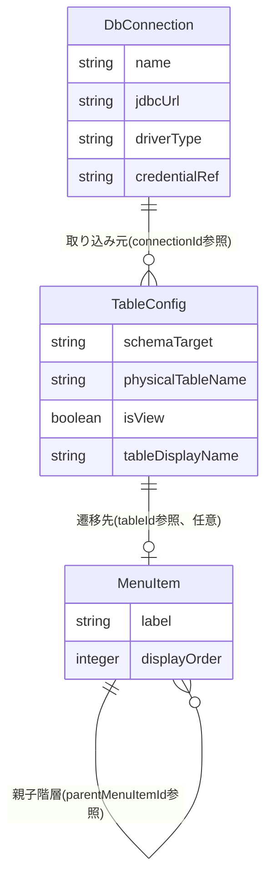

# Functional Specification: config-management

## ワークフロー

### 1. DB接続先設定のCRUD

1. 管理者がDB接続先設定を作成・更新・削除する(BR7.1で管理者権限を検証)。
2. 作成・更新時はBR1.1(必須項目検証)を適用する。
3. 削除時はBR1.2(参照中のTableConfigがあれば拒否)を適用する。
4. 操作成功時、該当キャッシュエントリを無効化し(BR6.2)、監査ログイベント(actionType=CONFIG_CONNECTION_CREATED/UPDATED/DELETED、BR8.1)を発行する。

### 2. スキーマ取り込みからのテーブル設定作成

1. 管理者がschema-ingestion(#14)の `GET /api/admin/schema-ingestion/schemas` と `POST /api/admin/schema-ingestion/preview` を呼び出し、取り込み対象のスキーマ/データベースとテーブルを選択する(schema-ingestion Unit担当の画面操作)。
2. 管理者が選択結果を `POST /api/admin/table-configs/import-from-schema` で送信する。
3. 契約#1経由でschema-ingestionから正規化スキーマ情報を再取得する(BR2.1)。
4. 選択された各テーブルについてTableConfigを新規作成し、formWidget(BR2.2)・required/maxLength(BR2.3)・isSearchable/listOrder/displayName(BR2.4)・foreignKeys(BR2.5、参照先が同一connectionId・schemaTarget内に既存であればreferencedTableIdを解決し、なければnullのままreferencedTablePhysicalNameを保持)の初期値を機械的に導出する。
5. 同一connectionId・schemaTarget内の既存TableConfigが持つ未解決の外部キー(referencedTableId=null)のうち、今回作成したテーブルのphysicalTableNameと一致するものを遡って解決する(BR2.7)。解決済みの参照について、代表表示列を決定する(BR2.8)。
6. 監査ログイベント(actionType=CONFIG_TABLE_CREATED、BR8.1)をテーブルごとに発行する。
7. 作成されたTableConfig一覧(未解決の外部キーがある場合はその旨を含む)を返す。

### 3. テーブル設定の個別編集

1. 管理者が `PUT /api/admin/table-configs/{tableId}` でTableConfigの個別項目(検索条件・一覧表示項目・編集対象外・バリデーション・フォーム部品・論理表示名等)を調整する(BR2.6)。
2. formWidget/searchOperatorの列挙値を検証する(BR3.1)。
3. 操作成功時、該当キャッシュエントリを無効化し(BR6.2)、監査ログイベント(actionType=CONFIG_TABLE_UPDATED、BR8.1)を発行する。

### 4. メニュー構成のCRUD

1. 管理者がメニュー項目を作成・更新・削除する。
2. 循環参照検証(BR4.1)、tableId存在検証(BR4.2)を適用する。
3. 操作成功時、該当キャッシュエントリを無効化し(BR6.2)、監査ログイベント(actionType=CONFIG_MENU_CREATED/UPDATED/DELETED、BR8.1)を発行する。

### 4a. 非管理者向けメニュー取得(`GET /api/menu`、契約#23、frontend-core Unit Functional Designより新設)

1. 非管理者を含む全利用者が、`X-Active-Role`ヘッダー(作業中ロールID)を付けて`GET /api/menu`を呼び出す。
2. `X-Active-Role`がアクセストークンのrolesクレームに含まれるか検証する。含まれなければ403を返す(BR4.3)。
3. 契約#22(config-management → permission)で、対象roleIdがcanList=trueを持つtableIdの集合を取得する。
4. メニュー階層のうち、テーブルノード(tableId IS NOT NULL)は手順3の集合に含まれるもののみ残す。フォルダ/グループノード(tableId IS NULL)は、配下を再帰的にたどって1件でも可視なテーブルノードが残る場合のみ結果に含める(BR4.3)。
5. フィルタ済みのメニュー階層を返す。設定管理画面(10.、frontend-adminのメニュー管理画面14)がisAdminによる全件アクセスであるのとは対照的に、本ワークフローはロールのcanList権限でフィルタ済みの結果のみを返す。

### 5. 設定のエクスポート

1. 管理者が `POST /api/admin/config/export` を呼び出す。
2. DbConnection・TableConfig・MenuItemの全件を単一のJSONファイルとして出力する(BR5.1、credentialRefは暗号化されたまま)。

### 6. 設定のインポート

1. 管理者が `POST /api/admin/config/import` でエクスポート済み(または手動作成)の設定ファイルを送信する。
2. 不正形式・スキーマ不一致・必須項目欠落の3種を検証する(BR5.2)。1件でも検出すれば設定全体を拒否し、errors配列とともに409を返す。
3. 検証をすべて通過すれば、既存の設定全体を置き換える。
4. キャッシュを全体クリアし(BR5.3)、監査ログイベント(actionType=CONFIG_IMPORTED、BR8.1)を発行する。

### 7. 有効な設定の参照(契約#2、dynamic-data-accessからの呼び出し)

1. dynamic-data-access(U4)が契約#2経由でtableIdを渡し、有効なTableConfigを要求する。
2. キャッシュにヒットすればキャッシュから返す。ミスした場合のみDBへ問い合わせ、結果をキャッシュに格納してから返す(BR6.1)。
3. 未設定のtableIdの場合は例外とし、dynamic-data-accessがREST境界で404として応答する(契約#2 Failure behavior)。
4. 返されたTableConfig.foreignKeysのうち、referencedTableIdがnull(BR2.5で未解決のまま)のエントリについては、dynamic-data-accessはFK値の名称解決(FR4.1)・ポップアップ検索(FR4.2)の対象外として扱う(エラーとはしない。参照先テーブルが後からインポートされればBR2.7により自動的に解決される)。

## 状態遷移

config-management(DbConnection・TableConfig・MenuItem)は、いずれも明示的な状態列を持たない。作成・更新・削除の3操作のみであり、意味のある状態遷移図は存在しない。

## エンティティ関連図(ER図、entities.mdから導出)

<!-- Text fallback: DbConnectionは複数のTableConfigの取り込み元となる(connectionIdによるID参照)。MenuItemはtableIdでTableConfigを任意に参照する(フォルダ/グループノードはnull)。MenuItemは自己参照でparentMenuItemIdによる階層構造を持つ。いずれもID参照であり外部キー制約は設けない。 -->

## ルールサマリー(rules.mdから導出)

| ワークフロー | 適用ルール |
|---|---|
| 1. DB接続先設定のCRUD | BR1.1, BR1.2, BR6.2, BR7.1, BR8.1 |
| 2. スキーマ取り込みからのテーブル設定作成 | BR2.1, BR2.2, BR2.3, BR2.4, BR2.5, BR2.7, BR2.8, BR7.1, BR8.1 |
| 3. テーブル設定の個別編集 | BR2.6, BR3.1, BR6.2, BR7.1, BR8.1 |
| 4. メニュー構成のCRUD | BR4.1, BR4.2, BR6.2, BR7.1, BR8.1 |
| 4a. 非管理者向けメニュー取得(契約#23) | BR4.3 |
| 5. 設定のエクスポート | BR5.1, BR7.1 |
| 6. 設定のインポート | BR5.2, BR5.3, BR7.1, BR8.1 |
| 7. 有効な設定の参照(契約#2) | BR6.1 |

## Review

**Verdict:** READY
**Reviewer:** aidlc-architecture-reviewer-agent
**Date:** 2026-09-07T02:25:35Z
**Iteration:** 1

### Findings

指摘なし(既知の繰延べ事項R-03・R-04を除く)

### Summary

新設されたBR4.3は契約#22(config-management → permission、roleIdからcanList=trueのtableId集合を取得)・契約#23(GET /api/menu、OpenAPI定義)双方と、フォルダ/グループノードの除外条件(配下に可視なテーブルノードが1件もない場合のみ除外)・テーブルノードのフィルタ条件(canList権限集合に含まれるもののみ)を含めて正確に一致している。BR7.1の修正はGET /api/menuのみを対象外とし、他の全操作(DB接続先設定・テーブル設定・メニュー構成・エクスポート/インポート・キャッシュクリア)にはisAdmin必須を引き続き課しており、ワークフロー4aの適用ルール一覧(BR4.3のみ、BR7.1を含まない)とも整合する。functional-spec.mdのワークフロー4aはBR4.3の判定ロジック(403判定→契約#22呼び出し→テーブルノードのフィルタ→フォルダ/グループノードの再帰的可視性判定)を過不足なくトレースしている。permission側のBR5.3(roleId受け取り→TablePermission.canList=trueのtableId集合を返す、該当なしなら空集合)は契約#22のConsumer passes/Provider returns/Failure behaviorと完全に一致し、config-management側のBR4.3の呼び出し前提と矛盾しない。traceability.jsonはFR3.4のcoverage targetにBR4.3を加法的に追記しており、upstream_idsの変更(新規追加不要)も適切。既存のBR1.1〜BR8.1・ワークフロー1〜7・entities.mdのMenuItemモデル(tableId nullableによるフォルダ/グループノード表現)との矛盾も見当たらない。
