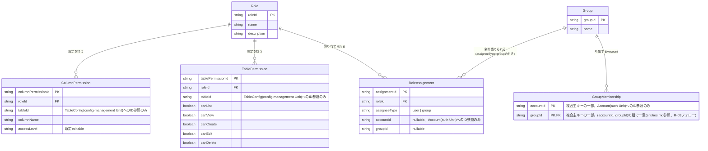

# Functional Specification: permission

## ワークフロー

### 1. ロール・グループの定義

1. 管理者(isAdminクレーム保持者)が`POST /api/admin/roles`または`POST /api/admin/groups`でRole・Groupを作成する。
2. name一意性を検証する(BR1.1)。違反時は400エラー(RFC 7807)を返す。

### 1a. ロール・グループの名称変更

1. 管理者が`PUT /api/admin/roles/{roleId}`または`PUT /api/admin/groups/{groupId}`でRole・Groupの名称を変更する(BR1.3、frontend-admin Unit Functional Designレビューより新設)。
2. 対象roleId/groupIdの存在を確認する。存在しなければ404を返す。
3. name一意性を検証する(BR1.1)。違反時は400エラー(RFC 7807)を返す。
4. 検証を通過したら、name属性のみを更新する。

### 1b. ロール・グループの削除

1. 管理者が`DELETE /api/admin/roles/{roleId}`または`DELETE /api/admin/groups/{groupId}`でRole・Groupを削除する(BR1.4・BR1.5、frontend-admin Unit Functional Designレビューより新設)。
2. 対象roleId/groupIdの存在を確認する。存在しなければ404を返す。
3. ロールの場合はRoleAssignment(roleId=対象)、グループの場合はRoleAssignment(assigneeType=group, groupId=対象)の存在を確認する。1件以上存在すれば409を返し削除を拒否する。
4. 参照が存在しなければ、ロールの場合はTablePermission・ColumnPermission、グループの場合はGroupMembershipを道連れに削除したうえで、対象Role/Group自体を削除する。

### 2. グループメンバー構成の管理

1. 管理者が`GET /api/admin/groups/{groupId}/members`で対象Groupの所属Account一覧を取得する。
2. 管理者が`POST /api/admin/groups/{groupId}/members`で対象GroupへAccountを追加する(GroupMembershipの作成)。既に所属済みのAccountを重複追加しようとした場合は既存の所属を維持し何もしない(冪等、BR1.2)。
3. 管理者が`DELETE /api/admin/groups/{groupId}/members?accountId=<accountId>`で対象GroupからAccountを除く(GroupMembershipの削除)。

### 3. テーブル単位・カラム単位権限の設定

1. 管理者が対象のRole・テーブルについて、TablePermission(canList/canView/canCreate/canEdit/canDelete)を設定する(BR2.1)。
2. 管理者が対象のRole・テーブル・カラムについて、ColumnPermission(accessLevel: editable/readonly/hidden)を設定する(BR2.2)。

### 4. ロールの割り当て

1. 管理者が`POST /api/admin/roles/{roleId}/assignments`でロールをAccountまたはGroupへ割り当てる。
2. assigneeTypeに応じてaccountId・groupIdのいずれか一方のみが指定されていることを検証する(BR3.1)。違反時は400エラー(RFC 7807)を返す。
3. 指定された(roleId, accountId)または(roleId, groupId)の組が既に存在する場合、既存の割当を維持し何もしない(BR3.3、冪等)。存在しない場合は新規に作成する。

### 5. 契約#21(account-management → permission)によるアカウントの初期ロール割り当て・変更

1. account-managementが、アカウント新規作成時(初期ロール割り当て)またはアカウント編集時(割り当てロール変更)に、accountIdとroleId配列を渡して本Unitを呼び出す(契約#21)。
2. 渡されたroleId配列に存在しないロールが含まれていないか検証する(BR3.2)。含まれる場合は例外を送出し、account-management側で400として応答される。
3. 検証を通過したら、配列内の重複roleIdを去重(dedup)したうえで、対象accountIdの直接RoleAssignment(assigneeType=user)をすべて削除し、去重後の各roleIdについて新規に作成する(全置換。iteration 2レビューR-01フォロー)。グループ経由の割当(GroupMembership)には触れない。
4. 更新後の直接RoleAssignment一覧(去重済みroleId配列)を返す。

### 6. 自身の切替可能ロール一覧の取得(`GET /api/me/roles`)

1. 利用者(管理者・非管理者を問わず全利用者)が自身の切替可能ロール一覧を要求する。
2. 自身のAccountに直接割り当てられたロール(RoleAssignment、assigneeType=user)を取得する。
3. 自身が所属するGroup(GroupMembership)を取得し、それらのGroupに割り当てられたロール(RoleAssignment、assigneeType=group)を取得する。
4. 手順2・3の和集合を切替可能ロール一覧として返す(BR4.1)。
5. 利用者は返された一覧から作業中ロールを選択し、以後のリクエストで`X-Active-Role`ヘッダー(contract-summary.md共通規約)として送る。ロール切替自体はクライアント側で完結し、本Unitへの追加の呼び出しは発生しない。

**ログイン時のアクセストークンrolesクレームとの関係(contract-summary.md #20)**: 手順2・3と全く同じ「有効なロール集合の計算」(直接割り当て+グループ経由の割り当ての和集合)は、auth Unitのログイン処理でも必要になる。auth Unitはログイン成功時にpermission Unitをプロセス内呼び出しし、対象accountIdの有効なロールID一覧を取得してアクセストークンのrolesクレームへそのまま埋め込む(contract-summary.md #20で新設)。`GET /api/me/roles`(本ワークフロー)とこの内部呼び出しは、同じロジックを異なる2つの消費者(利用者本人のロール切替UI、auth Unitのトークン発行処理)に提供する。

### 7. テーブル単位・カラム単位の権限確認(dynamic-data-access Unitからの呼び出し、contract-summary.md #3)

1. dynamic-data-access Unitが、対象テーブル・対象アクション(list/view/create/edit/delete)・判定対象ロールID(`X-Active-Role`由来)を渡してテーブル単位権限を問い合わせる。
2. 対象ロール・テーブルのTablePermissionレコードを検索する。存在すれば該当操作のcanXxx値を返す。存在しなければすべての操作を拒否と返す(BR5.1)。
3. カラム単位の権限が必要な場合、対象ロール・テーブル・カラムのColumnPermissionレコードを検索する。存在すればそのaccessLevelを返す。存在しなければeditableを返す(BR5.2)。

## 状態遷移

本Unitの各エンティティ(Role・Group・GroupMembership・RoleAssignment・TablePermission・ColumnPermission)はいずれも意味のある状態遷移(ライフサイクル)を持たない。作成・更新・削除の単純なCRUD対象である。

## エンティティ関連図(ER図、entities.mdから導出)

<!-- Text fallback: RoleとGroupは独立したエンティティ。GroupMembershipはGroupに対して多、Accountへの参照を1件持つ(外部キー制約なし)。RoleAssignmentはRoleに対して多、assigneeType=groupのときのみGroupへの参照を持ち、assigneeType=userのときはAccountへの参照(外部キー制約なし)のみを持つ(排他)。TablePermission・ColumnPermissionはいずれもRoleに対して多で、TableConfig(config-management Unit)へのID参照を持つ。 -->

## ルールサマリー(rules.mdから導出)

| ワークフロー | 適用ルール |
|---|---|
| 1. ロール・グループの定義 | BR1.1 |
| 1a. ロール・グループの名称変更 | BR1.1, BR1.3 |
| 1b. ロール・グループの削除 | BR1.4, BR1.5 |
| 2. グループメンバー構成の管理 | BR1.2 |
| 3. テーブル単位・カラム単位権限の設定 | BR2.1, BR2.2 |
| 4. ロールの割り当て | BR3.1, BR3.3 |
| 5. 契約#21によるアカウントの初期ロール割り当て・変更 | BR3.2 |
| 6. 自身の切替可能ロール一覧の取得 | BR4.1 |
| 7. テーブル単位・カラム単位の権限確認 | BR5.1, BR5.2 |

## Review

**Verdict:** READY
**Reviewer:** aidlc-architecture-reviewer-agent
**Date:** 2026-09-06T13:31:30Z
**Iteration:** 1

### Findings

| ID | Severity | Location | Finding | Required action | Status |
|---|---|---|---|---|---|
| R-01 | Minor | aidlc/spaces/default/intents/260904-static-config-crud/construction/permission/functional-design/upstream-coverage sensor result | `upstream-coverage` reports `unit-of-work`, `unit-of-work-story-map`, `requirements` as consumed-but-unreferenced in the scanned files (rules.md/entities.md/functional-spec.md/traceability.json never cite these three filenames by name; requirements.md coverage is carried instead via bare FR IDs such as FR5.1). This looks like the same class of sensor false-positive already accepted for `missing_from_upstream_ids`, but unlike that one it was not called out in the dispatch brief as expected, so it is recorded here for visibility rather than silently dropped. | No artifact change required if the team accepts this as sensor noise; otherwise add an explicit citation of unit-of-work.md/unit-of-work-story-map.md alongside the existing FR-ID citations. | New |
| R-02 | Minor | aidlc/spaces/default/intents/260904-static-config-crud/construction/permission/functional-design/rules.md > BR1.4, BR1.5 | The "check RoleAssignment reference, then cascade-delete child rows, then delete the Role/Group" sequence in BR1.4/BR1.5 does not state that the check-and-delete must run as a single atomic transaction. A RoleAssignment could in principle be created between the reference check and the delete, leaving a dangling reference. This is a narrow, implementation-level concern rather than a design defect (functional design is not expected to specify transaction boundaries), so it does not block readiness. | Optionally add one sentence noting the check-then-cascade-delete sequence must execute within a single transaction, to remove any ambiguity for the implementer. | New |

### Validation Tool Results

| Tool | Result | Interpretation |
|---|---|---|
| required-sections | PASS | functional-spec.md carries all required sections. |
| upstream-coverage | FAIL: `unreferenced: ["unit-of-work", "unit-of-work-story-map", "requirements"]` | See R-01. Not a defect in the reviewed business logic; recorded as advisory. |
| traceability | FAIL: `missing_from_upstream_ids` lists ~38 FR IDs (FR1.x, FR2.x, FR3.x, FR4.x, FR5.5/5.6, FR6.x, FR7.x) | Confirmed as the known false-positive named in the dispatch brief (FRs outside this Unit's scope, from the stories.md-skip fallback). All FRs actually in scope (FR5.1–FR5.4) are covered per traceability.json's `coverage` array, cross-checked against requirements.md. No new defect. |

### Summary

The four changes verified cleanly against the upstream contracts and against each other: BR1.3's rename logic matches the new PUT endpoints (200/400/404) exactly; BR1.4/BR1.5's cascade-vs-block distinction is architecturally sound against entities.md's actual ownership model — TablePermission/ColumnPermission/GroupMembership are each owned_by the permission Unit itself as child data of the Role/Group being deleted (correctly cascaded), while RoleAssignment is the one entity that references the Role/Group from outside that ownership boundary (correctly treated as the blocking 409 condition) — and matches the DELETE endpoints' 204/404/409 contract exactly; the BR3.2 dedup fix is stated identically and consistently in rules.md and functional-spec.md workflow 5, and correctly closes the prior unique-constraint risk. traceability.json's FR5.3 coverage entry was updated to include BR1.3–BR1.5. Only two Minor, non-blocking observations were found (sensor noise and an implementation-level transactionality note); no Critical or Major findings.
