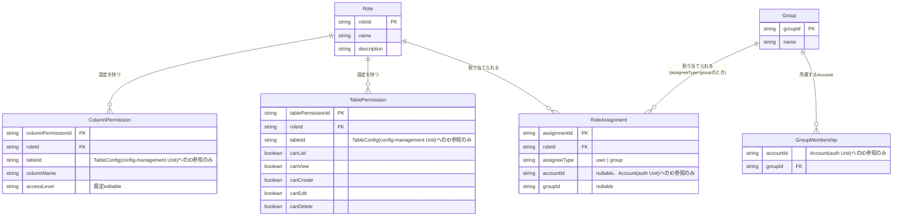

# Functional Specification: permission

## ワークフロー

### 1. ロール・グループの定義

1. 管理者(isAdminクレーム保持者)が`POST/PUT /api/admin/roles`または`POST/PUT /api/admin/groups`でRole・Groupを作成・変更する。
2. name一意性を検証する(BR1.1)。違反時は400エラー(RFC 7807)を返す。

### 2. グループメンバー構成の管理

1. 管理者が`GET /api/admin/groups/{groupId}/members`で対象Groupの所属Account一覧を取得する。
2. 管理者が`POST /api/admin/groups/{groupId}/members`で対象GroupへAccountを追加する(GroupMembershipの作成)。既に所属済みのAccountを重複追加しようとした場合は既存の所属を維持し何もしない(冪等、BR1.2)。
3. 管理者が`DELETE /api/admin/groups/{groupId}/members?accountId=<accountId>`で対象GroupからAccountを除く(GroupMembershipの削除)。

### 3. テーブル単位・カラム単位権限の設定

1. 管理者が対象のRole・テーブルについて、TablePermission(canList/canView/canCreate/canEdit/canDelete)を設定する(BR2.1)。
2. 管理者が対象のRole・テーブル・カラムについて、ColumnPermission(accessLevel: editable/readonly/hidden)を設定する(BR2.2)。

### 4. ロールの割り当て

1. 管理者が`POST /api/admin/roles/{roleId}/assignments`でロールをAccountまたはGroupへ割り当てる。
2. assigneeTypeに応じてaccountId・groupIdのいずれか一方のみが指定されていることを検証する(BR3.1)。違反時は400エラー(RFC 7807)を返す。

### 5. 自身の切替可能ロール一覧の取得(`GET /api/me/roles`)

1. 利用者(管理者・非管理者を問わず全利用者)が自身の切替可能ロール一覧を要求する。
2. 自身のAccountに直接割り当てられたロール(RoleAssignment、assigneeType=user)を取得する。
3. 自身が所属するGroup(GroupMembership)を取得し、それらのGroupに割り当てられたロール(RoleAssignment、assigneeType=group)を取得する。
4. 手順2・3の和集合を切替可能ロール一覧として返す(BR4.1)。
5. 利用者は返された一覧から作業中ロールを選択し、以後のリクエストで`X-Active-Role`ヘッダー(contract-summary.md共通規約)として送る。ロール切替自体はクライアント側で完結し、本Unitへの追加の呼び出しは発生しない。

**ログイン時のアクセストークンrolesクレームとの関係(contract-summary.md #20)**: 手順2・3と全く同じ「有効なロール集合の計算」(直接割り当て+グループ経由の割り当ての和集合)は、auth Unitのログイン処理でも必要になる。auth Unitはログイン成功時にpermission Unitをプロセス内呼び出しし、対象accountIdの有効なロールID一覧を取得してアクセストークンのrolesクレームへそのまま埋め込む(contract-summary.md #20で新設)。`GET /api/me/roles`(本ワークフロー)とこの内部呼び出しは、同じロジックを異なる2つの消費者(利用者本人のロール切替UI、auth Unitのトークン発行処理)に提供する。

### 6. テーブル単位・カラム単位の権限確認(dynamic-data-access Unitからの呼び出し、contract-summary.md #3)

1. dynamic-data-access Unitが、対象テーブル・対象アクション(list/view/create/edit/delete)・判定対象ロールID(`X-Active-Role`由来)を渡してテーブル単位権限を問い合わせる。
2. 対象ロール・テーブルのTablePermissionレコードを検索する。存在すれば該当操作のcanXxx値を返す。存在しなければすべての操作を拒否と返す(BR5.1)。
3. カラム単位の権限が必要な場合、対象ロール・テーブル・カラムのColumnPermissionレコードを検索する。存在すればそのaccessLevelを返す。存在しなければeditableを返す(BR5.2)。

## 状態遷移

本Unitの各エンティティ(Role・Group・GroupMembership・RoleAssignment・TablePermission・ColumnPermission)はいずれも意味のある状態遷移(ライフサイクル)を持たない。作成・更新・削除の単純なCRUD対象である。

## エンティティ関連図(ER図、entities.mdから導出)

<!-- Text fallback: RoleとGroupは独立したエンティティ。GroupMembershipはGroupに対して多、Accountへの参照を1件持つ(外部キー制約なし)。RoleAssignmentはRoleに対して多、assigneeType=groupのときのみGroupへの参照を持ち、assigneeType=userのときはAccountへの参照(外部キー制約なし)のみを持つ(排他)。TablePermission・ColumnPermissionはいずれもRoleに対して多で、TableConfig(config-management Unit)へのID参照を持つ。 -->

## ルールサマリー(rules.mdから導出)

| ワークフロー | 適用ルール |
|---|---|
| 1. ロール・グループの定義 | BR1.1 |
| 2. グループメンバー構成の管理 | BR1.2 |
| 3. テーブル単位・カラム単位権限の設定 | BR2.1, BR2.2 |
| 4. ロールの割り当て | BR3.1 |
| 5. 自身の切替可能ロール一覧の取得 | BR4.1 |
| 6. テーブル単位・カラム単位の権限確認 | BR5.1, BR5.2 |

## Review

**Verdict:** READY
**Reviewer:** aidlc-architecture-reviewer-agent
**Date:** 2026-09-06T03:03:03Z
**Iteration:** 2

### Findings

| ID | Severity | Location | Finding | Required action | Status |
|---|---|---|---|---|---|
| R-01 | Critical | inception/contract-design/contract-summary.md 契約#20 および inception/units-generation/unit-of-work-dependency.md の auth の depends_on とmermaid図、construction/permission/functional-design/functional-spec.md ワークフロー5 | 契約#20(permission提供、auth消費、Owner=permission)が新設され、unit-of-work-dependency.mdのYAML(auth.depends_onにpermissionを追加)・mermaid図(auth --> permissionエッジ追加)・統合ポイント表のいずれにも整合的に反映されている。permission.depends_onは引き続き空のままであり、トポロジカル順序を手計算しても循環は存在しない(schema-ingestion/permission/audit-logがレベル0、config-management/authがレベル1という並行開発レベル表とも一致)。functional-spec.mdワークフロー5にauthとの二重消費関係の説明も追加済み。 | 対応不要。 | Resolved |
| R-02 | Major | inception/contract-design/contract-summary.md permission APIブロック(`/api/admin/groups/{groupId}/members`)および construction/permission/functional-design/functional-spec.md ワークフロー2 | GET/POST/DELETE /api/admin/groups/{groupId}/membersがcontract-summary.mdに追加され、由来を示す追記コメントも付いている。functional-spec.mdワークフロー2の各手順がこれら3エンドポイントを明示的に引用している。 | 対応不要。 | Resolved |
| R-03 | Minor | construction/permission/functional-design/rules.md BR1.2、functional-spec.md ワークフロー2手順2、traceability.json | 重複するグループ所属追加の挙動が冪等(エラーにしない)というBR1.2として明文化され、ワークフロー・契約記述・traceability.jsonのFR5.3カバレッジ対象のいずれにも反映されている。 | 対応不要。 | Resolved |
| R-04 | Minor | construction/permission/functional-design/entities.md TablePermission.tableId | ColumnPermission.tableIdと同一形式の根拠注記(domain-design/components.mdの属性一覧に明記がなかったが関連説明文からテーブル帰属を補完する、という説明)が追加され、左右対称になった。 | 対応不要。 | Resolved |
| R-05 | Minor | construction/permission/functional-design/entities.md RoleAssignment.entity_constraints、rules.md BR3.1 | 読み取り時はassigneeTypeを正とし、不一致が見つかった場合はデータ不整合としてログに記録するという読み取り時優先順位が、entities.mdとrules.md BR3.1の両方に追記されている。 | 対応不要。 | Resolved |
| R-06 | Minor | inception/contract-design/contract-summary.md permission APIブロック `/api/admin/groups/{groupId}/members` のpost定義 | BR1.2(rules.md)は重複追加時に「200番台か201番台いずれかで返す」ことを認めているが、OpenAPI契約のresponsesには201のみが定義されており200が明記されていない。実装者がどちらを選んでも契約上は矛盾しないが、契約定義とビジネスルールの記述に軽微な非対称がある。 | OpenAPI契約のresponsesに200(既存所属を維持した場合の応答)を追記するか、201のみに統一する場合はBR1.2の記述からもう一方の選択肢を削るか、どちらの状態でも201を返す設計に統一する。 | New |

### Validation Tool Results

このステージ定義には自動検証ツールの指定がないため、cross-reference検証はエンティティ・ルール・契約・依存グラフの目視突合によって行った。

### Summary

前回指摘のCritical 1件・Major 1件・Minor 3件はいずれも genuinely 解消されており、Inception成果物への遡及的な依存エッジ追加(auth → permission)もYAML・mermaid・統合ポイント表・contract-summary.mdの双方向で矛盾なく反映され、循環依存は生じていない。新たに見つけたR-06は契約とビジネスルールの間の軽微な表現上の非対称に過ぎず、実装をブロックするものではない。これが本ステージの最終レビュー反復であり、Critical 0件・Major 0件のためREADYと判定する。
