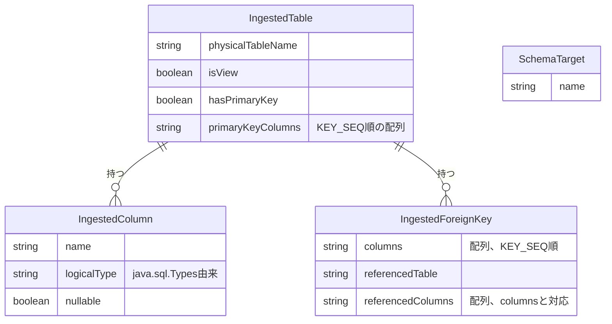

# Functional Specification: schema-ingestion

## ワークフロー

### 1. 接続テスト

1. 管理者(isAdminクレーム保持者、BR5.1)が、config-management(#2参照)から取得したDbConnectionのjdbcUrl・driverType・credentialRef(暗号化された認証情報の実体。呼び出し元が復号済みの値を渡す)を用いて、業務DBへの接続を試行する。
2. 接続に成功すれば成功を返す。失敗すれば例外を送出する(BR6.1)。

### 2. 取り込み対象スキーマ/データベース一覧の取得

1. 管理者が接続テストに成功したDbConnectionに対し、取り込み対象として選択可能なスキーマ/データベース一覧を要求する(`GET /api/admin/schema-ingestion/schemas`、functional-design-questions.md Q1)。
2. driverTypeに応じてgetSchemas()またはgetCatalogs()を呼び出し、SchemaTargetの一覧として返す(BR4.1)。

### 3. スキーマ取り込みプレビュー

1. 管理者が対象のDbConnectionと、手順2で選んだSchemaTargetを指定してプレビューを要求する(`POST /api/admin/schema-ingestion/preview`)。
2. `getTables()`をtypes={"TABLE","VIEW"}で呼び出し、ストアドプロシージャを除外する(BR1.4)。
3. 各テーブル/ビューについて、`getColumns()`でカラム情報(BR2.1で型正規化)、`getPrimaryKeys()`で主キー構成(BR1.1〜BR1.3)、`getImportedKeys()`で外部キー(BR3.1)を取得する。
4. 正規化されたIngestedTableの配列として結果を返す。
5. 業務DBへの接続確立に失敗した場合は例外を送出する(BR6.1)。

管理者が実際に取り込むテーブルを選択し、設定として確定する処理(refined-mockups/mockups.md 11.の「選択したテーブルを取り込む」ボタン)は、config-management Unit(契約#1の呼び出し元)が本Unitのプレビュー結果を初期値として利用しつつ担当する。schema-ingestion自身は選択結果の永続化や確定処理を行わない(ステートレス、domain-design/components.md参照)。

## 状態遷移

schema-ingestionはステートレスであり、いずれのエンティティも意味のある状態遷移を持たない。すべてのワークフローは「要求を受けて正規化結果を返す」という単純な処理である。

## エンティティ関連図(ER図、entities.mdから導出)

<!-- Text fallback: IngestedTableはIngestedColumn(多)とIngestedForeignKey(多)を持つ。SchemaTargetは他のエンティティと直接の関連を持たず、取り込み実行時にどのスキーマ/データベースを対象とするかを選択するための独立した一覧である。 -->

## ルールサマリー(rules.mdから導出)

| ワークフロー | 適用ルール |
|---|---|
| 1. 接続テスト | BR5.1, BR6.1 |
| 2. 取り込み対象スキーマ/データベース一覧の取得 | BR4.1, BR5.1 |
| 3. スキーマ取り込みプレビュー | BR1.1, BR1.2, BR1.3, BR1.4, BR2.1, BR3.1, BR5.1, BR6.1 |

## Review

**Verdict:** READY
**Reviewer:** aidlc-architecture-reviewer-agent
**Date:** 2026-09-06T13:42:41Z
**Iteration:** 1
**Request Challenge:** review:fc675a7daaef118f7d78974b404b2818

### Findings

| ID | Severity | Location | Finding | Required action | Status |
|---|---|---|---|---|---|
| R-01 | Minor | construction/schema-ingestion/functional-design/rules.md > BR1.1〜BR3.1(制約分類) | 「制約」("constraint"種別のルール)がPK/FK(複合主キー、外部キー)のみをモデル化しており、UNIQUE制約・CHECK制約を扱う記述がない | UNIQUE/CHECK制約の取り込み・非対応方針を明示するルールを追加するか、対象外である旨を明記する | Unresolved |
| R-02 | Minor | construction/schema-ingestion/functional-design/entities.md > IngestedColumn.logicalType | entities.mdの`logicalType`フィールド名が、contract-summary.md #14のOpenAPIレスポンススキーマにおける対応フィールド名`type`(255行目付近)と一致しない | フィールド名をどちらかに統一する(entities.md側を`type`に合わせるか、契約側の命名を変更する) | Unresolved |
| R-03 | Minor | construction/schema-ingestion/functional-spec.md > ワークフロー1(接続テスト)、DbConnection.credentialRefの扱い | DbConnectionの暗号化キー取り扱いに関する注記(「内部H2に保存しない」)が、鍵をgitにコミットしてはならない旨を明示していない(project.md Forbiddenの鍵管理規定と整合させる余地がある) | 暗号鍵・認証情報をリポジトリにコミットしない旨を注記に明示的に追加する | Unresolved |
| R-04 | Major | construction/schema-ingestion/functional-spec.md > ワークフロー1(接続テスト) | mockups.md 11.(スキーマ取り込み画面)の「接続テスト」ボタンに対応するエンドポイントとしてcontract-summary.md #14に`POST /api/admin/schema-ingestion/connection-test`(204/400/403/500)が新設されたが(このUnitの直近レビューで指摘・契約側では対応済み)、本Unitのfunctional-spec.mdワークフロー1はこの新設エンドポイントを明示的に引用していない(ワークフロー2・3は`GET .../schemas`、`POST .../preview`をそれぞれ明示引用しているのに対し非対称) | ワークフロー1の手順に`POST /api/admin/schema-ingestion/connection-test`を明示的に引用する記述を追加する(end-of-stageゲートでの一括反映を想定) | Unresolved |

### Validation Tool Results

| Tool | Result | Interpretation |
|---|---|---|
| aidlc-sensor.ts fire required-sections --stage functional-design | passed | 必須セクション(ワークフロー、状態遷移、ER図、ルールサマリー)は全て存在し、内容も変更前と同一であることを確認 |
| 手動クロスチェック: contract-summary.md #14 | `POST /api/admin/schema-ingestion/connection-test`が204/400/403/500のレスポンスとともに新設されていることを確認 | R-04の契約側対応が完了していることを裏付け、Unit側の未反映のみが残存 |
| 手動クロスチェック: entities.md ↔ functional-spec.md ER図 ↔ rules.md | 内容一致 | 内容が変更されていないこと、および内部整合性を確認 |

### Summary

本Unitのentities.md/rules.md/functional-spec.md/traceability.jsonは前回認証時点から内容の変更がなく、内部整合性も保たれている。契約側で新設された接続テスト専用エンドポイント(R-04関連)の存在は確認できたが、本Unit側のワークフロー1記述への反映はまだ済んでおらず、既知のMajor所見として維持する。Critical所見は0件であり、R-01〜R-04はいずれもEnd-of-Stageゲートでの一括対応が予定されている既知の繰越し事項であるため、READYとする。
