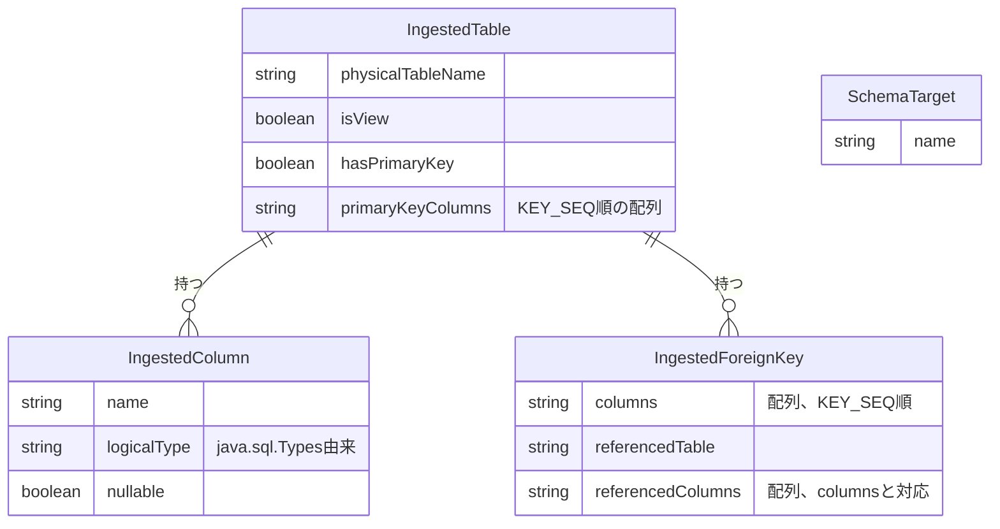

# Functional Specification: schema-ingestion

## ワークフロー

### 1. 接続テスト

1. 管理者(isAdminクレーム保持者、BR5.1)が、config-management(#2参照)から取得したDbConnectionのjdbcUrl・driverType・credentialRef(暗号化された認証情報の実体。呼び出し元が復号済みの値を渡す)を用いて、業務DBへの接続を試行する。
2. 接続に成功すれば成功を返す。失敗すれば例外を送出する(BR6.1)。

### 2. 取り込み対象スキーマ/データベース一覧の取得

1. 管理者が接続テストに成功したDbConnectionに対し、取り込み対象として選択可能なスキーマ/データベース一覧を要求する(`GET /api/admin/schema-ingestion/schemas`、functional-design-questions.md Q1)。
2. driverTypeに応じてgetSchemas()またはgetCatalogs()を呼び出し、SchemaTargetの一覧として返す(BR4.1)。

### 3. スキーマ取り込みプレビュー

1. 管理者が対象のDbConnectionと、手順2で選んだSchemaTargetを指定してプレビューを要求する(`POST /api/admin/schema-ingestion/preview`)。
2. `getTables()`をtypes={"TABLE","VIEW"}で呼び出し、ストアドプロシージャを除外する(BR1.4)。
3. 各テーブル/ビューについて、`getColumns()`でカラム情報(BR2.1で型正規化)、`getPrimaryKeys()`で主キー構成(BR1.1〜BR1.3)、`getImportedKeys()`で外部キー(BR3.1)を取得する。
4. 正規化されたIngestedTableの配列として結果を返す。
5. 業務DBへの接続確立に失敗した場合は例外を送出する(BR6.1)。

管理者が実際に取り込むテーブルを選択し、設定として確定する処理(refined-mockups/mockups.md 11.の「選択したテーブルを取り込む」ボタン)は、config-management Unit(契約#1の呼び出し元)が本Unitのプレビュー結果を初期値として利用しつつ担当する。schema-ingestion自身は選択結果の永続化や確定処理を行わない(ステートレス、domain-design/components.md参照)。

## 状態遷移

schema-ingestionはステートレスであり、いずれのエンティティも意味のある状態遷移を持たない。すべてのワークフローは「要求を受けて正規化結果を返す」という単純な処理である。

## エンティティ関連図(ER図、entities.mdから導出)

<!-- Text fallback: IngestedTableはIngestedColumn(多)とIngestedForeignKey(多)を持つ。SchemaTargetは他のエンティティと直接の関連を持たず、取り込み実行時にどのスキーマ/データベースを対象とするかを選択するための独立した一覧である。 -->

## ルールサマリー(rules.mdから導出)

| ワークフロー | 適用ルール |
|---|---|
| 1. 接続テスト | BR5.1, BR6.1 |
| 2. 取り込み対象スキーマ/データベース一覧の取得 | BR4.1, BR5.1 |
| 3. スキーマ取り込みプレビュー | BR1.1, BR1.2, BR1.3, BR1.4, BR2.1, BR3.1, BR5.1, BR6.1 |

## Review

**Verdict:** READY
**Reviewer:** aidlc-architecture-reviewer-agent
**Date:** 2026-09-06T03:37:38Z
**Iteration:** 1

### Findings

| ID | Severity | Location | Finding | Required action | Status |
|---|---|---|---|---|---|
| R-01 | Major | inception/requirements-analysis/requirements.md FR1.1 vs construction/schema-ingestion/functional-design/entities.md and rules.md | FR1.1 requires the Unit to retrieve テーブル・カラム・型・主キー・外部キー・"制約"(constraints), listing 制約 as a category distinct from 主キー(PK) and 外部キー(FK) — implying constraints such as UNIQUE or CHECK. entities.md's IngestedColumn only models `nullable` (a NOT NULL proxy) alongside PK/FK; no attribute, rule, or workflow step addresses UNIQUE/CHECK constraints, and traceability.json still marks FR1.1 as fully "OK" against BR2.1/BR3.1/BR4.1 (type normalization, FK grouping, schema listing) with no mention of the narrowed scope. This is a silent scope reduction versus a stated requirement, not a decision confirmed through the Q&A round. | Either add an entity attribute/rule covering UNIQUE/CHECK constraint retrieval (e.g. via `getIndexInfo()`), or explicitly record in rules.md/entities.md that FR1.1's "制約" is scoped to PK/FK/NOT NULL only for this MVP, and reflect that narrowing in traceability.json's FR1.1 target/status rather than leaving it as an unqualified OK. | New |
| R-02 | Minor | construction/schema-ingestion/functional-design/entities.md > IngestedColumn.logicalType vs inception/contract-design/contract-summary.md > `#14 schema-ingestion API` `/preview` response `columns[].type` | The entity model's source-of-truth field name is `logicalType`, but the (already-amended-for-this-Q&A-round) OpenAPI response schema for the same concept still names the JSON field `type`. Nothing in either artifact records that these are the same field under different names at the REST boundary, so a developer implementing the controller/DTO mapping has no documented guidance on which name is authoritative where. | Reconcile the naming: either rename the OpenAPI field to `logicalType` to match entities.md, or add a one-line note in entities.md (or functional-spec.md's derived ER view) stating that `logicalType` serializes as `type` on the `/preview` REST response. | New |
| R-03 | Minor | inception/domain-design/components.md > DbConnection entity inline comment and Entity Ownership table row | The added text (from this Unit's Q4) states the encryption key for `credentialRef` is supplied via application.yml/environment variable and "is not stored in the internal H2 datastore" — but it never states, in the terms project.md's Forbidden rule uses, that the key itself must never be committed to the git repository/source code. As written, a developer could satisfy the letter of the text by hardcoding the key value directly into a committed `application.yml`, since "not stored in H2" is silent on git-commit safety. This is a documentation-completeness gap, not a code violation yet — no code exists at this stage. | Add an explicit sentence to the DbConnection inline comment (and/or the Entity Ownership table row) stating the encryption key itself must never be committed to source control, consistent with project.md's Forbidden wording (env var / local file with 600 permissions, `.gitignore`-registered), so Code Generation inherits an unambiguous instruction. | New |

### Validation Tool Results

| Tool | Result | Interpretation |
|---|---|---|
| aidlc-sensor-traceability (traceability.json) | FAIL — `missing_from_upstream_ids` lists every FR outside FR1.1–FR1.6 (FR2.x–FR7.x) | Same known structural tool constraint already documented and accepted at units-generation (`unit-of-work.md`'s own Review section): the sensor's FR-fallback path (used because `user-stories` was SKIPPED for this scope) pulls the full project-wide FR list from `requirements.md` rather than scoping to this Unit's assignment. unit-of-work-story-map.md confirms schema-ingestion owns exactly FR1.1–FR1.6, and traceability.json's own `upstream_ids` array correctly lists only those six. No new defect introduced by this artifact; this is not treated as a blocking finding, consistent with the precedent already recorded for this project. |
| Manual cross-check: FR1.1–FR1.6 → rules.md coverage | All 9 rules (BR1.1–BR1.4, BR2.1, BR3.1, BR4.1, BR5.1, BR6.1) are accounted for — either as an `OK` target (BR1.1–BR1.4 map 1:1 to FR1.2–FR1.5; BR2.1/BR3.1/BR4.1 are all listed under FR1.1's comma-joined target) or explained via `reverse` (BR5.1, BR6.1 as N/A, correctly justified as cross-cutting/contract-derived rules with no dedicated FR). No unexplained orphan. | Confirms traceability.json's internal bookkeeping is sound aside from R-01's scope-narrowing concern. |
| Manual cross-check: composite-FK and SchemaTarget/`schemaTarget` changes across entities.md, rules.md BR3.1, functional-spec.md workflow 2/3, contract-summary.md #1 prose, and contract-summary.md #14 OpenAPI (`GET /schemas`, `preview` request `schemaTarget`, response `foreignKeys[].columns[]`/`referencedColumns[]`) | Consistent everywhere checked | The two cross-cutting Q&A edits (Q1 SchemaTarget/DbConnection de-scoping, Q2 array-based composite FK) are correctly propagated to every artifact named in the dispatch brief, including the in-process contract #1's prose (`schemaTarget` is passed). domain-design/components.md's `TableConfig.foreignKeys` attribute carries no shape specification, so it required no corresponding edit — conductor's judgment confirmed correct. |
| Manual cross-check: views/PK-less tables (BR1.2/BR1.3) vs FR1.3/FR1.4 | Consistent, no contradiction | BR1.3 explicitly forces `isView=true, hasPrimaryKey=false` regardless of what `getPrimaryKeys()` actually returns for a view ("ビューに対してgetPrimaryKeys()が何らかの結果を返した場合でも無視する"), correctly anticipating drivers that return PK-like metadata for updatable views. This does not contradict FR1.3/FR1.4's read-only treatment of PK-less tables/views — both are still included in scan results, restricted to list/detail only. |
| Manual cross-check: BR1.1/BR2.1 testability against team.md's front-loaded characterization-test commitment | Testable as written | Both rules cite the exact JDBC `DatabaseMetaData` column (`KEY_SEQ`, `DATA_TYPE`) and the exact avoidance (vendor `TYPE_NAME` strings), giving a characterization test a concrete, driver-observable assertion target for each of the three RDBMS. |
| Manual cross-check: DbConnection.credentialRef semantic change — schema-ingestion has no decryption responsibility | Consistent | functional-spec.md workflow 1 states the caller passes an already-decrypted value ("呼び出し元が復号済みの値を渡す"); schema-ingestion (not the owner of DbConnection or its key) performs no decryption, matching the ownership split in domain-design/components.md. |
| Manual cross-check: FR1.6 deferral | Correctly deferred, not dropped | traceability.json marks FR1.6 `Deferred` with target "packaging Unit", matching unit-of-work-story-map.md's own note that FR1.6 has no UI Unit and relates to U11 packaging's build wiring. |

### Summary

The three cross-cutting Q&A edits (SchemaTarget de-scoping of DbConnection, array-based composite foreign keys, and the credentialRef semantic change) are propagated consistently across entities.md, rules.md, functional-spec.md, traceability.json, and the two amended upstream artifacts (components.md, contract-summary.md) — no broken cross-reference was found among the specific items called out in the dispatch brief. The one Major finding (R-01) is a real, undocumented narrowing of FR1.1's "制約" wording rather than a cross-cutting-edit defect; the two Minor findings are naming/documentation completeness gaps worth closing before Code Generation but not architecturally blocking.
