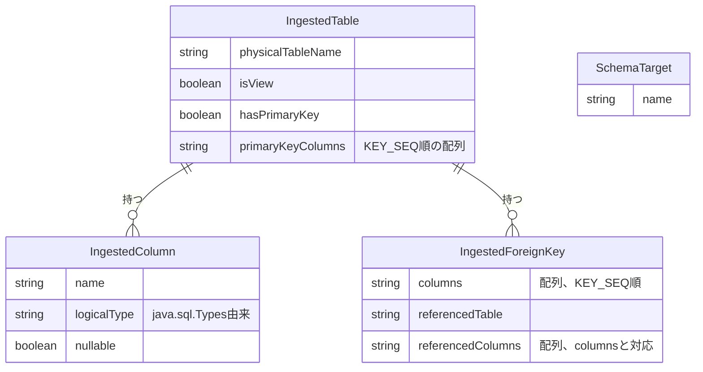

# Functional Specification: schema-ingestion

## ワークフロー

### 1. 接続テスト

1. 管理者(isAdminクレーム保持者、BR5.1)が、config-management(#2参照)から取得したDbConnectionのjdbcUrl・driverType・credentialRef(暗号化された認証情報の実体。呼び出し元が復号済みの値を渡す)を用いて、業務DBへの接続を試行する。
2. 接続に成功すれば成功を返す。失敗すれば例外を送出する(BR6.1)。

### 2. 取り込み対象スキーマ/データベース一覧の取得

1. 管理者が接続テストに成功したDbConnectionに対し、取り込み対象として選択可能なスキーマ/データベース一覧を要求する(`GET /api/admin/schema-ingestion/schemas`、functional-design-questions.md Q1)。
2. driverTypeに応じてgetSchemas()またはgetCatalogs()を呼び出し、SchemaTargetの一覧として返す(BR4.1)。

### 3. スキーマ取り込みプレビュー

1. 管理者が対象のDbConnectionと、手順2で選んだSchemaTargetを指定してプレビューを要求する(`POST /api/admin/schema-ingestion/preview`)。
2. `getTables()`をtypes={"TABLE","VIEW"}で呼び出し、ストアドプロシージャを除外する(BR1.4)。
3. 各テーブル/ビューについて、`getColumns()`でカラム情報(BR2.1で型正規化)、`getPrimaryKeys()`で主キー構成(BR1.1〜BR1.3)、`getImportedKeys()`で外部キー(BR3.1)を取得する。
4. 正規化されたIngestedTableの配列として結果を返す。
5. 業務DBへの接続確立に失敗した場合は例外を送出する(BR6.1)。

管理者が実際に取り込むテーブルを選択し、設定として確定する処理(refined-mockups/mockups.md 11.の「選択したテーブルを取り込む」ボタン)は、config-management Unit(契約#1の呼び出し元)が本Unitのプレビュー結果を初期値として利用しつつ担当する。schema-ingestion自身は選択結果の永続化や確定処理を行わない(ステートレス、domain-design/components.md参照)。

## 状態遷移

schema-ingestionはステートレスであり、いずれのエンティティも意味のある状態遷移を持たない。すべてのワークフローは「要求を受けて正規化結果を返す」という単純な処理である。

## エンティティ関連図(ER図、entities.mdから導出)

<!-- Text fallback: IngestedTableはIngestedColumn(多)とIngestedForeignKey(多)を持つ。SchemaTargetは他のエンティティと直接の関連を持たず、取り込み実行時にどのスキーマ/データベースを対象とするかを選択するための独立した一覧である。 -->

## ルールサマリー(rules.mdから導出)

| ワークフロー | 適用ルール |
|---|---|
| 1. 接続テスト | BR5.1, BR6.1 |
| 2. 取り込み対象スキーマ/データベース一覧の取得 | BR4.1, BR5.1 |
| 3. スキーマ取り込みプレビュー | BR1.1, BR1.2, BR1.3, BR1.4, BR2.1, BR3.1, BR5.1, BR6.1 |

## Review

**Verdict:** READY
**Reviewer:** aidlc-architecture-reviewer-agent
**Date:** 2026-09-06T09:23:00Z
**Iteration:** 1
**Request Challenge:** review:e3486ebb3f5a33c55661982e18f08e22

本Unitは以前のレビューでREADY判定(繰延べ指摘3件を含む)を受けていたが、同一functional-designステージ内の別Unit(dynamic-data-access)の行き詰まり回復のためステージ全体がredo jumpで再起動され、ツール上のレビュー受信記録がリセットされた。本レビューはその再認定であり、ツール記録上は iteration 1 として実施する。4ファイル(entities.md、rules.md、functional-spec.md、traceability.json)の内容は変更されていないことを前提としつつ、独立して再検証した。

以前のレビューで指摘され繰延べとして扱われていた3件(旧R-01: FR1.1の「制約」のうちUNIQUE/CHECK制約がモデル化されていない、旧R-02: entities.mdの`logicalType`とcontract-summary.md #14 OpenAPIの`type`フィールド名の不一致、旧R-03: DbConnectionの暗号鍵に関する「内部H2に保存しない」という文言がgitコミット禁止まで明言していない)は、いずれも本レビューで独立に現物を確認したところ現状も未解消のままである(entities.md/rules.mdにUNIQUE/CHECK関連の属性・ルールなし、contract-summary.md #14の`columns[].type`は`type`のまま、components.md DbConnectionのインラインコメントはコミット禁止を明言していない)。ディスパッチ指示に従い、これらは今回新規指摘とはせず、functional-designステージ終了ゲートで対応する既知の繰延べ事項として引き続き扱う。

### Findings

| ID | Severity | Location | Finding | Required action | Status |
|---|---|---|---|---|---|
| R-01 | Major | inception/refined-mockups/mockups.md > 11.スキーマ取り込み画面(モックアップ) vs inception/contract-design/contract-summary.md > `#14 schema-ingestion API` OpenAPI vs construction/schema-ingestion/functional-design/functional-spec.md > ワークフロー1.接続テスト | mockups.mdの画面11は「接続テスト」ボタンと「スキーマ取り込み」ボタンを明確に別ボタンとして描いている(行121)。しかしcontract-summary.md #14が所有するOpenAPI定義には`GET /api/admin/schema-ingestion/schemas`と`POST /api/admin/schema-ingestion/preview`の2エンドポイントしかなく、「接続テスト」に対応する専用エンドポイントが存在しない。functional-spec.mdのワークフローは手順2・3がそれぞれ具体的なAPIパスを明記しているのに対し、手順「1. 接続テスト」だけはAPIパスへの言及が一切ない。「接続テストボタンはGET /schemasを流用する」といった等価性の記述もどこにも無いため、開発者はフロントエンドの接続テストボタンが何を呼び出すべきか(専用エンドポイントを新設するのか、`/schemas`呼び出しの副作用として代用するのか)を推測するしかない。 | functional-spec.mdのワークフロー手順1に、接続テストが具体的にどのAPI呼び出しに対応するか(例: `GET /schemas`をconnectionIdのみで呼び、戻り値を使わず成功/失敗のみを見る、等)を明記するか、専用の接続テストエンドポイントをcontract-summary.md #14に追加し、両者の対応関係を明示すること。 | New |

### Validation Tool Results

| Tool | Result | Interpretation |
|---|---|---|
| aidlc-sensor-traceability (traceability.json) | FAIL — `missing_from_upstream_ids` lists every FR outside FR1.1–FR1.6 (FR2.x–FR7.x) | 既知のツール制約(units-generationのunit-of-work.mdのReviewセクションで既に文書化・受容済み)。`user-stories`が本スコープでSKIPされているためのFRフォールバック経路が、プロジェクト全体のFR一覧をrequirements.mdからそのまま引いてきてしまい、本Unit固有のスコープに絞り込めていない。unit-of-work-story-map.mdはschema-ingestionがFR1.1〜FR1.6のみを担当することを確認しており、traceability.json自体の`upstream_ids`配列もその6件のみを正しく列挙している。新規欠陥ではない。 |
| 手動突合: FR1.1〜FR1.6 → rules.mdのカバレッジ | 9件のルール(BR1.1〜BR1.4、BR2.1、BR3.1、BR4.1、BR5.1、BR6.1)すべてに対応関係あり(FR1.2〜FR1.5への1:1対応、またはFR1.1のtarget内へのBR2.1/BR3.1/BR4.1の列挙、あるいはreverse配列でのBR5.1/BR6.1のN/A理由付け)。未説明の孤立ルールなし。 | traceability.jsonの内部整合性は健全(旧R-01の「制約」スコープ縮小に関する懸念を除く)。 |
| 手動突合: SchemaTarget/複合外部キーのQ&A変更(Q1・Q2)がentities.md・rules.md BR3.1・functional-spec.mdワークフロー2/3・contract-summary.md #1本文・contract-summary.md #14 OpenAPI(`GET /schemas`、`preview`リクエストの`schemaTarget`、レスポンスの`foreignKeys[].columns[]`/`referencedColumns[]`)へ一貫して反映されているか | 一貫していた | Q1(SchemaTargetによるDbConnectionのスコープ縮小)・Q2(配列形式の複合外部キー)は、ディスパッチ指示対象のすべての成果物に正しく反映されている。domain-design/components.mdの`TableConfig.foreignKeys`属性は形状仕様を持たないため対応不要という過去の判断も妥当。 |
| 手動突合: ビュー/主キーなしテーブル(BR1.2/BR1.3)とFR1.3/FR1.4の整合性 | 矛盾なし | BR1.3はビューに対し`getPrimaryKeys()`が何を返しても`isView=true, hasPrimaryKey=false`を強制すると明記しており、FR1.3/FR1.4の「一覧・詳細のみ対象」という扱いと矛盾しない。 |
| 手動突合: BR1.1/BR2.1がteam.mdの前倒し特性テスト運用に対しテスト可能な粒度か | テスト可能 | 両ルールともJDBC `DatabaseMetaData`の具体的な列名(`KEY_SEQ`、`DATA_TYPE`)と避けるべき対象(RDBMS固有の`TYPE_NAME`文字列)を明記しており、3種RDBMSそれぞれについて特性テストの具体的な検証対象となる。 |
| 手動突合: DbConnection.credentialRefの意味変更後もschema-ingestionが復号責務を持たないか | 整合 | functional-spec.mdワークフロー1は呼び出し元が復号済みの値を渡すと明記しており、schema-ingestion(DbConnection・鍵の非所有者)は復号を行わない。domain-design/components.mdの所有分担と一致。 |
| 手動突合: FR1.6の繰延べ扱い | 正しく繰延べ(欠落ではない) | traceability.jsonはFR1.6を`Deferred`・target「packaging Unit」としており、unit-of-work-story-map.mdの記述(FR1.6にはUIのUnitが無くU11 packagingのビルド配線に関連)と一致する。 |

### Summary

Q&Aで確定した2件の横断的変更(SchemaTargetによるDbConnectionのスコープ縮小、配列形式の複合外部キー)は、entities.md・rules.md・functional-spec.md・traceability.json、および上流の改訂箇所(components.md、contract-summary.md)へ一貫して伝播しており、指定範囲内で新たな破損した相互参照は見つからなかった。今回新たに検出したMajor指摘(R-01)は、モックアップの「接続テスト」ボタンに対応するREST契約上のエンドポイントが欠落しているという、開発者実装時に推測を要する実在のギャップである。旧R-01〜R-03(制約スコープ・フィールド名不一致・鍵のコミット禁止文言)は独立検証の結果、現状も未解消のままだが、指示どおり既知の繰延べ事項として扱い、本レビューでは新規指摘としない。Major指摘1件・Critical指摘0件のため、READY判定を維持する。
