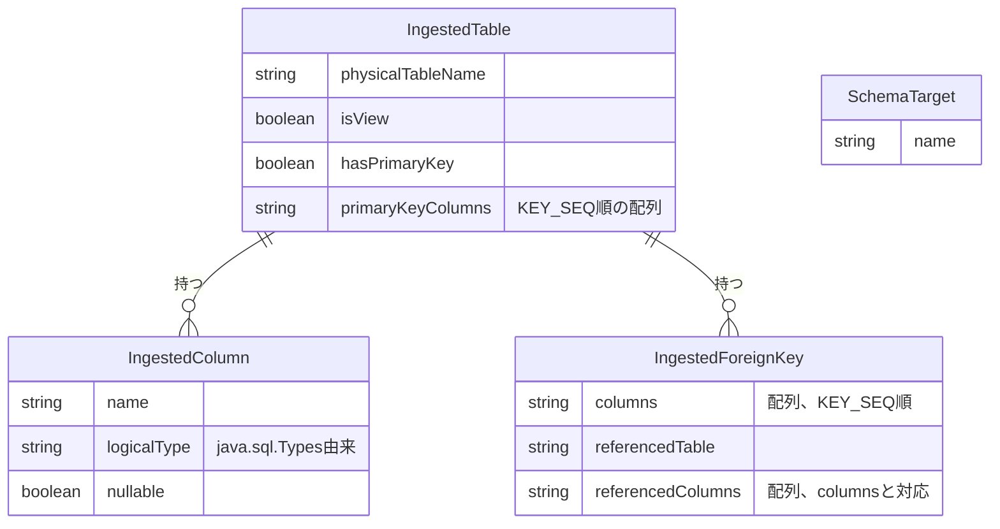

# Functional Specification: schema-ingestion

## ワークフロー

### 1. 接続テスト

1. 管理者(isAdminクレーム保持者、BR5.1)が、config-management(#2参照)から取得したDbConnectionのjdbcUrl・driverType・credentialRef(暗号化された認証情報の実体。呼び出し元が復号済みの値を渡す)を用いて、業務DBへの接続を試行する。
2. 接続に成功すれば成功を返す。失敗すれば例外を送出する(BR6.1)。

### 2. 取り込み対象スキーマ/データベース一覧の取得

1. 管理者が接続テストに成功したDbConnectionに対し、取り込み対象として選択可能なスキーマ/データベース一覧を要求する(`GET /api/admin/schema-ingestion/schemas`、functional-design-questions.md Q1)。
2. driverTypeに応じてgetSchemas()またはgetCatalogs()を呼び出し、SchemaTargetの一覧として返す(BR4.1)。

### 3. スキーマ取り込みプレビュー

1. 管理者が対象のDbConnectionと、手順2で選んだSchemaTargetを指定してプレビューを要求する(`POST /api/admin/schema-ingestion/preview`)。
2. `getTables()`をtypes={"TABLE","VIEW"}で呼び出し、ストアドプロシージャを除外する(BR1.4)。
3. 各テーブル/ビューについて、`getColumns()`でカラム情報(BR2.1で型正規化)、`getPrimaryKeys()`で主キー構成(BR1.1〜BR1.3)、`getImportedKeys()`で外部キー(BR3.1)を取得する。
4. 正規化されたIngestedTableの配列として結果を返す。
5. 業務DBへの接続確立に失敗した場合は例外を送出する(BR6.1)。

管理者が実際に取り込むテーブルを選択し、設定として確定する処理(refined-mockups/mockups.md 11.の「選択したテーブルを取り込む」ボタン)は、config-management Unit(契約#1の呼び出し元)が本Unitのプレビュー結果を初期値として利用しつつ担当する。schema-ingestion自身は選択結果の永続化や確定処理を行わない(ステートレス、domain-design/components.md参照)。

## 状態遷移

schema-ingestionはステートレスであり、いずれのエンティティも意味のある状態遷移を持たない。すべてのワークフローは「要求を受けて正規化結果を返す」という単純な処理である。

## エンティティ関連図(ER図、entities.mdから導出)

<!-- Text fallback: IngestedTableはIngestedColumn(多)とIngestedForeignKey(多)を持つ。SchemaTargetは他のエンティティと直接の関連を持たず、取り込み実行時にどのスキーマ/データベースを対象とするかを選択するための独立した一覧である。 -->

## ルールサマリー(rules.mdから導出)

| ワークフロー | 適用ルール |
|---|---|
| 1. 接続テスト | BR5.1, BR6.1 |
| 2. 取り込み対象スキーマ/データベース一覧の取得 | BR4.1, BR5.1 |
| 3. スキーマ取り込みプレビュー | BR1.1, BR1.2, BR1.3, BR1.4, BR2.1, BR3.1, BR5.1, BR6.1 |

## Review

**Verdict:** READY
**Reviewer:** aidlc-architecture-reviewer-agent
**Date:** 2026-09-07T02:24:05Z
**Iteration:** 1

### Findings

指摘なし(既知の繰延べ事項R-01〜R-04を除く)

### Summary

entities.md・rules.md・functional-spec.md・traceability.jsonの4ファイルは内容変更なしで、相互の整合性・requirements.md FR1.1〜FR1.6とのトレーサビリティ・team.md Testing Postureが求める特性テスト対象(複合主キーのKEY_SEQ順序、主キーなしテーブルの扱い、ビューの参照専用扱い、RDBMS間の型差異)のカバレッジのいずれにも新規の欠陥は見つからなかった。前回検出済みのR-01〜R-04(いずれもMinor 3件・Major 1件)は既知の繰延べ事項としてend-of-stageゲートに申し送り済みであり、本再認証レビューでの新規指摘はない。
