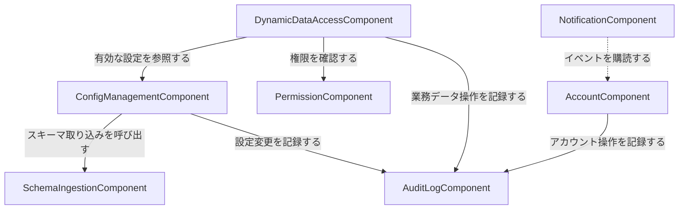

# Component Catalogue: MasterSmith MVP

requirements.mdのFR群を7つの論理コンポーネントに分割する。domain-design-questions.md Q1〜Q6の回答に基づく(すべてQ1〜Q3・Q6は「別コンポーネント」、Q4は「アクセストークンのクレームで判定」、Q5は「別コンポーネント+イベント連携」)。デプロイ形態・DB物理設計はUnits Generation以降で決定する。

## コンポーネントカタログ(機械可読)

```yaml
components:
  - name: SchemaIngestionComponent
    summary: 業務DB(PostgreSQL/MySQL/MariaDB)へ接続し、JDBC DatabaseMetaDataでスキーマを読み取る
    behaviour: >
      指定されたDB接続情報を使って業務DBへ接続し、テーブル・カラム・型・主キー・外部キー・
      制約を取得する。単一/複合主キー、主キーのないテーブル、ビューを区別して報告する
      (ビューは常に「主キーなし」として扱い、一覧・詳細のみの対象とする)。ストアドプロシージャは
      走査対象外。3種類のRDBMS間のメタデータ取得結果の差異(型名表記、複合主キーの列順序報告
      等)をこの一箇所で吸収し、呼び出し元には正規化した形で結果を返す。永続状態は持たない
      (呼び出しのたびに接続情報を受け取り、結果を返すだけのステートレスな走査ロジック)。
      本コンポーネント自身のスキーマ取り込み画面も管理者ロールを持つ利用者のみが利用できる
      (アクセストークンのisAdminクレームで判定)[FR5.5][FR5.6]。
    responsibilities:
      - 業務DBへの接続確認(接続テスト)
      - DatabaseMetaDataからのテーブル/カラム/型/PK/FK/制約の取得
      - 3種RDBMS間の取得結果の差異吸収・正規化
    depends_on: []
    dependents:
      - component: ConfigManagementComponent
        interaction: 設定管理コンポーネントがスキーマ取り込み操作(接続情報を渡す)を呼び出し、取得結果を設定項目の初期値として受け取る
    external_dependencies:
      - name: 業務DB(PostgreSQL/MySQL/MariaDB)
        kind: database
        purpose: スキーマメタデータの取得元。JDBCドライバはアプリケーションに内包 [FR1.6]
    entities: []

  - name: ConfigManagementComponent
    summary: DB接続先設定・メニュー構成・検索条件・一覧表示・編集対象外・バリデーション・フォーム部品・論理表示名という設定全体を保持・管理する
    behaviour: >
      設定全体(9項目)をテーブル単位のCRUD画面で編集可能にする[FR2.2]。設定ファイルの
      エクスポート/インポートを提供し、インポート時に不整合(不正形式・スキーマ不一致・
      必須項目欠落)を検出した場合は設定全体を拒否し(部分適用なし)、エラー内容を返す
      [FR2.3.1]。設定変更の反映はキャッシュの明示的クリアまたはキャッシュexpire経由とし、
      リクエストのたびにDBへ問い合わせる実装は行わない(静的設定駆動の原則)[FR2.6]。
      スキーマ取り込み操作を呼び出してテーブルの初期設定値を作成する。外部キー関係
      (参照先テーブル・カラム)と参照先の代表表示列(FR4.1のFK名称解決、FR4.2のポップアップ検索
      で使用)もTableConfigの一部として保持する。設定変更は監査ログへ記録する。管理者ロールを
      持つ利用者のみがこのコンポーネントの画面(設定管理画面)を利用できる
      (アクセストークンのisAdminクレームで判定)[FR5.5][FR5.6]。
    responsibilities:
      - 設定全体(DB接続先・メニュー・検索条件・一覧表示項目・編集対象外項目・バリデーション・フォーム部品・論理表示名)の保持
      - 設定のCRUD画面提供
      - 設定のエクスポート/インポート(不整合時は全体拒否)
      - 静的設定駆動のためのキャッシュ管理
    depends_on:
      - component: SchemaIngestionComponent
        interaction: 業務DB接続先を渡してスキーマを取り込み、テーブル設定の初期値を得る
        style: sync
      - component: AuditLogComponent
        interaction: 設定項目の作成・更新・削除を記録する
        style: async
    dependents:
      - component: DynamicDataAccessComponent
        interaction: 有効な設定(テーブル定義・検索条件・一覧表示項目・編集対象外項目・バリデーション・フォーム部品)をキャッシュ経由で参照する
    external_dependencies:
      - name: 内部データストア(H2)
        kind: database
        purpose: 設定全体の永続化。業務DBには保存しない [team-practices.md#Mandated]
      - name: 設定キャッシュ
        kind: cache
        purpose: 静的設定駆動の実現(明示的クリアまたはexpireでのみ再読み込み)[FR2.6]
    entities:
      - name: DbConnection
        identifier: connectionId
        attributes: [name, jdbcUrl, driverType, credentialRef]
      - name: MenuItem
        identifier: menuItemId
        attributes: [label, parentMenuItemId, tableId, displayOrder]
      - name: TableConfig
        identifier: tableId
        attributes: [physicalTableName, isView, primaryKeyColumns, searchConditions, listColumns, readOnlyColumns, validationRules, formWidgets, displayNames, foreignKeys, foreignKeyRepresentativeColumns]

  - name: DynamicDataAccessComponent
    summary: ConfigManagementComponentの設定に基づき、業務DBへ動的に問い合わせて一覧・詳細・編集を実行する
    behaviour: >
      設定(検索条件・一覧表示項目・編集対象外項目・バリデーション)に基づき動的にSQLを構成し、
      業務DBに対する検索・参照・作成・更新を行う[FR3.1〜FR3.4]。主キーのないテーブル・ビューは
      参照のみに制限する。同時編集の競合制御は行わず後勝ちとする(対象業務DBのスキーマが
      任意であり、バージョン列の存在を前提にできないため)[FR3.5]。外部キー値の表示名解決を
      実行時に行い[FR4.1]、登録・編集画面のFK入力項目向けにポップアップ検索(カラムごとの
      絞り込み条件付き)を提供する[FR4.2]。操作の実行にあたり、PermissionComponentへ
      テーブル単位・カラム単位の権限を問い合わせる。業務データの作成・更新・削除は監査ログへ
      記録する。業務データそのもの(対象RDBMSの行)は本コンポーネントが所有する永続エンティティ
      ではなく、実行時に発見された任意のスキーマに対する動的な問い合わせ対象である。
    responsibilities:
      - 設定駆動の一覧・詳細・編集(新規/更新)の実行
      - FK参照値の表示名解決とポップアップ検索
      - 後勝ちの同時編集制御
    depends_on:
      - component: ConfigManagementComponent
        interaction: 有効なテーブル設定(検索条件・一覧表示項目・編集対象外項目・バリデーション・フォーム部品)を参照する
        style: sync
      - component: PermissionComponent
        interaction: テーブル単位・カラム単位の操作権限を確認する
        style: sync
      - component: AuditLogComponent
        interaction: 業務データの作成・更新・削除を記録する
        style: async
    dependents: []
    external_dependencies:
      - name: 業務DB(PostgreSQL/MySQL/MariaDB)
        kind: database
        purpose: 業務データの検索・参照・作成・更新、およびFK参照先の検索
    entities: []

  - name: PermissionComponent
    summary: ロール・グループを定義し、テーブル単位・カラム単位の業務データ権限をロールに割り当てる
    behaviour: >
      ロール(Role)にテーブル単位の権限(一覧/詳細/作成/編集/削除)とカラム単位の権限
      (更新可(デフォルト)/表示のみ/非表示)を設定できる[FR5.1][FR5.2]。ロールをユーザまたは
      グループに割り当て[FR5.3]、複数ロールを持つ利用者は作業中のロールを選択・切り替え
      られる[FR5.4]。この業務データ権限モデルは、管理者専用画面へのアクセス制御
      (FR5.5/FR5.6、アクセストークンのisAdminクレームで判定)とは別のモデルであり、
      本コンポーネントはisAdminクレームを扱わない。
    responsibilities:
      - ロール・グループの定義
      - テーブル単位・カラム単位の業務データ権限の設定
      - ロールのユーザ/グループへの割り当てと切り替え
    depends_on: []
    dependents:
      - component: DynamicDataAccessComponent
        interaction: テーブル単位・カラム単位の操作権限を確認される
    external_dependencies:
      - name: 内部データストア(H2)
        kind: database
        purpose: ロール・グループ・権限の永続化
    entities:
      - name: Role
        identifier: roleId
        attributes: [name, description]
      - name: Group
        identifier: groupId
        attributes: [name]
      - name: RoleAssignment
        identifier: assignmentId
        attributes: [roleId, assigneeType]
        references:
          - entity: Account
            owned_by: AccountComponent
            relationship: 各RoleAssignmentは、ユーザとして割り当てる場合1つのAccountに対応する(グループの場合はGroupを参照)
      - name: TablePermission
        identifier: tablePermissionId
        attributes: [roleId, canList, canView, canCreate, canEdit, canDelete]
        references:
          - entity: TableConfig
            owned_by: ConfigManagementComponent
            relationship: 各TablePermissionは1つの設定済みテーブルに対する権限を表す
      - name: ColumnPermission
        identifier: columnPermissionId
        attributes: [roleId, columnName, accessLevel]
        references:
          - entity: TableConfig
            owned_by: ConfigManagementComponent
            relationship: 各ColumnPermissionは1つの設定済みテーブルの1カラムに対する権限を表す

  - name: AccountComponent
    summary: ログイン認証・アクセストークン発行・ログイン試行制限・利用者アカウントのライフサイクル(作成/一覧/編集/無効化)を扱う
    behaviour: >
      ID/パスワードによるログインを提供し[FR6.1]、認証成功時にステートレスなアクセストークン
      (isAdminクレームを含む。FR5.5/FR5.6の判定に用いる)とリフレッシュトークンを発行する
      [FR6.2][FR6.3]。連続n回のログイン失敗でm秒間アカウントをロックする[FR6.6]。パスワードは
      不可逆ハッシュで保存する[NFR7]。管理者は管理画面からアカウントの新規作成・一覧参照・
      編集・無効化(論理削除のみ、物理削除なし)ができる[FR6.4.1〜FR6.4.4]。これらの管理操作は
      アクセストークンのisAdminクレームで制御される[FR5.5][FR5.6]。アカウント作成・登録完了・
      情報変更・パスワード変更・パスワード忘れ・メールアドレス変更の各契機でドメインイベントを
      発行し、NotificationComponentが購読して通知メールを送信する(Springのイベント機構を用いた
      疎結合連携。直接の呼び出し依存は持たない)。アカウント関連操作は監査ログへ記録する。
    responsibilities:
      - ログイン認証・アクセストークン/リフレッシュトークンの発行
      - ログイン試行回数制限
      - アカウントの新規作成・一覧参照・編集・無効化(論理削除)
      - アカウントライフサイクルのドメインイベント発行
    depends_on:
      - component: AuditLogComponent
        interaction: ログイン・アカウント操作を記録する
        style: async
    dependents:
      - component: NotificationComponent
        interaction: アカウントライフサイクルイベント(作成・登録完了・情報変更・パスワード変更・パスワード忘れ・メールアドレス変更)をイベント経由で購読される。AccountComponent自身はNotificationComponentのインタフェースを知らない
    external_dependencies:
      - name: 内部データストア(H2)
        kind: database
        purpose: アカウント情報・ログイン試行履歴・トークンの永続化
    entities:
      - name: Account
        identifier: accountId
        attributes: [name, email, passwordHash, status, isAdmin]
      - name: AccountActionToken
        identifier: tokenId
        attributes: [accountId, purpose, expiresAt]

  - name: NotificationComponent
    summary: AccountComponentが発行するライフサイクルイベントを購読し、自作Mustacheエンジンでメールテンプレートを描画して送信する
    behaviour: >
      アカウント作成通知・アカウント登録完了・アカウント情報変更通知・パスワード変更通知・
      パスワード忘れ対応・メールアドレス変更リクエストの6種のメールフローに対応する[FR6.4]。
      HTML形式のテンプレートを`java-mustache-processor`で描画し、`<title>`要素をSubjectとする
      [FR6.5]。AccountComponentが発行するドメインイベントをSpringの`@EventListener`で購読する。
      イベント購読による連携(依存の向きはNotificationComponentからAccountComponentへ、
      styleはevent)であり、AccountComponentのインタフェースへの直接の呼び出し依存は持たない。
    responsibilities:
      - アカウントライフサイクルイベントの購読
      - Mustacheテンプレートによるメール描画
      - メール送信
    depends_on:
      - component: AccountComponent
        interaction: アカウントライフサイクルイベント(作成・登録完了・情報変更・パスワード変更・パスワード忘れ・メールアドレス変更)を購読する
        style: event
    dependents: []
    external_dependencies:
      - name: メール送信基盤(SMTP等)
        kind: other
        purpose: 通知メールの送信
    entities: []

  - name: AuditLogComponent
    summary: 設定変更・業務データ操作・アカウント操作の監査ログを記録し、参照・エクスポート・保持期間超過分の削除を提供する
    behaviour: >
      「いつ・誰が・何をしたか」を記録する[FR7.1][FR7.2]。管理画面から条件絞り込み付きで
      参照でき[FR7.3]、画面/APIでエクスポートでき[FR7.4]、記録からn日以上経過したログを
      画面/APIで削除できる(保持日数nは後続段階で確定)[FR7.5]。本コンポーネントの画面も
      管理者専用であり、アクセストークンのisAdminクレームで判定する[FR5.5][FR5.6]。
    responsibilities:
      - 設定変更・業務データ操作・アカウント操作の記録受付
      - 監査ログの参照(条件絞り込み)・エクスポート・保持期間超過分の削除
    depends_on: []
    dependents:
      - component: ConfigManagementComponent
        interaction: 設定項目の作成・更新・削除を記録される
      - component: DynamicDataAccessComponent
        interaction: 業務データの作成・更新・削除を記録される
      - component: AccountComponent
        interaction: ログイン・アカウント操作を記録される
    external_dependencies:
      - name: 内部データストア(H2)
        kind: database
        purpose: 監査ログの永続化
    entities:
      - name: AuditLogEntry
        identifier: entryId
        attributes: [occurredAt, actionType, targetDescription]
        references:
          - entity: Account
            owned_by: AccountComponent
            relationship: 各AuditLogEntryは、操作を行ったAccountを1件記録する
```

## コンポーネント図

すべての実線矢印は「呼び出し方向(A → B は A が B に依存する)」で統一する。点線矢印はイベント購読(依存の向きは購読側から発行側)を表す。



## コンポーネントサマリー

| Component | Purpose | Depends On | Dependents | Entities Owned |
|---|---|---|---|---|
| SchemaIngestionComponent | 業務DBスキーマの読み取り | (なし) | ConfigManagementComponent | (なし) |
| ConfigManagementComponent | 設定全体(9項目)の保持・CRUD・入出力 | SchemaIngestionComponent, AuditLogComponent | DynamicDataAccessComponent | DbConnection, MenuItem, TableConfig |
| DynamicDataAccessComponent | 設定駆動の業務データ一覧/詳細/編集、FK解決 | ConfigManagementComponent, PermissionComponent, AuditLogComponent | (なし) | (なし) |
| PermissionComponent | ロール・グループ・テーブル/カラム権限 | (なし) | DynamicDataAccessComponent | Role, Group, RoleAssignment, TablePermission, ColumnPermission |
| AccountComponent | 認証・トークン発行・アカウントライフサイクル | AuditLogComponent | NotificationComponent(イベント購読される) | Account, AccountActionToken |
| NotificationComponent | ライフサイクルイベント購読・メール送信 | AccountComponent(イベント購読、style: event) | (なし) | (なし) |
| AuditLogComponent | 監査ログの記録・参照・エクスポート・削除 | (なし) | ConfigManagementComponent, DynamicDataAccessComponent, AccountComponent | AuditLogEntry |

## エンティティ所有

| Entity | Owning Component | Identifier | Attributes | References |
|---|---|---|---|---|
| DbConnection | ConfigManagementComponent | connectionId | name, jdbcUrl, driverType, credentialRef | — |
| MenuItem | ConfigManagementComponent | menuItemId | label, parentMenuItemId, tableId, displayOrder | — |
| TableConfig | ConfigManagementComponent | tableId | physicalTableName, isView, primaryKeyColumns, searchConditions, listColumns, readOnlyColumns, validationRules, formWidgets, displayNames, foreignKeys, foreignKeyRepresentativeColumns | — |
| Role | PermissionComponent | roleId | name, description | — |
| Group | PermissionComponent | groupId | name | — |
| RoleAssignment | PermissionComponent | assignmentId | roleId, assigneeType | Account(AccountComponent) |
| TablePermission | PermissionComponent | tablePermissionId | roleId, canList, canView, canCreate, canEdit, canDelete | TableConfig(ConfigManagementComponent) |
| ColumnPermission | PermissionComponent | columnPermissionId | roleId, columnName, accessLevel | TableConfig(ConfigManagementComponent) |
| Account | AccountComponent | accountId | name, email, passwordHash, status, isAdmin | — |
| AccountActionToken | AccountComponent | tokenId | accountId, purpose, expiresAt | — |
| AuditLogEntry | AuditLogComponent | entryId | occurredAt, actionType, targetDescription | Account(AccountComponent) |

## 外部依存

| Component | Dependency | Kind | Purpose |
|---|---|---|---|
| SchemaIngestionComponent | 業務DB(PostgreSQL/MySQL/MariaDB) | database | スキーマメタデータの取得元 |
| ConfigManagementComponent | 内部データストア(H2) | database | 設定全体の永続化 |
| ConfigManagementComponent | 設定キャッシュ | cache | 静的設定駆動の実現 |
| DynamicDataAccessComponent | 業務DB(PostgreSQL/MySQL/MariaDB) | database | 業務データの検索・参照・作成・更新 |
| PermissionComponent | 内部データストア(H2) | database | ロール・グループ・権限の永続化 |
| AccountComponent | 内部データストア(H2) | database | アカウント情報・トークンの永続化 |
| NotificationComponent | メール送信基盤(SMTP等) | other | 通知メールの送信 |
| AuditLogComponent | 内部データストア(H2) | database | 監査ログの永続化 |

## Rationale

| Component | なぜ独立した建て付けか |
|---|---|
| SchemaIngestionComponent | RDBMS間差異吸収という技術的関心事はUI・設定項目の変更理由と別であり、変更頻度・変更理由が異なる(Q1) |
| ConfigManagementComponent | 「静的設定駆動」の中核。設定の保持・編集自体は、それを使って業務DBへ問い合わせる実行ロジック(DynamicDataAccessComponent)と別のライフサイクルを持つ(Q3) |
| DynamicDataAccessComponent | 設定を「使う」実行エンジンであり、設定を「保持する」ConfigManagementComponentとは変更理由が異なる。業務データ自体は対象RDBMSのスキーマに従うため、本コンポーネントは永続エンティティを持たない(Q3) |
| PermissionComponent | 「誰であるか(認証)」と「何ができるか(認可)」は責務が異なり、requirements-analysisレビューで確定した「業務データ権限モデルと管理者ゲーティングは別モデル」という方針とも整合する(Q2) |
| AccountComponent | 認証・トークン発行・アカウントライフサイクルは同一のAccountエンティティを中心とした一貫した責務であり、1つのコンポーネントにまとめる |
| NotificationComponent | メールテンプレート・送信手段は独立して変わりうる関心事であり、Springのイベント機構による疎結合連携でAccountComponentへの直接依存を避けられる(Q5) |
| AuditLogComponent | 複数コンポーネントを横断する共通の関心事(監査証跡)であり、各コンポーネントに分散させると一貫した参照・エクスポート・保持期間管理ができない(Q6) |

### コンポーネント境界の選択肢(検討したトレードオフ)

- **Option A — 7コンポーネントに分割(採用)**: 変更理由・変更頻度が異なる関心事を分離できる。リバーシビリティが高く、後続段階で必要ならより粗い単位への統合も容易。
- **Option B — 3コンポーネントに統合(設定系・実行系・アカウント系)**: 初期実装の見通しは立てやすいが、スキーマ取り込みの技術的関心事と設定CRUD画面の関心事が混在し、監査ログや通知メールの再利用性も下がる。
- **推奨**: Option A。開発者一人体制でも、静的設定駆動という本プロジェクトの核心的な設計思想(設定の保持と実行の分離)を明確に保つため。

## Assumptions & Open Questions

- Account.isAdminをアクセストークンのクレームとして伝播する具体的な実装(JWT等)は、Contract Design以降で確定する **[assumption]**。
- AccountComponentとNotificationComponent間のイベント(イベント名・ペイロード)の具体的な定義は、Contract Design以降で確定する **[assumption]**。
- Role/Group/RoleAssignmentの具体的なデータモデル(多対多の表現方法等)は、Functional Designで具体化する。

## Review

**Verdict:** READY
**Reviewer:** aidlc-architecture-reviewer-agent
**Date:** 2026-09-05T21:46:39Z
**Iteration:** 1

### Findings

| ID | Severity | Location | Finding | Required action | Status |
|---|---|---|---|---|---|
| R-01 | Critical | components.md > NotificationComponent / AccountComponent depends_on/dependents | Originally asymmetric (NotificationComponent.dependents listed AccountComponent with no matching AccountComponent.depends_on entry) and backwards for event-driven modeling. Now fixed: AccountComponent.depends_on is still empty except AuditLogComponent, AccountComponent.dependents correctly lists NotificationComponent, and NotificationComponent.depends_on lists AccountComponent with style event (subscriber depends on publisher). The mermaid edge reads NotificationComponent to AccountComponent as a dotted subscription edge, matching the summary table. Symmetric and directionally correct. | None — resolved. | Resolved |
| R-02 | Major | components.md > TableConfig entity / ConfigManagementComponent.behaviour | TableConfig previously had no attribute for FK relationships or a representative display column despite FR4.1/FR4.2 needing exactly that. TableConfig.attributes now includes foreignKeys and foreignKeyRepresentativeColumns, and ConfigManagementComponent.behaviour plus the Entity Ownership table both describe this addition, consistent with requirements.md FR4.1/FR4.2. | None — resolved. | Resolved |
| R-03 | Minor | traceability.json > FR3.6 status Deferred | Verified against .claude/knowledge/aidlc-shared/verification.md: valid statuses are OK, GAP, ORPHAN, Deferred, and N/A. Deferred is a legitimate value. Confirmed this was a false positive in the prior pass; requirements.md FR3.6 is explicitly a UI/design-system concern (make-you-chic-ui), out of scope for this stage's backend component catalogue, so Deferred with a justification target is the correct status. Agreed — no change needed. | None — false positive, confirmed resolved. | Resolved |
| R-04 | Minor | components.md > Component Diagram | The SchemaIngestionComponent to ConfigManagementComponent edge was previously drawn in data-flow direction while other edges used call direction. The diagram has been rewritten so every solid edge points caller to callee (matching depends_on), with a one-line legend above the diagram stating solid = call direction and dotted = event subscription (subscriber to publisher). Verified all seven solid edges and the one dotted edge are consistent with the depends_on/dependents table. | None — resolved. | Resolved |
| R-05 | Minor | components.md > SchemaIngestionComponent.behaviour / ConfigManagementComponent.behaviour | ADR-002 implied SchemaIngestionComponent has its own admin-gated screen, but behaviour text never mentioned isAdmin gating. SchemaIngestionComponent.behaviour now explicitly states its own schema-ingestion screen is admin-gated via the isAdmin token claim (citing FR5.5/FR5.6), and ConfigManagementComponent's equivalent statement was narrowed to refer only to its own screen, removing the prior ambiguity about which component's text covered which screen. | None — resolved. | Resolved |

### Validation Tool Results

No stage-specific validation tool was listed for domain-design beyond the declared sensors (required-sections, upstream-coverage, traceability); those are engine-fired at the gate and not separately re-run here. Manual end-to-end re-verification performed instead:

| Check | Result | Interpretation |
|---|---|---|
| depends_on/dependents symmetry (all 7 components) | PASS | Every depends_on entry has a matching dependents entry on the other side and vice versa, including the corrected NotificationComponent to AccountComponent event edge |
| Dependency graph acyclic | PASS | Call-direction edges (ConfigManagement to SchemaIngestion and AuditLog; DynamicDataAccess to ConfigManagement, Permission, and AuditLog; Account to AuditLog) plus the one event edge (Notification to Account) form no cycle |
| Entity ownership uniqueness and identifiers | PASS | All 11 entities have exactly one owning component and a declared identifier |
| references.entity / owned_by resolve to declared components | PASS | RoleAssignment to Account, TablePermission/ColumnPermission to TableConfig, AuditLogEntry to Account all resolve correctly |
| Component name uniqueness, no self-dependency | PASS | 7 unique PascalCase names; none lists itself in depends_on |
| traceability.json coverage against requirements.md FR list | PASS | Every FR1.x through FR7.5 upstream ID is covered; FR4.1/FR4.2 targets now consistent with the fixed TableConfig attributes; FR3.6 Deferred target verified against requirements.md's own UI-delegation wording |

### Summary

All five carried-forward findings are resolved with no new contradictions introduced: the event-direction fix is symmetric and correctly modeled, the FK/display-column gap in TableConfig is closed and traced to FR4.1/FR4.2, the Deferred status is confirmed valid, the diagram now uses a single consistent call-direction convention with a legend, and the admin-gating statements for SchemaIngestionComponent and ConfigManagementComponent no longer overlap ambiguously. No new issues were found in this re-verification pass.

