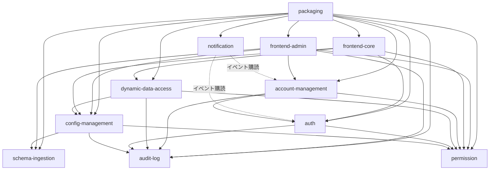

# Unit Dependency: MasterSmith MVP

Unit間の依存はdomain-design/components.mdの依存グラフを踏襲する(FR5.5/FR5.6の管理者ゲーティングはisAdminクレームのローカル判定であり、依存エッジとしては表現しない。ADR-002参照)。フロントエンドの2Unit(frontend-core/frontend-admin)からバックエンドUnitへの呼び出しは、ネットワーク越しのREST API呼び出しであり、他のバックエンドUnit間のプロセス内呼び出し(Q4)とは性質が異なる。本ドキュメントは依存の「向き」のみを表現し、実装着手順(経済的な判断)はDelivery Planning(2.9)で決定する。

> 追記(Construction / permission Unit Functional Designより): `auth → permission`の依存エッジを新設した。ログイン時にアクセストークンのrolesクレームへ埋め込む「有効なロール集合」(直接割り当て+グループ経由の割り当て、functional-design-questions.md Q1)はpermission Unitが所有するデータ(RoleAssignment・GroupMembership)からしか計算できず、Contract Design時点ではこの呼び出しが想定されていなかったため、Functional Designで判明した不足として追加する。permissionは元々依存を持たないUnit(レベル0)であり、この追加はauth側にのみ新しい依存が増える一方向の変更であるため、循環は発生しない(auth自身も他Unitからの被依存はなく、この変更で新たな循環経路は生まれない)。

> 追記(Construction / account-management Unit Functional Designより): `account-management → permission`の依存エッジを新設した。FR6.4.1(アカウント作成時の初期ロール割り当て)・FR6.4.3(編集画面での割り当てロール変更)は、permission Unitが所有するRoleAssignmentエンティティへの書き込みを要するが、Contract Design時点の契約#4はこのデータをauthへ渡す前提であり、authはRoleAssignmentを扱わないため実装不能だった(contract-summary.md #21参照)。permissionは依存を持たないUnit(レベル0)であり、この追加はaccount-management側にのみ新しい依存が増える一方向の変更であるため、循環は発生しない。

> 追記(Construction / frontend-core Unit Functional Designより): `config-management → permission`・`frontend-core → config-management`の依存エッジを新設した。frontend-coreのトップ画面(FR3.4)は非管理者利用者も使う画面だが、config-managementの既存エンドポイント(#15)はすべてisAdmin必須であり、非管理者向けにメニュー階層を取得する手段が存在しなかった。この手段として新設した`GET /api/menu`(契約#23)は、呼び出しロールのテーブル単位canList権限でメニューをフィルタする必要があり、config-managementはそのためにpermission Unitへ新しいプロセス内呼び出し(契約#22)を持つ。permissionは依存を持たないUnit(レベル0)であり、この追加によって循環は発生しない。

## 依存関係(機械可読)

```yaml
units:
  - name: schema-ingestion
    depends_on: []
  - name: permission
    depends_on: []
  - name: audit-log
    depends_on: []
  - name: config-management
    depends_on: [schema-ingestion, audit-log, permission]
  - name: auth
    depends_on: [audit-log, permission]
  - name: dynamic-data-access
    depends_on: [config-management, permission, audit-log]
  - name: account-management
    depends_on: [auth, permission, audit-log]
  - name: notification
    depends_on: [auth, account-management]
  - name: frontend-core
    kind: ui
    depends_on: [auth, dynamic-data-access, permission, config-management]
  - name: frontend-admin
    kind: ui
    depends_on: [schema-ingestion, config-management, permission, account-management, audit-log]
  - name: packaging
    kind: packaging
    depends_on: [schema-ingestion, config-management, permission, dynamic-data-access, auth, account-management, notification, audit-log, frontend-core, frontend-admin]
```

## 依存関係(人間可読)



すべての実線矢印は呼び出し方向(A → B はAがBに依存する)。点線矢印はイベント購読(依存の向きは購読側から発行側)を表す。

## 統合ポイント

| 依存元 | 依存先 | 統合ポイント | 方式 |
|---|---|---|---|
| config-management | schema-ingestion | スキーマ取り込み結果を設定項目の初期値として取得 | プロセス内呼び出し(sync) |
| config-management | audit-log | 設定項目の作成・更新・削除を記録 | プロセス内呼び出し(async) |
| dynamic-data-access | config-management | 有効なテーブル設定(検索条件・一覧表示項目・編集対象外項目・バリデーション・フォーム部品)を参照 | プロセス内呼び出し(sync) |
| dynamic-data-access | permission | テーブル単位・カラム単位の操作権限を確認 | プロセス内呼び出し(sync) |
| config-management | permission | トップ画面メニュー取得(`GET /api/menu`、契約#23)のため、呼び出しロールのテーブル単位canList権限を取得(contract-summary.md #22、frontend-core Unit Functional Designで新設) | プロセス内呼び出し(sync) |
| dynamic-data-access | audit-log | 業務データの作成・更新・削除を記録 | プロセス内呼び出し(async) |
| auth | audit-log | ログイン・自己サービス操作を記録 | プロセス内呼び出し(async) |
| auth | permission | ログイン時に、対象accountIdの有効なロールID一覧(直接割り当て+所属グループ経由の割り当て)を取得し、アクセストークンのrolesクレームへ埋め込む(contract-summary.md #20、permission Unit Functional Designで新設) | プロセス内呼び出し(sync) |
| account-management | auth | 共有するAccountエンティティの作成・参照・更新・無効化を、authが公開するAccountリポジトリ/サービスの呼び出しを通じて行う(スキーマは共有するが、直接のテーブルアクセスはせず必ずauth経由で呼び出す) | プロセス内呼び出し(sync) |
| account-management | permission | アカウント作成時の初期ロール割り当て・編集時の割り当てロール変更(contract-summary.md #21、account-management Unit Functional Designで新設) | プロセス内呼び出し(sync) |
| account-management | audit-log | アカウント管理操作を記録 | プロセス内呼び出し(async) |
| notification | auth | アカウント登録完了・パスワード変更・パスワード忘れ・メールアドレス変更のライフサイクルイベントを購読 | イベント(Springアプリケーション内イベント機構) |
| notification | account-management | アカウント作成イベントを購読 | イベント(Springアプリケーション内イベント機構) |
| frontend-core | auth | ログイン・トークン発行・自己サービス操作 | REST API(ネットワーク境界) |
| frontend-core | dynamic-data-access | 業務データの検索・参照・作成・更新、FK参照検索 | REST API(ネットワーク境界) |
| frontend-core | permission | 自身に割り当てられたロール一覧の取得、作業中ロールの切り替え(Topbarのユーザーメニュー、FR5.4) | REST API(ネットワーク境界) |
| frontend-core | config-management | トップ画面のメニュー階層取得(`GET /api/menu`、契約#23、frontend-core Unit Functional Designで新設) | REST API(ネットワーク境界) |
| frontend-admin | schema-ingestion | スキーマ取り込み実行 | REST API(ネットワーク境界) |
| frontend-admin | config-management | 設定管理CRUD | REST API(ネットワーク境界) |
| frontend-admin | permission | ロール・グループ・権限管理 | REST API(ネットワーク境界) |
| frontend-admin | account-management | アカウント管理 | REST API(ネットワーク境界) |
| frontend-admin | audit-log | 監査ログ参照・エクスポート・削除 | REST API(ネットワーク境界) |
| packaging | (全Unit) | フロントエンドのビルド成果物をバックエンドの静的コンテンツとして取り込み、単一WARへ組み立て | ビルド時の成果物結合 |

## 並行開発の機会

依存関係のないUnit同士は並行着手が可能(Q3)。開発者一人体制のため実際には順次進めるが、以下は独立して着手できる集合として記録する。

| レベル | 並行着手可能なUnit |
|---|---|
| レベル0(依存なし) | schema-ingestion, permission, audit-log |
| レベル1 | config-management, auth |
| レベル2 | dynamic-data-access, account-management |
| レベル3 | notification, frontend-core, frontend-admin |
| レベル4 | packaging |

このレベル分けは依存グラフから機械的に導出したトポロジーであり、実際の着手順(経済的判断)はDelivery Planning(2.9)で決定する。
