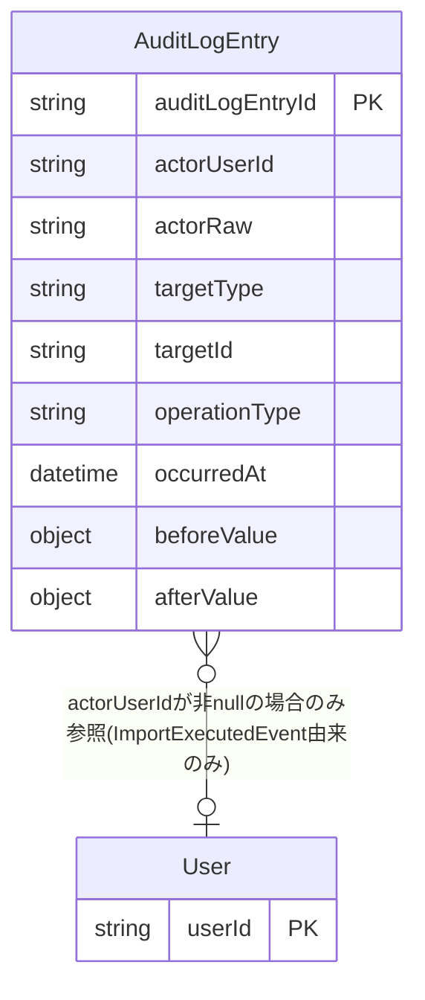

<!--
Copyright 2026 agwlvssainokuni

Licensed under the Apache License, Version 2.0 (the "License");
you may not use this file except in compliance with the License.
You may obtain a copy of the License at

    http://www.apache.org/licenses/LICENSE-2.0

Unless required by applicable law or agreed to in writing, software
distributed under the License is distributed on an "AS IS" BASIS,
WITHOUT WARRANTIES OR CONDITIONS OF ANY KIND, either express or implied.
See the License for the specific language governing permissions and
limitations under the License.
-->

# Functional Specification — audit-logging (U7)

本書は、audit-loggingユニットの振る舞い仕様(ワークフロー)の一次情報源である。データ形状は`entities.md`、業務ルールは`rules.md`を一次情報源とし、本書はそれらから派生したエンティティ関連図・ルールサマリーを補助的に含む。

## ワークフロー

### W1: ドメインイベント購読による監査記録(FR8.1、FR8.2)

1. config-engine・permission-engine・data-import-exportは、それぞれの操作(設定変更・権限変更・CSVインポート実行)の成功時に、Springの`ApplicationEventPublisher`経由でドメインイベント(`ConfigChangedEvent`・`PermissionChangedEvent`・`ImportExecutedEvent`)をfire-and-forgetで発行する(発行元はaudit-loggingの存在を意識しない疎結合構成)。
2. audit-loggingは、`@EventListener`により3種類のイベントをそれぞれ専用のリスナーメソッドで購読する(BR7.1)。
3. 受信したイベントの型に応じて、対応するマッピング規則(ConfigChangedEventはBR7.2、PermissionChangedEventはBR7.3、ImportExecutedEventはBR7.4)を適用し、`AuditLogEntry`を1件生成する。
4. 生成した`AuditLogEntry`を内部設定DB(組込みDB)へ追記(INSERT)する。書き込みに失敗した場合はBR7.7に従い、構造化ログ(ERRORレベル)へ記録するのみとし、発行元の処理へは一切影響を与えない(リトライ・再送出なし)。
5. 複数イベントが並行して発行される場合でも、記録順序の厳密な保証は行わない(BR7.8)。各`AuditLogEntry`の`occurredAt`のみを正とし、DBへの書き込み順序と一致しなくても閲覧側のソート(W2)で実用上問題ないものとする。

### W2: 監査ログ閲覧(FR8.4、C6: `GET /api/audit-log`)

1. 利用者が管理メニューから監査ログ閲覧画面を開く。frontend-uiはC6(`GET /api/audit-log`、Bearer認証済み)へ`page`・`pageSize`・`targetType`(任意)のクエリパラメータを付与してリクエストする。
2. audit-loggingは、リクエストのSpring Security認証済みプリンシパルから`activeRoleId`(セッション単位のアクティブロール、authentication-serviceが管理)を取得し、PermissionEngineの`canAccessScreen(activeRoleId, "audit-log")`(C10契約、同期呼出)を呼び出す(BR7.10)。予約`screenKey`"audit-log"は、permission-engineが既にBR3.10・BR3.15で予約・実装済みのものをそのまま利用し、本ユニット側で新規のscreenKey定義は行わない。
3. IF アクセス不可(`canAccessScreen`がfalse) THEN 403 Forbidden(RFC 9457形式の`ProblemDetails`、C6契約)を返す。
4. IF アクセス可 THEN 内部設定DBから`AuditLogEntry`を検索する。`targetType`が指定された場合は等価一致でフィルタし(BR7.9)、`occurredAt`の降順でソートしたうえで`page`・`pageSize`によるページングを適用する。
5. `{ items: AuditLogEntry[], totalCount: number }`(C6契約)を返す。`items`の各要素は`entities.md`の`AuditLogEntry`属性(`auditLogEntryId`・`actorUserId`・`targetType`・`targetId`・`operationType`・`occurredAt`・`beforeValue`・`afterValue`)をそのまま返す。`actorRaw`はC6契約に未追補のため現時点ではレスポンスに含めない(下記Assumptions & Open Questions参照)。

## エンティティ関連図(`entities.md`からの派生ビュー)

<!-- Text fallback: AuditLogEntryはaudit-loggingユニットが保持する唯一の永続エンティティである。actorUserIdが非null(現時点ではImportExecutedEvent由来のエントリのみ)の場合、その値はUserManagementが所有するUserのuserIdを不透明な文字列として参照する(永続化上の外部キー制約なし)。ConfigChangedEvent・PermissionChangedEvent由来のエントリはactorUserIdがnullで、元の値はactorRawに保持される。 -->

## 業務ルールサマリー(`rules.md`からの派生ビュー)

`rules.md`の全11ルール(BR7.1〜BR7.11)のうち、主要なものを要約する。詳細・完全な一覧は`rules.md`を参照。

- **購読対象イベント**(BR7.1): 現存する3種類(ConfigChangedEvent・PermissionChangedEvent・ImportExecutedEvent)のみ。
- **イベント別マッピング規則**(BR7.2〜BR7.4): targetType/targetId/operationType/actorUserId/actorRawへの変換規則をイベントごとに固定。
- **追記専用**(BR7.5): アプリ層にUPDATE/DELETEメソッドを定義しない。
- **無期限保持**(BR7.6): 削除・アーカイブ機能なし。
- **記録失敗時**(BR7.7): ERRORログのみ、リトライ・発行元への影響なし。
- **記録順序**(BR7.8): occurredAtのみを正とし厳密な順序保証は不要。
- **閲覧APIの並び順**(BR7.9): occurredAt降順が既定。
- **閲覧画面アクセス制御**(BR7.10): PermissionEngineのcanAccessScreen(screenKey="audit-log")へ委譲。
- **業務固有ハードコード禁止**(BR7.11): 共通エンジン層としての横断的制約(FR1.6)。

## Assumptions & Open Questions

- **[assumption]** project.mdの`## Mandated`は「監査ログは... 変更前後の値を記録する」としているが、本Boltが購読する3イベント(ConfigChangedEvent・PermissionChangedEvent・ImportExecutedEvent)はいずれも構造化された変更前後の値を運ばないため、`beforeValue`/`afterValue`は常にnullとして記録する(Q5確定)。これは見落としではなく、将来record-edit-engine(業務データ変更)・user-management(ユーザー変更)が変更前後の値を含む形でイベントを発行するようになった時点で、段階的に非null値が記録されるようになるという明示的なスコープ判断である。
- **[assumption]** `actorUserId`の意味論は、ImportExecutedEvent由来のエントリのみ実際のユーザーIDであり、ConfigChangedEvent・PermissionChangedEvent由来のエントリはnull(元の値はactorRawへ退避)である(Q4確定=B)。監査ログ閲覧画面で「誰が操作したか」を一貫してユーザー名表示したい場合、ConfigChangedEvent・PermissionChangedEvent由来のエントリについてはactorRaw(システム識別子またはactiveRoleId)をそのまま表示する形になる。ユーザーID伝播の是正(ConfigChangedEventへのactor引数追加等)は、Contract Design(C9契約)への追補が必要な将来的な改善事項として引き継ぐ。
- **[未解決]** `entities.md`で新設した`actorRaw`属性は、Contract Design(C6契約)の`AuditLogEntry`スキーマには未追補である。現時点のW2(監査ログ閲覧)は`actorRaw`をレスポンスに含めない設計としているが、閲覧画面で`actorRaw`(システム識別子・activeRoleId)をユーザーへ提示する要件が今後生じた場合は、C6契約への`actorRaw`プロパティ追加を検討する必要がある(次工程での確認事項として引き継ぐ)。
- **[解決済み]** PermissionChangedEventの実際の発行粒度(1回のassignPermission/assignAuxiliaryPermission呼び出しごと)は、permission-engine機能設計時点のrules.md BR3.11が想定していた「config-import-exportの1回のインポート実行単位のサマリ」とは異なる(実装時にpermission-engine側で本ユニット単体では実行単位を知り得ないという理由により変更された、`PermissionChangedEvent.java`のJavadoc参照)。本ユニットのBR7.3は、実際に存在するイベントの発行粒度(呼び出し単位)をそのまま前提として設計しており、この差異による影響はない(1回の呼び出し = 1件のAuditLogEntry)。
