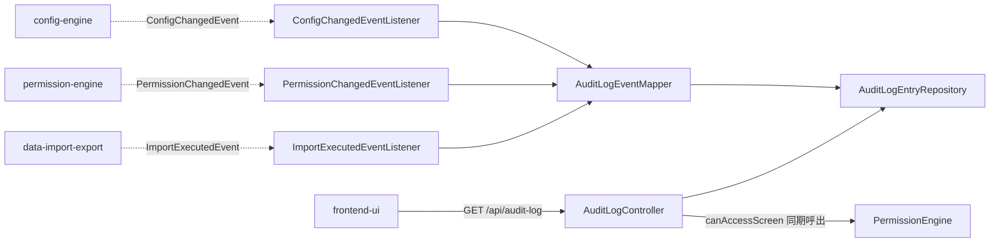

<!--
Copyright 2026 agwlvssainokuni

Licensed under the Apache License, Version 2.0 (the "License");
you may not use this file except in compliance with the License.
You may obtain a copy of the License at

    http://www.apache.org/licenses/LICENSE-2.0

Unless required by applicable law or agreed to in writing, software
distributed under the License is distributed on an "AS IS" BASIS,
WITHOUT WARRANTIES OR CONDITIONS OF ANY KIND, either express or implied.
See the License for the specific language governing permissions and
limitations under the License.
-->

# Logical Components — audit-logging (U7)

`nfr-design-questions.md` Q6確定に基づく、audit-loggingユニット内部のロジカルコンポーネント構成。本ユニットはAWSクラウドへのデプロイを対象外とする単一実行可能WAR内のSpring Bootコンポーネント群であり(Infrastructure Design・Operationフェーズは本ワークフローのスコープでSKIP)、インフラストラクチャコンポーネントの記述は行わない。

## コンポーネント一覧

| コンポーネント | 責務 | 対応するBR/NFR |
|---|---|---|
| `ConfigChangedEventListener` / `PermissionChangedEventListener` / `ImportExecutedEventListener` | 各ドメインイベントを専用の`@EventListener`メソッドで同期購読し、マッピング〜書き込みを`try-catch`で囲み例外を発行元へ伝播させない | BR7.1, NFR4.2, NFR4.5 |
| `AuditLogEventMapper` | 購読したイベントを`AuditLogEntry`へ変換する(イベント種別ごとの固定マッピング規則) | BR7.2, BR7.3, BR7.4 |
| `AuditLogEntryRepository` | 内部設定DBへのAuditLogEntry追記(INSERT)・検索(`targetType`フィルタ・`occurredAt`降順・ページング)。UPDATE/DELETEに相当するメソッドは定義しない | BR7.5, BR7.9, NFR1.1, NFR1.2, NFR2.2 |
| `AuditLogController`(C6実装) | `GET /api/audit-log`のエントリポイント。PermissionEngine(C10)への認可委譲、クエリパラメータ検証、ページング適用 | C6契約, BR7.10, NFR2.1, NFR2.5 |

## コンポーネント間の関連

<!-- Text fallback: config-engine・permission-engine・data-import-exportはそれぞれApplicationEvent(fire-and-forget)を発行し、対応する専用EventListenerが購読する。各EventListenerはAuditLogEventMapperでAuditLogEntryへ変換し、AuditLogEntryRepositoryへ追記する。frontend-uiはGET /api/audit-logでAuditLogControllerを呼び出し、ControllerはPermissionEngineへcanAccessScreenを同期呼出で委譲したうえで、AuditLogEntryRepositoryから検索結果を返す。 -->

## 障害ドメイン(Failure Domain)

- 各EventListenerの処理は、イベント発行元(config-engine等)と同一スレッド・同期実行だが、`try-catch`境界(`reliability-design.md`参照)により例外が発行元の呼び出しスタックへ伝播しない設計とする。1件のAuditLogEntry書き込み失敗は、当該イベント1件の記録漏れに閉じ、発行元の処理や他のイベント購読処理には波及しない。
- `AuditLogController`(閲覧API)の処理は、当該HTTPリクエストのスレッド内で完結する。内部設定DB接続断時は503を返すのみで(NFR4.4)、アプリケーション全体には波及しない。
- 本ユニットはJVMプロセス(単一WAR)全体を落とすような共有可変状態を持たない。

## 共有リソース

- 内部設定DB用HikariCPコネクションプール(業務データ用RDBMSとは別接続、team.md Q12b、他の内部設定DB依存ユニットと共有)
- Micrometerの`MeterRegistry`(アプリ全体で共有する計装基盤、`observability-design.md`参照)

## インフラストラクチャへの橋渡し(参考)

本プロジェクトはInfrastructure Design(3.4)をSKIP対象としており、AWS等のクラウドインフラ設計は行わない。単一実行可能WARとして、アプリケーションを実行する任意の環境(オンプレミス、コンテナ等)にデプロイされる前提であり、本コンポーネント群はいずれもその単一デプロイ単位の内部に含まれる。
