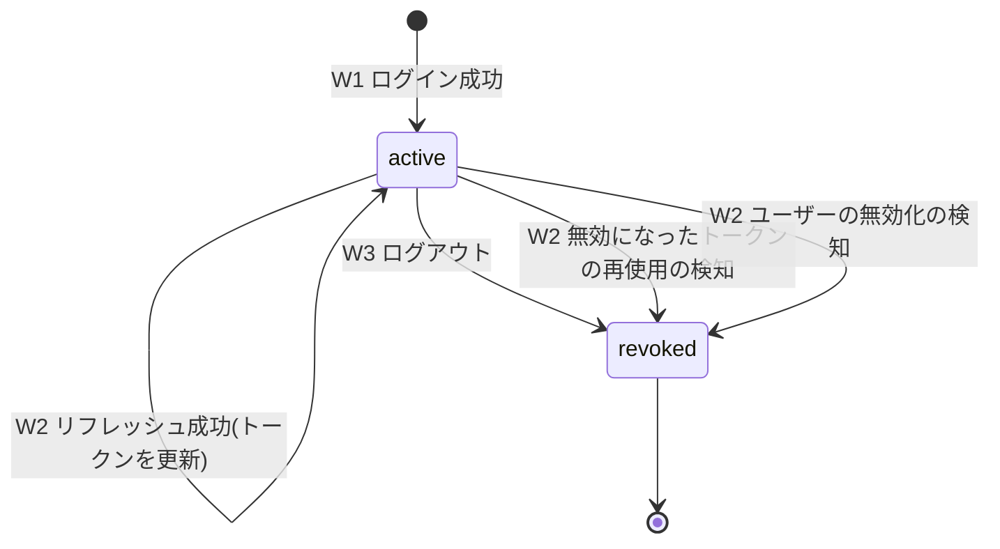
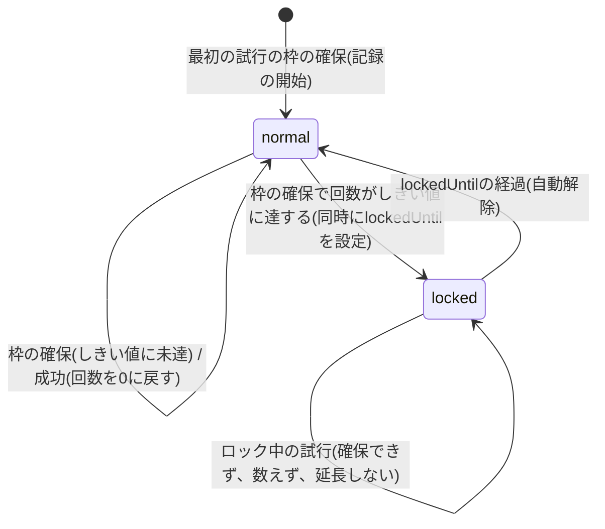
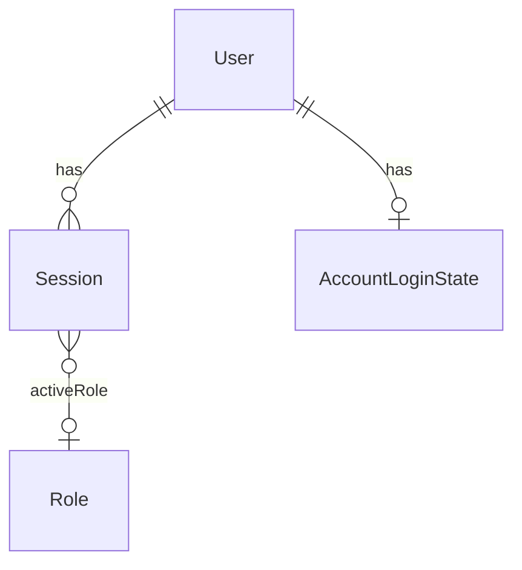

<!--
Copyright 2026 agwlvssainokuni

Licensed under the Apache License, Version 2.0 (the "License");
you may not use this file except in compliance with the License.
You may obtain a copy of the License at

    http://www.apache.org/licenses/LICENSE-2.0

Unless required by applicable law or agreed to in writing, software
distributed under the License is distributed on an "AS IS" BASIS,
WITHOUT WARRANTIES OR CONDITIONS OF ANY KIND, either express or implied.
See the License for the specific language governing permissions and
limitations under the License.
-->

# Functional Specification — authentication-service (U5)

## Sources

- `inception/units-generation/unit-of-work.md`(U5定義)
- `inception/units-generation/unit-of-work-story-map.md`(U5に割り当てられたFR一覧)
- `inception/domain-design/components.md`(AuthenticationServiceコンポーネント定義)
- `inception/contract-design/contract-summary.md`(C4: 認証REST API、C11: UserAccountLookupApi、C14: SessionContextApi)
- `inception/requirements-analysis/requirements.md`(FR2.3, FR2.7, FR3.1〜FR3.4, FR4.2)
- `inception/refined-mockups/mockups.md`(ログイン画面・初期パスワード設定画面・ユーザー管理画面)
- `construction/user-management/functional-design/functional-spec.md`・`rules.md`・`nfr-design/security-design.md`(U4の実装で持ち越された論点)
- `functional-design-questions.md`(Q1〜Q10の確定回答)

## 認証の前提と、このユニットの位置づけ

認証は、次の4つのAPI(C4)と、認証を必要とするすべてのAPIに掛かる認証フィルタで構成する。

- ログイン(`POST /api/auth/login`)、リフレッシュ(`POST /api/auth/refresh`)、ログアウト(`POST /api/auth/logout`)、アクティブロールの選択(`PUT /api/auth/active-role`)。
- 認証フィルタは、`/api/**`のすべてに適用し、認証を必要としないのは、ログイン・リフレッシュ・招待受諾(`/api/users/invitations/{token}/accept`、user-managementが提供)の3つだけである(BR5.11)。

本ユニットは、ユーザー情報(パスワードのハッシュ検証・statusの確認・選択可能なロール)を、user-managementのC11(`UserAccountLookupApi`)から得る。ロールの実在や権限の判定は、permission-engineが行い、本ユニットは、選択されたアクティブロールのID(不透明な識別子)を、認証フィルタとC14を通して、各ユニットに渡すだけである。

## ワークフロー

### W1: ログイン(FR2.7, FR3.1, FR3.2, FR4.2、BR5.1, BR5.2, BR5.3, BR5.5, BR5.8, BR5.9, BR5.15)

1. 利用者が`POST /api/auth/login`を呼び出す(email・password)。認証は不要。
2. emailをtrimし、小文字へ正規化する。
3. C11の`findByEmail`(トランザクションの外)でUserを検索する。存在しない、または、statusがactive以外(invited・disabled)の場合は、失敗回数を記録せず、手順8(ダミーの検証をしてから、失敗の応答)へ進む。
4. activeなUserについて、`AccountLoginState`に対する1つの原子的な更新で、試行の枠を確保する(予約、短いトランザクション)。回数がしきい値に達する予約の更新は、同じ更新の中で`lockedUntil`も設定する(ロックを、確保と同時に有効にする)。ロック中で、確保できなかった場合は、検証せず、失敗回数も数えず、ロック期間も延長せず、手順8へ進む。ロックの解除済みなら、回数を0に戻し、世代を進めてから数える(BR5.3)。確保した時点の世代と、この確保が設定したロックの日時を、この試行の予約として保持する。
5. C11の`verifyPasswordHash(userId, password)`(トランザクションの外)で、パスワードを検証する。`HashCapacityExceededException`が投げられた場合は、確保した枠を、条件付きの補償の更新(世代が同じで、回数が0より大きい場合だけ1戻し、この予約が設定したロックだけを解く)で返し、503を返して終了する(BR5.3・BR5.15)。
6. 検証が成功した場合:
   - `AccountLoginState`の`consecutiveFailures`を0に戻し、`lockedUntil`を空にし、世代を進める(短いトランザクション。正しいパスワードでの成功は、しきい値に達した試行であっても、ロックを解く。BR5.3)。
   - 選択可能なロール(C11の`UserAccount.roleIds`)から、アクティブロールを決める。ロールがちょうど1つなら、そのロール。それ以外は、未選択(null)(BR5.9)。
   - 新しい`Session`を作り、リフレッシュトークン(ランダム)のハッシュと有効期限を保存する。アクセストークン(JWT)を発行する(BR5.5)。
   - 200を返す(アクセストークン・リフレッシュトークン・選択可能なロール・アクティブロール(未選択ならnull))。
7. 検証が失敗した場合(パスワードの誤り): 枠は、手順4の確保の時点で失敗として数えられており(しきい値に達していれば、ロックも有効になっている)、追加の更新は行わない(BR5.3)。手順9へ進む。
8. 検証を行わなかった場合(登録されていない・招待中・無効化済み・ロック中): C11の`dummyVerify(password)`で、ユーザーを指定しないダミーの検証を行う(実際の検証と同じコストで、同じ同時実行数の上限を共有する)。`HashCapacityExceededException`なら、503を返して終了する(BR5.2・BR5.15)。
9. 原因を区別しない、同一の401を返す(BR5.2)。

### W2: リフレッシュ(FR2.3, FR3.1, FR4.2、BR5.6, BR5.7, BR5.10)

1. 利用者(フロントエンド)が`POST /api/auth/refresh`を呼び出す(refreshToken)。認証は不要(リフレッシュトークンが根拠)。
2. 提出されたリフレッシュトークンのハッシュで、`Session`を検索する。
   - `refreshTokenHash`と一致し、Sessionが有効(statusがactiveで`refreshExpiresAt`が未経過、BR5.11)なら、手順3へ。
   - `previousRefreshTokenHash`と一致する(すでに更新で無効にしたトークン)なら、`lastRefreshedAt`から猶予(既定10秒)以内かで分ける。猶予内は、正当な再送・複数タブ・同時実行による競合とみなし、401を返す(Sessionは失効させない)。猶予を超えていたら、無効なトークンの再使用(盗用の疑い)とみなし、Sessionをrevokedにして401を返す(BR5.6)。
   - それ以外(未知・期限切れ・失効済み)は、同一の401を返す。
3. C11の`isDisabled(userId)`(トランザクションの外)で、ユーザーの無効化を確認する。無効化されている(disabledまたは不存在)なら、Sessionをrevokedにして401を返す(BR5.7)。
4. C11の`findByUserId(userId)`から、選択可能なロールを取得し、Sessionのアクティブロールを再確認する(BR5.10): 選択済みで含まれなくなっていたら、nullに戻す(残りがちょうど1つならそのロールを自動選択)。未選択で、ロールがちょうど1つになっていたら、そのロールを自動選択する。
5. 1つの条件付きの更新で、`previousRefreshTokenHash`に現在の`refreshTokenHash`を移し、新しい`refreshTokenHash`・`lastRefreshedAt`・`refreshExpiresAt`・(手順4で変わった)`activeRoleId`を設定する。同一のリフレッシュトークンの同時の更新では、1件だけが成功する。更新の件数が0件(負けた側)なら、401を返す(Sessionは失効させない。到着の順序によらず、手順2の猶予内の再使用と同じ結果になる)。
6. 新しいアクセストークンと、新しいリフレッシュトークン、選択可能なロール、アクティブロール(未選択ならnull)を、200で返す(契約の追補、追補一覧)。フロントエンドは、ページの再読み込みのあとも、この応答で、ロール選択・ヘッダーの表示ができる(FR4.2)。

### W3: ログアウト(FR3.2、BR5.8)

1. 認証済みの利用者が`POST /api/auth/logout`を呼び出す。認証フィルタ(BR5.11)を通る。アクセストークンの有効期限が切れている場合は、認証フィルタで401になるため、フロントエンドは、先にリフレッシュしてからログアウトする(frontend-uiへの要求)。
2. リクエストのアクセストークンの`sid`に対応するSessionを、revokedにする。同一ユーザーの他のSession(他の端末)には影響しない。
3. 204を返す。以降、そのSessionのアクセストークンは、Sessionがrevokedのため、有効期限の前でも401になる。

### W4: アクティブロールの選択(FR4.2、BR5.9)

1. 認証済みの利用者が`PUT /api/auth/active-role`を呼び出す(roleId)。
2. C11の`findByUserId(userId)`から、選択可能なロール(直接付与分とGroup経由分の和集合)を取得する。
3. 指定されたroleIdが含まれない場合は、403を返す(Sessionは変更しない)。
4. 含まれる場合は、Sessionのアクティブロールを更新し、キャッシュを無効化して、200を返す。以降のリクエストは、新しいアクティブロールで処理される(別のSession(端末)には影響しない)。

### W5: リクエストの認証(認証フィルタ、FR3.1, FR3.3、BR5.11, BR5.12)

1. 認証を必要とするAPIへのリクエストに対し、認証フィルタが、`Authorization: Bearer`のアクセストークンを取り出す。
2. 署名と有効期限を検証する。不正または期限切れなら、401を返す。
3. `sid`のSessionを検索する(インメモリのキャッシュ経由)。存在しない、または、有効でない(revoked、またはリフレッシュの有効期限の経過、BR5.11の定義)なら、401を返す。
4. `Operator`(userId = `sub`、sessionId = `sid`、アクティブロール = Sessionの値(nullを含む))を決め、中立の共有契約(C15、`OperatorContext`)を通して、リクエストの処理へ渡す。認証フィルタ(authentication-service)が値を設定する側で、他ユニットはこの共有契約だけを読む(authentication-serviceのコンポーネントを呼ばない)。
5. 各ユニットは、`OperatorContext`から`Operator`を読み、コントローラ・サービスの入口で、`canAccessScreen`などによる認可の再検証を行う(従来どおり)。アクティブロールがnullの場合は、認証エラーではなく、そのままC10へ渡し、権限なし(403)として判定させる(BR5.12。RBAC設定が空の間の例外である`config-import-export`は、C10が許可する)。

### W6: C14 `getActiveRoleId`の提供(FR4.2、BR5.13)

1. list-engine・record-edit-engineが、`getActiveRoleId(sessionId)`を呼ぶ。
2. Sessionが存在しなければ`SessionNotFoundException`、Sessionが有効でない(revoked、またはリフレッシュの有効期限の経過、BR5.11の定義)なら`SessionExpiredException`を投げる。
3. それ以外は、Sessionのアクティブロール(未選択ならnull)を返す。

### W7: 他ユニットの暫定の操作者取得の置き換え(BR5.12)

認証フィルタの導入と同時に、次の暫定の実装を削除し、`OperatorContext`を読む実装に置き換える。コントローラ・サービスの入口は変えない。

- schema-introspector(U2): `ActiveRoleResolver`・`HeaderActiveRoleResolver`(menu-navigation(U6)・audit-logging(U7)も、これらを共有して利用している)。
- user-management(U4): `CurrentOperatorProvider`・`HeaderCurrentOperatorProvider`。
- permission-engine(U3): C10の`canAccessScreen`・`resolveEffectivePermission`が、`activeRoleId`のnull・空を、権限なし(NONE)として扱うよう変更する(RBAC設定が空の間の`config-import-export`の例外は、`activeRoleId`にかかわらず適用する)。テストの追加を含む。
- 上記の呼び出し元は、`activeRoleId`がnullでも、自前で401にせず、そのままC10へ渡す(操作者そのものが解決できない場合だけ401)。

ヘッダー(`X-Active-Role-Id`・`X-User-Id`)を信頼する経路は、どのプロファイルにも残さない(Q9=A)。

**ユニットの依存関係との整合(確認)**: 上記の置き換えが生む依存は、U2・U4・U6・U7から、中立の共有契約(C15の`Operator`・`OperatorContext`、共通基盤の所有、authentication-serviceの業務ロジックに依存しない型と読み取りインタフェース)への、読み取りだけである。authentication-serviceは、その契約の値を設定する側で、user-managementへは、C11(`unit-of-work-dependency.md`の「authentication-service→user-management」、確定済み)だけで依存する。user-managementは、authentication-serviceのコンポーネントを呼ばないため、U4→U5→U4の循環は生じない。permission-engine(U3)への変更は、C10の意味(nullの扱い)の追補で、新しいユニット間の依存を作らない。`unit-of-work-dependency.md`のDAG(Layer 0〜6)は変わらない(C15の共有契約は、DAGの葉として、どのユニットからも、依存できる位置に置く。追補一覧の9番)。

## 状態遷移

### Session.status

テキストフォールバック: Sessionは、ログイン成功(W1)でactiveになる。リフレッシュ(W2)に成功してもactiveのままで、トークンだけが更新される。ログアウト(W3)、無効になったトークンの再使用の検知(W2)、リフレッシュ時のユーザーの無効化の検知(W2)のいずれかで、revokedになり、activeには戻らない。リフレッシュの有効期限の経過は、statusを変えず、時刻の比較で判定する。

### AccountLoginState(ロックの状態)

テキストフォールバック: ロックの状態は、通常(normal)とロック中(locked)の2つである。ログイン試行は、検証の前に、試行の枠を確保する(予約)。通常のとき、枠を確保するたびに失敗の回数が増え、しきい値(既定5回)に達する枠の確保と同時に、ロック中になり、解除予定日時(既定15分後)が決まる(検証の結果や、途中の中断を待たない)。ロック中の試行は、枠を確保できず、数えず、ロックの期間も延長しない。解除予定日時が経過すると、自動的に通常に戻り、その後の最初の試行の予約では、失敗回数を0に戻してから数える。ログインに成功すると、回数は0に戻る。同時の試行が何件あっても、1回のロック期間までに検証できる試行は、しきい値の回数を超えない。

## エンティティ関連図(entities.mdより導出)

テキストフォールバック: Userは、0個以上のSessionを持つ(端末ごとのログイン)。Userは、0個または1個のAccountLoginState(連続失敗の回数とロックの状態)を持つ。Sessionは、選択済みの場合に限り、0個または1個のRole(アクティブロール)を参照する。UserはU4が、RoleはU3が所有し、本ユニットは、不透明な識別子として参照する。

## ルール概要(rules.mdより導出)

| ID | 概要 |
|---|---|
| BR5.1 | ログイン(C11で認証、成功条件、トークンとSessionの発行) |
| BR5.2 | 失敗の応答の統一と、C11のdummyVerifyによる応答時間・503の均一化 |
| BR5.3 | アカウントロック(予約型の原子的な更新、しきい値到達と同時にロックを有効化、条件付きの補償、5回・15分・自動解除) |
| BR5.4 | ロックの閾値・時間・トークンの有効期限・再送の猶予は`application.yml`、設定値の検証、FR2.7の文言の追補(反映済み) |
| BR5.5 | トークンの発行(JWT・不透明なリフレッシュトークン・鍵) |
| BR5.6 | リフレッシュのローテーション、再送の猶予、再使用の検知、ロール情報の返却 |
| BR5.7 | リフレッシュ時のisDisabledの確認 |
| BR5.8 | ログインごとのSession、ログアウトは該当のSessionだけ |
| BR5.9 | アクティブロール(単一は自動選択、複数は選択、403) |
| BR5.10 | リフレッシュ時のアクティブロールの再確認(外された・1つになった場合を含む) |
| BR5.11 | 認証フィルタ(Sessionの有効の定義を含む) |
| BR5.12 | Operatorの共有契約(C15)、アクティブロール未選択は403、C10のnullの扱い、暫定の操作者取得の置き換え |
| BR5.13 | C14のgetActiveRoleId |
| BR5.14 | 認証情報・トークン・鍵の非出力 |
| BR5.15 | ハッシュ計算の上限超過は、実際・ダミーの検証のどちらでも同じ503、C11はトランザクションの外 |
| BR5.16 | 無効化されたユーザーの扱いの分担 |

## 契約・他ユニットへの追補(Code Generation着手時に反映する)

このステージで確定した内容のうち、確定済みの契約(C4・C10・C11・C14)・要件・他ユニットの実装に影響するものを、次のとおり、追補として記録する。1番は、上流の契約の要請(機能設計での解消)に従い、このステージで、要件定義書へ反映済みである。それ以外は、Code Generationの計画承認までに、対象の設計(契約書・モックアップ)へ反映するか、ユーザーへ確認する。

| 番号 | 対象 | 内容 | 出典 |
|---|---|---|---|
| 1 | 要件定義書 FR2.7 | 文言を「`application.yml`で設定可能でなければならない(管理画面での編集UIは設けない)」に修正する追補を、要件定義書(`inception/requirements-analysis/requirements.md`)の末尾に、**反映済み**(元の記述は残す) | Q1=A, レビュー指摘R-08 |
| 2 | C4 リフレッシュ | レスポンスを`{accessToken, refreshToken, roles, activeRoleId}`にする(ローテーション、ロール情報の返却)。401は、同一の応答(未知・期限切れ・失効済み・再送の競合・盗用の疑いのいずれも区別しない) | Q5=A, BR5.6, レビュー指摘R-05 |
| 3 | C4 ログイン | レスポンスに`activeRoleId`(未選択ならnull)を追加。503(ハッシュ計算の待機超過)のレスポンスの追加。`roles`は、直接付与分とGroup経由分の和集合 | Q8=A, BR5.15, BR5.9 |
| 4 | C11 | `revokeRefreshTokensOnDisable`を削除する(引き込み型のため不要)。`findByUserId(userId): Optional<UserAccount>`を追加する(トークンがuserIdしか運ばないため、リフレッシュ・ロール選択で最新のロールを得る)。`dummyVerify(rawPassword): void`を追加する(ユーザーを指定しないダミーの検証。実際の検証と同じコスト・同じハッシュ計算の同時実行数の上限を共有し、上限超過は`HashCapacityExceededException`)。いずれも、user-managementが実装する加法的な追補 | Q6=A, BR5.2, BR5.15, レビュー指摘R-03 |
| 5 | C14 | `getActiveRoleId`が、未選択の場合にnullを返すこと。Sessionの有効の定義(BR5.11)に基づく`SessionExpiredException` | Q7=A, BR5.13 |
| 6 | C10(permission-engine) | `canAccessScreen(activeRoleId, screenKey)`・`resolveEffectivePermission`が、`activeRoleId`がnullまたは空のときは、「ロールを持たない」として、fail closed(権限なし=NONE)で判定すること。RBAC設定が空の間の`config-import-export`の例外は、`activeRoleId`にかかわらず適用する。permission-engineの実装とテストの変更を含む | Q7=A, BR5.12, レビュー指摘R-06 |
| 7 | frontend-ui(U12)への要求 | (a)招待受諾の成功後、設定したemail・passwordで`POST /api/auth/login`を続けて呼ぶ(Q3=A)。(b)リフレッシュは、単一の呼び出し(single-flight)にまとめ、リフレッシュトークンを、複数のタブで共有する。リフレッシュが401のときは、共有された最新のトークンで、1回だけ再試行し、それでも401ならセッションの終了として扱う(BR5.6の猶予)。(c)アクセストークンの期限切れの場合は、先にリフレッシュしてからログアウトする(BR5.8)。(d)ページの再読み込みのあとは、リフレッシュの応答のロール情報で、ロール選択・ヘッダーの表示を行う。(e)ロールが0個・1個・複数個のユーザーの、それぞれの画面の扱い(BR5.9・BR5.12) | Q3=A, BR5.6, BR5.8, BR5.9 |
| 8 | 他ユニット(U2・U4・U6・U7・U3) | 暫定の操作者取得(ヘッダー方式)を削除し、`OperatorContext`を読む実装に置き換える。permission-engine(U3)は、C10のnullの扱いの変更(6番)。いずれも、本ユニットのCode Generationの範囲に含める | Q9=A, BR5.12 |
| 9 | 新しい共有契約 C15 | `Operator`(userId・sessionId・activeRoleId)と、リクエストの処理中の操作者を返す読み取り専用の`OperatorContext`を、authentication-serviceの業務ロジックに依存しない中立の共有契約として追加する。**所有と実装の担い手**: 契約の所有規則(プロバイダーのユニットが所有)の、共通基盤の契約(shared kernel)としての例外とし、**変更には、authentication-serviceと、すべての読み取り側のユニットの合意を要する**(契約表と所有規則に、その旨を追補する)。実装は、**authentication-service(U5)のCode Generation**で行う(認証フィルタが値を設定するため)。`contract-summary.md`の契約表と所有規則、`unit-of-work-dependency.md`の統合ポイント表への追補を含む | BR5.12, レビュー指摘R-01・R-14 |
| 10 | リファインドモックアップ | ユーザー管理画面の「ロック中」の表示・「有効化」の操作の記述は、MVPでは実装しない。frontend-uiの実装時に、実装に合わせて更新する | Q10=A |
| 11 | 他ユニットの追補の実装の担い手 | C11の追補(4番: `findByUserId`・`dummyVerify`・`revokeRefreshTokensOnDisable`の削除)は、user-management(U4)、C10のnullの扱い(6番)は、permission-engine(U3)のコードへの変更であり、いずれも、authentication-service(U5)のCode Generationの範囲に含めて実装する(U5のログイン・リフレッシュ・認証フィルタが、これらに依存するため)。各ユニットの既存のテストの更新と追加を含み、U4・U3の既存の振る舞い(既存のメソッド・テスト)は変えない | 4番・6番・8番, レビュー指摘R-14 |
| 12 | `contract-summary.md` C4の既知の未解消フォローアップ | 「FR2.7の文言の不一致は未解消」の記述を、「要件定義書の追補(`requirements.md`の末尾)で解消済み」に更新する(Code Generationの最初の作業として、追補として記録する) | 1番, レビュー指摘R-14 |

## Assumptions & Open Questions

確定済みの質問回答(Q1〜Q10)に含まれず、本設計で置いた判断は、次のとおり`[assumption]`として残す。人間が確認するまで確定事項として扱わない。レビュー(iteration 1)の指摘への対応として追加・変更したものには、指摘の番号を付ける。

- [assumption] 選択可能なロールの再取得のための`findByUserId`: アクセストークンは`sub`(userId)しか運ばないため、`PUT /api/auth/active-role`(W4)とリフレッシュ時(W2)に、userIdから最新のロールを得る手段が要る。C11に`findByUserId(userId): Optional<UserAccount>`を追加する(加法的な追補で、user-managementが実装する)。代替案は、Sessionにemail(不変)を保持して`findByEmail`を使う方法だが、個人情報をSessionに複製することになるため採らない。
- [assumption] ダミーの検証の実装場所(R-03): ユーザーを指定しないダミーの検証を、C11に`dummyVerify(rawPassword)`として追加する。実際の検証と同じコスト・同じ同時実行数の上限を共有させることで、上限超過の503が、存在・ロックの状態を漏らさないようにする。代替案(authentication-serviceが自前でハッシュを計算する)は、user-managementの上限を回避して、認証なしにメモリの多い計算を無制限に起動できるため採らない。
- [assumption] リフレッシュの再送の猶予(R-02・R-15、**Q5=Aからの差異**): Q5=A(人間が確認済み)は、「すでに無効になったトークンが再び使われたら、そのセッションを失効させる」としていた。本設計は、これに対し、更新済みのトークンの再送を、`lastRefreshedAt`から10秒(`application.yml`で設定)以内は、401だけで、Sessionを失効させない、という猶予を加えた。再送・複数タブによる誤失効(全端末の再ログイン)を避けるためである。トレードオフは、(1)猶予内に到着した再送は、新しいトークンを返さないため、最初の応答を失ったクライアントは、再ログインになること(残余リスク4)、(2)猶予内に、盗まれた古いトークンが提出されても、Sessionは失効せず、盗用の検知が、猶予を超えた再使用まで遅れること、(3)`previousRefreshTokenHash`は直前の1世代だけを保持するため、2世代以上前のトークンの提出は、「未知」と区別されず、盗用の検知にならないこと(残余リスク5・6)。この差異は、承認ゲートで、人間の確認を得る。猶予を0にすれば、Q5=Aの元の挙動になる。
- [assumption] ロックの予約型の更新(R-04・R-12・R-13): 検証の前に、試行の枠を確保する原子的な更新を行い、回数がしきい値に達する更新と同時に`lockedUntil`を設定する(検証の途中の中断があっても、状態が固定されず、永続的にロックされない)。補償の更新(ハッシュ計算の上限超過で枠を返す)は、世代(`generation`)と、この予約が設定したロックの日時を条件とする条件付きの更新で、リセットをまたいだ誤った補償を防ぐ。補償が失敗した場合は、失敗として数えたままにする(安全側。ロックは自動解除される)。この方式の欠点は、正しいパスワードの利用者でも、負荷による503が続くと、失敗として数えられうること(補償の条件付きの更新で緩和する)。
- [assumption] リフレッシュとログインの応答へのロール情報の追加(R-05): FR4.2の「選択したロールを、ヘッダーに常時表示する」を、ページの再読み込みのあとも満たすため、C4のリフレッシュのレスポンスに`roles`と`activeRoleId`を、ログインのレスポンスに`activeRoleId`を追加する。契約の所有者はU5であり、このステージで確定する(新しいAPIの追加は、不要と判断した)。
- [assumption] `Operator`の共有契約(C15)と共通基盤の所有(R-01): `Operator`と`OperatorContext`を、authentication-serviceの業務ロジックに依存しない、中立の共有契約として置く。パッケージ・所有の具体は、Code Generationの計画で確定する(共通基盤の所有とする案)。`unit-of-work-dependency.md`のDAGは、変わらない(共有契約は葉)。
- [assumption] C10のnullの扱い(R-06): `canAccessScreen(null|空, screenKey)`は、fail closedでNONE(権限なし)、ただし、RBAC設定が空の間の`config-import-export`の例外は、`activeRoleId`にかかわらず適用する(permission-engineの変更を要する。追補一覧の6番)。
- [assumption] `AccountLoginState`への具体化: Domain Designの`LoginAttempt`(試行ごとの履歴)を、ユーザーごとに1件のカウンタ(連続失敗の回数・ロックの解除予定日時)に具体化した。試行ごとの履歴を永続化・参照する要件(監査・画面表示)が無く、同時実行でも回数を正しく数えるには、カウンタのほうが単純なためである。履歴が必要になった場合は、追補で`LoginAttempt`を追加する。
- [assumption] ログイン・ログアウト・ロックを、監査ログ(AuditLogging)のイベントとして発行しない。これらを監査対象とする要件がなく、ロックの発生の検知は、メトリクス(NFR Design)で行う想定である。
- [assumption] ログアウト後のアクセストークンの扱い: FR2.3の「既発行のアクセストークンは有効期限まで有効」は、ユーザーの無効化に関する記述である。ログアウトでは、Sessionがrevokedになるため、認証フィルタ(BR5.11)が、有効期限の前でも401を返す。これは、FR2.3と矛盾しないと解釈した(ログアウトは、利用者自身の意図的な操作のため)。
- [assumption] アクティブロールのキャッシュ: 認証フィルタが、リクエストごとにSessionを引くため、インメモリのキャッシュ(ロールの選択・更新・失効で無効化)を置く。キャッシュの有効期間・容量・複数プロセス構成での扱いは、NFR Design(3.3)で確定する。
- [assumption] JWTの署名アルゴリズムと鍵の管理(単一プロセスのため共通鍵方式を想定)、Sessionの有効期限切れの行の削除(定期的な削除)、リフレッシュトークンの生成方式(長さ・乱数)、`/api/auth/login`等に対するレート制限の要否は、NFR Requirements・NFR Designで確定する。
- [assumption] FR2.7の文言の追補(R-08): 上流の契約は、FR2.7の文言の修正を、機能設計の着手前(または機能設計での解消)としている。本ステージで、要件定義書(`inception/requirements-analysis/requirements.md`)の末尾に、追補として反映した(元の記述は残す)。この追補の内容の確認は、本ステージの承認ゲートで得る。
- [open question] 初期管理者(ロールが空)が、RBAC設定の最初のインポートのあと、ロールを得るまでの手順: 初期管理者は、`initial-admin.role-ids`が空のままだと、ロールを持たないため、RBAC設定のインポート後に、user-managementの画面でロールを付与してもらう必要がある(自分自身のroleIdsの変更は禁止されているため、別の権限管理者が必要)。運用の手順として、初期管理者の`initial-admin.role-ids`に、インポートするRBAC設定の管理者ロールのIDをあらかじめ指定しておく方法が現実的である。運用の手順の記述は、Build and Test・packagingの範囲で確認する。
- [open question] 複数プロセス構成でのSessionとアクティブロールのキャッシュの整合(あるプロセスでロールを切り替えても、別のプロセスのキャッシュが古いままになる): 内部設定DBが組込みDBであることによる複数プロセス構成の制約は、他ユニットと共通の事項として、全体設計(Infrastructure Design・運用設計)に委ねる。

### 残余リスク(R-10・R-08・R-09・R-15)

| 番号 | リスク | 内容 | 判断・引き継ぎ |
|---|---|---|---|
| 1 | ロックを悪用した締め出し | 第三者が、同一アカウントへ、5回の誤ったパスワードを、15分ごとに送り続けることで、初期管理者を含む任意のアカウントを、継続的にロックできる。Q10=Aにより、管理者がロックを解除する手段は無い | 受容(MVP)。NFR Designへの引き継ぎ: `/api/auth/login`のレート制限(IPなど)の要否、初期管理者の保護(ロックの対象外・別の経路など)の検討 |
| 2 | パスワードスプレー | 1つのパスワードを、多数のアカウントに試す方式には、アカウント単位のロックが有効でない | 受容(MVP)。NFR Designで、レート制限と検知(メトリクス)の要否を検討 |
| 3 | 期限切れのままのログアウト | アクセストークンの期限切れで、ログアウトできなかった場合、リフレッシュトークンが、有効期限(最大30分)まで有効なままになる(共用端末) | 受容。frontend-uiの要求(追補7の(c))で、ログアウト前のリフレッシュにより、軽減する |
| 4 | 再送の猶予とトークンの損失 | 猶予内の再送は、新しいトークンを返さない。最初の応答を失ったクライアントは、再ログインになる | 受容(誤失効による、全端末の再ログインよりも、影響が小さいため)。猶予の長さは、人間の確認を得る |
| 5 | 猶予内の盗用の検知の遅れ | 猶予(既定10秒)内に、盗まれた古いトークンが提出されても、Sessionは失効しない(401で、新しいトークンは得られないため、被害は限られる)。盗用の検知は、猶予を超えた再使用まで遅れる | 受容。Q5=Aとの差異として、承認ゲートで人間の確認を得る。猶予を0にすれば、元の挙動になる |
| 6 | 検知範囲の限界(1世代) | `previousRefreshTokenHash`は直前の1世代だけを保持する。2世代以上前の盗まれたトークンは、「未知」と区別されず、盗用の検知にならない | 受容(MVP)。世代の履歴を持つ案は、NFR Designで、必要性を検討する |

## Code Generation着手時の追補

Code Generationの計画承認(`code-generation/code-generation-plan.md`の前提事項1〜5)で確定した内容を、本設計への追補として記録する。既存の記述は書き換えない(機能設計の追補一覧の9番・12番、NFR Designの保留10〜16・18〜20番の扱い)。

### 確定した実装の判断

| 番号 | 対象 | 確定した内容 |
|---|---|---|
| 1 | 認証の基盤のライブラリ(`nfr-requirements/tech-stack-decisions.md`の確認事項3) | `spring-boot-starter-security`のフィルタチェーン(`SecurityFilterChain`。認証の要否の規則・セキュリティヘッダー・ステートレス・CSRF無効・CORSなし)と、Nimbus JOSE + JWT(`com.nimbusds:nimbus-jose-jwt`)の直接利用とする。OAuth2 Resource Serverは用いない。理由: (a)署名方式をHS256だけに限定し、時計のずれの許容を0にし、`sub`とSessionの`userId`を照合し、すべての失敗を同一の401にする、という要件を、自前の認証フィルタのほうが確実に制御できる。(b)認証の成否がSession(キャッシュ経由のDB)の状態に依存するため、JWTの検証だけでは完結しない。Nimbusは、Spring Boot BOM・Spring Security BOMの管理対象外のため、最新の安定版(10.10)を固定する |
| 2 | パッケージ | 本体は`com.mastersmith.auth`(`entity`・`repository`・`dto`・`service`・`token`・`security`・`cache`・`web`・`config`・`exception`・`observation`)。C14の`SessionContextApi`は`com.mastersmith.auth`直下(C11の`UserAccountLookupApi`と同じ流儀)。C15(`Operator`・`OperatorContext`)は、共通基盤の契約(shared kernel)として`com.mastersmith.common.security`(NFR Designの保留10番の確定) |
| 3 | 設定キー | `mastersmith.auth.*`(user-managementの`mastersmith.users.*`と揃える。NFR Designの`auth.*`は、この`mastersmith.`配下の相対名)。既定値は、NFR Requirements・NFR Designのとおり。JWTの鍵は、環境変数`MASTERSMITH_AUTH_JWT_SECRET`(キー`mastersmith.auth.jwt.secret`)から、`JwtKeyProvider`が`Environment`を通して直接読み、`@ConfigurationProperties`の束縛の対象にしない(値を例外・ログに出さないため)。リポジトリの`application.yml`には、既定値も実値も置かない(未設定なら起動失敗)。テスト用の`application.yml`には、テスト専用のダミーの鍵を置く |
| 4 | 移行スクリプト | `V5__create_authentication.sql`(`auth_session`・`account_login_state`。列・制約・インデックスは`nfr-design/scalability-design.md` NFR3.4のとおり。`user_id`のインデックスは設けない)。JPAのDDL自動生成には委ねず、`ddl-auto: validate`のまま(保留16番の採番: 既存の`V1`〜`V4`の続き) |
| 5 | リフレッシュの再送の猶予 | 機能設計の`[assumption]`(Q5=Aとの差異)のとおり実装する。`mastersmith.auth.refresh-reuse-grace`(既定10秒、0で猶予なし=Q5=Aの元の挙動)で変更できる。この差異の最終確認は、機能設計ステージの承認ゲートで人間が行う(Code Generationの計画承認は、これを代替しない) |
| 6 | 全Sessionの失効 | `mastersmith.auth.session.revoke-all-on-startup`(既定false)は、`SmartInitializingSingleton`で、Webサーバーがリクエストを受け付ける前に実行する(テストで確認) |

### NFR Designの保留(共通基盤・他ユニットへの要求)の扱い

| 保留番号 | 扱い | 内容 |
|---|---|---|
| 10 | 実装 | C15のパッケージ`com.mastersmith.common.security`の確定。`contract-summary.md`の契約表・所有規則と、`unit-of-work-dependency.md`の統合ポイント表へ、追補を記録した |
| 11 | 実装 | schema-introspector(U2)・user-management(U4)・menu-navigation(U6)・audit-logging(U7)の暫定の操作者取得(ヘッダー方式)を削除し、`OperatorContext`を読む実装へ置き換えた(コントローラ・サービスの入口は変えない)。既存のテストは、`OperatorContext`を差し替える形へ更新した |
| 12 | 実装 | permission-engine(U3)の`canAccessScreen`・`resolveEffectivePermission`が、`activeRoleId`のnull・空を、fail closed(NONE)として扱う。RBAC設定が空の間の`config-import-export`の例外は、`activeRoleId`にかかわらず適用する。テーブル駆動テストを追加した |
| 13 | 実装 | C11の`findByUserId`・`dummyVerify`(129文字以上は計算しない、`HashConcurrencyLimiter`を共有)を、user-management(U4)に追加した。`revokeRefreshTokensOnDisable`は、U4で実装済みではなく、契約から削除する追補だけを行った。`HashCapacityExceededException`は、すでに公開されている |
| 14 | 実装(設定) | 接続の取得のタイムアウト3秒(`spring.datasource.hikari.connection-timeout: 3000`)を設定した。最大サイズ(60)は、user-managementの見込みに余裕を含む値で、変更しない。`spring.jpa.open-in-view=false`は、設定済み(接続を保持しない不変条件を、テストで確認) |
| 15 | 一部を実装、残りは本Boltの対象外 | 実装: `management.endpoints.web.exposure.include: health`(`GET /actuator/health`だけを公開)、ヘルスの結果の5秒間のキャッシュ、ヘルスのグループを設けない設定、H2コンソールの無効(設定済み)。対象外(共通基盤・環境の担当): メトリクスのエクスポート形式(Prometheus/OTLP)・トレースの実装・構造化ログ・`RequestLogFilter`・HSTS(フォワードヘッダーの設定かリバースプロキシでの付与を、環境の前提とする) |
| 16 | 記録 | 移行スクリプトの採番は、既存の`V1`〜`V4`の続きの`V5`とする。U5は`auth_session`・`account_login_state`を所有する |
| 17 | 記録のみ(U12) | frontend-ui(U12)への要求(401でリフレッシュして再試行・503を認証の失敗と区別・`code`から文言を選ぶ・初期のCSPで動くこと・SPAのルートは静的ファイルとして認証なしで返る)。本Boltでは実装しない |
| 18 | 実装(契約の追補) | 503・413・400・`Cache-Control: no-store`・`WWW-Authenticate: Bearer`・ProblemDetailsの`code`(i18nキー)を、実装し、`contract-summary.md`のC4への追補として記録した。U4(フィールド単位のエラーの`errors[].message`にi18nキー、`code`なし)との規約の分担も記録した。`instance`には、生のパスを入れない |
| 19 | 環境側の前提として記録 | `revoke-all-on-startup`による全Sessionの削除の手順(バックアップからの復元後・鍵の漏えいの疑いのとき、設定を戻すことを含む)。運用フェーズが本MVPスコープ外のため、担当が定まるまで、環境側の前提とする。設定そのものは、実装した |
| 20 | 実装(U5側)、U10・U11への要求は記録のみ | `AuthCrossCuttingExceptionAdvice`(対象の例外の型をU5の3つに限定、`@Order`を明記)を実装した。list-engine(U10)・record-edit-engine(U11)が、C14の例外を握りつぶさず伝播させることは、両ユニットの実装時の要求として記録する |

### 本Boltで実装しないもの

フロントエンド(U12)・複数プロファイル横断E2Eテスト(U12・統合の担当)・共通基盤の観測の設定(メトリクスのエクスポート・トレース・構造化ログ)・HSTS(環境の前提)・ログイン・ログアウト・ロックの監査ログのイベント(機能設計の`[assumption]`のとおり発行しない。ロックの検知はメトリクス)。残余リスク(ロックを悪用した締め出し・パスワードスプレー・猶予内の盗用の検知の遅れ・検知範囲の1世代の限界)は、機能設計の判断のとおり受容(MVP)とし、新たな対策は加えない。
