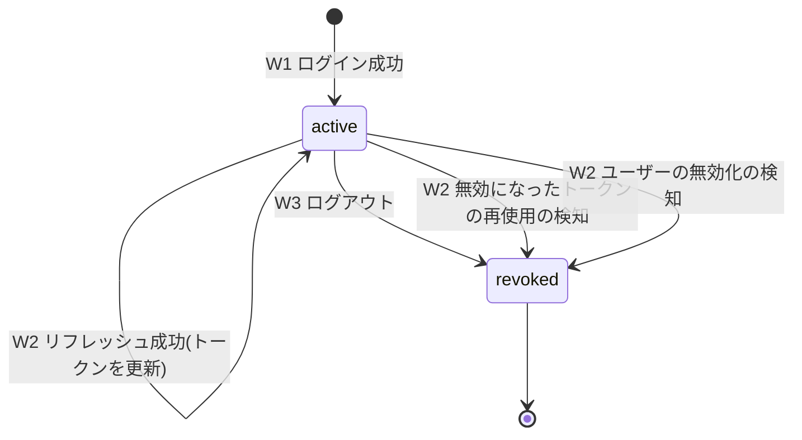
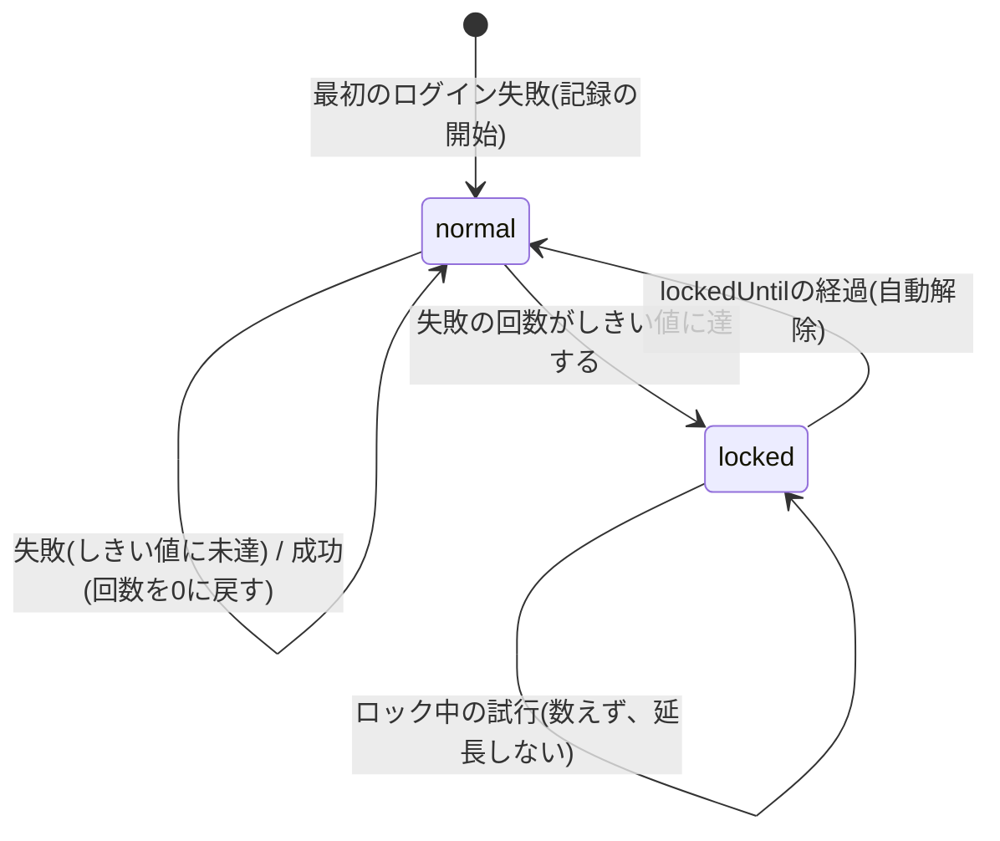
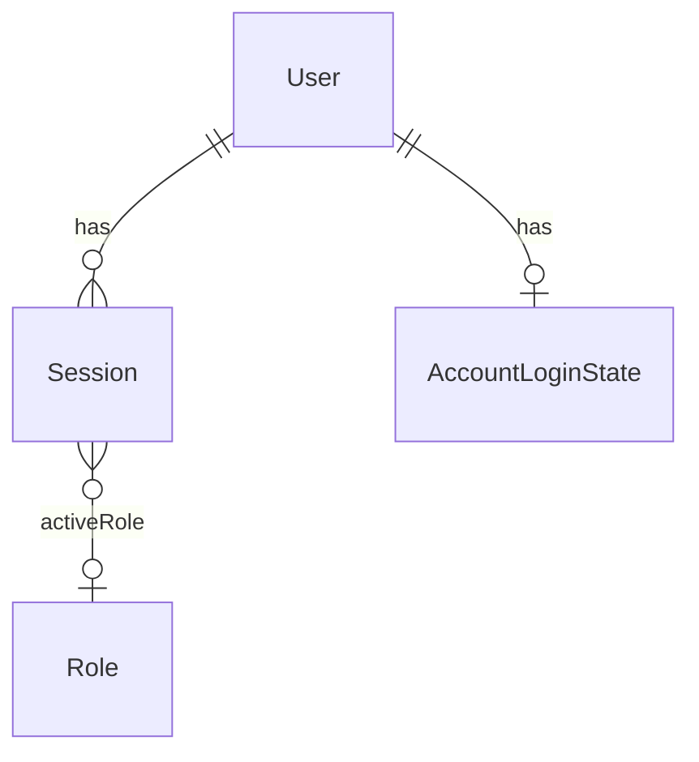

<!--
Copyright 2026 agwlvssainokuni

Licensed under the Apache License, Version 2.0 (the "License");
you may not use this file except in compliance with the License.
You may obtain a copy of the License at

    http://www.apache.org/licenses/LICENSE-2.0

Unless required by applicable law or agreed to in writing, software
distributed under the License is distributed on an "AS IS" BASIS,
WITHOUT WARRANTIES OR CONDITIONS OF ANY KIND, either express or implied.
See the License for the specific language governing permissions and
limitations under the License.
-->

# Functional Specification — authentication-service (U5)

## Sources

- `inception/units-generation/unit-of-work.md`(U5定義)
- `inception/units-generation/unit-of-work-story-map.md`(U5に割り当てられたFR一覧)
- `inception/domain-design/components.md`(AuthenticationServiceコンポーネント定義)
- `inception/contract-design/contract-summary.md`(C4: 認証REST API、C11: UserAccountLookupApi、C14: SessionContextApi)
- `inception/requirements-analysis/requirements.md`(FR2.3, FR2.7, FR3.1〜FR3.4, FR4.2)
- `inception/refined-mockups/mockups.md`(ログイン画面・初期パスワード設定画面・ユーザー管理画面)
- `construction/user-management/functional-design/functional-spec.md`・`rules.md`・`nfr-design/security-design.md`(U4の実装で持ち越された論点)
- `functional-design-questions.md`(Q1〜Q10の確定回答)

## 認証の前提と、このユニットの位置づけ

認証は、次の4つのAPI(C4)と、認証を必要とするすべてのAPIに掛かる認証フィルタで構成する。

- ログイン(`POST /api/auth/login`)、リフレッシュ(`POST /api/auth/refresh`)、ログアウト(`POST /api/auth/logout`)、アクティブロールの選択(`PUT /api/auth/active-role`)。
- 認証フィルタは、`/api/**`のすべてに適用し、認証を必要としないのは、ログイン・リフレッシュ・招待受諾(`/api/users/invitations/{token}/accept`、user-managementが提供)の3つだけである(BR5.11)。

本ユニットは、ユーザー情報(パスワードのハッシュ検証・statusの確認・選択可能なロール)を、user-managementのC11(`UserAccountLookupApi`)から得る。ロールの実在や権限の判定は、permission-engineが行い、本ユニットは、選択されたアクティブロールのID(不透明な識別子)を、認証フィルタとC14を通して、各ユニットに渡すだけである。

## ワークフロー

### W1: ログイン(FR2.7, FR3.1, FR3.2, FR4.2、BR5.1, BR5.2, BR5.3, BR5.5, BR5.8, BR5.9, BR5.15)

1. 利用者が`POST /api/auth/login`を呼び出す(email・password)。認証は不要。
2. emailをtrimし、小文字へ正規化する。
3. C11の`findByEmail`(トランザクションの外)でUserを検索する。
   - 存在しない、または、statusがactive以外(invited・disabled)の場合は、失敗回数を記録せず、手順7(ダミーのハッシュを検証してから、失敗の応答)へ進む。
4. activeなUserの`AccountLoginState`を参照し、ロック中(現在時刻が`lockedUntil`より前)なら、失敗回数を数えず、ロック期間も延長せず、手順7へ進む。ロックが解除済み(`lockedUntil`が経過)なら、`consecutiveFailures`を0として扱う。
5. C11の`verifyPasswordHash(userId, password)`(トランザクションの外)で、パスワードを検証する。`HashCapacityExceededException`が投げられた場合は、失敗回数を数えず、503を返して終了する(BR5.15)。
6. 検証が成功した場合:
   - `AccountLoginState`の`consecutiveFailures`を0に戻し、`lockedUntil`を消す(BR5.3)。
   - 選択可能なロール(C11の`UserAccount.roleIds`)から、アクティブロールを決める。ロールがちょうど1つなら、そのロール。それ以外は、未選択(null)(BR5.9)。
   - 新しい`Session`を作り、リフレッシュトークン(ランダム)のハッシュと有効期限を保存する。アクセストークン(JWT)を発行する(BR5.5)。
   - 200を返す(アクセストークン・リフレッシュトークン・選択可能なロール)。
7. 検証が失敗した場合(パスワードの誤りを含む):
   - activeなUserの、ロック中でない試行なら、`consecutiveFailures`を原子的に1増やし、しきい値に達したら`lockedUntil`を設定する(BR5.3)。
   - 手順3〜4で検証を行わなかった場合は、ダミーのハッシュを検証して、応答時間を近づける(BR5.2)。
   - 原因を区別しない、同一の401を返す(BR5.2)。

### W2: リフレッシュ(FR2.3, FR3.1、BR5.6, BR5.7, BR5.10)

1. 利用者(フロントエンド)が`POST /api/auth/refresh`を呼び出す(refreshToken)。認証は不要(リフレッシュトークンが根拠)。
2. 提出されたリフレッシュトークンのハッシュで、`Session`を検索する。
   - `refreshTokenHash`と一致し、statusがactiveで、`refreshExpiresAt`が未経過なら、手順3へ。
   - `previousRefreshTokenHash`と一致する(無効になったトークンの再使用)なら、Sessionをrevokedにして401を返す(BR5.6)。
   - それ以外(未知・期限切れ・失効済み)は、同一の401を返す。
3. C11の`isDisabled(userId)`(トランザクションの外)で、ユーザーの無効化を確認する。無効化されている(disabledまたは不存在)なら、Sessionをrevokedにして401を返す(BR5.7)。
4. C11から、選択可能なロールを取得し、Sessionのアクティブロールが、なお含まれることを確認する。含まれなくなっていたら、アクティブロールをnullに戻す(残りのロールがちょうど1つなら、そのロールを自動選択する)(BR5.10)。
5. 条件付きの更新で、`previousRefreshTokenHash`に現在の`refreshTokenHash`を移し、新しい`refreshTokenHash`・`lastRefreshedAt`・`refreshExpiresAt`を設定する(同一のリフレッシュトークンの同時の更新では、1件だけが成功する)。更新の件数が0件なら401を返す。
6. 新しいアクセストークンと、新しいリフレッシュトークンを、200で返す(契約の追補: レスポンスに`refreshToken`を追加する)。

### W3: ログアウト(FR3.2、BR5.8)

1. 認証済みの利用者が`POST /api/auth/logout`を呼び出す。認証フィルタ(BR5.11)を通る。
2. リクエストのアクセストークンの`sid`に対応するSessionを、revokedにする(すでにrevokedなら、何もしない)。同一ユーザーの他のSession(他の端末)には影響しない。
3. 204を返す。以降、そのSessionのアクセストークンは、Sessionがrevokedのため、有効期限の前でも401になる。

### W4: アクティブロールの選択(FR4.2、BR5.9)

1. 認証済みの利用者が`PUT /api/auth/active-role`を呼び出す(roleId)。
2. C11から、選択可能なロール(直接付与分とGroup経由分の和集合)を取得する。
3. 指定されたroleIdが含まれない場合は、403を返す(Sessionは変更しない)。
4. 含まれる場合は、Sessionのアクティブロールを更新し、キャッシュを無効化して、200を返す。以降のリクエストは、新しいアクティブロールで処理される(別のSession(端末)には影響しない)。

### W5: リクエストの認証(認証フィルタ、FR3.1, FR3.3、BR5.11, BR5.12)

1. 認証を必要とするAPIへのリクエストに対し、認証フィルタが、`Authorization: Bearer`のアクセストークンを取り出す。
2. 署名と有効期限を検証する。不正または期限切れなら、401を返す。
3. `sid`のSessionを検索する(インメモリのキャッシュ経由)。存在しない、または、revokedなら、401を返す。
4. `Operator`(userId = `sub`、sessionId = `sid`、アクティブロール = Sessionの値(nullを含む))を決め、リクエストの処理へ渡す。
5. 各ユニットは、`Operator`を読み、コントローラ・サービスの入口で、`canAccessScreen`などによる認可の再検証を行う(従来どおり)。アクティブロールがnullの場合は、認証エラーではなく、権限なし(403)として判定する(BR5.12)。

### W6: C14 `getActiveRoleId`の提供(FR4.2、BR5.13)

1. list-engine・record-edit-engineが、`getActiveRoleId(sessionId)`を呼ぶ。
2. Sessionが存在しなければ`SessionNotFoundException`、revokedまたは期限切れなら`SessionExpiredException`を投げる。
3. それ以外は、Sessionのアクティブロール(未選択ならnull)を返す。

### W7: 他ユニットの暫定の操作者取得の置き換え(BR5.12)

認証フィルタの導入と同時に、次の暫定の実装を削除し、`Operator`を読む実装に置き換える。コントローラ・サービスの入口は変えない。

- schema-introspector(U2): `ActiveRoleResolver`・`HeaderActiveRoleResolver`(menu-navigation(U6)・audit-logging(U7)も、これらを共有して利用している)。
- user-management(U4): `CurrentOperatorProvider`・`HeaderCurrentOperatorProvider`。

ヘッダー(`X-Active-Role-Id`・`X-User-Id`)を信頼する経路は、どのプロファイルにも残さない(Q9=A)。

## 状態遷移

### Session.status

テキストフォールバック: Sessionは、ログイン成功(W1)でactiveになる。リフレッシュ(W2)に成功してもactiveのままで、トークンだけが更新される。ログアウト(W3)、無効になったトークンの再使用の検知(W2)、リフレッシュ時のユーザーの無効化の検知(W2)のいずれかで、revokedになり、activeには戻らない。リフレッシュの有効期限の経過は、statusを変えず、時刻の比較で判定する。

### AccountLoginState(ロックの状態)

テキストフォールバック: ロックの状態は、通常(normal)とロック中(locked)の2つである。通常のとき、失敗が重なって回数がしきい値(既定5回)に達すると、ロック中になり、解除予定日時(既定15分後)が決まる。ロック中の試行は、数えず、ロックの期間も延長しない。解除予定日時が経過すると、自動的に通常に戻り、その後の最初の試行は、失敗回数を0として扱う。ログインに成功すると、回数は0に戻る。

## エンティティ関連図(entities.mdより導出)

テキストフォールバック: Userは、0個以上のSessionを持つ(端末ごとのログイン)。Userは、0個または1個のAccountLoginState(連続失敗の回数とロックの状態)を持つ。Sessionは、選択済みの場合に限り、0個または1個のRole(アクティブロール)を参照する。UserはU4が、RoleはU3が所有し、本ユニットは、不透明な識別子として参照する。

## ルール概要(rules.mdより導出)

| ID | 概要 |
|---|---|
| BR5.1 | ログイン(C11で認証、成功条件、トークンとSessionの発行) |
| BR5.2 | 失敗の応答の統一と、応答時間の均一化 |
| BR5.3 | アカウントロック(5回・15分・自動解除) |
| BR5.4 | ロックの閾値・時間・トークンの有効期限は`application.yml`、FR2.7の文言の修正 |
| BR5.5 | トークンの発行(JWT・不透明なリフレッシュトークン・鍵) |
| BR5.6 | リフレッシュのローテーションと再使用の検知 |
| BR5.7 | リフレッシュ時のisDisabledの確認 |
| BR5.8 | ログインごとのSession、ログアウトは該当のSessionだけ |
| BR5.9 | アクティブロール(単一は自動選択、複数は選択、403) |
| BR5.10 | リフレッシュ時のアクティブロールの再確認 |
| BR5.11 | 認証フィルタ |
| BR5.12 | アクティブロール未選択は403、暫定の操作者取得の置き換え |
| BR5.13 | C14のgetActiveRoleId |
| BR5.14 | 認証情報・トークン・鍵の非出力 |
| BR5.15 | ハッシュ計算の上限超過は503、C11はトランザクションの外 |
| BR5.16 | 無効化されたユーザーの扱いの分担 |

## 契約・他ユニットへの追補(Code Generation着手時に反映する)

このステージで確定した内容のうち、確定済みの契約(C4・C11・C14)・要件・他ユニットの実装に影響するものを、次のとおり、追補として記録する。いずれも、Code Generationの計画承認までに、対象の設計(契約書・要件定義書・モックアップ)へ反映するか、ユーザーへ確認する。

| 番号 | 対象 | 内容 | 出典 |
|---|---|---|---|
| 1 | 要件定義書 FR2.7 | 文言を「`application.yml`で設定可能でなければならない(管理画面での編集UIは設けない)」に修正(追補として記録し、元の記述は残す) | Q1=A |
| 2 | C4 リフレッシュ | レスポンスに`refreshToken`を追加(ローテーション)。レスポンスコード(401の同一応答)の整理 | Q5=A |
| 3 | C4 ログイン | 503(ハッシュ計算の待機超過)のレスポンスの追加。`roles`は、直接付与分とGroup経由分の和集合 | Q8=A, BR5.15 |
| 4 | C11 | `revokeRefreshTokensOnDisable`を削除する(引き込み型のため不要)。`findByUserId(userId)`の追加(下記の[assumption]) | Q6=A |
| 5 | C14 | `getActiveRoleId`が、未選択の場合にnullを返すこと | Q7=A |
| 6 | リファインドモックアップ | ユーザー管理画面の「ロック中」の表示・「有効化」の操作の記述は、MVPでは実装しない。frontend-uiの実装時に、実装に合わせて更新する | Q10=A |
| 7 | frontend-ui(U12)への要求 | 招待受諾の成功後、フロントエンドが、設定したemail・passwordで`POST /api/auth/login`を続けて呼ぶ(モックアップの「自動的にログイン済みの状態で遷移」を実現する)。ロールが0個・複数個・単一のユーザーの、それぞれの画面の扱い | Q3=A, BR5.9 |
| 8 | 他ユニット(U2・U4・U6・U7) | 暫定の操作者取得(ヘッダー方式)を削除し、`Operator`を読む実装に置き換える(本ユニットのCode Generationの範囲に含める) | Q9=A, BR5.12 |

## Assumptions & Open Questions

確定済みの質問回答(Q1〜Q10)に含まれず、本設計で置いた判断は、次のとおり`[assumption]`として残す。人間が確認するまで確定事項として扱わない。

- [assumption] 選択可能なロールの再取得のための`findByUserId`: アクセストークンは`sub`(userId)しか運ばないため、`PUT /api/auth/active-role`(W4)とリフレッシュ時(W2)に、userIdから最新のロールを得る手段が要る。C11は`findByEmail(email)`しか持たない。`UserAccountLookupApi`に`findByUserId(userId): Optional<UserAccount>`を追加する(加法的な追補で、user-managementが実装する)ことを案とする。代替案は、Sessionにemail(不変。user-managementはemailの更新を許さない)を保持して`findByEmail`を使う方法だが、個人情報をSessionに複製することになる。
- [assumption] `AccountLoginState`への具体化: Domain Designの`LoginAttempt`(試行ごとの履歴)を、ユーザーごとに1件のカウンタ(連続失敗の回数・ロックの解除予定日時)に具体化した。試行ごとの履歴を永続化・参照する要件(監査・画面表示)が無く、同時実行でも回数を正しく数えるには、カウンタのほうが単純なためである。履歴が必要になった場合は、追補で`LoginAttempt`を追加する。
- [assumption] ログイン・ログアウト・ロックを、監査ログ(AuditLogging)のイベントとして発行しない。これらを監査対象とする要件がなく、ロックの発生の検知は、メトリクス(NFR Design)で行う想定である。
- [assumption] ログアウト後のアクセストークンの扱い: FR2.3の「既発行のアクセストークンは有効期限まで有効」は、ユーザーの無効化に関する記述である。ログアウトでは、Sessionがrevokedになるため、認証フィルタ(BR5.11)が、有効期限の前でも401を返す。これは、FR2.3と矛盾しないと解釈した(ログアウトは、利用者自身の意図的な操作のため)。
- [assumption] アクティブロールのキャッシュ: 認証フィルタが、リクエストごとにSessionを引くため、インメモリのキャッシュ(ロールの選択・更新・失効で無効化)を置く。キャッシュの有効期間・容量・複数プロセス構成での扱いは、NFR Design(3.3)で確定する。
- [assumption] JWTの署名アルゴリズムと鍵の管理(単一プロセスのため共通鍵方式を想定)、Sessionの有効期限切れの行の削除(定期的な削除)、リフレッシュトークンの生成方式(長さ・乱数)、`/api/auth/login`等に対するレート制限の要否は、NFR Requirements・NFR Designで確定する。
- [open question] リフレッシュのレスポンスに、ロールの一覧と現在のアクティブロールを含めるか、または、ページの再読み込みのあとに、フロントエンドが選択可能なロールと現在のアクティブロールを知るためのAPI(例: `GET /api/auth/session`)を追加するか。C4は、リフレッシュがアクセストークンだけを返す契約であり、再読み込みのあとのロール選択画面・ヘッダーの表示のために、追補が必要になる可能性がある。frontend-ui(U12)の機能設計で確認し、C4の追補として反映する。
- [open question] 初期管理者(ロールが空)が、RBAC設定の最初のインポートのあと、ロールを得るまでの手順: 初期管理者は、`initial-admin.role-ids`が空のままだと、ロールを持たないため、RBAC設定のインポート後に、user-managementの画面でロールを付与してもらう必要がある(自分自身のroleIdsの変更は禁止されているため、別の権限管理者が必要)。運用の手順として、初期管理者の`initial-admin.role-ids`に、インポートするRBAC設定の管理者ロールのIDをあらかじめ指定しておく方法が現実的である。運用の手順の記述は、Build and Test・packagingの範囲で確認する。
- [open question] 複数プロセス構成でのSessionとアクティブロールのキャッシュの整合(あるプロセスでロールを切り替えても、別のプロセスのキャッシュが古いままになる): 内部設定DBが組込みDBであることによる複数プロセス構成の制約は、他ユニットと共通の事項として、全体設計(Infrastructure Design・運用設計)に委ねる。
