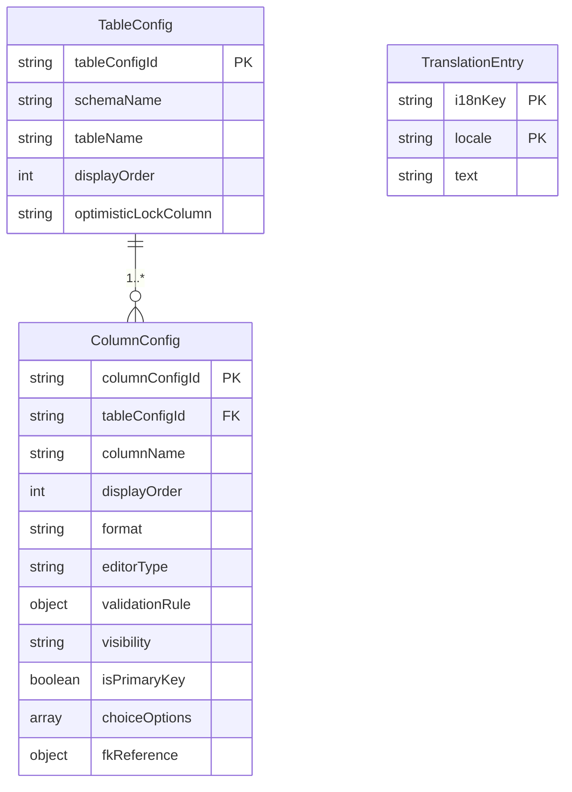

<!--
Copyright 2026 agwlvssainokuni

Licensed under the Apache License, Version 2.0 (the "License");
you may not use this file except in compliance with the License.
You may obtain a copy of the License at

    http://www.apache.org/licenses/LICENSE-2.0

Unless required by applicable law or agreed to in writing, software
distributed under the License is distributed on an "AS IS" BASIS,
WITHOUT WARRANTIES OR CONDITIONS OF ANY KIND, either express or implied.
See the License for the specific language governing permissions and
limitations under the License.
-->

# Functional Specification — config-engine (U1)

本書は、config-engineユニットの振る舞い仕様（ワークフロー・状態遷移）の一次情報源である。エンティティのデータ形状は`entities.md`、業務ルールは`rules.md`を一次情報源とし、本書はそれらから派生したER図・ルールサマリーを補助的に含む。

## ワークフロー

### W1: アプリ起動時の設定読込・fail-fast検証（FR1.2, FR1.3）

1. アプリ起動時、ConfigEngineは内部設定DBから全TableConfig/ColumnConfigを読み込む。
2. 各TableConfigについて、BR1.2（必須プロパティ: schemaName, tableName）を検証する。
3. 各ColumnConfigについて、BR1.3（必須プロパティ: tableConfigId, columnName, editorType）を検証する。
4. editorTypeがselect/radioのColumnConfigについて、BR1.4（choiceOptions/fkReferenceのいずれか一方）を検証する。
5. IF いずれかの検証に違反 THEN ConfigValidationExceptionを送出し、アプリケーション起動を中断する（BR1.1）。
6. ELSE 読み込んだ設定を内部モデルとして保持し、起動を継続する。

### W2: schema-introspectorからの初期ドラフト取り込み（FR1.4、C9: writeTableConfigDraft）

1. schema-introspector（U2）が対象RDBMSのメタデータ（テーブル/カラム/型/NULL可否/主キー/外部キー等）を読み取り、TableConfigDraftを生成する。
2. schema-introspectorはConfigEngineの`writeTableConfigDraft`を呼び出す。
3. 対象テーブルごとに、ConfigEngineは(schemaName, tableName)の組で既存TableConfigの有無を確認する。
4. IF 既存TableConfigが存在する THEN 当該テーブルの取り込みをスキップする（BR1.8。エラーとしない）。
5. ELSE メタデータの型名をConfigEngine内部の論理型へ正規化し（Q2確定）、新規TableConfig・ColumnConfigを作成する。editorTypeの初期値は正規化された論理型から推定する。schema-introspectorが判定した主キー制約の有無を、各ColumnConfig.isPrimaryKeyへそのまま設定する（BR1.14、Contract Design追補C9）。
6. 生成した各TableConfigのtableConfigIdの一覧を呼び出し元へ返す。

### W3: 表示設定・バリデーション設定の取得（C9: getTableConfig, getColumnConfigs, getOptimisticLockColumn）

1. list-engine/record-edit-engine/data-import-export等の消費者ユニットが、対象の(schemaName, tableName)を指定してgetTableConfigを呼び出す。
2. ConfigEngineは該当TableConfigを返す。IF 該当なし THEN TableConfigNotFoundExceptionを送出する。
3. 消費者ユニットは続けてgetColumnConfigsを呼び出し、対象テーブルの全ColumnConfigを取得する。
4. 消費者ユニットはeditorType・validationRule・visibility・choiceOptions/fkReferenceを用いて画面（一覧・詳細編集）を構築する。
5. record-edit-engineは保存処理の前に、getOptimisticLockColumnを呼び出し、楽観ロック対象列の有無を取得する（BR1.7）。

### W4: FK参照選択肢の名称解決（FR1.5）

1. record-edit-engine/list-engineは、ColumnConfig.fkReferenceが設定されたカラムを描画・保存する際、ConfigEngineからfkReferenceの参照先情報（referencedSchemaName/referencedTableName/referencedValueColumnName/referencedLabelColumnName）を取得する。
2. record-edit-engine/list-engineは、この参照先情報を用いて業務データ用RDBMSへ直接問い合わせ、選択肢の値と表示名を実行時に動的取得する（ConfigEngine自身は業務データRDBMSへアクセスしない）。
3. choiceOptionsが設定されたカラム（FK参照でない静的選択肢）の場合は、ConfigEngineが保持するchoiceOptions（value + i18nKey）をそのまま用い、動的取得は行わない。

### W5: 設定一式のエクスポート・インポート（FR11.1、C9: getExportableConfigSet, importConfigSet／C7契約）

1. config-import-export（U9）が、設定管理画面からのエクスポート要求を受け、ConfigEngineのgetExportableConfigSetを呼び出す。
2. ConfigEngineは全TableConfig/ColumnConfig（i18nキーを含み、表示名テキストそのものは含まない）をConfigExportSetとして返す。
3. インポート時、config-import-exportはConfigEngineのimportConfigSetを呼び出す。
4. ConfigEngineはBR1.1〜BR1.4の検証を実施する。IF 検証エラー THEN ConfigValidationException（フィールド単位のエラー情報を含む、BR1.11）を送出し、内部設定DBへの反映を行わない。
5. ELSE インポートされた設定一式を内部設定DBへ反映する。

### W6: 業務設定層i18nテキストの管理画面からの登録・編集（Q4 Follow-up確定）

1. 管理者は設定管理画面（frontend-ui）から、TableConfig/ColumnConfigの表示名・バリデーションメッセージ・静的選択肢のi18nキー（BR1.5, BR1.6により導出済み）に対応する言語別テキストを一覧・編集する。
2. 管理者がテキストを登録・更新すると、フロントエンドはConfigEngineへ当該i18nKey・locale・textを送信する。
3. ConfigEngineは対応するTranslationEntryを作成または更新する（(i18nKey, locale)の組で一意）。
4. 以降、当該i18nKeyの表示名・メッセージ解決時には、登録されたTranslationEntryのテキストが用いられる。未登録の場合はフロントエンド側で未翻訳表示にフォールバックする（本ユニットの責務範囲外）。

> **既知の未解決事項（Assumptions & Open Questions参照）**: W6を実現する具体的なREST APIエンドポイントは、Contract Design（`contract-summary.md`）の既存契約（C7: config-import-export、C9: 内部インタフェース）には未定義である。個別のTableConfig/ColumnConfigフィールド編集（displayOrder・format・editorType・validationRule等の変更）についても同様に、既存契約は設定一式のJSON export/import（C7）のみをカバーしており、フィールド単位の編集操作は未定義である。これらは本ユニットの機能仕様としては操作一覧（W3〜W6）を提示するにとどめ、具体的なエンドポイント定義はCode Generation着手前にContract Designへの追補として解決することを推奨する。

## エンティティ関連図（`entities.md`からの派生ビュー）

<!-- Text fallback: TableConfigは1個以上のColumnConfigを持つ（1..*）。TranslationEntryはTableConfig/ColumnConfigのi18nキー（schemaName/tableName/columnNameから導出）に対して間接的に対応するが、外部キー関係は持たない（i18nKeyという文字列を介した疎な対応）。 -->

## 業務ルールサマリー（`rules.md`からの派生ビュー）

`rules.md`の全14ルール（BR1.1〜BR1.14）のうち、主要なものを要約する。詳細・完全な一覧は`rules.md`を参照。

- **fail-fast検証**（BR1.1〜BR1.4）: TableConfig/ColumnConfigの必須プロパティ欠落、およびselect/radioの選択肢設定の不整合を、起動時・インポート時にfail-fastで検知する。
- **i18nキー導出**（BR1.5, BR1.6）: 表示名・バリデーションメッセージのi18nキーは、schemaName/tableName/columnNameから機械的に導出し、テキストそのものは保持しない。
- **楽観ロック**（BR1.7）: 対象列は明示設定のみを用い、RDBMS方言による自動検出は行わない。
- **ドラフト取り込みの非上書き**（BR1.8）: schema-introspectorからの初期ドラフトは、既存設定がある場合はスキップする。
- **業務設定層i18nのデータ管理**（BR1.10）: TranslationEntryにより、業務設定層のi18nキーの言語別テキストを管理画面から編集可能にする。基盤層固定UI文言は対象外。
- **複数RDBMS方言の吸収**（BR1.12）: schema-introspectorが読み取ったDBメタデータの型名をConfigEngine内部論理型へ正規化し、物理層SQL生成方言をlist-engine/record-edit-engineへ提供する。
- **監査ログ連携**（BR1.13）: ドラフト取り込み（W2）・設定一式インポート（W5）・i18nテキスト登録更新（W6）で変更されたエンティティごとに、AuditLogging（U7）へConfigChangedEventを発行する（下記「監査ログ連携」参照）。
- **主キー列情報の設定**（BR1.14）: ColumnConfig.isPrimaryKeyは、schema-introspectorからのドラフト取り込み（W2）時にのみ設定され、手動編集・importConfigSet経由では変更されない。data-import-export（U8）のCSVインポートupsert判定に用いられる（Contract Design追補C9、レビュー指摘R-05対応）。

## 監査ログ連携（AuditLoggingへのイベント発行、BR1.13）

`components.md`のコンポーネントカタログは`ConfigEngine -.->|設定変更イベント| AuditLogging`という疎結合なイベント発行依存を定義しており、AuditLogging側の`AuditLogEntry`エンティティ（`actorUserId, targetType, targetId, operationType, occurredAt, beforeValue, afterValue`）はエンティティ単位の記録を前提としている。本ユニットはこれを次のとおり実現する。

1. W2（ドラフト取り込み）・W5（設定一式インポート）・W6（i18nテキスト登録・更新）で1件のTableConfig/ColumnConfig/TranslationEntryが作成・更新されるたびに、ConfigEngineは`ConfigChangedEvent(operation, targetType, targetId, beforeValue, afterValue, actor, occurredAt)`を1件生成する。1回のAPI呼び出しで複数エンティティが変更される場合（W2・W5で複数テーブルを扱う場合等）は、呼び出し単位でまとめず、変更されたエンティティごとに個別に発行する。
   - `operation`: 新規作成なら`CREATED`、既存エンティティの更新なら`UPDATED`。
   - `targetType`/`targetId`: 変更されたエンティティの種別とID（例: TableConfigなら`tableConfigId`、TranslationEntryなら`{i18nKey}:{locale}`）。
   - `beforeValue`/`afterValue`: 変更前後のエンティティ状態のスナップショット。`CREATED`の場合`beforeValue`はnull。
   - `actor`: 操作者。W2（schema-introspectorからの取り込み）はシステム操作として`"system"`を用いる。W5・W6は本来利用者操作であり、認証済みユーザーのIDをactorとして伝搬すべきだが、下記のとおり現状は未解決である。
   - `occurredAt`: 発生日時。
2. 生成したイベントは、AuditLogging（U7）がSpringの`ApplicationListener`/`@EventListener`等で購読する前提の疎結合発行（fire-and-forget）とする。ConfigEngine自身はAuditLoggingの購読処理完了を待たない。

## Assumptions & Open Questions

- **[open question]** W5・W6（config-import-exportからのインポート、管理画面からのi18n登録・更新）は本来利用者操作であり、ConfigChangedEventのactorには操作を行った利用者のIDを記録すべきだが、既存契約（C9: writeTableConfigDraft, importConfigSet）は呼び出し元の認証コンテキスト（操作者ID）を引数として受け取らない。そのため現状の実装はW5・W6についてもactor="system"を用いており、`project.md` Mandated（監査ログは操作者を記録しなければならない）を完全には満たしていない。利用者操作のactor伝搬は、Contract Design追補（認証コンテキストの受け渡し契約）で解決する必要がある。
- **[assumption]** W6（i18n管理）およびTableConfig/ColumnConfigのフィールド単位編集を実現するREST APIエンドポイントは、既存のContract Design（`contract-summary.md`）に未定義である。Code Generation（3.5）着手前に、Contract Designへの追補としてエンドポイント定義を解決する必要がある。
- **[assumption]** FK参照選択肢の名称解決（W4）は、ConfigEngine自身ではなくlist-engine/record-edit-engineが業務データRDBMSへ直接アクセスして行う前提とした。ConfigEngineはfkReferenceの参照先メタデータ（静的設定）のみを提供する。
- 既知の未解決フォローアップ（`unit-of-work.md` U5引継ぎ事項、`contract-summary.md` Open Questions）: FR2.7（ログイン失敗ロックアウト）の要件定義書文言と`application.yml`方式の不一致は、config-engineユニットの機能設計対象外（authentication-service, U5）のため、本書では扱わない。
