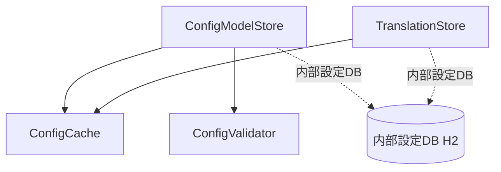

<!--
Copyright 2026 agwlvssainokuni

Licensed under the Apache License, Version 2.0 (the "License");
you may not use this file except in compliance with the License.
You may obtain a copy of the License at

    http://www.apache.org/licenses/LICENSE-2.0

Unless required by applicable law or agreed to in writing, software
distributed under the License is distributed on an "AS IS" BASIS,
WITHOUT WARRANTIES OR CONDITIONS OF ANY KIND, either express or implied.
See the License for the specific language governing permissions and
limitations under the License.
-->

# Logical Components — config-engine (U1)

`nfr-design-questions.md` Q2（責務ごとの論理分割、選択肢A）に基づく、config-engineユニット内部の論理コンポーネント一覧。本プロジェクトのscopeでは`infrastructure-design`ステージがSKIP対象（単一実行可能WAR・単一インスタンス構成が既に確定しているため）であり、本書はCode Generationにおけるパッケージ・クラス構成の指針として位置づける。

## 論理コンポーネント一覧

```yaml
logical_components:
  - name: ConfigModelStore
    responsibility: >
      TableConfig/ColumnConfig/TranslationEntryへのアクセス窓口。ConfigEngineApi（C9契約）の実装本体。
      getTableConfig/getColumnConfigs/getOptimisticLockColumn等の読み取り系メソッドはConfigCacheへ委譲し、
      writeTableConfigDraft/importConfigSet等の書き込み系メソッドは内部設定DBへの永続化とConfigCacheの
      再構築をオーケストレーションする。
    depends_on: [ConfigCache, ConfigValidator]
    failure_domain: >
      書き込み系メソッドの失敗（fail-fast検証エラー、内部設定DB接続断）はこのコンポーネントの境界で
      検出され、呼び出し元へ例外として伝播する。読み取り系メソッドはConfigCacheの不変スナップショットに
      委譲するため、ConfigModelStore自体の障害は書き込みパスに限定される（blast radius: 書き込み操作のみ）。
    shared_resources: [内部設定DB（H2、組込み）]

  - name: ConfigCache
    responsibility: >
      TableConfig/ColumnConfig/TranslationEntryのアプリケーション内メモリキャッシュ。起動時に全件読み込み、
      書き込み操作後に全体スナップショットを原子的に差し替える（performance-design.md参照）。
    depends_on: []
    failure_domain: >
      単一インスタンスのメモリ内に閉じる。他コンポーネント・他ユニットとの共有ステートを持たないため、
      障害時の影響範囲は当該インスタンスのconfig-engineモジュールに限定される（blast radius: 最小）。
    shared_resources: []

  - name: ConfigValidator
    responsibility: >
      TableConfig/ColumnConfig（BR1.1〜BR1.4, BR1.12）のfail-fast検証。Jakarta Bean Validation
      アノテーション + カスタムConstraintValidatorで構成する（tech-stack-decisions.md参照）。
    depends_on: []
    failure_domain: >
      検証ロジック自体の不具合は、起動時（fail-fast）またはインポート時（importConfigSet）の
      すべての設定検証に影響しうる（blast radius: 設定投入経路全体）。ただし実行時の読み取りパスには
      影響しない。
    shared_resources: []

  - name: TranslationStore
    responsibility: >
      業務設定層のi18nキー・言語別テキスト（TranslationEntry）の管理。Q4 Follow-upで確定した
      「業務設定層のi18nはConfigEngine内部設定DBで管理」を実装する。ConfigCacheの一部として
      キャッシュされるが、登録・編集操作（W6）の窓口としてConfigModelStoreとは独立した責務を持つ。
    depends_on: [ConfigCache]
    failure_domain: >
      TranslationEntryの登録・編集失敗は、当該i18nキーの翻訳表示（フロントエンドの未翻訳フォールバック）
      にのみ影響し、TableConfig/ColumnConfig自体の読み取り・fail-fast検証には影響しない
      （blast radius: 表示テキストの解決のみ）。
    shared_resources: [内部設定DB（H2、組込み）]
```

## 依存関係図



<!-- Text fallback: ConfigModelStoreはConfigCache・ConfigValidatorに依存する。TranslationStoreはConfigCacheに依存し、ConfigModelStoreとは独立したコンポーネントとして設定管理画面からの翻訳テキスト登録・編集を扱う。ConfigModelStoreとTranslationStoreはいずれも内部設定DB（H2）へアクセスする。 -->

## デプロイモデルとの関係

`unit-of-work.md`のとおり、config-engineはembedded（単一実行可能WARに統合）でデプロイされる。上記4コンポーネントはすべて同一JVMプロセス内のSpringコンポーネント（パッケージ）として実装され、別プロセス・別コンテナへの分割は行わない。したがって「障害domain」の記述は、コンポーネント境界におけるエラー伝播範囲の設計指針であり、物理的なプロセス分離を意味しない。

## Infrastructure Designへの申し送り（本プロジェクトではSKIP対象）

本プロジェクトのスコープでは`infrastructure-design`ステージ（3.4）がSKIP対象のため、上記コンポーネントを物理インフラ（コンテナ・VM等）へマッピングする設計は行わない。単一実行可能WARとして、既存の技術スタック決定（`team.md`: Java 25 + Spring Boot + Gradle）どおりにパッケージングする。
