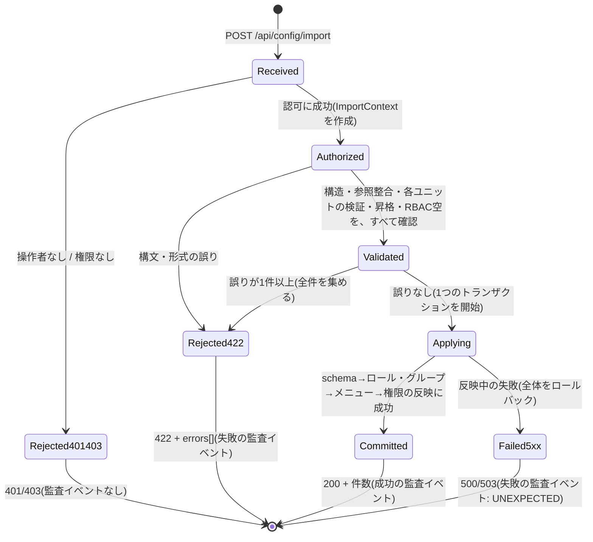
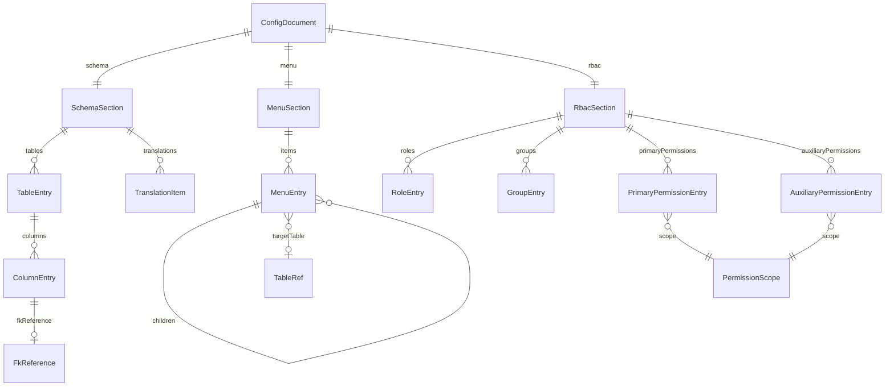

<!--
Copyright 2026 agwlvssainokuni

Licensed under the Apache License, Version 2.0 (the "License");
you may not use this file except in compliance with the License.
You may obtain a copy of the License at

    http://www.apache.org/licenses/LICENSE-2.0

Unless required by applicable law or agreed to in writing, software
distributed under the License is distributed on an "AS IS" BASIS,
WITHOUT WARRANTIES OR CONDITIONS OF ANY KIND, either express or implied.
See the License for the specific language governing permissions and
limitations under the License.
-->

# Functional Specification — config-import-export (U9)

## Sources

- `inception/units-generation/unit-of-work.md`(U9定義)
- `inception/units-generation/unit-of-work-story-map.md`(U9に割り当てられたFR: FR11.1・FR11.2)
- `inception/domain-design/components.md`(ConfigImportExportコンポーネント定義、依存: ConfigEngine・MenuNavigation・PermissionEngine(sync)、AuditLogging(event))
- `inception/contract-design/contract-summary.md`(C7: 設定のexport/import REST API、C9: config-engineの`getExportableConfigSet`・`importConfigSet`、C10: permission-engine、C12: menu-navigationの`getExportableMenuStructure`・`importMenuStructure`、C15: 共通基盤の操作者)
- `inception/requirements-analysis/requirements.md`(FR11.1・FR11.2・FR1.3・FR1.6・FR3.3・FR3.4・FR8.1〜FR8.3・NFR7・NFR8)
- 他ユニットの設計・実装(持ち越された論点の確認): `construction/config-engine/functional-design/functional-spec.md`(W5、actorの未解決事項)・`construction/permission-engine/functional-design/rules.md`(BR3.8・BR3.9・BR3.11・BR3.13・BR3.14)・`construction/authentication-service/functional-design/rules.md`(BR5.12)、および、実装済みのconfig-engine・menu-navigation・permission-engineの内部インタフェース
- `functional-design-questions.md`(Q1〜Q12の確定回答、追加確認Q13・Q14・Q14bの確定回答)

## 位置づけ

本ユニットは、**設定一式のJSONファイル**を、書き出し(エクスポート)・読み込み(インポート)する調整役である。設定の実体は、config-engine(スキーマ定義と翻訳)・menu-navigation(業務メニュー)・permission-engine(RBAC)が、内部設定DBに保持している(FR11.2)。本ユニットは、自身では、設定を保持せず(永続化するエンティティを持たない)、次の3つを担う。

- 3つのユニットから設定を集め、環境に依存しない形(自然キー)の1つのJSONにまとめる(エクスポート)。
- JSONを検証し、3つのユニットに、**1つの単位として**反映する(インポート。全置換)。
- 取り込みの実行者の記録と、監査イベントの発行。

認可は、管理系画面のscreenKey `config-import-export` で、サーバー側で必ず再検証する。業務データ(行データ)のCSVは、data-import-export(U8)の担当で、本ユニットの対象外である。

## ワークフロー

### W1: 設定一式のエクスポート(FR11.1、BR9.1〜BR9.5)

1. 管理者が、設定管理画面から、`GET /api/config/export`を呼ぶ。
2. 認証フィルタ(authentication-service)が、アクセストークンを検証し、`OperatorContext`に操作者を設定する。本ユニットは、`OperatorContext`から操作者を得る。操作者が解決できなければ、401を返す(BR9.4)。
3. `canAccessScreen(activeRoleId, "config-import-export")`で判定し、falseなら403を返す(BR9.4)。アクティブロールがnullでも、自前で拒否せず、そのままC10へ渡す。
4. 1つの一貫した読み取りの範囲で、次の順に、3つのユニットから内部の表現を取得する(BR9.5)。(a)config-engine: `getExportableConfigSet`(TableConfig・ColumnConfig・TranslationEntry)。(b)menu-navigation: `getExportableMenuStructure`(フラットなMenuItemの一覧)。(c)permission-engine: ロール・グループ・グループとロールの対応・主権限・補助権限(書き出しの内部契約、追補一覧)。
5. 内部IDを自然キーへ変換する(BR9.3)。テーブル=(schemaName, tableName)、カラム=(schemaName, tableName, columnName)、ロール・グループ=名前、権限の対象=scopeType+自然キー。メニューは、parentMenuItemIdをもとに、入れ子の木構造にし、遷移先のtableConfigIdを、`targetTable`(自然キー)に変換する。
6. ヘッダー(`formatVersion`=1・`exportedAt`・`appVersion`)を付け、3つのセクション(`schema`・`menu`・`rbac`)からなるJSONを、200で返す。`Content-Disposition`で、保存名(`mastersmith-config-<日時>.json`)を示す(BR9.2)。
7. エクスポートは、内部設定DBを変更せず、監査イベントを発行しない(BR9.16)。

### W2: 設定一式のインポート(FR11.1・FR1.3、BR9.4・BR9.6〜BR9.19・BR9.21)

1. 管理者が、設定管理画面で、JSONファイルを選ぶ。フロントエンドは、現在の設定(W1)を取得し、ファイルとの比較から、セクションごとの追加・更新・削除の件数を、確認モーダルに表示する(BR9.18)。管理者が承認すると、`POST /api/config/import`を呼ぶ(リクエスト本体は、ファイルの内容)。
2. **認可**(W1のステップ2〜3と同じ。BR9.4)。操作者が解決できなければ401、`canAccessScreen`がfalseなら403を返す。この時点で、`ImportContext`(操作者のuserId・activeRoleId・開始日時・`bootstrapAtStart`)を作る。`bootstrapAtStart`は、permission-engineが初期状態(主権限が0件)かを、この時点で判定して固定する(BR9.11)。認可の失敗は、取り込みとして数えず、監査イベントを発行しない(未認可の要求は、取り込みの実行ではないため)。
3. **構文・形式**: リクエスト本体が、JSONとして読めなければ、その誤りだけを422で返す(監査イベント: 失敗・MALFORMED)。`formatVersion`が欠落・未対応なら、その誤りだけを422で返す(監査イベント: 失敗・UNSUPPORTED_FORMAT。BR9.8)。
4. **構造**: 必須項目・型・許容値・一意性を検証し、誤りを集める(未知のプロパティは無視。BR9.8)。
5. **参照整合**: セクションをまたぐ参照(メニューの遷移先・権限の対象・権限とグループのロール・FK参照・楽観ロック列)が、ファイルの中で解決できるか検証し、誤りを集める(BR9.13)。
6. **各ユニットの検証**(何も反映しない): 自然キーを、現在の環境の内部IDへ解決したうえで(既存の項目は維持、新規は仮の識別で扱う。BR9.14)、config-engine(BR1.1〜BR1.4)・menu-navigation・permission-engineに、検証だけを依頼し、誤りを集める(BR9.10)。
7. **権限昇格の判定**: `bootstrapAtStart`がfalseなら、すべてのRBACエントリについて、操作者(operatorActiveRoleId)の**取り込み開始時点の**実効権限を基準に、昇格を判定し、上回るエントリをすべて集める(BR9.11)。
8. **RBACが空にならないこと**: ファイルの主権限が0件なら、誤りに加える(BR9.12)。
9. ステップ3(構文・形式以外)〜8で、誤りが**1件でも**あれば、何も反映せず、集めた誤りを、最大100件まで(超えたら打ち切りを示して)、422で返す(BR9.7)。失敗の監査イベントを1件発行する。分類は、権限昇格が含まれれば ESCALATION_DENIED、主権限が0件なら RBAC_EMPTY、それ以外は VALIDATION_ERROR。複数に該当する場合は、権限昇格 → RBAC_EMPTY → VALIDATION_ERROR の優先順位で、最初に該当するものを1つ選ぶ(誤りの総数は、`errorCount`に記録する)。
10. **反映**: すべての検証に合格した場合に限り、**1つのトランザクション**で、次の順に反映する(BR9.10)。(a)schema(テーブル・カラム・翻訳。全置換で、ファイルにないものは削除)。(b)ロール・グループ(全置換)。(c)メニュー(全置換)。(d)主権限・補助権限(操作者のactiveRoleIdを、actorRoleIdとして渡す。全置換)。いずれかで失敗したら、全体をロールバックし、失敗の監査イベント(UNEXPECTED)を発行して、503(内部設定DBの障害)または500を返す(BR9.21)。
11. トランザクションの確定後に、(a)permission-engineが、権限変更のサマリイベント(BR3.11)を発行し、(b)各ユニットが、個別の変更イベントを発行し(actorは`"system"`。BR9.15)、(c)本ユニットが、成功の監査イベント(セクションごとの件数つき)を1件発行する。イベントの発行の失敗は、取り込みの結果に影響させない(BR9.16)。
12. 200と、セクションごとの追加・更新・削除の件数(ImportResult)を返す(BR9.17)。

### W3: 初回のRBAC投入(ブートストラップ状態、BR9.11・BR9.12)

W2の特別な場合である。permission-engineに主権限が1件もない初期状態では、初期管理者(ロールを持たない場合を含む)が、`config-import-export`へ到達できる(C10の例外。permission-engineのBR3.13)。この場合のW2は、次のとおり動く。

1. ステップ2で、`bootstrapAtStart`=trueとなる。ステップ7の昇格の判定は、行わない(初回のRBAC投入を許すため)。
2. ステップ8は、そのまま適用する。初回のファイルの主権限も、1件以上でなければならない。
3. 反映後は、主権限が1件以上になり、初期状態の例外は終了する。以降の取り込みは、通常の判定(BR3.6・BR3.8・BR3.10)に従う。
4. 初期管理者が、取り込んだRBAC設定で、管理者のロールを得るには、初期管理者の`initial-admin.role-ids`に、そのロールのIDをあらかじめ指定しておくか、別の権限管理者が、ロールを付与する必要がある(authentication-serviceの機能設計の残余の事項。運用の手順として、Build and Test・packagingの範囲で確認する)。

## 状態遷移

### 取り込みの1回の実行(ImportAttempt)

本ユニットは、永続化するエンティティを持たないため、ここでは、1回の取り込み要求が通る、処理の段階を示す。

テキストフォールバック: 取り込み要求は、まず認可を受ける。操作者がいない(401)、権限がない(403)場合は、そこで終わり、監査イベントも発行しない。認可に成功すると、構文と形式(formatVersion)を確認し、誤りがあれば、その誤りだけを422で返す。続いて、構造・参照整合・各ユニットの検証・権限昇格・主権限が0件でないことを、すべて確認し、誤りを全件集める。誤りが1件でもあれば、何も反映せずに422を返す。誤りがなければ、1つのトランザクションで、schema→ロール・グループ→メニュー→権限の順に反映する。成功すれば、200と件数を返し、成功の監査イベントを発行する。反映中に失敗した場合は、全体をロールバックし、500または503を返す。422と反映中の失敗では、失敗の監査イベントを1件発行する。

## エンティティ関連図(entities.mdより導出)

テキストフォールバック: 設定ファイル(ConfigDocument)は、スキーマ・メニュー・RBACの3つのセクションを、それぞれ1つずつ持つ。スキーマは、0個以上のテーブルと翻訳を持ち、テーブルは0個以上のカラムを持つ。カラムは、FK参照を、0個または1個持つ。メニューは、0個以上のメニュー項目を持ち、メニュー項目は、入れ子で、子の項目を持ちうる。リーフのメニュー項目は、遷移先のテーブルを、自然キーで指す。RBACは、ロール・グループ(対応するロールの名前を持つ)・主権限・補助権限を持ち、主権限・補助権限は、それぞれ、権限の対象(スコープ)を、自然キーで指す。

## ルール概要(rules.mdより導出)

| ID | 概要 |
|---|---|
| BR9.1 | エクスポートの範囲(schema・menu・rbac。ユーザー・認証情報・監査ログ・業務データ・管理メニューは含めない) |
| BR9.2 | 設定ファイルの形式(UTF-8のJSON、formatVersion・exportedAt・appVersion) |
| BR9.3 | 参照はすべて自然キー(内部IDを含めない) |
| BR9.4 | 認可: 操作者の解決(401)と`canAccessScreen`(403) |
| BR9.5 | エクスポートは、1つの時点として整合する読み取り。監査イベントなし |
| BR9.6 | インポートの検証の順序と、反映前にすべて終えること |
| BR9.7 | 検証の誤りは全件(最大100件、位置+i18nキー) |
| BR9.8 | formatVersionの確認と、未知のプロパティの無視 |
| BR9.9 | 全置換(削除を含む)、自然キーでの照合、isPrimaryKeyの維持 |
| BR9.10 | 取り込み全体を1つの単位(全検証→全合格のみ1トランザクションで反映) |
| BR9.11 | 権限昇格の判定は、取り込み開始時点の設定を基準に。1件でも検出したら全体を中止 |
| BR9.12 | 主権限が0件になるファイルは拒否 |
| BR9.13 | 参照整合(ファイルの中で解決) |
| BR9.14 | 内部IDの維持・採番(メニューは再採番) |
| BR9.15 | 操作者の記録(OperatorContext→actorRoleId・サマリイベント) |
| BR9.16 | 取り込み1回につき1件の監査イベント(成功・失敗) |
| BR9.17 | 応答(200+件数、401・403・422・500/503) |
| BR9.18 | dryRunなし。確認は、フロントエンドが、現在のエクスポートと比較 |
| BR9.19 | 受け入れたリスク(排他・大きさの上限・自己の締め出しの防止) |
| BR9.20 | 業務固有情報のハードコード禁止 |
| BR9.21 | 入力の誤り(422)と内部の障害(500/503)の区別 |

## 契約・他ユニットへの追補(Code Generation着手時に反映する)

このステージで確定した内容のうち、確定済みの契約(C7・C9・C10・C12)・他ユニットの実装に影響するものを、次のとおり記録する。いずれも、本ユニットのCode Generationの計画承認までに、対象の設計(契約書)へ反映するか、ユーザーへ確認する。

| 番号 | 対象 | 内容 | 出典 |
|---|---|---|---|
| 1 | C7(契約書) | (a)エクスポートの応答の形式(`formatVersion`・`exportedAt`・`appVersion`・`schema`・`menu`・`rbac`)と、`Content-Disposition`。(b)インポートの、要求本体の形式、200の応答本体(セクションごとの追加・更新・削除の件数)、401の追加、422の`errors[]`(`field`は、JSON上の位置、`message`は、i18nキー、`params`)、最大100件での打ち切りの表示、500・503。(c)メッセージキーの一覧(`config.import.format.unsupported`・`config.import.reference.notFound`・`config.import.rbac.escalation`・`config.import.rbac.empty`・`config.import.json.malformed` ほか) | BR9.2・BR9.7・BR9.8・BR9.17 |
| 2 | C9(config-engine) | 取り込みの契約を、**検証と反映の2つに分ける**。(a)検証だけを行う(何も反映しない)メソッド。(b)反映するメソッド(全置換: 自然キーで照合し、ファイルにない項目を削除し、`isPrimaryKey`は維持する。呼び出し元のトランザクションに参加し、自身でコミットしない)。入力の型は、内部IDに依存せず、自然キーで表す。あわせて、実装済みの`importConfigSet`の既知の課題(既存のColumnConfigを上書きする経路が成立しない、`isPrimaryKey`の維持が未実装、`getExportableConfigSet`が、キャッシュ内の共有インスタンスを返す)を、この契約の実装で解消する(config-engineのCode Generationのレビュー指摘R-02・R-07)。`getExportableConfigSet`は、他から変更できないスナップショットを返す | BR9.5・BR9.9・BR9.10, config-engineのレビュー指摘 |
| 3 | C12(menu-navigation) | (a)`getExportableMenuStructure`は、現状のフラットな一覧のままでよい(入れ子への変換は、本ユニットが行う)。(b)`importMenuStructure`を、**検証と反映の2つに分ける**。反映は、全置換(現状の実装のとおり)で、呼び出し元のトランザクションに参加し、自身でコミットしない。遷移先のテーブルのIDの実在の検証は、反映の順序(schemaが先)により、反映の段階で満たされる。検証だけの段階では、構造の規則(階層・表示順)だけを検証する | BR9.10・BR9.13・BR9.14 |
| 4 | C10(permission-engine) | (a)RBAC設定の**書き出し**(ロール・グループ・グループとロールの対応・主権限・補助権限)。(b)ロール・グループ・グループとロールの対応の、**投入・削除**(全置換)。(c)主権限・補助権限の、検証だけのメソッド(昇格の判定を、取り込み開始時点の設定を基準に行う。`actorRoleId`と`bootstrapAtStart`を引数に取る)と、反映するメソッド(全置換。削除を含む。呼び出し元のトランザクションに参加する)。(d)ブートストラップ状態(主権限が0件)かを、外部から問い合わせるメソッド(`bootstrapAtStart`の固定のため)。(e)権限変更のサマリイベント(BR3.11)は、取り込みのトランザクションの確定後に発行する。**注意**: permission-engineのブートストラップ状態の判定は、実装では、主権限の行が0件かどうかであり、設計(BR3.13)の「永続的に終了」と一致しない。本ユニットは、BR9.12で、主権限が0件になる取り込みを拒否して回避する。permission-engine側の修正は、別途の課題として残す | BR9.10・BR9.11・BR9.12, permission-engineのBR3.9・BR3.13 |
| 5 | C15(共通基盤) | 本ユニットは、C15の`OperatorContext`の、読み取り側のコンシューマーである(consumersに含まれることを、契約書で確認する)。authentication-serviceのコンポーネントは呼ばない | BR9.15 |
| 6 | audit-logging(U7) | `ConfigImportExecutedEvent`の購読と、監査ログのエントリへの対応付けを追加する(既存のイベント(`ConfigChangedEvent`・`PermissionChangedEvent`・`UserChangedEvent`・`ImportExecutedEvent`)のリスナーと同じ流儀)。対象の種別は、設定の取り込みとし、操作者・日時・結果・件数・失敗の分類を記録する。ファイルの内容は、記録しない | BR9.16 |
| 7 | frontend-ui(U12)への要求 | (a)設定管理画面で、ファイルの選択・エクスポートのダウンロード・インポートの実行を提供する。(b)取り込み前に、`GET /api/config/export`で現在の設定を取得し、ファイルとの比較から、セクションごとの追加・更新・削除の件数を、確認モーダルに表示する(全置換で、意図せず削除される項目を、利用者が事前に確認できるようにするため。BR9.18)。(c)422の`errors[]`を、位置(`field`)と、i18nキーから選んだメッセージの一覧として表示する。100件で打ち切られた場合は、その旨を示す。(d)401・403・500・503を、認証の失敗・権限不足・障害として区別して表示する。(e)取り込みが成功したら、セクションごとの件数を表示する | BR9.7・BR9.17・BR9.18 |
| 8 | `unit-of-work-dependency.md` | 本ユニットの依存は、config-engine・menu-navigation・permission-engine(sync)、audit-logging(event)のままで、変わらない。C15への依存(読み取り)は、DAGの葉であるため、DAGは変わらない | BR9.15 |

## Assumptions & Open Questions

確定済みの質問回答(Q1〜Q12・Q13・Q14・Q14b)に含まれず、本設計で置いた判断は、次のとおり`[assumption]`として残す。人間が確認するまで確定事項として扱わない。

- [assumption] エクスポートの応答の`Content-Disposition`の保存名(`mastersmith-config-<書き出し日時>.json`)と、`exportedAt`・`appVersion`の項目は、C7に定義がなく、機能設計で置いた仮定である(BR9.2)。契約(C7)への追補(追補一覧の1番)で確認する。
- [assumption] インポートの200の応答本体に、セクションごとの件数を含めることは、C7に定義がなく、機能設計で置いた仮定である(BR9.17)。監査イベントの件数と同じ値を、利用者にも示すため。
- [assumption] メニューの、JSON上の表現(入れ子の木構造)と、メニュー項目のIDの再採番(BR9.14)は、機能設計で置いた仮定である。メニュー項目に自然キーがなく、現時点の実装では、他ユニットがmenuItemIdを参照していない(権限の判定は、遷移先のtableConfigIdで行われる)ことを前提とする。
- [assumption] エクスポートの「1つの時点として整合する読み取り」の実現方法(読み取り専用のトランザクションの分離レベル)は、NFR設計・Code Generationで確定する(BR9.5)。
- [assumption] 未認可の要求(401・403)は、取り込みの実行ではないため、監査イベントを発行しない(W2のステップ2)。権限のない者による取り込みの試行を、監査したい場合は、認証・認可の失敗の記録として、別の要件とする。
- [assumption] 失敗の分類が複数に該当する場合の優先順位(ESCALATION_DENIED → RBAC_EMPTY → VALIDATION_ERROR。W2のステップ9)は、機能設計で置いた仮定である。誤りの総数は、`errorCount`に記録する。
- [assumption] 全置換の対象の「翻訳」は、config-engineが保持するすべての翻訳(TranslationEntry)である。翻訳を、管理画面から個別に編集する機能(config-engineのW6)がある場合、取り込みは、それらを、ファイルの内容で置き換える。
- [open question] **全置換で削除されるロールを、ユーザーが保持している場合の扱い**: ファイルにないロールは、全置換で削除される。しかし、user-managementのユーザーの`roleIds`(直接付与分)と、グループ経由のロールは、その削除に追従しない。その結果、ユーザーの「選択可能なロール」の一覧に、実在しないロールが残りうる(選択しても、permission-engineは、実在しないロールを、権限なし(NONE)として判定する)。対応の案は、(a)取り込みで、削除されるロールを保持しているユーザーがいる場合は拒否する、(b)authentication-serviceのC11の`roleIds`を返す際に、実在するロールだけに絞る、(c)運用上の手順とする、のいずれか。Code Generationの計画承認までに、対象の設計へ反映するか、ユーザーへ確認する。
- [open question] permission-engineのブートストラップ状態の判定(主権限の行が0件)が、設計(BR3.13「永続的に終了」)と一致しない。本ユニットは、取り込みでは、BR9.12で回避するが、ほかの経路(内部設定DBの直接の操作など)で、主権限が0件になった場合は、初期状態の例外が再び有効になる。permission-engine側の修正(初回のRBAC投入の永続的な記録による判定)を、別途の課題として検討する(追補一覧の4番)。
- [open question] 内部設定DBは、組込みDBであり、複数プロセス構成での取り込みの一貫性は、他ユニットと共通の事項として、全体設計(Infrastructure Design・運用設計)に委ねる。

### 残余リスク

| 番号 | リスク | 内容 | 判断・引き継ぎ |
|---|---|---|---|
| 1 | 同時実行 | 取り込みの排他がないため、2人の管理者が同時に取り込むと、後から確定した方が勝ち、デッドロックなどで失敗しうる | 受け入れ(MVP、Q11=C)。BR9.19 |
| 2 | 大きさの上限なし | リクエスト本体の大きさを制限しないため、巨大なファイルが、メモリを圧迫しうる(認証済みで、`config-import-export`の権限を持つ操作者に限られる) | 受け入れ(MVP、Q11=C)。NFR設計で、リソースの見積もりと、必要なら上限の再検討を引き継ぐ |
| 3 | 自己の締め出し | 取り込みの結果、操作者が設定管理画面に到達できなくなりうる。回復は、内部設定DBの修復による | 受け入れ(MVP、Q12=C)。運用の手順として記録する |
| 4 | 確認の時点と取り込みの時点のずれ | 確認モーダルの件数は、フロントエンドが、確認の時点の設定から計算する。確認から取り込みまでの間に設定が変わると、実際の削除の件数と、異なりうる | 受け入れ(MVP)。BR9.18 |
| 5 | 個別イベントの`actor` | config-engine・menu-navigationが発行する個別の変更イベントの`actor`は、取り込みでも`"system"`のままになる(操作者は、本ユニットのサマリイベントに記録される) | 受け入れ(Q8=A)。BR9.15 |
| 6 | ロールの削除とユーザーの`roleIds` | 上記の[open question]のとおり | Code Generationの計画承認までに確認 |
| 7 | ブートストラップ状態の判定 | 上記の[open question]のとおり | 別途の課題 |
