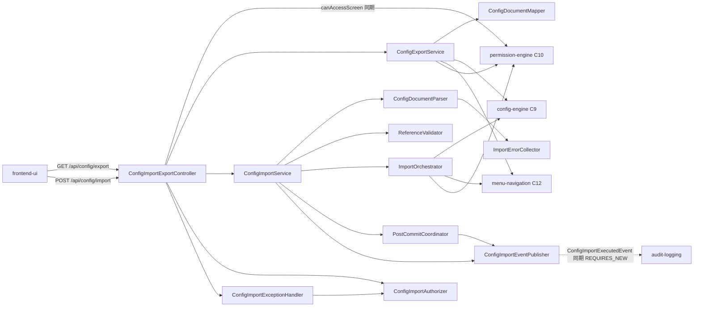

<!--
Copyright 2026 agwlvssainokuni

Licensed under the Apache License, Version 2.0 (the "License");
you may not use this file except in compliance with the License.
You may obtain a copy of the License at

    http://www.apache.org/licenses/LICENSE-2.0

Unless required by applicable law or agreed to in writing, software
distributed under the License is distributed on an "AS IS" BASIS,
WITHOUT WARRANTIES OR CONDITIONS OF ANY KIND, either express or implied.
See the License for the specific language governing permissions and
limitations under the License.
-->

# Logical Components — config-import-export (U9)

`nfr-design-questions.md`の確定回答(Q1〜Q3)と、`nfr-requirements/`・`functional-design/`に基づく、config-import-exportユニット内部のロジカルコンポーネントの構成。本ユニットは、単一の実行可能WAR内のSpring Bootコンポーネント群であり(Infrastructure Design・Operationフェーズは、本ワークフローのスコープでSKIP)、インフラストラクチャコンポーネントの記述は行わない。パッケージは、`com.mastersmith.configio`(既存の`dataio`・`config`・`permission`などと同じ階層)とする。

## コンポーネント一覧

| コンポーネント | 責務 | 対応するBR/NFR |
|---|---|---|
| `ConfigImportExportController`(C7) | `GET /api/config/export`・`POST /api/config/import`のエントリポイント。`OperatorContext`から操作者を得る(401)、`canAccessScreen`(403)。`@RequestBody JsonNode`(Jackson 3)を受け取る(Q3=B) | C7, BR9.4, NFR2.1, NFR2.2 |
| `ConfigExportService` | 読み取り専用・`REPEATABLE_READ`のトランザクションを開き、3ユニットのエクスポート用メソッドを呼び、`ConfigDocumentMapper`で自然キーへ変換する。エクスポートは、監査イベントを発行しない | BR9.1〜BR9.3, BR9.5, NFR1.1, NFR4.4 |
| `ConfigImportService` | 取り込みの調整役。`@Transactional`は付けず、`TransactionTemplate`(`REPEATABLE_READ`)で、検証・反映の部分だけを包む。トランザクションの外で、失敗の分類と、失敗の監査イベントの発行を行う(既存の`CsvImportService`と同じ流儀)。ImportContextの作成、検証、反映、`PostCommitCoordinator`の登録を、順に行う | BR9.6〜BR9.17, NFR1.2, NFR4.1〜NFR4.3, NFR4.5 |
| `ConfigDocumentParser` | `JsonNode`を、ConfigDocumentへ変換する。構造・型・許容値・一意性を検証し、誤りを`ImportErrorCollector`へ集める。誤りの位置は、JSON Pointerで表す | BR9.6〜BR9.8, BR9.13 |
| `ConfigDocumentMapper` | 内部の表現(3ユニットのエクスポート用の型)と、ConfigDocument(自然キー)を、双方向に変換する。IDと自然キーの対応は、メモリ上のマップで解決する(N+1を避ける) | BR9.3, BR9.14, NFR1.1 |
| `ReferenceValidator` | セクションをまたぐ参照(メニューの遷移先・権限の対象・グループのロール・FK参照)が、ファイルの中で解決できるかを検証する | BR9.13 |
| `ImportErrorCollector` | 誤りを、最大100件まで集める。超えたら、打ち切りを示す。位置・i18nキー・パラメータを保持する | BR9.7 |
| `ImportOrchestrator` | 3ユニットの検証専用メソッド(自然キーからIDへの解決を含む)を呼び、昇格の判定・主権限0件の判定を行う。反映の段階では、削除→追加・更新の順序で、3ユニットの反映するメソッドを呼ぶ | BR9.10〜BR9.12, NFR4.1 |
| `PostCommitCoordinator` | 取り込みのトランザクションに、**1つだけ**登録する`TransactionSynchronization`。`afterCommit`で、3ユニットの`invalidateCaches`(順1〜3)→3ユニットの`publishEvents`(順4〜6)→成功の監査イベント(順7)を、固定した順序で、それぞれ独立にtry-catchで包んで実行する | NFR4.2 |
| `ConfigImportEventPublisher` | `ConfigImportExecutedEvent`を、**`REQUIRES_NEW`の`TransactionTemplate`の中で、同期発行**する(既存のuser-managementの`UserChangedEventPublisher`と同じ対処。audit-loggingのリスナーは、同期の`@EventListener`であり、発行元のトランザクションに参加するため)。成功は`PostCommitCoordinator`から、失敗は、`ConfigImportService`のトランザクションの外の`catch`から呼ばれる。発行の例外を握りつぶし、ERRORのログに出す | BR9.16, NFR4.5 |
| `ConfigImportAuthorizer` | 操作者の解決(401)と`canAccessScreen`(403)。`ConfigImportExportController`と、束縛の例外を扱う`ConfigImportExceptionHandler`の、両方が、同じ処理を呼ぶ | BR9.4, NFR2.1 |
| `ConfigImportExceptionHandler` | このコントローラー専用(`@ControllerAdvice(assignableTypes)`)。例外を、RFC 9457のProblemDetails(401・403・422・500・503)へ変換する。422は`errors[]`を持つ。DBの障害の例外(`ConcurrencyFailureException`など)を503へ対応づける。`@RequestBody`の束縛の例外(`HttpMessageNotReadableException`・`HttpMediaTypeNotSupportedException`・本体の欠落)は、`ConfigImportAuthorizer`で認可を先に行い、成功した場合だけ、422(MALFORMED)と失敗の監査イベントを返す(security-design.md「Q3=Bの帰結」) | BR9.7, BR9.17, BR9.21, NFR2.6, NFR4.3, NFR2.1 |

## コンポーネント間の関連

<!-- Text fallback: frontend-uiは、GET /api/config/exportとPOST /api/config/importで、ConfigImportExportControllerを呼ぶ。コントローラーは、permission-engine(C10)のcanAccessScreenで認可し、ConfigExportServiceまたはConfigImportServiceを呼ぶ。エクスポートは、ConfigDocumentMapperで自然キーへ変換し、config-engine(C9)・menu-navigation(C12)・permission-engine(C10)のエクスポート用メソッドを呼ぶ。インポートは、ConfigDocumentParser(誤りはImportErrorCollectorへ)、ReferenceValidator、ImportOrchestratorの順に検証し、ImportOrchestratorが3ユニットの検証専用・反映メソッドを呼ぶ。取り込みの結果は、ConfigImportExecutedEventとして、ConfigImportEventPublisherが、REQUIRES_NEWのトランザクションの中で、同期的に発行する(成功はPostCommitCoordinatorから、失敗はConfigImportServiceのトランザクションの外から)。audit-loggingのリスナーは、同期の@EventListenerで、例外を遮断する(fire-and-forget)。認可は、ConfigImportAuthorizerが、コントローラーと、束縛の例外を扱うConfigImportExceptionHandlerの両方から呼ばれる。例外は、ConfigImportExceptionHandlerがProblemDetailsに変換する。 -->

## 障害ドメイン(Failure Domain)

- 本ユニットは、リクエストをまたぐ状態を持たない。1回の取り込みの失敗は、そのリクエストに閉じ、他のリクエストへ波及しない。
- 反映の失敗は、トランザクションのロールバックで、内部設定DBに、影響を残さない。
- 確定後の、キャッシュの無効化は、失敗しえない(メモリ上のフラグの設定)。再読み込みの失敗は、その読み取りの503にとどまり、取り込みの結果には影響しない。
- 巨大な本体による、メモリの枯渇は、JVM全体に影響する(受け入れたリスク。NFR2.2・NFR2.4)。

## 共有リソース

- 内部設定DB(H2)のコネクションプール(HikariCP)とトランザクションマネージャー(config-engine・menu-navigation・permission-engine・audit-loggingと共有)。
- Micrometerの`MeterRegistry`(標準の計装のみ。本ユニットは、カスタムのメーターを使わない)。
- 3ユニットのインメモリのキャッシュ(本ユニットは、無効化のフックだけを呼ぶ)。

## NFR8.1: 保守性の設計(業務固有名を、エンジン層にハードコードしないことの、構造的な担保)

- 本ユニットのコンポーネントは、いずれも、業務の名前(テーブル名・カラム名・ロール名・メニュー名など)を、コードの中に持たない。設定ファイルの中の名前は、すべて、データ(文字列)として、`ConfigDocumentParser`・`ConfigDocumentMapper`・`ReferenceValidator`が、機械的に扱う(意味を解釈しない。functional-design rules.md BR9.20)。
- 構造的な担保: (a)コンポーネントの責務が、「形式(自然キー・JSON Pointer)の変換と、参照の照合」に限られ、業務の規則は、各ユニット(config-engine・menu-navigation・permission-engine)の検証専用メソッドに委譲される。(b)テストは、連番から機械的に生成した設定と、2種類以上の、異なる業務ドメインの設定プロファイルで、同じ操作(エクスポート→インポート)を流す(performance-design.md NFR1.3のフィクスチャ生成器を共用する)。
- テストの合格条件(80%行カバレッジ、安全失敗・複数プロファイル横断・認可拒否のテスト、昇格拒否・主権限0件拒否の表形式のテスト。nfr-requirements/tech-stack-decisions.md NFR8.1)は、Code Generationのテスト計画で、具体化する。

## 契約・他ユニットへの追補(NFR Designで確定した事項。Code Generationの着手前に反映する)

機能設計の追補一覧(functional-spec.md、1〜8番)に加えて、NFR Designで確定した、他ユニットへの実装上の追補を、次のとおり記録する。

| 番号 | 対象 | 内容 | 出典 |
|---|---|---|---|
| 1 | config-engine(C9)・menu-navigation(C12) | 全件のキャッシュに、`VALID`/`STALE`の状態と**世代番号**、`invalidate()`(世代を進めて`STALE`にする。失敗しえない)、読み取り前の`STALE`の確認と、内部設定DBからの全件の再読み込み(待ちの上限つきの排他のロック・二重の確認・**独立した読み取り専用トランザクション(`REQUIRES_NEW`)**・終了時の世代の確認)、再読み込みの失敗の共有と抑制の期間(`reload-wait-timeout`・`reload-failure-backoff`。`application.yml`で設定)を追加する。再読み込みの失敗は、その読み取りの503とする。個別の更新は、`STALE`の間・更新の最中に世代が進んだ場合は、キャッシュを更新せず、`invalidate()`を呼ぶ | Q1=C, NFR4.2(reliability-design.md「各ユニットのキャッシュの共通の契約」) |
| 1a | permission-engine(C10) | Caffeineのキャッシュ。`invalidate()`は、世代番号を進め、`invalidateAll()`を呼ぶ。値は、計算開始時の世代番号を持ち、読み取りで世代が古い値は破棄して再計算する。ロードは、独立した読み取り専用トランザクション(`REQUIRES_NEW`)で行い、失敗は、その読み取りの503(全件の再読み込み・全体のロックは新設しない) | Q1=C, NFR4.2 |
| 2 | config-engine(C9)・menu-navigation(C12)・permission-engine(C10) | エクスポート用のメソッド(`getExportableConfigSet`・`getExportableMenuStructure`・RBACの書き出し)は、キャッシュを介さず、内部設定DBから直接読む。呼び出し元の読み取り専用トランザクションの中で読む。返す値は、他から変更できないスナップショット | Q2=A, NFR4.4 |
| 3 | 3ユニットの反映するメソッド | 伝播`MANDATORY`。自身ではコミットしない。**`afterCommit`を自身では登録しない**。代わりに、`PostCommit`(`invalidateCaches`と`publishEvents`の、2つの動作)を、戻り値に含めて返し、`PostCommitCoordinator`が、固定した順序で実行する(1つの例外が、他のユニットの無効化を妨げないため)。個別の変更イベントの発行は、既存のuser-managementの流儀に従い、`REQUIRES_NEW`のトランザクションの中で行い、例外を握りつぶす。単独の呼び出し(トランザクションなし)は、例外にする | NFR4.1, NFR4.2, NFR4.5 |
| 4 | 3ユニットの、検証専用のメソッドと、反映するメソッドの、戻り値 | 検証の誤りは、例外ではなく、位置(自然キーの経路)・i18nキー・パラメータを持つ、誤りの一覧として返す(全件を集めるため)。反映するメソッドは、追加・更新・削除の件数を返す | 機能設計のレビュー指摘R-02・R-07 |
| 5 | 内部設定DBのデータソース設定 | バッチの設定(`hibernate.jdbc.batch_size`=50、`order_inserts`・`order_updates`=true)を、既存の設定と衝突しないことを確認して設定する。あわせて、(a)対象のエンティティの主キーの生成方式(`IDENTITY`だと挿入のバッチが無効になる)を確認し、必要なら`JdbcTemplate`のバッチ更新を使う。(b)反映の段階の境界で、明示的に`flush()`する(または、一括削除を使う) | NFR1.2, NFR4.1, performance-design.md |
| 6 | `build.gradle.kts` | 本ユニットは、Jackson 3系(`tools.jackson.databind`。Spring Boot 4.1.1の既定)を使う。既存のJackson 2系への明示的な依存(`com.fasterxml.jackson.core:jackson-databind`)が、不要であるかは、**本体のコードだけでなく、テストのコード(`ProblemDetailsWriterTest`が、Jackson 2の`JsonNode`・`ObjectMapper`をimportしている)の依存も含めて**、Code Generationで確認する(本ユニットの範囲では、削除は行わず、確認のみ) | security-design.md NFR2.2 |
| 7 | frontend-ui(U12) | 取り込みの確認モーダルに、事前のエクスポートと、内部設定DBのファイルの退避を勧める案内を含める | reliability-design.md NFR4.7 |
