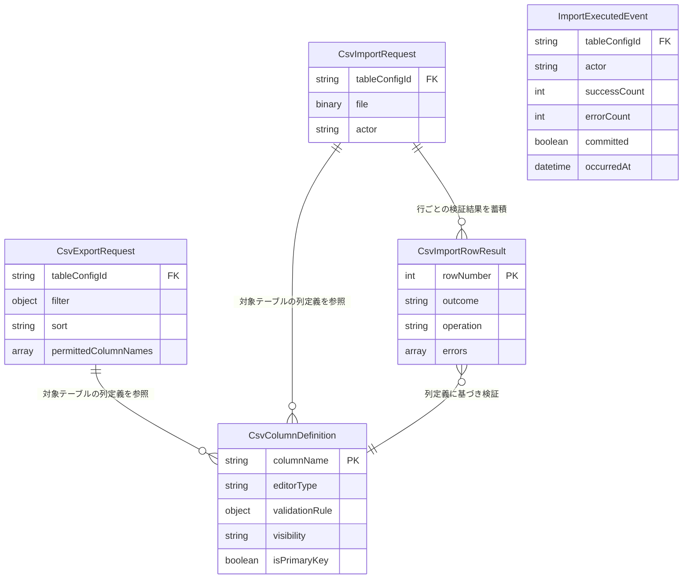

<!--
Copyright 2026 agwlvssainokuni

Licensed under the Apache License, Version 2.0 (the "License");
you may not use this file except in compliance with the License.
You may obtain a copy of the License at

    http://www.apache.org/licenses/LICENSE-2.0

Unless required by applicable law or agreed to in writing, software
distributed under the License is distributed on an "AS IS" BASIS,
WITHOUT WARRANTIES OR CONDITIONS OF ANY KIND, either express or implied.
See the License for the specific language governing permissions and
limitations under the License.
-->

# Functional Specification — data-import-export (U8)

本書は、data-import-exportユニットの振る舞い仕様(ワークフロー)の一次情報源である。データ形状は`entities.md`、業務ルールは`rules.md`を一次情報源とし、本書はそれらから派生したエンティティ関連図・ルールサマリーを補助的に含む。

## ワークフロー

### W1: 業務データCSVエクスポート(FR12.1、C13: exportCsv、C1: `/records/export`)

1. 利用者が一覧画面のツールバーで「CSVエクスポート」を選択する。フロントエンドはC1(`GET /records/export`、Contract Design追補Q6=A)の`filter`・`sort`クエリパラメータへ現在の一覧画面の検索条件・ソート順を渡す。list-engineはこれを受け取り、自身がPermissionEngineへ問い合わせ済みの列単位の実効READ権限列一覧(`permittedColumnNames`)とあわせて`CsvExportRequest`(内部パラメータ、WEB APIには公開しない)として組み立て、DataImportExportの内部インタフェース`exportCsv`(C13追補)を呼び出す。
2. DataImportExportは、config-engineの`getTableConfig`・`getColumnConfigs`を呼び出し、対象テーブルの列定義を取得する。
3. 取得した列定義から、`visibility: hidden`の列、および`CsvExportRequest.permittedColumnNames`に含まれない列を除外した`CsvColumnDefinition`一覧を組み立てる(BR8.2)。列単位の実効READ権限の判定自体はlist-engineがPermissionEngineへの問い合わせ済みであり、DataImportExport自身は権限の再検証を行わない(BR8.8)。
4. DataImportExportは、業務データ用RDBMSへBR8.10のとおりカーソル経由で対象データを逐次読み取り、BR8.1のCSV形式(UTF-8 BOM付き・カンマ区切り・ヘッダー行・CRLF)で1行ずつCSV出力ストリームへ書き込む。
5. 生成したCSVストリームをlist-engine経由で利用者へ返却する(HTTPレスポンス、`text/csv`)。

### W2: 業務データCSVインポート(FR12.1、C13: importCsv、C1: `/records/import`)

1. 利用者が一覧画面のツールバーで「CSVインポート」を選択し、CSVファイルを選択する。フロントエンドはC2(`POST /records/import`)へファイルを送信する。record-edit-engineは、CREATE権限(および行によってはFULL権限、Q7)の実効権限を検証済みのうえで、自身のREST層(C2、Bearer認証済み)のSpring Security認証済みプリンシパルから取得した実行者ユーザーIDとあわせて`CsvImportRequest { tableConfigId, file, actor }`(内部パラメータ、WEB APIのリクエストボディには`actor`を公開しない)を組み立て、DataImportExportの内部インタフェース`importCsv`(C13追補、Contract Design追補Q7=A)を呼び出す。
2. DataImportExportは、config-engineの`getTableConfig`・`getColumnConfigs`を呼び出し、対象テーブルの列定義(型・validationRule・`isPrimaryKey`)から`CsvColumnDefinition`一覧を組み立てる。主キー列の判定(`isPrimaryKey`)は、config-engineのC9契約(Contract Design追補Q8=A)により`ColumnConfig.isPrimaryKey`として提供される。
3. DataImportExportは、CSVファイルを1回のストリーミング走査で1行ずつ逐次読み取る(BR8.10)。各行について:
   a. 主キー列の値の有無を確認し、BR8.3によりINSERT/UPDATEを判定する(主キー値ありかつ対象行が存在しない場合はBR8.6のエラーとする)。
   b. 各列の値を`editorType`に応じた型へ変換し、変換できない場合は型変換エラーとする(BR8.5)。
   c. 変換後の値に対し、config-engineから取得した`validationRule`を適用する(BR8.5)。
   d. a〜cのいずれかに違反があれば、当該行を`outcome: INVALID`とし、行番号・フィールド単位のエラーメッセージ(BR8.6)を記録する。違反がなければ`outcome: VALID`とし、確定した操作種別(INSERT/UPDATE)と変換後の値を、生のCSV行文字列ではなく軽量な`CsvImportRowResult`として一時バッファへ蓄積する(BR8.10)。
4. 全行の読み取り・バリデーションが完了した時点で、BR8.7により次のいずれかを実施する。
   - IF 1件でも`outcome: INVALID`の行がある THEN 一時バッファの内容を破棄し、DBへの反映を一切行わない(成功見込みだった行も含めロールバック)。
   - ELSE 一時バッファに保持した全行の変換後データを用いて、INSERT/UPDATEを1つのデータベーストランザクションでコミットする(BR8.4により、UPDATE対象行への楽観ロック競合検出は行わず、常に後勝ちで上書きする)。
5. DataImportExportは、`ImportResult { successCount, errors }`(C13契約)を呼び出し元(record-edit-engine)へ返す。`errors`はBR8.6の行単位エラー一覧、`successCount`はコミットに成功した行数(全体ロールバック時は0)である。
6. DataImportExportは、処理結果に応じてBR8.9の`ImportExecutedEvent { tableConfigId, actor, successCount, errorCount, committed, occurredAt }`(実行単位のサマリ、行単位の変更前後値は含まない)をAuditLogging(U7)へfire-and-forgetで発行する。`actor`は手順1で受け取った`CsvImportRequest.actor`をそのまま用いる。
7. record-edit-engineは受け取った`ImportResult`をfrontend-uiへ中継し、frontend-uiは`CsvImportErrorModal`(`refined-mockups/interaction-spec.md`参照)で成功件数・エラー行一覧を表示する。

## エンティティ関連図(`entities.md`からの派生ビュー)

<!-- Text fallback: CsvExportRequest/CsvImportRequestはいずれも対象テーブルのCsvColumnDefinition一覧(config-engineから導出)を参照して処理する。CsvImportRequestは1回のインポート実行につき0件以上のCsvImportRowResult(行単位の検証結果)を蓄積する。ImportExecutedEventはCsvImportRowResultの集計結果(successCount/errorCount/committed)とCsvImportRequest.actorを保持する、インポート実行1回につき1件発行されるドメインイベントであり、外部キー関係(永続化上の参照制約)は持たない。 -->

## 業務ルールサマリー(`rules.md`からの派生ビュー)

`rules.md`の全10ルール(BR8.1〜BR8.10)のうち、主要なものを要約する。詳細・完全な一覧は`rules.md`を参照。

- **CSV形式**(BR8.1): UTF-8(BOM付き)・カンマ区切り・ヘッダー行・CRLFで統一。
- **エクスポート対象列の絞り込み**(BR8.2): hidden列・READ権限未満列を除外。
- **upsert判定**(BR8.3): 主キー列の値の有無でINSERT/UPDATEを判定。
- **楽観ロック非適用**(BR8.4): インポートは常に後勝ちで上書き。
- **バリデーション**(BR8.5, BR8.6): validationRule全適用+型変換エラーも対象。エラーは行番号・フィールド単位で提示。
- **全件検証後の一括コミット**(BR8.7): 1件でもエラーがあれば全体をロールバックする。
- **権限は呼び出し元を信頼**(BR8.8): DataImportExport自身は再検証しない。
- **監査ログ連携**(BR8.9): 実行単位のサマリイベントのみ発行(行単位の変更前後値は含まない)。
- **ストリーミング処理**(BR8.10): NFR1(最大10万行)に対応するため全件をメモリに保持しない。

## Assumptions & Open Questions

- **[解決済み]** W1(エクスポート)が必要とする一覧画面の検索条件・ソート順、および列単位の実効READ権限一覧(`permittedColumnNames`)は、Contract Design追補(Q6=A)により解決した。C1(`GET /records/export`)に`filter`・`sort`クエリパラメータを追加し、`permittedColumnNames`はWEB APIには公開せず、C13の内部インタフェース`exportCsv`のパラメータとしてのみ渡す(list-engineがサーバー側で算出)。
- **[解決済み]** W2(インポート)の`ImportExecutedEvent.actor`が必要とする実行者ユーザーIDは、Contract Design追補(Q7=A)により解決した。C13の内部インタフェース`importCsv`に`actor`パラメータを追加し、record-edit-engineが自身のREST層(C2、Bearer認証済み)のSpring Security認証済みプリンシパルから取得して渡す。WEB API(C2)のリクエストボディには`actor`を追加しない。
- **[解決済み]** BR8.3(upsert判定)・BR8.10で必要とする「対象テーブルの主キー列」情報は、Contract Design追補(Q8=A)により解決した。config-engineのC9契約の`ColumnConfig`型に`isPrimaryKey: boolean`を追加し、schema-introspector(U2)が対象RDBMSのメタデータ読み取り時に判定した結果を`writeTableConfigDraft`経由で設定する(`construction/config-engine/functional-design/rules.md` BR1.14)。複合主キーのテーブルへの対応は本MVPスコープの主要な対象外とし、単一主キー列を主な想定とする。
- **[assumption]** project.mdの`## Mandated`は「監査ログは... 変更前後の値を記録する」としているが、本ユニットのBR8.9(ImportExecutedEvent)は、CSVインポートで変更された個々の行の変更前後値を記録しない実行単位のサマリイベントとする(Q8・Q8 Follow-up確定)。これは見落としではなく、CSVインポートは業務データの一括投入・移行用途であり個々の行の変更前後値までは監査ログの対象としない、というインタビューで明示的に確認済みのスコープ判断である。config-engineの機能設計(`construction/config-engine/functional-design/rules.md` BR1.13)が採用した「変更されたエンティティごとに1イベント発行」という粒度とは異なる方針を、本ユニットについては意図的に採用している。
- **[assumption]** BR8.7の「全件検証後の一括コミット」は、C13契約の`importCsv`のnote(「行単位のバリデーションエラーを収集して返す(全体を即時失敗にはしない)」)を、「行単位バリデーションを最初のエラーで中断せず全行分の結果を収集する」という意味であると解釈し、DBへの反映(コミット)単位とは別の論点として整理した(Q10確定)。この解釈はfunctional-design-questions.md Q10で明示的に確認済みである。
- **[assumption]** BR8.7(全件検証後の一括コミット)とBR8.10(ストリーミング処理)は、CSVファイルの読み取り自体は1回のストリーミング走査とし、検証済みの変換後データ(軽量な行データ)のみを一時バッファへ保持することで両立させる設計とした(レビュー指摘R-03対応)。NFR1の想定規模(最大10万行)であれば、一時バッファのメモリ影響は限定的と評価している(`rules.md` BR8.10のnotes参照)。より大規模なデータ量への対応が必要になった場合は、一時テーブルへのバッファリング方式への切り替えを検討する。
