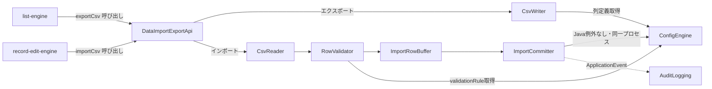

<!--
Copyright 2026 agwlvssainokuni

Licensed under the Apache License, Version 2.0 (the "License");
you may not use this file except in compliance with the License.
You may obtain a copy of the License at

    http://www.apache.org/licenses/LICENSE-2.0

Unless required by applicable law or agreed to in writing, software
distributed under the License is distributed on an "AS IS" BASIS,
WITHOUT WARRANTIES OR CONDITIONS OF ANY KIND, either express or implied.
See the License for the specific language governing permissions and
limitations under the License.
-->

# Logical Components — data-import-export (U8)

`nfr-design-questions.md` Q6確定に基づく、data-import-exportユニット内部のロジカルコンポーネント構成。本ユニットはAWSクラウドへのデプロイを対象外とする単一実行可能WAR内のSpring Bootコンポーネント群であり(Infrastructure Design・Operationフェーズは本ワークフローのスコープでSKIP)、インフラストラクチャコンポーネントの記述は行わない。

## コンポーネント一覧

| コンポーネント | 責務 | 対応するBR/NFR |
|---|---|---|
| `CsvReader` / `CsvWriter` | Apache Commons CSVのストリーミングAPIをラップし、BR8.1のCSV形式(UTF-8 BOM付き・カンマ区切り・ヘッダー行・CRLF)で読み書きする | BR8.1, BR8.10, NFR1.1〜NFR1.3 |
| `RowValidator` | config-engineから取得した`validationRule`・`editorType`を用いて、CSV行の型変換・バリデーションを行う | BR8.5, BR8.6 |
| `ImportRowBuffer` | 検証済みの変換後行データ(`ValidatedRow`)を一時的に保持する(MVPスコープではメモリ上リスト実装のみ) | BR8.7, BR8.10, NFR3.3 |
| `ImportCommitter` | 1トランザクションでのDBコミット(BR8.7)、`ImportExecutedEvent`の発行(BR8.9)、メトリクス・ログ出力 | BR8.4, BR8.7, BR8.9, NFR2.1, NFR4.1, NFR5.1, NFR5.2 |
| `DataImportExportApi`(C13実装) | 外部(list-engine/record-edit-engine)からの呼び出しエントリポイント。上記4コンポーネントを協調させる | C13契約 |

## コンポーネント間の関連

<!-- Text fallback: list-engine/record-edit-engineはDataImportExportApiを呼び出す。エクスポートはCsvWriterへ、インポートはCsvReader→RowValidator→ImportRowBuffer→ImportCommitterの順に処理が流れる。ImportCommitterとCsvWriter/RowValidatorはConfigEngineへ同一プロセス内で問い合わせる(Java例外ベース、リトライ・サーキットブレーカーなし)。ImportCommitterはAuditLoggingへアプリケーション内イベント(fire-and-forget)を発行する。 -->

## 障害ドメイン(Failure Domain)

- 本ユニットの処理は、呼び出し元(list-engine/record-edit-engineが処理する1つのHTTPリクエスト)のスレッド内で完結する。1つのエクスポート・インポート処理の失敗は、当該リクエストのエラー応答に閉じ、他の同時実行中のリクエストやアプリケーション全体には波及しない(NFR3.1のステートレス設計と整合)。
- `ImportCommitter`のトランザクション失敗(NFR4.1)は、当該テーブルへの変更を全てロールバックするが、他のテーブルや他ユニットの状態には影響しない。

## 共有リソース

- HikariCPコネクションプール(アプリ全体で共有、`performance-design.md`参照)
- Micrometerの`MeterRegistry`(アプリ全体で共有する計装基盤、`observability-design.md`参照)

## インフラストラクチャへの橋渡し(参考)

本プロジェクトはInfrastructure Design(3.4)をSKIP対象としており、AWS等のクラウドインフラ設計は行わない。単一実行可能WARとして、アプリケーションを実行する任意の環境(オンプレミス、コンテナ等)にデプロイされる前提であり、本コンポーネント群はいずれもその単一デプロイ単位の内部に含まれる。
