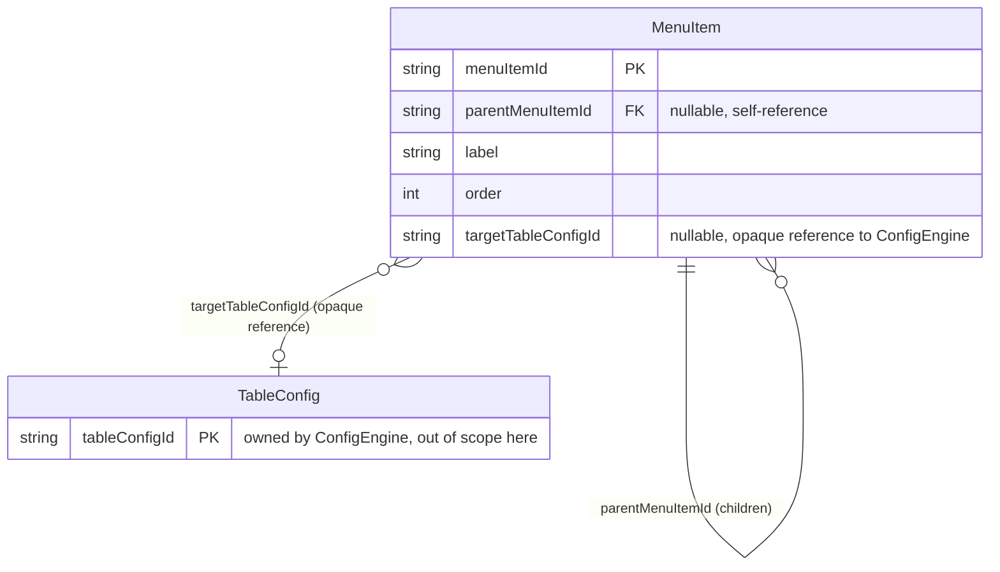

<!--
Copyright 2026 agwlvssainokuni

Licensed under the Apache License, Version 2.0 (the "License");
you may not use this file except in compliance with the License.
You may obtain a copy of the License at

    http://www.apache.org/licenses/LICENSE-2.0

Unless required by applicable law or agreed to in writing, software
distributed under the License is distributed on an "AS IS" BASIS,
WITHOUT WARRANTIES OR CONDITIONS OF ANY KIND, either express or implied.
See the License for the specific language governing permissions and
limitations under the License.
-->

# Functional Spec — menu-navigation (U6)

`entities.md`(データ形状)・`rules.md`(判定ロジック)の確定を踏まえ、menu-navigationユニットのワークフロー(操作順序)を定義する。本ファイルはワークフロー・状態遷移の正本であり、エンティティ関連図・ルールサマリーは`entities.md`/`rules.md`からの派生ビューとして併記する。

## ワークフロー

### W1: 業務・管理メニュー階層取得(`GET /api/menu`、FR7.1〜FR7.3、BR6.1〜BR6.7・BR6.9)

1. リクエストのBearerトークンを検証する(401、認証エラー)。
2. `ActiveRoleResolver`(schema-introspector・audit-loggingと共有する既存の暫定拡張点)によりactiveRoleIdを解決する(functional-design-questions.md Q4=A)。
3. 永続化された全MenuItemを読み取り、`parentMenuItemId`により木構造を再構築する(businessMenu)。
4. 木構造の各リーフ項目(`targetTableConfigId != null`)について:
   a. ConfigEngine側にtargetTableConfigIdが存在するか確認する。存在しなければ当該項目を除外する(BR6.7)。
   b. 存在する場合、`PermissionEngine.canAccessScreen(activeRoleId, targetTableConfigId)`を呼び出す(BR6.3-(1))。falseなら当該項目を除外する。
5. フォルダ項目(`targetTableConfigId == null`)の可視性を、配下リーフの可視性から再帰的に導出する(BR6.4)。配下が全て非表示のフォルダは除外する。
6. 各階層内の兄弟項目を`order`昇順でソートする(BR6.6)。
7. 管理メニュー4項目(ハードコード、BR6.2)それぞれについて、対応する予約screenKey(BR6.3-(3)〜(5))で`canAccessScreen`を呼び出し、trueの項目のみadminMenuに含める。
8. `{ businessMenu: [...], adminMenu: [...] }`を200で返す。権限のあるメニューが1件もない場合も、両方とも空配列としてそのまま返す(空メニューの案内表示自体はフロントエンド側の責務、BR6.5)。

### W2: 業務メニュー項目の作成(`POST /api/menu-items`、BR6.8)

1. Bearerトークンを検証する(401)。
2. `ActiveRoleResolver`でactiveRoleIdを解決する。
3. `PermissionEngine.canAccessScreen(activeRoleId, "config-import-export")`を呼び出す。falseなら403を返す。
4. リクエストボディ(`parentMenuItemId`・`label`・`order`・`targetTableConfigId`)を検証する。`parentMenuItemId`が指定されている場合は既存MenuItemの存在を確認する(存在しなければ400)。`targetTableConfigId`が指定されている場合はConfigEngine側の存在を確認する(存在しなければ400)。
5. 検証を通過したら新規MenuItemを永続化し、201で作成結果を返す。

### W3: 業務メニュー項目の更新(`PUT /api/menu-items/{menuItemId}`、BR6.8)

1. Bearerトークンを検証する(401)。
2. `ActiveRoleResolver`でactiveRoleIdを解決する。
3. `PermissionEngine.canAccessScreen(activeRoleId, "config-import-export")`を呼び出す。falseなら403を返す。
4. 対象MenuItemの存在を確認する(存在しなければ404)。
5. リクエストボディを検証する(W2の手順4と同様)。
6. 検証を通過したら更新を永続化し、200で更新結果を返す。

### W4: 業務メニュー項目の削除(`DELETE /api/menu-items/{menuItemId}`、BR6.8)

1. Bearerトークンを検証する(401)。
2. `ActiveRoleResolver`でactiveRoleIdを解決する。
3. `PermissionEngine.canAccessScreen(activeRoleId, "config-import-export")`を呼び出す。falseなら403を返す。
4. 対象MenuItemの存在を確認する(存在しなければ404)。
5. 削除を実行し、204を返す。子孫MenuItemが存在する場合の挙動(カスケード削除の可否)はcode-generationステージで確定する(Open Questions参照)。

## 状態遷移

MenuItemは業務上の状態(ステータスフィールド)を持たない。作成(W2)・更新(W3)・削除(W4)のCRUDライフサイクルのみで、遷移図として表現すべき中間状態は存在しない。

## エンティティ関連図(derived — `entities.md`が正本)

## ルールサマリー(derived — `rules.md`が正本)

| ID | 概要 |
|---|---|
| BR6.1 | 業務メニューN階層・管理メニュー4項目、パンくずリストなし |
| BR6.2 | 管理メニュー4項目はハードコード |
| BR6.3 | 項目種別ごとのscreenKey決定規則 |
| BR6.4 | フォルダの表示可否は配下リーフから再帰的に導出 |
| BR6.5 | 空メニュー判定・案内表示はフロントエンド側の責務 |
| BR6.6 | 兄弟項目はorder昇順 |
| BR6.7 | 参照先TableConfig欠損時は実行時除外 |
| BR6.8 | MenuItem CRUD APIの認可・バリデーション |
| BR6.9 | トップ画面カード表示は第1階層グループ単位 |

## Assumptions & Open Questions

- W4(削除)における子孫MenuItemの扱い(カスケード削除か、子を持つ項目の削除を拒否するか)は、`functional-design-questions.md`では確定していない。code-generationステージで、より安全側(子を持つ項目の削除を409で拒否し、先に子の削除・付け替えを要求する)を既定案としつつ最終確定する。
- 管理メニュー「業務メニュー設定」と「設定管理」が同一screenKeyを共有する設計(BR6.3-(5))は、両画面が同一の権限スコープを持つことを意味する。将来、両画面の権限を分離する要望が生じた場合は、schema-introspector側の設計変更を伴うフォローアップとなる。
