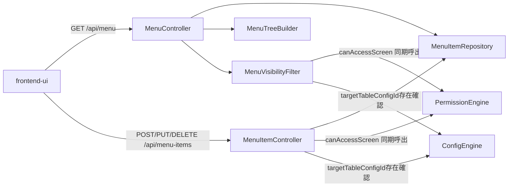

<!--
Copyright 2026 agwlvssainokuni

Licensed under the Apache License, Version 2.0 (the "License");
you may not use this file except in compliance with the License.
You may obtain a copy of the License at

    http://www.apache.org/licenses/LICENSE-2.0

Unless required by applicable law or agreed to in writing, software
distributed under the License is distributed on an "AS IS" BASIS,
WITHOUT WARRANTIES OR CONDITIONS OF ANY KIND, either express or implied.
See the License for the specific language governing permissions and
limitations under the License.
-->

# Logical Components — menu-navigation (U6)

`nfr-design-questions.md` Q5確定に基づく、menu-navigationユニット内部のロジカルコンポーネント構成。本ユニットはAWSクラウドへのデプロイを対象外とする単一実行可能WAR内のSpring Bootコンポーネント群であり(Infrastructure Design・Operationフェーズは本ワークフローのスコープでSKIP)、インフラストラクチャコンポーネントの記述は行わない。

## コンポーネント一覧

| コンポーネント | 責務 | 対応するBR/NFR |
|---|---|---|
| `MenuItemRepository` | 内部設定DBへのMenuItemの永続化・全件取得・子孫存在確認(`existsByParentMenuItemId`) | BR6.1, NFR1.1, NFR4.4 |
| `MenuTreeBuilder` | 全MenuItemから自己参照外部キーを辿って木構造を組み立てる(アプリケーション層) | tech-stack-decisions.md, BR6.6 |
| `MenuVisibilityFilter` | フォルダ・リーフ項目それぞれの表示可否判定(screenKey決定・PermissionEngine呼び出し・再帰的なフォルダ可視性導出) | BR6.3, BR6.4 |
| `MenuController`(C3実装) | `GET /api/menu`のエントリポイント。木構造組み立て・可視性フィルタリング・レスポンス組み立て | C3契約, BR6.1, BR6.2, BR6.9 |
| `MenuItemController`(C3追補実装) | `POST/PUT/DELETE /api/menu-items`のエントリポイント。認可・入力検証・子孫チェック | C3追補, BR6.8 |

## コンポーネント間の関連

<!-- Text fallback: frontend-uiはGET /api/menuでMenuControllerを、POST/PUT/DELETE /api/menu-itemsでMenuItemControllerを呼び出す。MenuControllerはMenuItemRepositoryから全件取得しMenuTreeBuilderで木構造化、MenuVisibilityFilterでPermissionEngine(canAccessScreen)・ConfigEngine(targetTableConfigId存在確認)への同期呼出を経てレスポンスを組み立てる。MenuItemControllerもMenuItemRepositoryへの読み書きに加え、同じPermissionEngine・ConfigEngineへの同期呼出で認可・検証を行う。 -->

## 障害ドメイン(Failure Domain)

- `GET /api/menu`・`/api/menu-items`の処理は、いずれも当該HTTPリクエストのスレッド内で完結する。ConfigEngine・PermissionEngineへの呼び出しは同一プロセス内のJavaメソッド呼び出しであり(embedded配置)、ネットワーク越しの外部呼び出しを持たない。
- 内部設定DB接続断時は、個別のエラーレスポンス(NFR4系)を返すのみで、アプリケーション全体には波及しない。
- 本ユニットはJVMプロセス(単一WAR)全体を落とすような共有可変状態を持たない。MenuItemツリーはキャッシュしないため(Q2確定)、キャッシュ不整合によるリスクもない。

## 共有リソース

- 内部設定DB用HikariCPコネクションプール(業務データ用RDBMSとは別接続、team.md Q12b、他の内部設定DB依存ユニットと共有)
- Micrometerの`MeterRegistry`(アプリ全体で共有する計装基盤、`observability-design.md`参照)
- `ActiveRoleResolver`拡張点(schema-introspector・audit-loggingと共有)

## インフラストラクチャへの橋渡し(参考)

本プロジェクトはInfrastructure Design(3.4)をSKIP対象としており、AWS等のクラウドインフラ設計は行わない。単一実行可能WARとして、アプリケーションを実行する任意の環境(オンプレミス、コンテナ等)にデプロイされる前提であり、本コンポーネント群はいずれもその単一デプロイ単位の内部に含まれる。
