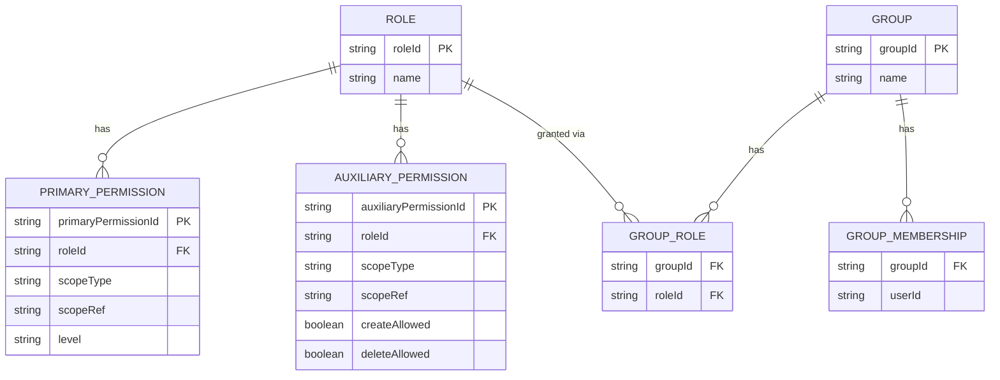

# Functional Spec — permission-engine (U3)

## Sources

- [desc] `aidlc/spaces/default/intents/260910-master-mgmt-app/project-description.json`
- [scope] `config-driven-admin-mvp`
- `inception/units-generation/unit-of-work.md`(U3定義)
- `inception/requirements-analysis/requirements.md`(FR3.3, FR3.4, FR4.1〜FR4.4, FR1.6)
- `inception/domain-design/components.md`(PermissionEngineコンポーネント定義)
- `inception/contract-design/contract-summary.md`(C10: PermissionEngineApi)
- `construction/permission-engine/functional-design/functional-design-questions.md`(Q1〜Q8、Follow-up含む)

## ワークフロー

### W1: 実効主権限・補助権限の解決(resolveEffectivePermission)

1. コンシューマー(user-management, menu-navigation, audit-logging, list-engine, record-edit-engine, config-import-export)が`resolveEffectivePermission(activeRoleId, scopeType, scopeRef)`を呼び出す。
2. `scopeType`が`COLUMN`の場合、まず`scopeRef`(columnConfigId)に対する当該`activeRoleId`のPrimaryPermission行を検索する。見つかれば`level`を採用し、Step 5へ。
3. 見つからなければ、対応する`TABLE`(親テーブルのtableConfigId、config-engineから解決)に対するPrimaryPermission行を検索する。見つかれば採用しStep 5へ。`scopeType`が`TABLE`から開始した場合はここから。
4. 見つからなければ、対応する`SCHEMA`に対するPrimaryPermission行を検索する。見つかれば採用しStep 5へ。それでも見つからなければ`level = NONE`とする(BR3.6)。
5. 補助権限(`canCreate`/`canDelete`)についても同様に、`TABLE`→`SCHEMA`の順でAuxiliaryPermissionの`createAllowed`/`deleteAllowed`(null以外)を検索する(BR3.5)。いずれも見つからなければ`false`とする(BR3.6)。
6. `EffectivePermission { level, canCreate, canDelete }`を返す。

### W2: 画面アクセス可否判定(canAccessScreen)

1. コンシューマーが`canAccessScreen(activeRoleId, screenKey)`を呼び出す。
2. `screenKey`が予約キー(`user-management` | `audit-log` | `config-import-export`)の場合、対応する予約スキーマ名(BR3.15: `__system__:user-management` 等)に対し`resolveEffectivePermission(activeRoleId, "SCHEMA", 予約スキーマ名)`を呼び出す。
3. それ以外の場合、`screenKey`をconfig-engineの`tableConfigId`とみなし、`resolveEffectivePermission(activeRoleId, "TABLE", screenKey)`を呼び出す。
4. **ブートストラップ例外(BR3.13)**: `screenKey == "config-import-export"`かつシステム全体でPrimaryPermission行が1件も存在しない場合、Step 2〜3を経由せず無条件に`true`を返す(初期管理者が最初のRBAC設定インポート画面へ到達できるようにするため)。
5. 上記いずれにも該当しない場合、`level != NONE`であれば`true`、`NONE`であれば`false`を返す(BR3.10)。

### W3: 選択可能ロール一覧の算出

1. user-management(またはauthentication-serviceが依頼するuser-management経由)が、UserのuserIdに紐づく直接付与ロール(User.roleIds)を保持している。
2. user-managementは、本ユニットの新設メソッド(下記「Domain Design/Contract Designへの追補」参照)を呼び出し、Group経由の間接付与ロールを取得する。
3. 直接付与ロールとGroup経由ロールの和集合(重複排除)を、当該Userの選択可能ロール一覧として返す(BR3.3)。
4. ロール選択UI自体(ヘッダーでの選択操作、単一ロール時の非表示制御)はauthentication-service/frontend-uiの責務であり、本ユニットは一覧の算出のみを担う。

### W4: 権限割当(assignPermission、昇格防止)

1. config-import-exportが、設定一式JSONインポート処理(C7 `/api/config/import`)の一環として、RBAC設定の各エントリ(ロール・スコープ・権限レベル)ごとに`assignPermission(roleId, scopeType, scopeRef, level)`を呼び出す。JSONペイロード内のRBACセクションは、config-engine側の実業務スキーマ/テーブル一覧に対する整合性検証を経ない不透明な(roleId, scopeType, scopeRef, level)タプルの列挙であり、BR3.15の予約スキーマ名もこのまま含めてよい(BR3.14)。
2. **ブートストラップ判定**: システム全体でPrimaryPermission行が1件も存在しない場合(BR3.13のブートストラップ状態)、Step 3の昇格チェックをスキップし、Step 4へ進む。
3. ブートストラップ状態でない場合、本ユニットは、呼び出し元(インポートを実行している管理者)の`activeRoleId`について、同一(scopeType, scopeRef)に対する現在の実効権限を`resolveEffectivePermission`相当のロジックで算出する。割り当てようとする新しい`level`(主権限、BR3.4の`FULL > READ > NONE`順序で比較)または`createAllowed`/`deleteAllowed`(補助権限)が、算出した操作者自身の実効権限を上回る場合、`PermissionEscalationException`をスローし、当該エントリの割当を拒否する(BR3.8)。
4. 拒否されなかった場合、PrimaryPermission(またはAuxiliaryPermission)の該当行をupsertする。この時点でPrimaryPermission行数が0から1以上に変化した場合、ブートストラップ状態は以降永続的に終了する(BR3.13)。
5. config-import-exportの1回のインポート実行が完了した時点で、実行中に1件以上のassignPermissionが成功していれば、`PermissionChanged`サマリイベント(実行者・変更件数・日時)を1件発行する(BR3.11)。個々の変更前後の値は含めない。

## エンティティ関連図(`entities.md`からの派生ビュー)

テキストフォールバック: Role 1---N PrimaryPermission、Role 1---N AuxiliaryPermission、Role 1---N GroupRole。Group 1---N GroupMembership、Group 1---N GroupRole。GroupMembershipはGroupと外部エンティティUser(user-management所有、userIdのみ参照)を結ぶ。

## 業務ルールサマリー(`rules.md`からの派生ビュー)

| ID | 概要 |
|---|---|
| BR3.1 | ロールのUserへの直接付与(階層なし) |
| BR3.2 | Group経由のロール間接付与 |
| BR3.3 | 選択可能ロール一覧=直接∪Group経由 |
| BR3.4 | 主権限のスコープ階層解決順序(カラム→テーブル→スキーマ) |
| BR3.5 | 補助権限のスコープ階層解決順序(テーブル→スキーマ) |
| BR3.6 | 全階層指定なし時のデフォルト(NONE/禁止) |
| BR3.7 | サーバー側での実効権限再検証の必須化 |
| BR3.8 | 権限昇格の防止 |
| BR3.9 | assignPermissionの唯一の呼び出し経路(config-import-export) |
| BR3.10 | canAccessScreenの汎用画面キー体系 |
| BR3.11 | PermissionChangedイベント(インポート単位のサマリ) |
| BR3.12 | 業務固有情報のハードコード禁止 |
| BR3.13 | ブートストラップ例外(初回RBAC投入時の昇格チェック除外) |
| BR3.14 | 予約スコープのconfig-engine非検証(不透明識別子) |
| BR3.15 | 管理系画面の予約スキーマ名 |

## Domain Design/Contract Designへの追補(Code Generation着手前に解決が必要)

1. **Role.parentRoleId属性の削除(Domain Design追補)**: `inception/domain-design/components.md`のRoleエンティティ定義から`parentRoleId`属性を削除する追補が必要。ロール階層継承は本MVPでは実装しない(`entities.md`「Domain Designからの逸脱」参照)。`team.md`のテスト方針が言及する「ロール階層継承」は、スコープ階層(スキーマ→テーブル→カラム)の継承を指すものと解釈し直す旨、注記を追加することが望ましい。
2. **Groupエンティティの追加(Domain Design追補)**: `components.md`のPermissionEngineエンティティ一覧にGroup/GroupMembership/GroupRoleを追加する追補が必要(FR4.1の「グループ」概念を実現するための新設、`entities.md`参照)。
3. **C10契約への新規メソッド追加(Contract Design追補)**: W3(選択可能ロール一覧の算出)を実現するため、C10(PermissionEngineApi)に`getGroupDerivedRoleIds(userId: string): List<string>`(仮称)の追加が必要。user-managementが自身の`User.roleIds`(直接付与分)と本メソッドの戻り値(Group経由分)を合成し、選択可能ロール一覧を構成する。user-managementは既にC10のコンシューマーとして登録済みであり、新規コンシューマー追加は不要。

## Assumptions & Open Questions

- [Q1] FR4.1の「グループ」は、Domain Design時点では存在しなかったエンティティであり、本機能設計で新設した(Group/GroupMembership/GroupRole)。Contract Design(C10)への追補(`getGroupDerivedRoleIds`の追加)が、Code Generation着手前に必要。
- [Q2 Follow-up] Domain Design(`components.md`)のRole.parentRoleId属性は、本機能設計での確認の結果、本MVPでは実装しないことに変更された。Domain Designおよびteam.mdへの追補(注記修正)が望ましいが、本ユニットのCode Generation自体をブロックする事項ではない。
- [解決済み] 内部予約スキーマの具体的な識別子名はBR3.15で確定した(`__system__:user-management`等)。RBACのブートストラップ・デッドロック(初期状態でRBAC設定を一切投入できない問題)およびconfig-engine非検証の予約スコープ投入経路は、BR3.13/BR3.14/BR3.15とW2/W4の改訂で解消した(アーキテクチャレビュー iteration 1, NOT-READY, R-01/R-02対応)。
- assignPermissionの拒否(PermissionEscalationException)が発生した場合、config-import-export側がインポート処理全体を中止するか、当該エントリのみをスキップして続行するかは、config-import-exportユニット自身の機能設計(後続Bolt)で確定する。

## Consolidated Summary Confirmation

- Looks correct
- Request changes

[Answer]:
