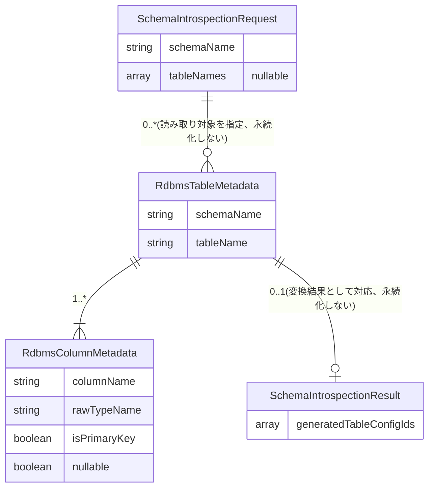

<!--
Copyright 2026 agwlvssainokuni

Licensed under the Apache License, Version 2.0 (the "License");
you may not use this file except in compliance with the License.
You may obtain a copy of the License at

    http://www.apache.org/licenses/LICENSE-2.0

Unless required by applicable law or agreed to in writing, software
distributed under the License is distributed on an "AS IS" BASIS,
WITHOUT WARRANTIES OR CONDITIONS OF ANY KIND, either express or implied.
See the License for the specific language governing permissions and
limitations under the License.
-->

# Functional Specification — schema-introspector (U2)

本書は、schema-introspectorユニットの振る舞い仕様(ワークフロー)の一次情報源である。エンティティのデータ形状は`entities.md`、業務ルールは`rules.md`を一次情報源とし、本書はそれらから派生したER図・ルールサマリーを補助的に含む。

本ユニットは状態を持つ永続エンティティを一切保有しない一過性の読み取り・委譲処理であるため、ライフサイクル状態遷移は定義しない。提供するワークフローはW1のみである。

## ワークフロー

### W1: スキーマからドラフト生成(FR1.4、C8: `POST /api/config/schema-introspection`)

1. 管理者がfrontend-ui(U12)の設定管理画面(config-import-exportと共通の画面、`unit-of-work.md` U12)で「スキーマからドラフト生成」操作を実行し、`SchemaIntrospectionRequest`(schemaName、tableNames省略可)を伴い`POST /api/config/schema-introspection`を呼び出す。
2. schema-introspectorは、呼び出し元のアクティブロール(activeRoleId)に対し`PermissionEngine.canAccessScreen(activeRoleId, "config-import-export")`を呼び出し、設定管理画面へのアクセス権限を再検証する(BR2.8)。
3. IF 権限なし THEN 403 Forbidden(C8のForbiddenレスポンス)を返し、以降の処理を行わない。
4. 対象RDBMS(業務データ用)の接続情報からRDBMS方言(POSTGRESQL | MYSQL | MARIADB)を判定する(BR2.3)。IF 判定不可・接続失敗 THEN 422(C8のValidationErrorレスポンス)を返し、以降の処理を行わない(BR2.9)。
5. BR2.2に従い、読み取り対象のテーブル一覧を決定する。IF `tableNames`が指定される THEN 指定テーブルのみ。ELSE `schemaName`配下の全テーブル。
6. 対象テーブルごとに、対象RDBMSのメタデータカタログ(information_schema等、方言別の実装詳細はcode-generationで確定)からカラム名・型名(rawTypeName)・主キー制約・NULL可否を読み取り、`RdbmsTableMetadata`/`RdbmsColumnMetadata`を組み立てる(BR2.1: 読み取り専用アクセスのみ、BR2.4: 主キー判定、BR2.10: NULL可否の読み取り)。
7. IF いずれかのテーブルのメタデータ読み取りに失敗 THEN 422(C8のValidationErrorレスポンス)を返し、`writeTableConfigDraft`を一切呼び出さずに処理全体を中断する(BR2.9。全テーブルの読み取りが完了してから1回だけ書き込みを行う設計のため、部分書込みは発生しない)。
8. 読み取りに成功した全テーブルの`RdbmsTableMetadata`を、config-engine(U1)のC9契約型`TableConfigDraft`(dialect, `List<TableDraftEntry>`)へ変換する。各テーブルの`TableDraftEntry`は対象カラムごとの`ColumnDraftEntry`(columnName, rawTypeName, isPrimaryKey)を持つ。rawTypeNameは正規化せずそのまま設定し、楽観ロック対象列に相当する情報は含めない(BR2.5、BR2.6)。読み取った`nullable`は`RdbmsColumnMetadata`として保持されたまま(`ColumnDraftEntry`に対応フィールドが無いため)この変換では伝搬しない(BR2.10)。
9. 組み立てた`TableConfigDraft`を1回の`writeTableConfigDraft`呼び出しとしてconfig-engineへ送信する。
10. config-engineは対象テーブルごとに、(schemaName, tableName)の組で既存`TableConfig`の有無を確認する。IF 既存 THEN 当該テーブルの取り込みをスキップする(BR2.7、config-engine側`rules.md` BR1.8)。ELSE 新規`TableConfig`/`ColumnConfig`を作成する(editorTypeはconfig-engine側の論理型正規化(`rules.md` BR1.12)から決定、isPrimaryKeyは受け取った判定結果をそのまま設定、`rules.md` BR1.14)。
11. config-engineから返された、新規生成された`TableConfig`のID一覧を`SchemaIntrospectionResult.generatedTableConfigIds`としてそのまま呼び出し元(frontend-ui)へ返す(200 OK)。既存設定があってスキップされたテーブルのIDはこの一覧に含まれない。

## エンティティ関連図(`entities.md`からの派生ビュー)

<!-- Text fallback: SchemaIntrospectionRequestは0..*のRdbmsTableMetadata(対象RDBMSから読み取ったテーブル)の読み取り範囲を指定する。RdbmsTableMetadataは1個以上のRdbmsColumnMetadataを持つ。読み取り結果全体はconfig-engineのwriteTableConfigDraft呼び出しを経て、既存設定が無く新規生成された場合に限りSchemaIntrospectionResultへ0..1で対応する。いずれのエンティティも永続化されない一時的な値オブジェクトである。 -->

## 業務ルールサマリー(`rules.md`からの派生ビュー)

`rules.md`の全10ルール(BR2.1〜BR2.10)を要約する。詳細・完全な一覧は`rules.md`を参照。

- **読み取り専用アクセス**(BR2.1): 業務データ用RDBMSへの読み取り専用アクセスのみを行い、書き込みは一切行わない。
- **読み取り範囲**(BR2.2): tableNames省略時はスキーマ配下の全テーブルが対象。
- **RDBMS方言判定**(BR2.3): 対象RDBMSの方言を判定し、TableConfigDraft.dialectへ設定する。
- **主キー判定**(BR2.4): 主キー制約を判定し、isPrimaryKeyへ設定する(単一主キー列を主な想定。複合主キーの場合は含まれる全カラムをtrueとする既定動作を明記)。
- **editorType/formatの委譲**(BR2.5): editorType/formatの決定はconfig-engine側(BR1.12)に委譲し、schema-introspectorはrawTypeNameをそのまま渡す。外部キー参照カラムの特別扱い(select自動化)は行わない(Q1確定・Follow-upでB変更)。
- **楽観ロック対象列の非設定**(BR2.6): 楽観ロック対象列は自動検出せず、常に未設定のまま伝搬する(Q2確定)。
- **再実行時スキップの委譲**(BR2.7): テーブル単位の再実行スキップはconfig-engine側(BR1.8)に委譲し、schema-introspector自身は事前フィルタを行わない(Q3確定・Follow-upでB変更)。
- **アクセス制御**(BR2.8): 設定管理画面と同一のscreenKey("config-import-export")でcanAccessScreenによるサーバー側再検証を行う。
- **fail-fast**(BR2.9): メタデータ読み取り失敗時は部分書込みを行わずに処理全体を中断する。
- **NULL可否の読み取りと非伝搬**(BR2.10): FR1.4の読み取り対象としてNULL可否を読み取り保持するが、config-engine側の`ColumnDraftEntry`に対応フィールドが無いため、ドラフト生成時には伝搬しない。

## Assumptions & Open Questions

- **[assumption]** Q1・Q3は当初、FKカラムのeditorType=select自動化(Q1=A)・カラム単位の差分検出による再実行(Q3=A)として確定回答されたが、Code Generation済みのconfig-engine実装(`ColumnDraftEntry`にFK情報フィールドが存在しない、`writeTableConfigDraft`がテーブル単位スキップのみを実装・テスト済み)との不整合が判明したため、Follow-upで両者ともB(FK特別扱いなし/テーブル単位スキップ)へ変更し、実装済みconfig-engineへの手戻りを避ける方針で確定した(`functional-design-questions.md`参照)。
- **[assumption]** 対象RDBMSのメタデータカタログへの具体的なアクセス方法(JDBC DatabaseMetaData、方言別のinformation_schemaクエリ等)は、本設計では技術非依存の抽象(BR2.1〜BR2.4)にとどめ、具体化はCode Generation(3.5)で行う。
- **[assumption]** 複合主キーを持つテーブルの`isPrimaryKey`判定(BR2.4)は、レビュー指摘(R-03)対応により、制約に含まれる全カラムをtrueとする既定動作を明記して解消した。data-import-export側のCSVインポートupsert判定が複合主キーを正しく扱えるかどうかは、本MVPスコープの主要な対象外(`contract-summary.md`主キー列情報の追加、単一主キー列を主な想定)のまま据え置く。
- **[assumption]** NULL可否(nullable、レビュー指摘R-01対応)は、FR1.4が明記する読み取り対象であるためRdbmsColumnMetadataとしては読み取り・保持するが、config-engine(U1)のC9契約型`ColumnDraftEntry`に対応するフィールドが無く、`ColumnConfig.validationRule`への"required"ルール自動導出経路も未実装であるため、本MVPではwriteTableConfigDraft呼び出しへ伝搬しない(BR2.10)。Q1/Q3同様、config-engineへの機能追加(ColumnDraftEntry拡張・validationRule自動導出)は実装済みユニットへの手戻りを伴うため、今回はスコープに含めない意図的な判断とした。将来、NOT NULL制約からのバリデーションルール自動生成が必要になった場合は、Contract Design(C9)への追補として解決することを推奨する。
