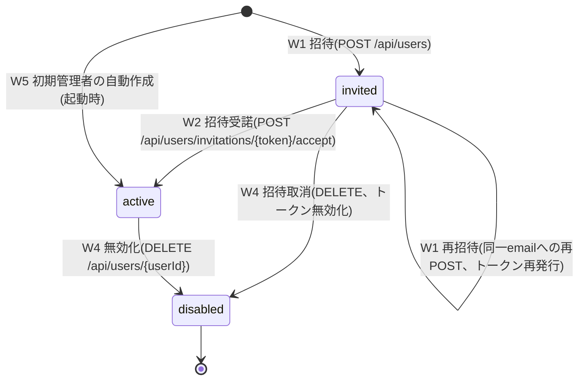
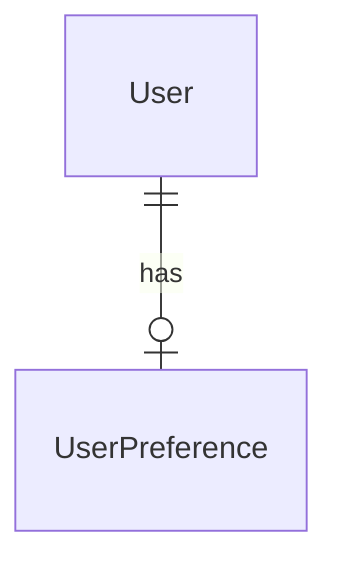

<!--
Copyright 2026 agwlvssainokuni

Licensed under the Apache License, Version 2.0 (the "License");
you may not use this file except in compliance with the License.
You may obtain a copy of the License at

    http://www.apache.org/licenses/LICENSE-2.0

Unless required by applicable law or agreed to in writing, software
distributed under the License is distributed on an "AS IS" BASIS,
WITHOUT WARRANTIES OR CONDITIONS OF ANY KIND, either express or implied.
See the License for the specific language governing permissions and
limitations under the License.
-->

# Functional Specification — user-management (U4)

## Sources

- `inception/units-generation/unit-of-work.md`(U4定義)
- `inception/units-generation/unit-of-work-story-map.md`(U4に割り当てられたFR一覧)
- `inception/domain-design/components.md`(UserManagementコンポーネント定義)
- `inception/contract-design/contract-summary.md`(C5: user-management REST API、C10: PermissionEngineApi、C11: UserAccountLookupApi、C14: SessionContextApi)
- `inception/requirements-analysis/requirements.md`(FR1.6, FR2, FR9.1, FR10.1)
- `functional-design-questions.md`(Q1〜Q6確定回答)

## 認可の前提(操作者の取得)

`/api/users`系・`/api/me/preferences`は、検証済みBearerトークン(JWT)から操作者のuserIdとactiveRoleIdを取得する。
これはリクエストの認証コンテキスト(共通の認証フィルタが設定するセキュリティコンテキスト)を読むだけで、
AuthenticationServiceコンポーネントを呼び出さない(C11によりAuthenticationService→UserManagementの同期依存が
既にあるため、逆方向の呼び出しはU4とU5の循環依存になる)。トークンにuserIdとactiveRoleIdが含まれること、
ロール選択前のトークンで`/api/me/preferences`が使えることは、authentication-service(U5)の機能設計で確定する(Assumptions & Open Questions参照)。

## ワークフロー

### W1: ユーザー招待・再招待(FR2.1、BR4.1, BR4.5, BR4.9, BR4.10, BR4.11, BR4.12, BR4.15, BR4.16)

1. 管理者が`POST /api/users`を呼び出す(email/name/roleIds)。
2. `canAccessScreen(activeRoleId, "user-management")`で認可を再検証する(BR4.10)。
3. email・nameを検証し、emailをtrim・小文字へ正規化する(BR4.15)。不備があれば422。
4. 正規化後のemailで既存Userを検索する。
   - 存在しない: 手順5へ。
   - status=invitedのUserが存在する: 再招待(BR4.11)。手順5の後、新しいinvitationTokenを発行して旧トークンを無効にし、name・roleIdsを更新する。
   - status=active/disabledのUserが存在する: 422(重複)。
5. roleIdsの実在を検証する(BR4.5、PermissionEngineApiの新規メソッド)。実在しないroleIdがあれば422。
6. status=invitedでUserを作成(または再招待として更新)し、招待トークン(UUIDv4、無期限)を発行する。
7. SMTP経由で招待メールを送信する(BR4.16)。送信に失敗した場合は手順6の作成・更新を巻き戻し、503を返して終了する。
8. UserChangedEvent(operation=INVITED, beforeValue=新規ならnull・再招待なら更新前の値, afterValue={name, email, status: invited, roleIds}, actor=管理者のuserId)を発行する(BR4.9)。
9. 201を返す。

### W2: 招待受諾・初回パスワード設定(FR2.1、BR4.2, BR4.3, BR4.9, BR4.15)

1. 利用者が招待メール中のリンク(トークン)から`POST /api/users/invitations/{token}/accept`を呼び出す(password/name、および任意でtheme/fontSize/locale)。認証は不要(C5: `security: []`)。
2. トークンに対応するUser(status=invited)を検索する。見つからない(未知・使用済み・取消済み)場合は区別せず404。
3. passwordが8文字以上128文字以下か、nameが空でないか、theme/fontSize/localeが許容値内かを検証する。不備なら422(フィールド単位)。
4. status=invitedからactiveへの条件付き更新を原子的に行う(並行受諾では1件のみ成功、他方は404)。passwordをArgon2idでハッシュ化してpasswordHashに設定し、nameを更新し、invitationTokenをnullにする。
5. UserPreferenceを作成する(指定値、省略時はlight/medium/ja、BR4.3)。手順4と同一トランザクション。
6. UserChangedEvent(operation=ACTIVATED, beforeValue={name, email, status: invited, roleIds}, afterValue={name, email, status: active, roleIds}, actor=受諾したUser自身のuserId)を発行する(BR4.9)。
7. 200を返す。

### W3: ユーザー情報更新(FR2.2、BR4.5, BR4.9, BR4.10, BR4.12, BR4.14, BR4.15)

1. 管理者が`PUT /api/users/{userId}`を呼び出す(nameとroleIdsのみ更新可能、BR4.14)。
2. BR4.10の認可再検証。
3. 対象User存在確認。存在しなければ404。
4. nameを検証する(BR4.15)。更新可能項目以外が指定されていれば422(BR4.14)。
5. 対象が操作者自身で、かつroleIdsが現在値と異なる場合は422(BR4.12)。
6. roleIds実在検証(BR4.5)。
7. 更新前の値をbeforeValueとして保持し、更新を適用する。
8. UserChangedEvent(operation=UPDATED, beforeValue, afterValue, actor=管理者のuserId)を発行する。
9. 200を返す。

### W4: ユーザー無効化・招待取消(FR2.3、BR4.6, BR4.9, BR4.10, BR4.11)

1. 管理者が`DELETE /api/users/{userId}`を呼び出す。
2. BR4.10の認可再検証。
3. 対象User存在確認。存在しなければ404。
4. 対象が操作者自身なら422(BR4.6)。すでにdisabledなら何もせず204(冪等、イベント発行なし)。
5. status=disabledへ遷移する。対象がstatus=invitedだった場合は招待の取消として扱い、invitationTokenをnullにする(BR4.11)。
6. UserChangedEvent(operation=DISABLED, beforeValue, afterValue, actor=管理者のuserId)を発行する。
7. 204を返す。以後、authentication-serviceはC11の`isDisabled`(常に最新のstatusを返す、BR4.13)により再認証・トークン更新を拒否できる。既発行のアクセストークンは有効期限まで有効(FR2.3)。

### W5: 初期管理者アカウントの自動作成(FR2.4、BR4.3, BR4.7, BR4.9)

1. アプリ起動時、`ApplicationRunner`が`application.yml`の初期管理者email・パスワード・任意の`initial-admin.role-ids`を読む。設定の不備(パスワードが8文字未満または128文字超、emailの形式不正、SMTP設定の不備)は起動時にfail fastする。
2. 正規化後のemailに対応するUserがstatusを問わず存在しなければ、パスワードをArgon2idでハッシュ化しstatus=active・roleIds=`initial-admin.role-ids`(未指定なら空)でUserを作成する。roleIdsの実在検証(BR4.5)は行わない。
3. UserPreferenceを既定値で作成する(BR4.3)。
4. UserChangedEvent(operation=BOOTSTRAPPED, beforeValue=null, afterValue={name, email, status: active, roleIds}, actor=`system`)を発行する(BR4.9)。
5. 既に存在すれば何もしない(冪等)。

permission-engineのブートストラップ例外(RBAC設定が1件も存在しない間に限り`canAccessScreen(_, "config-import-export")`がtrueを返す)により、初期管理者は最初のRBAC設定インポート画面へ到達できる。初期管理者がどのroleIdでログインするかはAssumptions & Open Questionsを参照。

### W6: ユーザー単位の表示設定取得・更新(FR9.1、FR10.1、BR4.8)

1. 利用者が`GET/PUT /api/me/preferences`を呼び出す。
2. BR4.8の認可(検証済みBearerトークンから操作者のuserIdを取得できれば誰でも自分の設定を操作可、canAccessScreenとactiveRoleIdは不要)。対象userIdはトークンから得た値のみを用い、リクエストからは受け取らない。
3. GET: 自分自身のUserPreferenceを返す。存在しなければ既定値(light/medium/ja)を返す(作成はしない)。
4. PUT: 許容値を検証し(不備なら422)、自分自身のUserPreferenceを更新する(存在しなければ作成)。

### W7: ユーザー一覧取得(FR2.2、BR4.10, BR4.14)

1. 管理者が`GET /api/users`を呼び出す。
2. BR4.10の認可再検証。
3. 全Userをemail昇順で返す。各要素はuserId・name・email・status・roleIdsのみとし、passwordHashとinvitationTokenは含めない(BR4.14)。ページングは行わない(C5は配列を返す)。

### W8: C11 UserAccountLookupApi の提供(FR2.3, FR2.6、BR4.13)

1. `findByEmail(email)`: 正規化後のemailで検索し、UserAccount(userId・status・roleIds)を返す。roleIdsは`User.roleIds`とPermissionEngineApiの`getGroupDerivedRoleIds(userId)`の和集合。passwordHashは返さずnullとする。存在しなければ`Optional.empty`。
2. `verifyPasswordHash(userId, rawPassword)`: status=activeかつpasswordHashが非nullの場合のみArgon2idで検証した結果を返す。invited・disabled・不存在はfalse。平文をログ・エラーメッセージに出力しない。
3. `isDisabled(userId)`: 最新のstatusを参照し、disabledまたは不存在ならtrue。
4. `revokeRefreshTokensOnDisable(userId)`: 呼び出し方向・実装方針は未確定(Assumptions & Open Questions参照)。

## 状態遷移(User.status)

テキストフォールバック: Userの状態は、招待(W1)でinvited、招待受諾(W2)でactive、無効化または招待取消(W4)でdisabledになる。invitedでは再招待(W1)で状態は変わらずトークンだけが再発行される。初期管理者はW5で直接activeとして作成される。disabledから他の状態へ戻る遷移は定めない(復帰手段は対象外)。

## エンティティ関連図(entities.mdより導出)

テキストフォールバック: UserとUserPreferenceは1対0または1の関係である。UserPreferenceは招待受諾時または初期管理者の作成時に作られるため、招待中のUserは持たない。

## ルール概要(rules.mdより導出)

| ID | 概要 |
|---|---|
| BR4.1 | ユーザー招待(既存invitedは再招待) |
| BR4.2 | 招待受諾・初回パスワード設定 |
| BR4.3 | UserPreference作成(招待受諾時・初期管理者作成時) |
| BR4.4 | パスワード・招待トークンの平文出力の禁止 |
| BR4.5 | roleId実在検証 |
| BR4.6 | ユーザー無効化 |
| BR4.7 | 初期管理者アカウントの自動作成 |
| BR4.8 | /api/me/preferencesの認可・未作成時の挙動 |
| BR4.9 | UserChangedEventの発行 |
| BR4.10 | /api/users系の認可 |
| BR4.11 | 招待の再発行・取消 |
| BR4.12 | ロール付与による権限昇格の防止 |
| BR4.13 | C11提供側の振る舞い |
| BR4.14 | 一覧の出力項目・PUTの更新可能項目 |
| BR4.15 | email・nameの検証と正規化 |
| BR4.16 | 招待メール送信とSMTP失敗時の扱い |

## Assumptions & Open Questions

確定済みの質問回答(Q1〜Q6)に含まれず、レビュー指摘への対応として本設計で置いた判断は、次のとおり`[assumption]`として残す。人間が確認するまで確定事項として扱わない。

- [assumption] 招待の再発行・取消(BR4.11): Q2で確定した「トークン無期限」の運用前提だった「無効化して再招待」は、emailの一意制約と矛盾するため、再招待は「status=invitedの同一emailへの再POST」、取消は「invitedへのDELETE(disabled化+トークン無効化)」とする。disabledのUserを同一emailで再招待・復帰させる手段は対象外とする。
- [assumption] ロール付与による昇格防止(BR4.12): 「権限管理者」を`canAccessScreen(activeRoleId, "user-management")`がtrueとなる操作者と解釈し、その明示的な操作でのみroleIdsを付与・変更できるとする。加えて自分自身のroleIds変更を禁止する。「自分の実効権限を超えるロールは付与できない」というより厳格な判定はC10に比較用メソッドが無いため設計しておらず、必要ならC10追補(open question)となる。
- [assumption] 操作者(userId・activeRoleId)はBearerトークンのクレームから取得し、C14(`SessionContextApi`)のconsumersにuser-managementを追加しない(U4↔U5の循環依存を避けるため)。
- [assumption] UserChangedEventのoperation値にACTIVATED・BOOTSTRAPPEDを追加し、W2でACTIVATED、W5でBOOTSTRAPPED(actorはシステム識別子`system`)を1件ずつ発行する。`targetType`はUserChangedEventの固定属性(User)とする。
- [assumption] 招待メール送信(SMTP、FR2.8)に失敗した場合は招待全体を失敗させ、Userの作成・更新を巻き戻して503を返す(BR4.16)。
- [assumption] `GET /api/users`はページングせずemail昇順の全件を返す(C5が配列を返す定義であるため)。
- [assumption] パスワードは8文字以上128文字以下(Unicodeコードポイント数)とする。上限128文字は長大入力によるハッシュ計算負荷を避けるための設計上の制約であり、要件(FR2.5)は下限のみを定める。Argon2idのパラメータ(メモリ・反復・並列度)はNFR Requirements/Designで確定する。
- [assumption] 最後の有効な管理者の無効化を防ぐ規則は設計していない(「管理者」がロール権限に依存する概念のため)。自分自身の無効化のみ禁止する(BR4.6)。
- [open question] Contract Design追補(Code Generation着手前に必要): (1) C10へ`roleId`実在検証メソッド(例: `roleExists(roleId): boolean`、Q6)、(2) C5の招待受諾APIへtheme/fontSize/locale任意項目(Q4)、(3) C5のレスポンスコード追加(401・404・PUT/DELETE/acceptの422、招待メール送信失敗の503)、(4) C5の`PUT /api/users/{userId}`にrequestBody(nameとroleIds)、(5) C11のUserAccountでroleIdsをGroup経由分を含む和集合とし、passwordHashをnullとする方針。
- [open question] C11の`revokeRefreshTokensOnDisable`の呼び出し方向(user-management→authentication-serviceか、authentication-serviceが自身のトークンストアに対して行うか)は契約上の記述が曖昧で未確定。本ユニットはW4の`isDisabled`が常に最新のstatusを返すこと(BR4.13)でFR2.3の「以後の再認証不可」を担保する前提とし、リフレッシュトークンの即時失効機構はauthentication-service(U5)の機能設計で確定する。
- [open question] 初期管理者のroleIds(FR2.4は`application.yml`のメールアドレス・パスワードのみを定める): 本設計では任意項目`initial-admin.role-ids`(未指定なら空)を追加する案とした。ロールが空のユーザーがどのようにログイン後にロールを選択して`config-import-export`(permission-engineのブートストラップ例外の対象)へ到達するかは、authentication-service(U5)の機能設計で確認が必要。disabledになった初期管理者の復旧は本ユニットの対象外。
- [open question] authentication-service(U5)のトークンがuserIdとactiveRoleIdをクレームに含むこと、およびロール選択前のトークンで`/api/me/preferences`を呼べること(FR9.1のテーマをロール選択画面にも適用するため)。
- [open question] 割り当て後にpermission-engine側でロールが削除された場合の`User.roleIds`の扱い(ダングリング参照)。permission-engineの設計で確認する。
