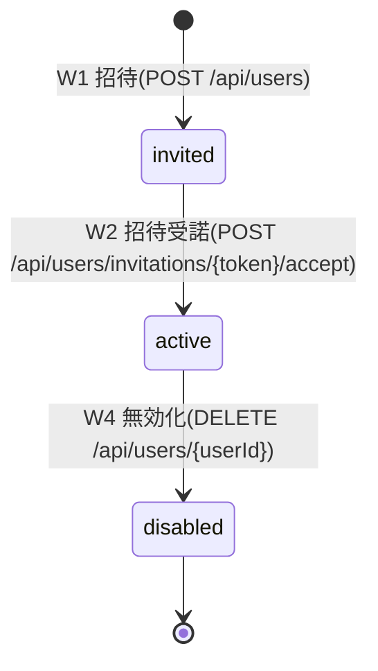
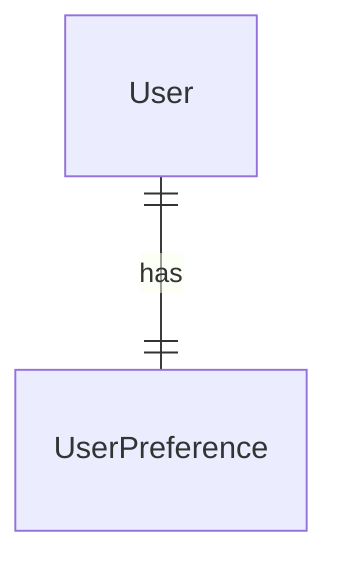

<!--
Copyright 2026 agwlvssainokuni

Licensed under the Apache License, Version 2.0 (the "License");
you may not use this file except in compliance with the License.
You may obtain a copy of the License at

    http://www.apache.org/licenses/LICENSE-2.0

Unless required by applicable law or agreed to in writing, software
distributed under the License is distributed on an "AS IS" BASIS,
WITHOUT WARRANTIES OR CONDITIONS OF ANY KIND, either express or implied.
See the License for the specific language governing permissions and
limitations under the License.
-->

# Functional Specification — user-management (U4)

## Sources

- `inception/units-generation/unit-of-work.md`(U4定義)
- `inception/domain-design/components.md`(UserManagementコンポーネント定義)
- `inception/contract-design/contract-summary.md`(C5: user-management REST API、C11: UserAccountLookupApi)
- `inception/requirements-analysis/requirements.md`(FR2, FR9.1, FR10.1)
- `functional-design-questions.md`(Q1〜Q6確定回答)

## ワークフロー

### W1: ユーザー招待(FR2.1、BR4.1)

1. 管理者が`POST /api/users`を呼び出す(email/name/roleIds)。
2. `canAccessScreen(activeRoleId, "user-management")`で認可を再検証する(BR4.10)。
3. emailの重複を確認する。重複していれば422。
4. roleIdsの実在を検証する(BR4.5、PermissionEngineApiの新規メソッド)。実在しないroleIdがあれば422。
5. status=invitedでUserを作成し、招待トークン(UUIDv4、無期限)を発行する。
6. SMTP経由で招待メールを送信する(送信失敗時の扱いはAssumptions参照)。
7. UserChangedEvent(operation=INVITED, beforeValue=null, afterValue={name, email, status: invited, roleIds})を発行する(BR4.9)。
8. 201を返す。

### W2: 招待受諾・初回パスワード設定(FR2.1、BR4.2, BR4.3)

1. 利用者が招待メール中のリンク(トークン)から`POST /api/users/invitations/{token}/accept`を呼び出す(password/name、および任意でtheme/fontSize/locale)。
2. トークンに対応するUser(status=invited)を検索する。見つからなければ404。
3. passwordが8文字以上か検証する。未満なら422。
4. passwordをArgon2idでハッシュ化しpasswordHashに設定し、nameを更新し、status=activeへ遷移する。
5. UserPreferenceを作成する(theme/fontSize/localeが指定されていればその値、省略されていればlight/medium/ja、BR4.3)。
6. UserChangedEvent(operation=INVITED、またはUPDATEDとして扱うかは実装判断。beforeValue={name, email, status: invited, roleIds}、afterValue={name, email, status: active, roleIds})を発行する(BR4.9。W1のINVITEDイベントと合わせて2件発行するか、W2完了時の1件のみとするかは、招待作成時点では氏名・最終状態が確定していないことを踏まえ、コード生成時にoperation値の使い分けを含めて具体化する)。
7. 200を返す。

### W3: ユーザー情報更新(FR2.2、BR4.5, BR4.9, BR4.10)

1. 管理者が`PUT /api/users/{userId}`を呼び出す(name/roleIds等)。
2. BR4.10の認可再検証。
3. 対象User存在確認。存在しなければ404。
4. roleIds実在検証(BR4.5)。
5. 更新前の値をbeforeValueとして保持し、更新を適用する。
6. UserChangedEvent(operation=UPDATED, beforeValue, afterValue)を発行する。
7. 200を返す。

### W4: ユーザー無効化(FR2.3、BR4.6, BR4.9, BR4.10)

1. 管理者が`DELETE /api/users/{userId}`を呼び出す。
2. BR4.10の認可再検証。
3. 対象User存在確認。存在しなければ404。
4. status=disabledへ遷移する。
5. UserChangedEvent(operation=DISABLED, beforeValue, afterValue)を発行する。authentication-service(未実装、U5)は本イベントを購読して自身が管理するリフレッシュトークンを即座に失効させる想定(Assumptions参照、C11 `revokeRefreshTokensOnDisable`との関係含む)。
6. 204を返す。

### W5: 初期管理者アカウントの自動作成(FR2.4、BR4.7)

1. アプリ起動時、`ApplicationRunner`が`application.yml`の初期管理者email/passwordを読む。
2. 該当emailのUserが存在しなければ、passwordをArgon2idでハッシュ化しstatus=activeでUserを作成する(roleIdsは初期管理者用の固定ロールを割り当てる、詳細はコード生成時にpractices-discoveryのブートストラップ例外(BR3.13)と整合させる)。
3. 既に存在すれば何もしない(冪等)。

### W6: ユーザー単位の表示設定取得・更新(FR9.1、FR10.1、BR4.8)

1. 利用者が`GET/PUT /api/me/preferences`を呼び出す。
2. BR4.8の認可(認証済みであれば誰でも自分の設定を操作可、canAccessScreenは呼ばない)。
3. GET: 自分自身のUserPreferenceを返す。PUT: 自分自身のUserPreferenceを更新する。

## 状態遷移(User.status)

invitedからdisabledへの直接遷移は想定しない(招待中ユーザーを無効化する運用上の要求はrequirements.mdに存在しないため、コード生成時は`DELETE /api/users/{userId}`をstatus不問で受け付けるか、invited対象を404扱いにするかを実装判断とする。後者を推奨する: 招待の取り消しは別のユースケースであり、本Boltの対象外)。

## エンティティ関連図(entities.mdより導出)

## ルール概要(rules.mdより導出)

| ID | 概要 |
|---|---|
| BR4.1 | ユーザー招待 |
| BR4.2 | 招待受諾・初回パスワード設定 |
| BR4.3 | 招待受諾時のUserPreference作成 |
| BR4.4 | パスワード平文出力の禁止 |
| BR4.5 | roleId実在検証 |
| BR4.6 | ユーザー無効化 |
| BR4.7 | 初期管理者アカウントの自動作成 |
| BR4.8 | /api/me/preferencesの認可 |
| BR4.9 | UserChangedEventの発行 |
| BR4.10 | /api/users系の認可 |

## Assumptions & Open Questions

- [assumption] 招待メール送信(SMTP、FR2.8)が失敗した場合の扱いは、requirements.mdに明示がないため、コード生成時にfail-fast(招待自体を失敗させ既存Userレコードも作成しない)とするか、非同期リトライとするかを判断する。本設計では前者(fail-fast、W1全体をトランザクション的に扱う)を推奨する。
- [open question] C11(`UserAccountLookupApi`)の`revokeRefreshTokensOnDisable`は、パッケージ・所有ユニットの上ではuser-managementが公開しauthentication-serviceが呼び出す契約として定義されているが、「無効化と同時にリフレッシュトークンを即時失効させる」という意味論は、リフレッシュトークンを実際に管理するauthentication-service側が自身のトークンストアに対して行うべき操作であり、呼び出し方向(user-management→authentication-serviceであるべきでは)が契約上の記述と逆にも読める。本ユニットの機能設計では、この方向性の疑問を未解決のまま、BR4.6の`UserChangedEvent(operation=DISABLED)`発行をFR2.3の即時失効要求を満たすための実質的な通知手段として位置付ける。C11の当該メソッドの実装方針(誰が何を呼ぶか)は、authentication-service(U5)の機能設計時に確定する。
- [open question] roleId実在検証(BR4.5、Q6確定)に必要なPermissionEngineApiの新規メソッド(例: `roleExists(roleId): boolean`)は、Contract Design(C10)への追補が必要。本Boltのコード生成時に、permission-engine(既に実装済み)へ当該メソッドを追加し、C10契約に反映する。
- [open question] `/api/me/preferences`(C5)・招待受諾API(C5)へのtheme/fontSize/locale任意項目追加(Q4確定)は、Contract Design(C5)への追補が必要。本Boltのコード生成時にcontract-summary.mdへ反映する。
- [assumption] W2の`UserChangedEvent`発行を1件(W2完了時のみ、operation=INVITED)とするか2件(W1でINVITED、W2でUPDATED)とするかは、コード生成時に決定する。監査ログの観点では、招待作成と受諾完了は別の事象であるため2件発行(W1: INVITED、W2: UPDATED、氏名確定・status: invited→active)を推奨する。
