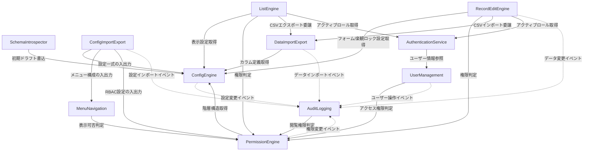

# Component Catalogue — MasterSmith(マスタ管理アプリ)

要件定義書(`inception/requirements-analysis/requirements.md`)と `domain-design-questions.md` の確定回答に基づき、システムを構成するコンポーネント(論理的な building block)を定義する。デプロイトポロジー(モノリス/マイクロサービス等)や技術スタックの詳細は Units Generation・Functional Design で扱うため、ここでは扱わない。

## Part A — コンポーネントカタログ

```yaml
components:
  - name: ConfigEngine
    summary: テーブル・カラム単位の表示設定(表示名/表示順/書式/編集部品/バリデーション/権限/表示可否)とメニュー構成以外の設定モデルを読込・保持し、DB方言差異を吸収する
    behaviour: >
      アプリ起動時に設定ファイル(内部設定DB)から設定を読み込み、PostgreSQL/MySQL/MariaDBの方言差異を吸収した内部モデルへ変換する。
      設定定義自体に誤り(必須プロパティ欠落等)がある場合は起動時・設定読込時にfail fastで検知する(FR1.3)。
      select/radio編集部品のうちFK参照によるものは、選択肢の名称解決のみ実行時に動的取得する(FR1.5)。
      RecordEditEngineからの照会に応じて、対象テーブルの楽観ロック対象列(更新日時/バージョン列)の有無を返す。
    responsibilities:
      - テーブル・カラム単位の表示設定の保持と提供(FR1.1)
      - 複数RDBMS方言の吸収(FR1.2)
      - 設定定義の起動時fail fast検証(FR1.3)
      - 楽観ロック対象列の定義有無の管理(Q6-follow-up、FR6.3の条件付き適用)
    depends_on:
      - component: AuditLogging
        interaction: 設定変更(テーブル・カラム設定の追加/更新)のドメインイベントを発行する
        style: event
    dependents:
      - component: SchemaIntrospector
        interaction: メタデータから生成した初期ドラフトを設定として取り込む
      - component: ListEngine
        interaction: 一覧の表示項目・検索条件・書式の設定を取得する
      - component: RecordEditEngine
        interaction: フォーム部品・バリデーション・楽観ロック対象列の設定を取得する
      - component: PermissionEngine
        interaction: 権限判定対象のスキーマ・テーブル・カラム階層構造を取得する
      - component: ConfigImportExport
        interaction: 設定一式のexport元/import先として利用される
      - component: DataImportExport
        interaction: 対象テーブルのカラム定義・バリデーションルールを取得する
    external_dependencies:
      - name: 内部設定DB(組込みDB)
        kind: database
        purpose: 表示設定・スキーマ定義の永続化(業務データ用RDBMSとは別接続)
    entities:
      - name: TableConfig
        identifier: tableConfigId
        attributes: [schemaName, tableName, displayName, displayOrder, optimisticLockColumn]
      - name: ColumnConfig
        identifier: columnConfigId
        attributes: [tableConfigId, columnName, displayName, displayOrder, format, editorType, validationRule, visibility]

  - name: SchemaIntrospector
    summary: 対象DBのメタデータ(テーブル/カラム/型/NULL可否/主キー/外部キー等)を読み取り、設定の初期ドラフトを生成する
    behaviour: >
      対象RDBMSのメタデータを読み取り、ConfigEngineが保持する設定モデルの初期ドラフトを生成する(FR1.4)。
      アプリ本体に統合された機能として提供し、外部ツールを必要としない。
    responsibilities:
      - 対象DBメタデータの読み取り(FR1.4)
      - 設定初期ドラフトの生成
    depends_on:
      - component: ConfigEngine
        interaction: 生成した初期ドラフトを設定として書き込む
        style: sync
    dependents: []
    external_dependencies:
      - name: 業務データ用RDBMS(PostgreSQL/MySQL/MariaDB)
        kind: database
        purpose: メタデータ(テーブル/カラム定義)の読み取り元
    entities: []

  - name: ListEngine
    summary: 業務テーブルごとの一覧画面(検索・ページング・ソート)を設定駆動で提供する
    behaviour: >
      検索フォーム(主要条件+詳細検索)・一覧表示・ページング・ソートを、業務テーブルごとにコードを変更せず設定駆動で生成する(FR5.1)。
      ページサイズ(10/20/50/100件)の選択に対応する(FR5.2)。
      READ権限未満のカラムは列自体を非表示にする(PermissionEngineの判定結果に従う、FR4.5)。
      CREATE権限がない場合は「+ 新規作成」ボタンを表示しない(FR5.3)。
    responsibilities:
      - 設定駆動の一覧画面生成(FR5.1)
      - ページング・ソート(FR5.2)
      - 一覧チェックボックスによる一括削除(refined-mockups Q4)
      - 業務データCSVエクスポート(FR12.1、DataImportExportへ委譲)
    depends_on:
      - component: ConfigEngine
        interaction: 一覧の表示項目・検索条件・書式設定を取得する
        style: sync
      - component: PermissionEngine
        interaction: カラム単位のREAD権限・CREATE権限・一括削除(DELETE権限)を判定する
        style: sync
      - component: DataImportExport
        interaction: 業務データCSVエクスポートを委譲する
        style: sync
      - component: AuthenticationService
        interaction: セッションのアクティブロール(Session.activeRoleId)を読み取り、PermissionEngine呼び出しの引数とする
        style: sync
    dependents: []
    external_dependencies:
      - name: 業務データ用RDBMS(PostgreSQL/MySQL/MariaDB)
        kind: database
        purpose: 業務データ(行データ)の検索・一覧取得
    entities: []

  - name: RecordEditEngine
    summary: 業務テーブルごとの詳細・編集画面(フォーム・バリデーション・保存・楽観ロック)を設定駆動で提供する
    behaviour: >
      設定駆動のフォーム部品(1行テキスト/複数行テキスト/整数値/小数値/日付/日時/select/radio/switch/checkbox)による詳細・編集画面を生成する(FR6.1)。
      フィールドのフォーカスアウト時にインラインバリデーションエラーを表示する(FR6.2)。
      ConfigEngineから対象テーブルの楽観ロック対象列(更新日時/バージョン列)の有無を取得し、存在する場合のみ楽観ロックによる同時編集競合を検出する。存在しない場合は後勝ちで保存する(Q6-follow-up、レビュー指摘R-01フォローアップ対象のFR6.3修正を前提)。
      競合検出時は画面上部にインラインバナーでエラーメッセージを表示し、一覧画面には遷移せず詳細・編集画面に留まる(FR6.3)。
      編集不可の項目は読取専用表示、READ権限未満の項目は非表示にする(FR6.4)。
    responsibilities:
      - 設定駆動のフォーム生成・保存(FR6.1)
      - フィールド単位のバリデーションエラー表示(FR6.2)
      - 楽観ロック競合検出(存在する場合のみ、FR6.3条件付き)
      - 権限に基づく読取専用/非表示制御(FR6.4)
      - 業務データCSVインポート(FR12.1、DataImportExportへ委譲)
    depends_on:
      - component: ConfigEngine
        interaction: フォーム部品・バリデーション・楽観ロック対象列の設定を取得する
        style: sync
      - component: PermissionEngine
        interaction: フィールド単位のREAD/FULL権限、CREATE/DELETE補助権限を判定する
        style: sync
      - component: DataImportExport
        interaction: 業務データCSVインポートを委譲する
        style: sync
      - component: AuditLogging
        interaction: 業務データの作成・更新・削除のドメインイベントを発行する
        style: event
      - component: AuthenticationService
        interaction: セッションのアクティブロール(Session.activeRoleId)を読み取り、PermissionEngine呼び出しの引数とする
        style: sync
    dependents: []
    external_dependencies:
      - name: 業務データ用RDBMS(PostgreSQL/MySQL/MariaDB)
        kind: database
        purpose: 業務データ(行データ)の取得・保存
    entities: []

  - name: PermissionEngine
    summary: ロール・主権限(FULL/READ/NONE/指定なし・階層継承)・補助権限(CREATE/DELETE)を判定し、全コンポーネントの実効権限問い合わせに応答する
    behaviour: >
      ロール単位で権限を割り当て、ユーザーまたはグループに割り当てる(FR4.1)。
      主権限をスキーマ・テーブル・カラムの各階層に割り当て、指定なしの階層は上位階層の設定を継承する(FR4.3)。
      補助権限(CREATE/DELETE)をスキーマ・テーブル単位で割り当てる(FR4.4)。
      画面表示の出し分けだけに依存せず、必ずサーバー側で実効権限を再検証する(FR3.3)。
      権限の昇格は権限管理者による明示的な操作を経ずに許可しない(FR3.4)。
    responsibilities:
      - ロール・権限の割当管理(FR4.1)
      - 主権限の階層継承解決(FR4.3)
      - 補助権限の判定(FR4.4)
      - サーバー側での実効権限の再検証(FR3.3)
      - 権限昇格の防止(FR3.4)
    depends_on:
      - component: ConfigEngine
        interaction: 権限判定対象のスキーマ・テーブル・カラム階層構造を取得する
        style: sync
      - component: AuditLogging
        interaction: 権限変更(ロール・主権限・補助権限の割当変更)のドメインイベントを発行する
        style: event
    dependents:
      - component: ListEngine
        interaction: カラム単位のREAD/CREATE/DELETE権限を判定させる
      - component: RecordEditEngine
        interaction: フィールド単位の権限を判定させる
      - component: MenuNavigation
        interaction: メニュー項目の表示可否を判定させる
      - component: UserManagement
        interaction: ユーザ管理画面・監査ログ閲覧画面へのアクセス権限を判定させる
      - component: AuditLogging
        interaction: 監査ログ閲覧画面へのアクセス権限を判定させる
      - component: ConfigImportExport
        interaction: RBAC設定のエクスポート対象取得・インポート反映の権限を判定させる
    external_dependencies:
      - name: 内部設定DB(組込みDB)
        kind: database
        purpose: ロール・権限割当の永続化
    entities:
      - name: Role
        identifier: roleId
        attributes: [name, parentRoleId]
      - name: PrimaryPermission
        identifier: primaryPermissionId
        attributes: [roleId, scopeType, scopeRef, level]
      - name: AuxiliaryPermission
        identifier: auxiliaryPermissionId
        attributes: [roleId, scopeType, scopeRef, create, delete]

  - name: UserManagement
    summary: ユーザーの登録・更新・無効化と、ユーザー単位の表示設定(テーマ・フォントサイズ・言語)を管理する
    behaviour: >
      管理者は招待メールによりユーザーを登録できる。招待メールを受け取ったユーザーは、メール中のリンクから自身のパスワード・氏名を設定して初回ログインできる(FR2.1)。
      管理者はユーザーの氏名・所属ロール等の情報を更新できる(FR2.2)。
      管理者はユーザーを無効化できる。無効化と同時にリフレッシュトークンは即時失効するが、既発行のアクセストークンはその有効期限まで失効しない(FR2.3)。
      `application.yml`に設定された初期管理者アカウントを、存在しない場合に限りアプリ起動時に自動作成する(FR2.4)。
      パスワードは最小8文字以上とし、ハッシュ化して保存する(FR2.5, FR2.6)。
      ユーザーごとにテーマ(ライト/ダーク)・フォントサイズ(大/中/小)・言語(日本語/English)を保持し、選択内容を全画面に適用する(FR9.1, FR10.1、refined-mockups-questions Q7)。
    responsibilities:
      - ユーザーの登録・更新・無効化(FR2.1〜FR2.3)
      - 初期管理者アカウントの自動作成(FR2.4)
      - パスワードのハッシュ化保存(FR2.5, FR2.6)
      - ユーザー単位の表示設定(テーマ/フォントサイズ/言語)の保持(FR9, FR10)
    depends_on:
      - component: PermissionEngine
        interaction: ユーザ管理画面へのアクセス権限を判定させる
        style: sync
      - component: AuditLogging
        interaction: ユーザー招待・更新・無効化のドメインイベントを発行する
        style: event
    dependents:
      - component: AuthenticationService
        interaction: ログイン時のユーザー情報・パスワードハッシュ・ロック状態を参照する
    external_dependencies:
      - name: 内部設定DB(組込みDB)
        kind: database
        purpose: ユーザー情報・表示設定の永続化
      - name: SMTPサーバー
        kind: third-party-api
        purpose: 招待メールの送信(FR2.8)
    entities:
      - name: User
        identifier: userId
        attributes: [name, email, passwordHash, status, roleIds]
        references:
          - entity: Role
            owned_by: PermissionEngine
            relationship: 各Userは0個以上のRoleを保持する(複数ロール付与、FR4.2)
      - name: UserPreference
        identifier: userId
        attributes: [theme, fontSize, locale]

  - name: AuthenticationService
    summary: トークンベース認証・セッション管理・ログイン失敗によるアカウントロックを担う
    behaviour: >
      アクセストークン(有効期限10分)とリフレッシュトークン(有効期限30分)によるトークンベース認証を採用する。両トークンの有効期限は`application.yml`で設定可能とする(FR3.1)。
      同一ユーザーが複数デバイスから同時にログインすることを許可する(FR3.2)。
      連続ログイン失敗によるアカウントの一時ロック機能を提供する。失敗回数の閾値・ロック時間は`application.yml`で設定する(refined-mockups レビュー指摘R-01対応)。**注意:** 現行の要件定義書FR2.7は「管理画面から設定可能でなければならない」と記載されており、本設計の`application.yml`方式とは文言上一致していない。この不一致は既知のフォローアップ事項であり、要件定義書FR2.7の文言修正(`refined-mockups/mockups.md`のAssumptions & Open Questionsに記録済み)が完了するまでは未解消のままとなる。後続の機能設計・要件定義書更新の際に必ず反映すること。
      ロック中のログイン試行に対しては、通常の認証エラーと同一の汎用メッセージのみを返しロック状態を外部に漏らさない(refined-mockups-questions Q12)。
      複数ロールを持つユーザーが操作時にヘッダーのロール選択UIで選択したロールをセッション単位で保持する。選択したロールは、リクエストを処理するListEngine/RecordEditEngine等がセッション情報(Session.activeRoleId)から読み取り、PermissionEngineへの権限判定呼び出しの引数として渡す(FR4.2)。PermissionEngineはAuthenticationServiceを直接呼び出さず、あくまで呼び出し元から渡されたアクティブロールIDを判定材料とする。
    responsibilities:
      - トークン発行・検証(FR3.1)
      - 複数デバイス同時ログインの許可(FR3.2)
      - ログイン失敗回数の追跡とアカウント一時ロック(FR2.7、application.yml方式)
      - セッション単位のアクティブロール選択の保持(FR4.2)
    depends_on:
      - component: UserManagement
        interaction: ユーザー情報・パスワードハッシュ・ロック状態を参照/更新する
        style: sync
    dependents:
      - component: ListEngine
        interaction: セッションのアクティブロールを読み取る
      - component: RecordEditEngine
        interaction: セッションのアクティブロールを読み取る
    external_dependencies:
      - name: 内部設定DB(組込みDB)
        kind: database
        purpose: セッション・ロック状態の永続化
    entities:
      - name: LoginAttempt
        identifier: loginAttemptId
        attributes: [userId, attemptedAt, succeeded]
        references:
          - entity: User
            owned_by: UserManagement
            relationship: 各LoginAttemptは1人のUserに対する試行である
      - name: Session
        identifier: sessionId
        attributes: [userId, activeRoleId, issuedAt]
        references:
          - entity: User
            owned_by: UserManagement
            relationship: 各Sessionは1人のUserに対して発行される
          - entity: Role
            owned_by: PermissionEngine
            relationship: 各Sessionはユーザーが選択した1個のアクティブRoleを保持する(単一ロールの場合は自動選択、FR4.2)

  - name: MenuNavigation
    summary: 業務メニュー(N階層)・管理メニューの構成と、権限に基づく表示可否を管理する
    behaviour: >
      業務メニュー配下にマスタメンテのメニューをN階層、管理メニュー配下に管理者機能(業務メニュー設定/ユーザ管理/監査ログ管理/設定管理)を配置する。パンくずリストは設けない(FR7.1)。
      ログイン後の初期表示は、業務メニュー・管理メニューをCard形式で並べる専用のトップ画面とする。権限により利用できないメニュー項目は表示しない(FR7.2)。
      権限のあるメニューが1件もない場合は案内メッセージを表示する(FR7.3)。
    responsibilities:
      - 業務メニュー・管理メニューの階層構成管理(FR7.1)
      - トップ画面のCard形式表示制御(FR7.2)
      - 空メニュー時の案内表示(FR7.3)
    depends_on:
      - component: PermissionEngine
        interaction: メニュー項目ごとの表示可否を判定させる
        style: sync
    dependents:
      - component: ConfigImportExport
        interaction: メニュー構成をエクスポート対象に含める/インポート結果を反映する
    external_dependencies:
      - name: 内部設定DB(組込みDB)
        kind: database
        purpose: メニュー構成の永続化
    entities:
      - name: MenuItem
        identifier: menuItemId
        attributes: [parentMenuItemId, label, order, targetTableConfigId]
        references:
          - entity: TableConfig
            owned_by: ConfigEngine
            relationship: 各MenuItemは0または1個のTableConfig(マスタメンテ画面)へ遷移する

  - name: AuditLogging
    summary: 他コンポーネントが発行するドメインイベントを購読し、操作者・操作対象・操作種別・日時・変更前後の値を追記専用で記録する
    behaviour: >
      RecordEditEngine・UserManagement・ConfigEngine・PermissionEngine等が発行するドメインイベント(例: RecordUpdated, UserInvited, PermissionChanged)を購読し、操作者・操作対象・操作種別・日時・変更前後の値を記録する(FR8.1)。
      アプリケーションからのUPDATE/DELETE経路を持たない追記専用(append-only)とする(FR8.2)。
      無期限に保持し、削除・アーカイブ機能は実装しない(FR8.3)。
      イベント発行元の各コンポーネントは、AuditLoggingの存在を意識せず疎結合を保つ(Q5回答Bのイベント駆動構成)。
    responsibilities:
      - ドメインイベントの購読による監査記録(FR8.1)
      - 追記専用ストレージへの記録(FR8.2)
      - 無期限保持(FR8.3)
      - 監査ログ閲覧画面へのデータ提供
    depends_on:
      - component: PermissionEngine
        interaction: 監査ログ閲覧画面へのアクセス権限を判定させる(同期呼出、PermissionEngineとの間の意図的な循環については本ファイルのRationaleを参照)
        style: sync
    dependents:
      - component: ConfigEngine
        interaction: 設定変更イベントを購読する
      - component: RecordEditEngine
        interaction: 業務データの作成・更新・削除イベントを購読する
      - component: UserManagement
        interaction: ユーザー招待・更新・無効化イベントを購読する
      - component: PermissionEngine
        interaction: 権限変更イベントを購読する
      - component: ConfigImportExport
        interaction: 設定インポート実行イベントを購読する
      - component: DataImportExport
        interaction: 業務データインポート実行イベントを購読する
    external_dependencies:
      - name: 内部設定DB(組込みDB)
        kind: database
        purpose: 監査ログの追記専用永続化
    entities:
      - name: AuditLogEntry
        identifier: auditLogEntryId
        attributes: [actorUserId, targetType, targetId, operationType, occurredAt, beforeValue, afterValue]
        references:
          - entity: User
            owned_by: UserManagement
            relationship: 各AuditLogEntryは操作を行った1人のUserを記録する

  - name: ConfigImportExport
    summary: スキーマ定義・メニュー構成・RBAC設定を含む設定一式をJSON形式でエクスポート・インポートする
    behaviour: >
      スキーマ定義(テーブル・カラムの表示設定等)・メニュー構成・RBAC設定をすべて含む設定一式を、JSON形式でエクスポート・インポートする(FR11.1)。
      設定の保持はハイブリッド方式とし、管理画面から編集可能な内部設定DBを正とする。エクスポート・インポートは内部設定DBの内容を書き出し・取り込みする手段として提供する(FR11.2)。
      独立した「設定管理」画面から操作する(refined-mockups-questions Q7)。インポート実行時は確認モーダルを経て、設定定義に誤りがある場合はfail fastで中止する(FR1.3)。
    responsibilities:
      - 設定一式のJSONエクスポート(FR11.1)
      - 設定一式のJSONインポート(FR11.1、fail fast検証を含む)
    depends_on:
      - component: ConfigEngine
        interaction: エクスポート対象の設定一式を取得し、インポート結果を書き戻す
        style: sync
      - component: MenuNavigation
        interaction: メニュー構成をエクスポート対象に含める
        style: sync
      - component: PermissionEngine
        interaction: RBAC設定をエクスポート対象に含める
        style: sync
      - component: AuditLogging
        interaction: 設定インポート実行のドメインイベントを発行する
        style: event
    dependents: []
    external_dependencies: []
    entities: []

  - name: DataImportExport
    summary: 業務データ(行データ)のCSVエクスポート・インポートを行う
    behaviour: >
      一覧・詳細編集で扱う業務データ本体(行データ)について、CSVによるエクスポート・インポートの両方に対応する(FR12.1)。
      一覧画面のツールバーから操作し、インポート時のバリデーションエラーは行単位で提示する(refined-mockups-questions Q8)。
    responsibilities:
      - 業務データのCSVエクスポート(FR12.1)
      - 業務データのCSVインポート(FR12.1、行単位バリデーション)
    depends_on:
      - component: ConfigEngine
        interaction: 対象テーブルのカラム定義・バリデーションルールを取得する
        style: sync
      - component: AuditLogging
        interaction: 業務データインポート実行のドメインイベントを発行する
        style: event
    dependents:
      - component: ListEngine
        interaction: 一覧画面のツールバーからエクスポート/インポートを起動する
      - component: RecordEditEngine
        interaction: インポートされた行データの保存(バリデーション・楽観ロック)を委譲する
    external_dependencies:
      - name: 業務データ用RDBMS(PostgreSQL/MySQL/MariaDB)
        kind: database
        purpose: エクスポート対象データの読み取り、インポートデータの書き込み
    entities: []
```

## Part B — 人間可読ビュー

### コンポーネント図



<!-- Text fallback: 実線はsync呼び出し。RecordEditEngine/ListEngine/SchemaIntrospector/ConfigImportExport/PermissionEngine/DataImportExportはいずれもConfigEngineへ依存する。ListEngine/RecordEditEngine/MenuNavigation/UserManagement/AuditLoggingはPermissionEngineへ権限判定を依頼する。AuthenticationServiceはUserManagementへ依存し、ListEngine/RecordEditEngineはAuthenticationServiceからセッションのアクティブロールを取得する。ListEngine/RecordEditEngineはDataImportExportへCSV入出力を委譲し、DataImportExportはConfigEngineからカラム定義を取得する。ConfigImportExportはConfigEngine/MenuNavigation/PermissionEngineから設定一式を集約する。破線はイベント発行(非同期・疎結合)。ConfigEngine/RecordEditEngine/PermissionEngine/UserManagement/ConfigImportExport/DataImportExportは、それぞれの操作に対応するドメインイベントをAuditLoggingへ発行する。PermissionEngineとAuditLoggingの間、およびConfigEngine→AuditLogging→PermissionEngine→ConfigEngineの間には、sync呼び出しとイベント発行の性質の違いに起因する意図的な循環依存が存在する(詳細はRationale「意図的な循環依存」を参照)。 -->

### コンポーネントサマリー

| Component | Purpose | Depends On | Dependents | Entities Owned |
|---|---|---|---|---|
| ConfigEngine | 表示設定・スキーマ定義の保持とDB方言吸収 | AuditLogging(event) | SchemaIntrospector, ListEngine, RecordEditEngine, PermissionEngine, ConfigImportExport, DataImportExport | TableConfig, ColumnConfig |
| SchemaIntrospector | DBメタデータからの設定初期ドラフト生成 | ConfigEngine | (なし) | (なし) |
| ListEngine | 一覧画面(検索・ページング・ソート) | ConfigEngine, PermissionEngine, DataImportExport, AuthenticationService | (なし) | (なし) |
| RecordEditEngine | 詳細・編集画面(フォーム・保存・楽観ロック) | ConfigEngine, PermissionEngine, DataImportExport, AuditLogging(event), AuthenticationService | (なし) | (なし) |
| PermissionEngine | RBAC判定(主権限・補助権限・階層継承) | ConfigEngine, AuditLogging(event) | ListEngine, RecordEditEngine, MenuNavigation, UserManagement, ConfigImportExport, AuditLogging | Role, PrimaryPermission, AuxiliaryPermission |
| UserManagement | ユーザー管理・表示設定(テーマ/フォント/言語) | PermissionEngine, AuditLogging(event) | AuthenticationService | User, UserPreference |
| AuthenticationService | トークン認証・ロック判定・アクティブロール保持 | UserManagement | ListEngine, RecordEditEngine | LoginAttempt, Session |
| MenuNavigation | メニュー階層・トップ画面表示制御 | PermissionEngine | ConfigImportExport | MenuItem |
| AuditLogging | 監査ログ記録(イベント購読) | PermissionEngine | ConfigEngine, RecordEditEngine, PermissionEngine, UserManagement, ConfigImportExport, DataImportExport | AuditLogEntry |
| ConfigImportExport | 設定一式のJSON export/import | ConfigEngine, MenuNavigation, PermissionEngine, AuditLogging(event) | (なし) | (なし) |
| DataImportExport | 業務データのCSV export/import | ConfigEngine, AuditLogging(event) | ListEngine, RecordEditEngine | (なし) |

### エンティティ所有

| Entity | Owning Component | Identifier | Attributes | References |
|---|---|---|---|---|
| TableConfig | ConfigEngine | tableConfigId | schemaName, tableName, displayName, displayOrder, optimisticLockColumn | — |
| ColumnConfig | ConfigEngine | columnConfigId | tableConfigId, columnName, displayName, displayOrder, format, editorType, validationRule, visibility | — |
| Role | PermissionEngine | roleId | name, parentRoleId | — |
| PrimaryPermission | PermissionEngine | primaryPermissionId | roleId, scopeType, scopeRef, level | Role(roleId) |
| AuxiliaryPermission | PermissionEngine | auxiliaryPermissionId | roleId, scopeType, scopeRef, create, delete | Role(roleId) |
| User | UserManagement | userId | name, email, passwordHash, status, roleIds | Role(roleIds), owned by PermissionEngine |
| UserPreference | UserManagement | userId | theme, fontSize, locale | User(userId) |
| LoginAttempt | AuthenticationService | loginAttemptId | userId, attemptedAt, succeeded | User(userId), owned by UserManagement |
| Session | AuthenticationService | sessionId | userId, activeRoleId, issuedAt | User(userId) owned by UserManagement; Role(activeRoleId) owned by PermissionEngine |
| MenuItem | MenuNavigation | menuItemId | parentMenuItemId, label, order, targetTableConfigId | TableConfig(targetTableConfigId), owned by ConfigEngine |
| AuditLogEntry | AuditLogging | auditLogEntryId | actorUserId, targetType, targetId, operationType, occurredAt, beforeValue, afterValue | User(actorUserId), owned by UserManagement |

### 外部依存

| Component | Dependency | Kind | Purpose |
|---|---|---|---|
| ConfigEngine | 内部設定DB(組込みDB) | database | 表示設定・スキーマ定義の永続化 |
| SchemaIntrospector | 業務データ用RDBMS | database | メタデータ読み取り |
| ListEngine | 業務データ用RDBMS | database | 業務データの検索・一覧取得 |
| RecordEditEngine | 業務データ用RDBMS | database | 業務データの取得・保存 |
| PermissionEngine | 内部設定DB(組込みDB) | database | ロール・権限割当の永続化 |
| UserManagement | 内部設定DB(組込みDB) | database | ユーザー情報・表示設定の永続化 |
| UserManagement | SMTPサーバー | third-party-api | 招待メール送信 |
| AuthenticationService | 内部設定DB(組込みDB) | database | セッション・ロック状態の永続化 |
| MenuNavigation | 内部設定DB(組込みDB) | database | メニュー構成の永続化 |
| AuditLogging | 内部設定DB(組込みDB) | database | 監査ログの追記専用永続化 |
| DataImportExport | 業務データ用RDBMS | database | エクスポート対象読み取り/インポートデータ書込 |

### Rationale(コンポーネント分割理由)

| Component | 分割理由 |
|---|---|
| ConfigEngine | 表示設定というデータの所有権・変更理由(業務テーブル追加のたびに更新)が他と異なる独立した関心事(domain-design-questions Q2回答B) |
| SchemaIntrospector | 「DBメタデータ読み取り」という一過性の生成処理は、恒常的な設定保持(ConfigEngine)と変更理由・実行頻度が異なるため分離(Q2回答B) |
| ListEngine / RecordEditEngine | 一覧(検索・ページング主体)と詳細編集(フォーム・保存・楽観ロック主体)は責務と変更理由が異なり、それぞれ独立してテスト可能(Q1回答B) |
| PermissionEngine | ほぼ全コンポーネントから横断的に呼ばれる実効権限判定は、単一の変更理由(権限モデルの変更)を持つ独立コンポーネントとして切り出す方が、UserManagementに埋め込むより凝集度が高い(Q3回答A) |
| UserManagement / AuthenticationService | ユーザーCRUD(変更頻度: 低〜中、管理者操作契機)とトークン発行・検証(変更頻度: 高、リクエストごとに実行)は実行特性が大きく異なるため分離(Q4回答A) |
| Session(AuthenticationService所有) | 複数ロールを持つユーザーが選択したアクティブロール(FR4.2)は、セッション単位で変化するリクエストスコープの状態であり、恒常的なUser/Roleの割当(UserManagement/PermissionEngineが所有)とはライフサイクルが異なるため、セッション管理を担うAuthenticationServiceに配置する |
| AuditLogging | 記録対象の操作が多数のコンポーネントに分散するため、明示的な同期依存(depends_on)ではなくイベント購読による疎結合を選択し、将来の記録対象追加が既存コンポーネントの変更を要さないようにする(Q5回答B) |
| MenuNavigation | メニュー構成はConfigEngineの表示設定(カラム単位)とは粒度・変更理由が異なる(ナビゲーション階層の再編)ため分離(Q6回答B) |
| UserManagement(表示設定を含む) | テーマ・フォントサイズ・言語はユーザーに強く紐づく属性であり、ユーザーのライフサイクル(登録・無効化)と共に変化するためUserManagementに含める(Q7回答A) |
| ConfigImportExport / DataImportExport | 対象データ(設定一式 vs 業務データ行)・形式(JSON vs CSV)・利用画面(設定管理画面 vs 一覧画面)がいずれも異なり、変更理由も独立しているため分離(Q8回答A) |
| 楽観ロックをRecordEditEngine内に配置 | 楽観ロック判定は詳細・編集画面の保存フロー内の一処理であり、独立コンポーネントに切り出すほどの複雑さ・再利用性がないため(Q9回答A) |
| FR13/FR14をカタログ対象外 | CI・可観測性はビルド・運用時の関心事であり、実行時に呼び出される業務ロジックを持つコンポーネントではないため(Q10回答A) |

### 意図的な循環依存(Deliberate Cycles)

`AuditLogging` は監査ログ閲覧画面へのアクセス権限判定のために `PermissionEngine` へ同期依存する一方、`ConfigEngine`・`RecordEditEngine`・`UserManagement`・`PermissionEngine`・`ConfigImportExport`・`DataImportExport` は監査記録のためのドメインイベントを `AuditLogging` へ発行する(`style: event`の疎結合な依存)。この結果、次の2種類の循環が生じる。

- **`PermissionEngine` ←→ `AuditLogging`**: `PermissionEngine`はイベント発行(疎結合)で`AuditLogging`に依存し、`AuditLogging`は閲覧権限判定のため`PermissionEngine`に同期依存する。
- **`ConfigEngine` → `AuditLogging` → `PermissionEngine` → `ConfigEngine`**: 上記の`AuditLogging`→`PermissionEngine`の同期依存と、`PermissionEngine`→`ConfigEngine`の同期依存、`ConfigEngine`→`AuditLogging`のイベント発行が組み合わさって生じる3ノードの循環。

いずれも「同期呼び出し(強い結合)」と「イベント発行(疎結合、非同期を前提とした将来実装を許容)」という性質の異なる依存が混在することで生じており、実行時のデッドロックや初期化順序の問題を引き起こすものではない(イベント発行は fire-and-forget であり、呼び出し元の処理completionを待たない)。将来的にイベント基盤を別プロセス・別コンポーネント(メッセージブローカー等)に切り出す場合は、この循環は解消される見込みである。

### Alternatives Rejected(主要な分割判断)

- **ListEngine/RecordEditEngine統合案(Q1 Option A)**: 一覧と詳細編集を1つの`RecordEngine`にまとめる案は、実装の初期段階では単純だが、一覧固有の検索・ソート最適化と詳細編集固有のバリデーション・楽観ロック処理が今後複雑化した際に単一コンポーネントが肥大化するリスクがあるため不採用。
- **PermissionEngineをUserManagementに内包する案(Q3 Option B)**: ユーザー管理の変更(招待フロー等)のたびに権限判定ロジックが巻き込まれる結合を避けるため不採用。
- **AuditLoggingへの明示的depends_on(Q5 Option A)**: 記録対象操作が増えるたびに全呼び出し元コンポーネントの変更が必要になり、変更コストが高いため不採用。将来的な信頼性(イベント配信保証)は次工程(NFR設計)で検討する前提。
- **ImportExportServiceへの統合(Q8 Option B)**: 設定(JSON)と業務データ(CSV)は形式・検証ロジック・利用画面が全く異なり、共通化のメリットが薄いため不採用。
